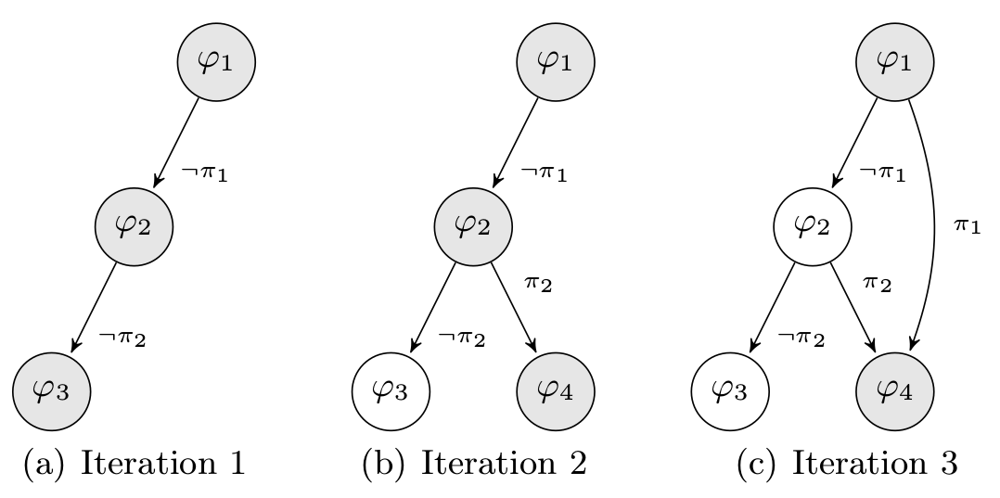
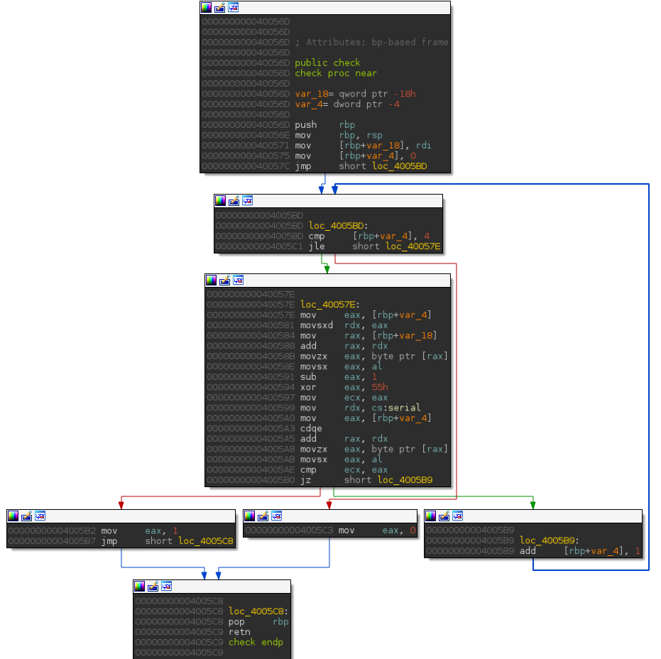
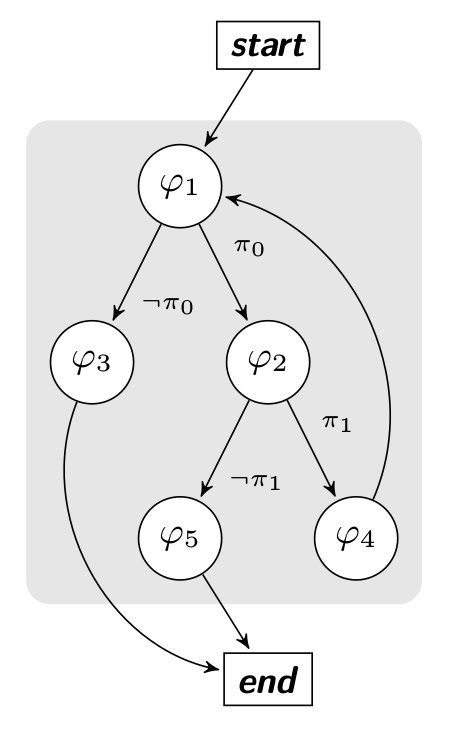
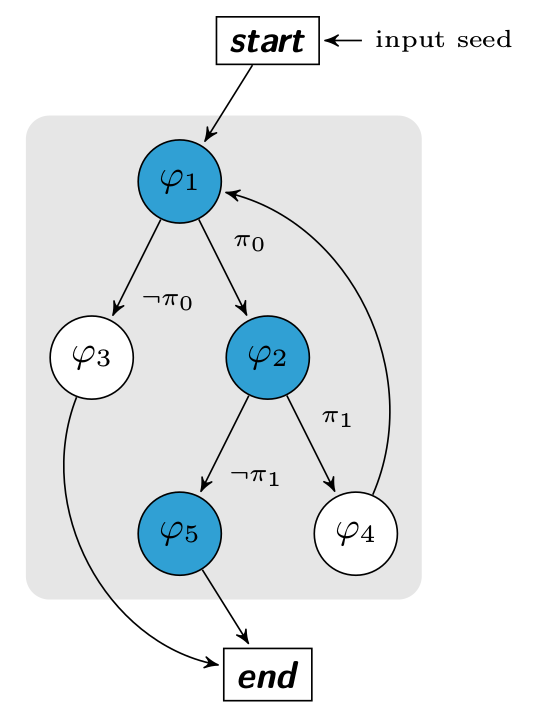
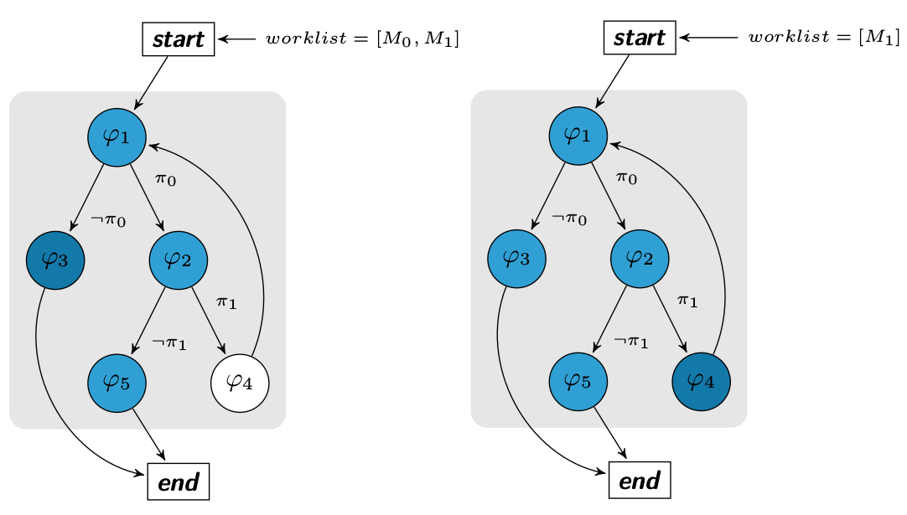
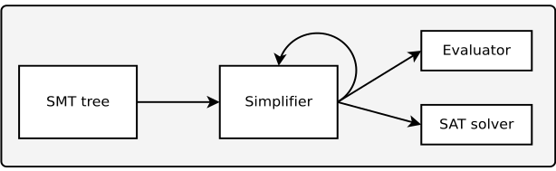

# Code coverage using a dynamic symbolic execution

> This blog post introduces code coverage with Triton

## Introduction

Code coverage is mainly used in the vulnerability research area.
The goal is to generate inputs which will reach different parts of the program's code.
Then, if an input makes the program crash, we check if the crash can be exploited or not.
A lot of methods exist to perform code coverage, such as random testing or mutation generation.
In this short blog post, we focus on code coverage using dynamic symbolic execution (DSE)
and explain why it is not a trivial task. Note that covering the code does not
mean finding every possible bugs. Some bugs do not make the program crash and this [talk](https://shell-storm.org/talks/StHack2015_Dynamic_Behavior_Analysis_using_Binary_Instrumentation_Jonathan_Salwan.pdf)
from slides 35 to 38 explains why. However, if we perform model checking associated
with code coverage, it starts to get interesting =).


## Code coverage and DSE

Note that unlike an SSE (static symbolic execution), a DSE is applied on a trace and
can discover new branches only if these ones are reached during the execution.
To go through another path, we must solve one of the last branch constraints discovered from the last trace.
Then, we repeat this operation until all branches are taken.

For example, let's assume a program $P$ which takes an input called $I$,
where I may be a model $M$ or a random seed $R$. An execution is denoted $P(I)$ and returns a set of
constraints $PC$. All $\varphi_{i}$ represent basic blocks and $\pi_i$ represent the branches constraint.
A model $M_i$ is (at least) one valid solution of a constraint $\pi_i$. For example, $M_1 = Solution(\neg\pi_1 \land \pi_2)$.
To discover all paths, we maintain a worklist denoted $W$ which is a set of $M$.

At the first iteration, $I = R, W = \emptyset$ and $P(I) \rightarrow PC$. Then,
$\forall \pi \in PC, W = W \cup \{ Solution(\pi) \}$
and we execute once again the program such that $\forall M \in W, P(M)$.
When a model $M$ is injected in the program's input, it is deleted from the worklist $W$.
Then, we repeat this operation until $W$ is empty.





Symbolic code coverage has pros and cons. It is useful when we work on an obfuscated
binary because it can detect opaque predicates or unreachable code and repair a flattened graph.
The main drawback occurs when expressions become too complex, causing an SMT solver timeout or
high memory consumption. In the past, our largest symbolic expression consumed about 450 gigabytes of
RAM before timing out. This scenario mainly occurs when we analyze large or obfuscated binaries
which contain polynomial functions. Some of these cons may partially be fixed by optimizing symbolic
expressions but this subject will be another story to come later :).

## Performing code coverage using Triton

Since the version `v0.1 build 633` (commit [474fe2](https://github.com/JonathanSalwan/Triton/commit/474fe240e66ff6ab3e3501f8d7fc88ce1fcb3ef6)),
Triton integrates everything we need to perform code coverage. These new features allow us to deal and compute
the SMT2-Lib representation over an AST. In the rest of the blog post, we will focus on the design and the
algorithm used to perform code coverage.

### Algorithm

As an introduction (and to not turn our brain upside down), let's assume this following sample of code which
comes from the samples directory.

```cpp
char *serial = "\x31\x3e\x3d\x26\x31";
int check(char *ptr)
{
  int i = 0;
  while (i < 5){
    if (((ptr[i] - 1) ^ 0x55) != serial[i])
      return 1;
    i++;
  }
  return 0;
}
```

Basically, this function checks if the input is equal to `elite`, and returns `0` if it is true, otherwise
it returns `1`. The control flow graph of this function is described below. It's an interesting first example,
because to cover all basic blocks we need to find the good input.



We can see that only one variable can be controlled, the one located at the address `rbp+var_18` which refers
to the `argv[1]`'s pointer. The goal is to reach all the basic blocks in the function check by computing the
constraints and using the snapshot engine until every basic block is reached. For instance, the
constraint to reach the basic block located at the address `0x4005C3` is `[rbp+var_4] > 4` but we do not control
this variable directly. On the other hand, the jump at the address `0x4005B0` depends on the user input and
this constraint can be solved by performing a symbolic execution.

The algorithm which generalizes the previous idea is based on Microsoft's fuzzer algorithm ([SAGE](http://research.microsoft.com/en-us/um/people/pg/public_psfiles/ndss2008.pdf)) and the
next diagram represents our check function with its constraints. The start and end nodes represent
respectively the function's prologue (`0x40056D`) and the function's epilogue (`0x4005C8`).



Before the first execution, we know nothing about branches' constraints. So, as explained in the previous
chapter, we inject some random seeds to collect the first $PC$ and build our set $W$. The trace of the first
execution $P(I)$ is represented by the basic blocks in blue.

This execution gives us our first path constraint $P(I) \rightarrow (\pi_0 \land \neg \pi_1)$.



Based on our first trace, we know that there are two branches ($\pi_0 \land \neg \pi_1$) discovered and so 2 others
undiscovered. To reach the basic bloc $\varphi_3$, we compute the negation of the first branch constraint. If and
only if the solution $Solution(\neg \pi_0)$ is SAT, we add the model to the worklist W.

Same for $\varphi_4$ such that $W = W \cup {Solution(\pi_0 \land \neg(\neg \pi_1))}$. Once all solutions have been generated and models added
to the worklist, we execute every models from the worklist.



### Implementation

One condition to perform code coverage, is to predict the next instruction address when we are on a jump
instruction. This condition is necessary to build the path constraint.

We can not put a callback after a branch instruction because the `RIP` register has already changed. As Triton
creates semantics expressions for all registers, the idea is to evaluate `RIP` when we are on a branch instruction.

In a first time, we have developed an SMT evaluator to compute the `RIP` but we saw a little bit later that
Pin provides `IARG_BRANCH_TARGET_ADDR` and `IARG_BRANCH_TAKEN` which can be used to know the next `RIP` values.
With Pin, computing the next address is very easy, nevertheless the SMT evaluator was useful to [check
instruction's semantics](https://github.com/JonathanSalwan/Triton/blob/c9648bb1b1f7d8a2afef0941ab267dc9387fd91c/tests/test_semantics.py).

To perform the evaluation, we implemented the [visitor pattern](https://en.wikipedia.org/wiki/Visitor_pattern)
to transform the SMT abstract syntax tree (AST) to a Z3 AST. This design can be used to transform our SMT AST
into any others representations.

The Z3 AST is easier to handle and can be evaluated or simplified with Z3 API. The transformation is performed
by [src/smt2lib/z3AST.h](https://github.com/JonathanSalwan/Triton/blob/c9648bb1b1f7d8a2afef0941ab267dc9387fd91c/src/includes/Z3ast.h) and
[src/smt2lib/z3AST.cpp](https://github.com/JonathanSalwan/Triton/blob/c9648bb1b1f7d8a2afef0941ab267dc9387fd91c/src/smt2lib/z3AST.cpp).

-----

We will now explain how the code coverage's tool works. Let's assume that inputs come from command's line.
Firstly, we have:

```python
def run(inputSeed, entryPoint, exitPoint, whitelist = []):
  ...

if __name__=='__main__':
  TritonExecution.run("bad !", 0x400480, 0x40061B, ["main", "check"]) # crackme_xor

```

At line 176, we define the input seed `bad !` which is the first program's argument (`argv[1]`). Then, we give
the address from the beginning of the code coverage (**start block**) - it's at this address that we will take
a snapshot. The third argument matches with the **end block** - it's at this address that we will restore the
snapshot. Finally, we can set a whitelist to avoid specific functions like library's functions,
cryptographic's function and so on.

```python
def mainAnalysis(threadId):

  print "[+] In main"
  rdi = getRegValue(IDREF.REG.RDI) # argc
  rsi = getRegValue(IDREF.REG.RSI) # argv

  argv0_addr = getMemValue(rsi, IDREF.CPUSIZE.QWORD)      # argv[0] pointer
  argv1_addr = getMemValue(rsi + 8, IDREF.CPUSIZE.QWORD)  # argv[1] pointer

  print "[+] In main() we set :"
  od = OrderedDict(sorted(TritonExecution.input.dataAddr.items()))

  for k,v in od.iteritems():
      print "\t[0x%x] = %x %c" % (k, v, v)
      setMemValue(k, IDREF.CPUSIZE.BYTE, v)
      convertMemToSymVar(k, IDREF.CPUSIZE.BYTE, "addr_%d" % k)

  for idx, byte in enumerate(TritonExecution.input.data):
      if argv1_addr + idx not in TritonExecution.input.dataAddr: # Not overwrite the previous setting
          print "\t[0x%x] = %x %c" % (argv1_addr + idx, ord(byte), ord(byte))
          setMemValue(argv1_addr + idx, IDREF.CPUSIZE.BYTE, ord(byte))
          convertMemToSymVar(argv1_addr + idx, IDREF.CPUSIZE.BYTE, "addr_%d" % idx)
```

The next code being executed is the `mainAnalysis` callback, we inject values to the inputs selected
(line 148, 154) and we convert these inputs as symbolic variables (line 149, 155).

All inputs selected are stored in a global variable called `TritonExecution.input`. Then, we can begin the code
exploration.

```python
if instruction.getAddress() == TritonExecution.entryPoint and not isSnapshotEnabled():
  print "[+] Take Snapshot"
  takeSnapshot()
  return
```

When we are at the entry point, we take a snapshot in order to replay code exploration with a new input.

```python
if instruction.isBranch() and instruction.getRoutineName() in TritonExecution.whitelist:

  addr1 = instruction.getAddress() + 2                # Address next to this one
  addr2 = instruction.getOperands()[0].getValue()     # Address in the instruction condition

  # [PC id, address taken, address not taken]
  if instruction.isBranchTaken():
    TritonExecution.myPC.append([ripId, addr2, addr1])
  else:
    TritonExecution.myPC.append([ripId, addr1, addr2])

  return
```

This test above checks if we are on a branch instruction like (`jnz, jle` ...) and if we are in a function which
is in the *allowlist*. If so, we get the two possible addresses (`addr1` and `addr2`) and the effective address
is computed by `isBranchTaken()` (line 69).

Then, we store into the path constraint the `RIP` expression, the address taken and the address not taken
(line 73–76).


```python
if instruction.getAddress() == TritonExecution.exitPoint:
  print "[+] Exit point"

  # SAGE algorithm
  # http://research.microsoft.com/en-us/um/people/pg/public_psfiles/ndss2008.pdf
  for j in range(TritonExecution.input.bound, len(TritonExecution.myPC)):
    expr = []
    for i in range(0,j):
        ripId = TritonExecution.myPC[i][0]
        symExp = getFullExpression(getSymExpr(ripId).getAst())
        addr = TritonExecution.myPC[i][1]
        expr.append(smt2lib.smtAssert(smt2lib.equal(symExp, smt2lib.bv(addr,  64))))

    ripId = TritonExecution.myPC[j][0]
    symExp = getFullExpression(getSymExpr(ripId).getAst())
    addr = TritonExecution.myPC[j][2]
    expr.append(smt2lib.smtAssert(smt2lib.equal(symExp, smt2lib.bv(addr,  64))))


    expr = smt2lib.compound(expr)
    model = getModel(expr)

    if len(model) > 0:
        newInput = TritonExecution.input
        newInput.setBound(j + 1)

        for k,v in model.items():
            symVar = getSymVar(k)
            newInput.addDataAddress(symVar.getKindValue(), v)
        print newInput.dataAddr

        isPresent = False

        for inp in TritonExecution.worklist:
            if inp.dataAddr == newInput.dataAddr:
                isPresent = True
                break
        if not isPresent:
            TritonExecution.worklist.append(newInput)

  # If there is input to test in the worklist, we restore the snapshot
  if len(TritonExecution.worklist) > 0 and isSnapshotEnabled():
      print "[+] Restore snapshot"
      restoreSnapshot()

  return
```

The last step happens when we are on the **exit point**. Lines 84 to 120 are the SAGE implementation.
In few words, we browse the path constraints' list and for each **PC**, we try to get the model which satisfies
the negation. If there is a valid model to reach the new target basic block, we add the model into the worklist.

Once all models are inserted into the worklist, we restore the snapshot and we re-inject each model as input seed.

The full code can be found [here](https://github.com/JonathanSalwan/Triton/blob/c9648bb1b1f7d8a2afef0941ab267dc9387fd91c/tools/code_coverage.py) and its execution on our example looks like this:

```bash
$ ./triton ./tools/code_coverage.py ./samples/crackmes/crackme_xor abc
[+] Take Snapshot
[+] In main
[+] In main() we set :
        [0x7ffd5ef8254d] = 62 b
        [0x7ffd5ef8254e] = 61 a
        [0x7ffd5ef8254f] = 64 d
        [0x7ffd5ef82550] = 20
        [0x7ffd5ef82551] = 21 !
loose
[+] Exit point
{140726196774221: 101}
[+] Restore snapshot
[+] In main
[+] In main() we set :
        [0x7ffd5ef8254d] = 65 e
        [0x7ffd5ef8254e] = 61 a
        [0x7ffd5ef8254f] = 64 d
        [0x7ffd5ef82550] = 20
        [0x7ffd5ef82551] = 21 !
loose
[+] Exit point
{140726196774221: 101, 140726196774222: 108}
[+] Restore snapshot
[+] In main
[+] In main() we set :
        [0x7ffd5ef8254d] = 65 e
        [0x7ffd5ef8254e] = 6c l
        [0x7ffd5ef8254f] = 64 d
        [0x7ffd5ef82550] = 20
        [0x7ffd5ef82551] = 21 !
loose
[+] Exit point
{140726196774221: 101, 140726196774222: 108, 140726196774223: 105}
[+] Restore snapshot
[+] In main
[+] In main() we set :
        [0x7ffd5ef8254d] = 65 e
        [0x7ffd5ef8254e] = 6c l
        [0x7ffd5ef8254f] = 69 i
        [0x7ffd5ef82550] = 20
        [0x7ffd5ef82551] = 21 !
loose
[+] Exit point
{140726196774224: 116, 140726196774221: 101, 140726196774222: 108, 140726196774223: 105}
[+] Restore snapshot
[+] In main
[+] In main() we set :
        [0x7ffd5ef8254d] = 65 e
        [0x7ffd5ef8254e] = 6c l
        [0x7ffd5ef8254f] = 69 i
        [0x7ffd5ef82550] = 74 t
        [0x7ffd5ef82551] = 21 !
loose
[+] Exit point
{140726196774224: 116, 140726196774225: 101, 140726196774221: 101, 140726196774222: 108, 140726196774223: 105}
[+] Restore snapshot
[+] In main
[+] In main() we set :
        [0x7ffd5ef8254d] = 65 e
        [0x7ffd5ef8254e] = 6c l
        [0x7ffd5ef8254f] = 69 i
        [0x7ffd5ef82550] = 74 t
        [0x7ffd5ef82551] = 65 e
Win
[+] Exit point
[+] Done !
```

### Further improvement


Currently, the evaluator is quite slow and we loose a lot of time to evaluate expressions. One feature that
should improve the evaluator speed is an SMT simplifier. We plan to develop a passes system (like LLVM) to
simplify the SMT tree.

The goal is to register some expressions transformation rules before sending expressions to the evaluator or
the solver. For example, that's what [miasm2 already does](https://github.com/cea-sec/miasm/tree/7ee593d00488e75dadb6edad7ffe5a7dcf6b155d/miasm/expression).



There are a lot of mini tricks to lighten symbolic expressions which are easy to implement and really beneficial.
For example, the transformation of the expression
`rax1 = (bvxor rax0 rax0) -> rax1 = (_ bv64 0)`
will break the `rax`'s symbolic expression chain.


## Conclusion

Although the code coverage using a symbolic resolution is a nice way to cover a code without guessing the
inputs, it's clearly not a trivial task. The paths explosion implies the memory consumption and in several
cases the expressions are too complex to be computed but this method remains truly effective on short parts
of code.


> **Note**
To improve the symbolic coverage, it could be interesting to deal with bits-flip/random seeds when
expressions are too complex or to deal with symbolic execution and abstract domains.
