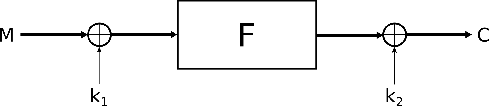
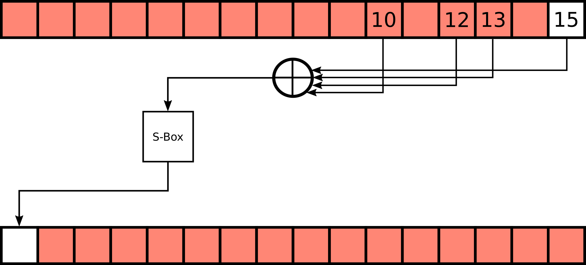
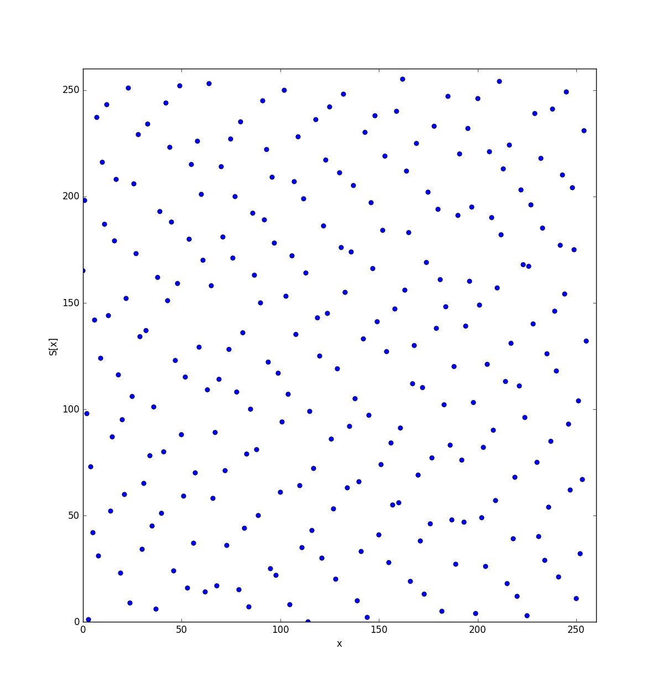
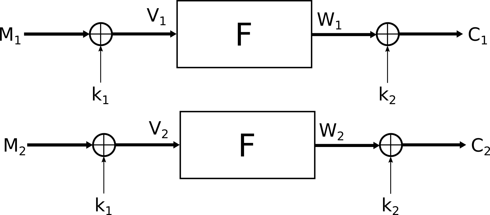

# HITB 2015 Write-up - Crypto 400

> Write up

## Introduction

The crypto 400 challenge deals with the Even Mansour cryptosystem. To validate this challenge we have to send the flag to a server.
The server checks if the answer matches the flag by encrypting the flag and the given message with a **random** key.
If both are equal the flag is correct otherwise it fails and the encrypted message is printed.

```python
key = os.urandom(32)
enc_flag = encrypt(flag, key)
enc = encrypt(answer, key)

if enc == enc_flag:
  response = "You lucky bastard, %s is indeed the correct flag!\n" % flag
else:
  response = "Unfortunately that is not our flag :(\n"
  response += "Your guess encrypts as\n%s" % enc
  response += "whereas our flag encrypts as\n%s" % enc_flag
```

## Even Mansour scheme

In this Even-Mansour scheme, the block size is 16 bytes and the 32-byte key is split into two 16-byte values: $k_1$ and $k_2$.
At first, the message $M$ is xor-ed with $k_1$ then $M \oplus k_1$ is going through a $F$ function which
will be discussed later. Finally the output is xor-ed with $k_2$.




So we have:

$$C = F(M \oplus k_1) \oplus k_2$$


```python
def EvenMansour(block, key):
  block = xor(block, key[:16])
  block = F(block)
  block = xor(block, key[16:])
  return block
```

In this challenge, the weakness comes from the $F$ function.

## $F$ function

The $F$ function is composed of 64-rounds that perform the ``step(...)`` transformation:

```python
def F(block):
  for i in range(64):
    block = step(block)
  return block
```

`step` uses an S-Box to transform the block in this way:





$$\begin{cases}
\text{block}^{n+1}\_0 = \text{SBox}(\text{block}^{n}\_{10} \oplus \text{block}^{n}\_{12} \oplus \text{block}^{n}\_{13} \oplus \text{block}^{n+1}_{15}) & k = 0 \\\\\\
\text{block}^{n+1}\_k = \text{block}^{n}\_{k - 1} & k > 0
\end{cases}$$


$\text{block}^{n}_k$ is the byte $k$ of the *block* at round $n$ ($0 \leq k < 16$ and $0 \leq n < 64$)


```python
def step(block):
  return chr( S[ ord(block[10]) ^ ord(block[12]) ^ ord(block[13]) ^ ord(block[15]) ] ) + block[:15]
```

By plotting $y = \text{S-Box}(x)$ we can notice that the S-Box has a special construction:



I thought about computing the differential characteristics which is the probability that given the input difference
$\Delta = x \oplus y$ we get the output delta: $\delta = S(x) \oplus S(y)$.
We will call this probability $P(\Delta | \delta)$ and with
following function, we can compute this probability:

```python
def P(dx ,dy):
    count = 0;
    for x in range(len(SBox)):
        dY = SBox[x] ^ SBox[x ^ dx]
        if dY == dy:
            count += 1;
    return float(count) / float(256)
```

For all $\Delta$ and $\delta$, we notice that this probability is either 0 or 1. Consequently, if we know $\delta$ we are sure to find $\Delta$. This will be useful for the differential attack.

## Differential Attack

To find the flag, we will perform a differential attack. We have a message $M_1$ that we know and we have an unknown second message $M_2$
that is the flag. We also know $C_1$ and $C_2$ such as:

$$\begin{align}
C\_1 & = & F(M\_1 \oplus k\_1) \oplus k\_2 \\\\\\
C\_2 & = & F(M\_2 \oplus k\_1) \oplus k\_2
\end{align}$$




By xor-ing $C_1$ and $C_2$ we can get $\Delta W = W_1 \oplus W_2 = C_1 \oplus C_2$. If somehow we can resolve $\Delta V$:

$$\begin{align}
\Delta V & = & V\_1 \oplus V\_2 \\\\\\
          & = & M\_1 \oplus k\_1 \oplus M\_2 \oplus k\_1\\\\\\
          & = & M\_1 \oplus M\_2.
\end{align}$$

We can extract $M_2$ with:

$$M_2 = \Delta V \oplus M_1$$

## Recovering $\Delta V$

Now, let's see how to resolve $\Delta V$ from $\Delta W$.

From the `step` function, we know that $\text{block}^{n+1}\_k = \text{block}^{n}\_{k - 1}$ therefore:

$$\Delta W^{n-1}\_k = \Delta W^{n}\_{k + 1} \forall k < 15$$

We know also $\Delta W^{n-1}\_{0,1,2 \ldots 14}$ but not $\Delta W^{n-1}\_{15}$

To find $\Delta W^{n-1}\_{15}$ we will use the fact that $P(\Delta X | \Delta W^{n-1}\_{15}) = 1$ for a given $\Delta X$.
Concretely, I built a table *diffTable* which maps $\delta$ to $\Delta$.

\begin{align}
\text{diffTable}(\Delta W^{n}\_{0}) & = & \Delta W^{n-1}\_{10} \oplus \Delta W^{n-1}\_{12} \oplus \Delta W^{n-1}\_{13} \oplus \Delta W^{n-1}\_{15} \\\\\\
                                   & = & \Delta W^{n}\_{11} \oplus \Delta W^{n}\_{13} \oplus \Delta W^{n}\_{14} \oplus \Delta W^{n-1}\_{15}\\\\\\
\Delta W^{n-1}\_{15}                & = & \text{diffTable}(\Delta W^{n}\_{0}) \oplus \Delta W^{n}\_{11} \oplus \Delta W^{n}\_{13} \oplus \Delta W^{n}\_{14}
\end{align}

Which enables to recover $\Delta W^{n - 1}$ from $\Delta W^{n}$.
Then, with recursion we can compute $\Delta W^{0} = \Delta V$

## Implementation

The following script is the implementation of the attack:

```python
#!/usr/bin/python2.7
# -*- coding: utf-8 -*-
import os

S = [
  0xa5,0xc6,0x62,0x01,0x49,0x2a,0x8e,0xed,0x1f,0x7c,0xd8,0xbb,0xf3,0x90,0x34,0x57,
  0xb3,0xd0,0x74,0x17,0x5f,0x3c,0x98,0xfb,0x09,0x6a,0xce,0xad,0xe5,0x86,0x22,0x41,
  0x89,0xea,0x4e,0x2d,0x65,0x06,0xa2,0xc1,0x33,0x50,0xf4,0x97,0xdf,0xbc,0x18,0x7b,
  0x9f,0xfc,0x58,0x3b,0x73,0x10,0xb4,0xd7,0x25,0x46,0xe2,0x81,0xc9,0xaa,0x0e,0x6d,
  0xfd,0x9e,0x3a,0x59,0x11,0x72,0xd6,0xb5,0x47,0x24,0x80,0xe3,0xab,0xc8,0x6c,0x0f,
  0xeb,0x88,0x2c,0x4f,0x07,0x64,0xc0,0xa3,0x51,0x32,0x96,0xf5,0xbd,0xde,0x7a,0x19,
  0xd1,0xb2,0x16,0x75,0x3d,0x5e,0xfa,0x99,0x6b,0x08,0xac,0xcf,0x87,0xe4,0x40,0x23,
  0xc7,0xa4,0x00,0x63,0x2b,0x48,0xec,0x8f,0x7d,0x1e,0xba,0xd9,0x91,0xf2,0x56,0x35,
  0x14,0x77,0xd3,0xb0,0xf8,0x9b,0x3f,0x5c,0xae,0xcd,0x69,0x0a,0x42,0x21,0x85,0xe6,
  0x02,0x61,0xc5,0xa6,0xee,0x8d,0x29,0x4a,0xb8,0xdb,0x7f,0x1c,0x54,0x37,0x93,0xf0,
  0x38,0x5b,0xff,0x9c,0xd4,0xb7,0x13,0x70,0x82,0xe1,0x45,0x26,0x6e,0x0d,0xa9,0xca,
  0x2e,0x4d,0xe9,0x8a,0xc2,0xa1,0x05,0x66,0x94,0xf7,0x53,0x30,0x78,0x1b,0xbf,0xdc,
  0x4c,0x2f,0x8b,0xe8,0xa0,0xc3,0x67,0x04,0xf6,0x95,0x31,0x52,0x1a,0x79,0xdd,0xbe,
  0x5a,0x39,0x9d,0xfe,0xb6,0xd5,0x71,0x12,0xe0,0x83,0x27,0x44,0x0c,0x6f,0xcb,0xa8,
  0x60,0x03,0xa7,0xc4,0x8c,0xef,0x4b,0x28,0xda,0xb9,0x1d,0x7e,0x36,0x55,0xf1,0x92,
  0x76,0x15,0xb1,0xd2,0x9a,0xf9,0x5d,0x3e,0xcc,0xaf,0x0b,0x68,0x20,0x43,0xe7,0x84
]

def xor(block1, block2):
  return "".join( chr(ord(a) ^ ord(b)) for (a,b) in zip(block1, block2))

def step(block):
  return chr(S[ord(block[10]) ^ ord(block[12]) ^ ord(block[13]) ^ ord(block[15])]) + block[:15]

def F(block):
  for i in xrange(64):
    block = step(block)
  return block

def EvenMansour(block, key):
  block = xor(block, key[:16])
  block = F(block)
  block = xor(block, key[16:])
  return block

def encrypt(data, key):
  data, num_blocks = pad(data)
  res = ""
  for i in xrange(num_blocks):
            block = EvenMansour(data[16*i:16*i+16], key)
      res += block
        return res

def pad(data):
    while True:
        data += '\x00'
    if len(data) % 16 == 0:
      return data, len(data) / 16

#
# Table T[a] = b such as
# S[x] ^ S[y] = a and b = x ^ y
#
def DiffTable(S):
    table = [0 for i in range(len(S))]
    for delta in range(len(S)):
        for x in range(len(S)):
            dY = S[x] ^ S[x ^ delta]
            table[dY] = delta
    return table


def main():
    key = os.urandom(32)
    M1 = "hitb{0123456789abcdef}"
    M2 = "aaaaaaaaaaaaaaaaaaaaaa"

    C1 = encrypt(M1, key)
    C2 = encrypt(M2, key)

    numberOfBlocks = len(C2) / 16
    diffTable = DiffTable(S)
    clearText = ""

    for block in range(numberOfBlocks):
        dW = xor(C1,C2)[16 * block : 16 * (block + 1)]
        for i in range(64):
            dWtemp = [dW[i + 1] for i in range(15)]

            delta = diffTable[ord(dW[0])]
            dW15 = chr(ord(dW[11]) ^ ord(dW[13]) ^ ord(dW[14]) ^ delta)
            dWtemp.append(dW15)

            dW = "".join(dWtemp)
        M = xor(dW, M2[16 * block : 16 * (block + 1)])
        clearText += M
    print clearText

if __name__ == '__main__':
    main()
```

## Conclusion

In fact by noticing that

$$F(x \oplus y) = F(x) \oplus F(y) \oplus C^{te}$$


```python
for b in xrange(10):
        u = os.urandom(16);
        v = os.urandom(16);
        d = xor(F(xor(u,v)), xor(F(u), F(v)))
        print d.encode("hex")
```

We have:

\begin{align}
F(M_1 \oplus k_1) \oplus F(M_2 \oplus k_1) & = & F(M_1) \oplus F(M_2)\\
M_2 & = & F^{-1}(F(M_1) \oplus C_1 \oplus C_2)
\end{align}

Which is far easier to resolve.

Thanks to **`jb^`**, who helped me find the previous technique.

Sources are available [here](hitb2015-crypto400.tar.gz)
