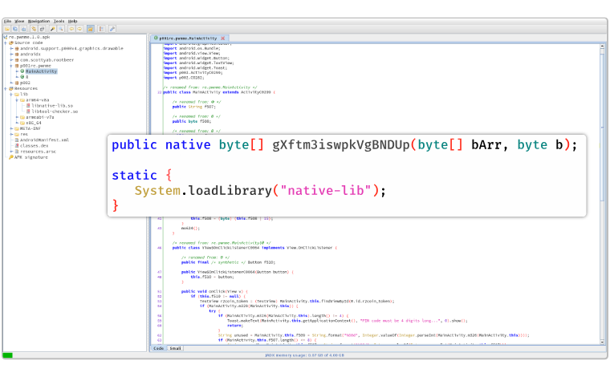
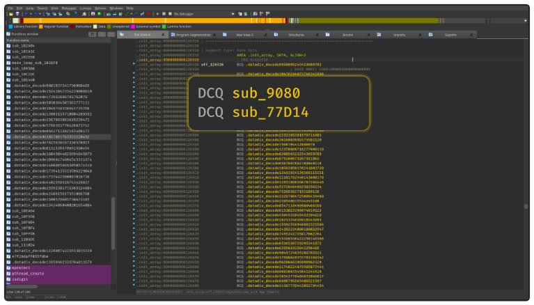
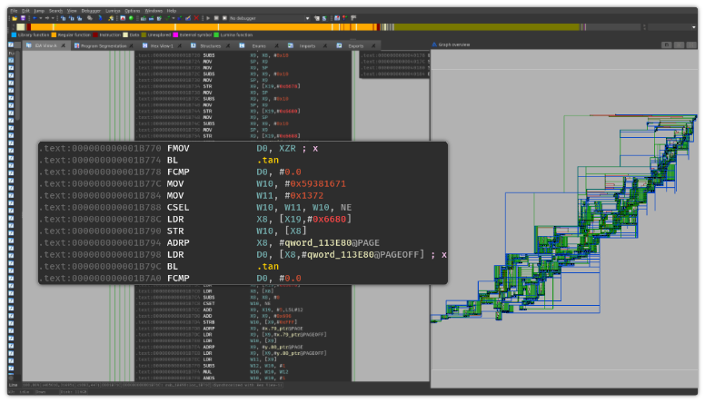
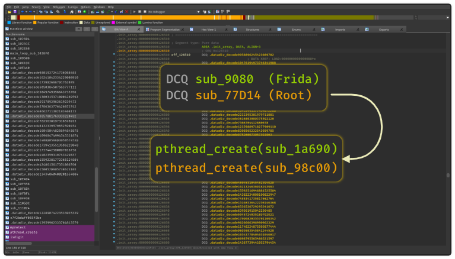
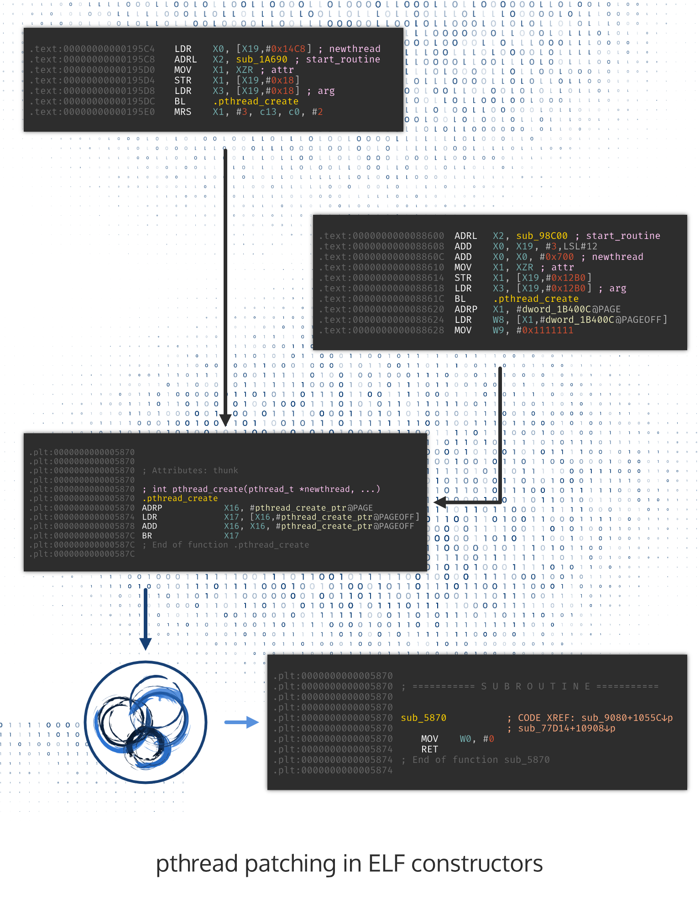
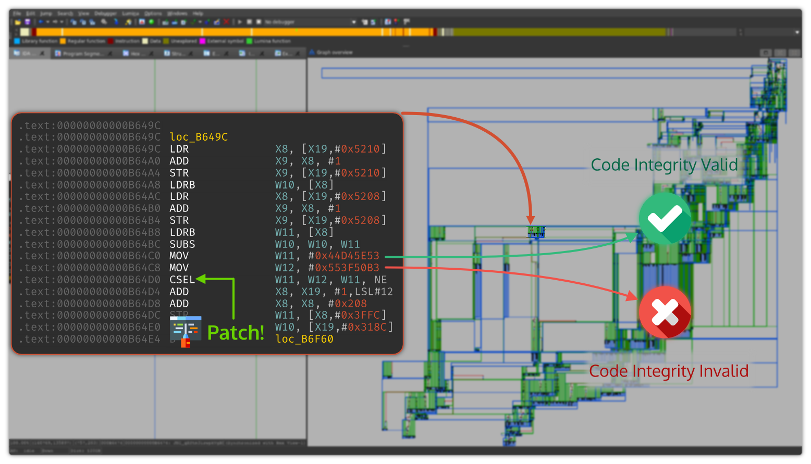
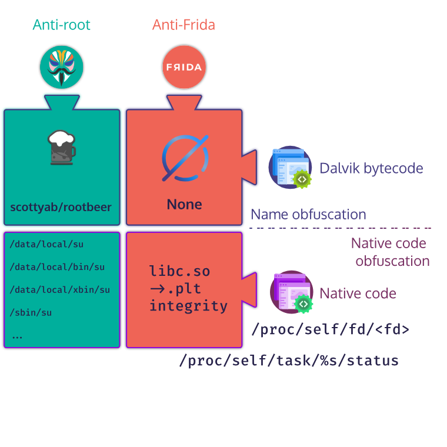

# r2-pay: anti-debug, anti-root & anti-frida (part 1)

> This first blog post describes the protections in the challenge r2-pay.

<style>
  .green {
    color:green;
    font-family: 'JetBrains Mono', monospace;
    font-size: 87.5%;
  }

  .blue {
    color: blue;
    font-family: 'JetBrains Mono', monospace;
    font-size: 87.5%;
  }
  .orange {
    color: #FF6347;
    font-family: 'JetBrains Mono', monospace;
    font-size: 87.5%;
  }

  .red {
    color: #df2b04;
    font-family: 'JetBrains Mono', monospace;
    font-size: 87.5%;
  }

  .hl-comment {
    color: #df2b04;
    font-family: 'JetBrains Mono', monospace;
    font-size: 87.5%;
  }

  .hl-keyword {
    color: #A90D91;
    font-family: 'JetBrains Mono', monospace;
    font-size: 87.5%;
  }

  .hl-literal {
    color: #1C01CE;
    font-family: 'JetBrains Mono', monospace;
    font-size: 87.5%;
  }

  .hl-preproc {
    color: #633820;
    font-family: 'JetBrains Mono', monospace;
    font-size: 87.5%;
  }

  .hl-strings {
    color: #C41A16;
    font-family: 'JetBrains Mono', monospace;
    font-size: 87.5%;
  }
  .yellow {
    color: #CC7000;
    font-family: 'JetBrains Mono', monospace;
    font-size: 87.5%;
  }

#
</style>


## Introduction

This series of blog posts explains one way to resolve the r2-pay challenge released during the [r2con2020](https://rada.re/con/2020/) conference. This first part is about the
anti-analysis tricks used to hinder reverse-engineering while the second part will be more focused on
breaking the whitebox.

The resolution took me more than a week-end but it covers nice topics that worth it: **obfuscation & whitebox**.
It was also the opportunity to practice attacks against whiteboxes
and to test [SideChannelMarvels/JeanGrey](https://github.com/SideChannelMarvels/JeanGrey) developed by Philippe Teuwen (aka. [@doegox](https://twitter.com/doegox)).


The challenge has been resolved with the AArch64 version on a device running on Android 9 and rooted with Magisk.

> **Note**
Here are the files used in this write-up:

 [re.pwnme.1.0.apk - af019d3016720592aade7bde9890110c](re.pwnme.1.0.apk)

 [libnative-lib.so (arm64-v8a version)](libnative-lib.so)


## Overview

When opening the application on a non-tempered device (or with Magisk hide enabled), we are asked to enter
a PIN and an amount that is used to generate a *token*.

To resolve the challenge, we have to find the *master key* that is used to generate the token.
Few days before the CTF I was told that one of the challenges
would involve an obfuscated whitebox ...

The main interface of the APK is located in the Java class ``re.pwnme.MainActivity`` which forwards the user inputs (PIN & amount)
to a JNI function named ``gXftm3iswpkVgBNDUp``. This function takes the concatenated input $PIN\ ||\ Amount$
and returns the token as a byte array.

The **static constructor** of the class loads the "native-lib" library which is available for the architectures:
``arm64-v8a``, ``armeabi-v7a``, and ``x86_64``. Unsurprisingly, this library is obfuscated and some symbols suggest that it has
been compiled with a fork of O-LLVM[^1].



In addition, the library does not export the expected symbol ``Java_re_pwnme_MainActivity_gXftm3iswpkVgBNDUp`` but prefers
to use the ``JNI_OnLoad`` technique[^2]. ``JNI_OnLoad()`` is also obfuscated along with control-flow-flattening.

The main task of the challenge is to understand the logic of the ``gXftm3iswpkVgBNDUp`` function to figure out how the
*token* is generated.


## Anti-Root & Anti-Frida

Along with the ``libnative-lib.so`` library, the applications embeds another library ``libtool-checker.so``
whose name sounds quite familiar: it comes from the open-source project [RootBeer](https://github.com/scottyab/rootbeer)
which is used to detect if the device is rooted.

Some of the root-checks are done in the MainActivity class and if the device is rooted the application raises
an exception by dividing a number with 0.

On this point, we can disable the check by using [Frida](https://frida.re/) on the RootBeer's functions involved in the detection:

```javascript
// frida -U -l ./bypass-root.js --no-pause -f re.pwnme
Java.perform(function () {
  var RootCheck = Java.use('\u266b.\u1d64');

  RootCheck['₤'].implementation = function () {
    console.log("Skip root");
    return false;
  }

  RootCheck['θ'].overload().implementation = function () {
    console.log("Skip root");
    return false;
  }
})
```

Nevertheless, the application still crashes as soon as it starts and generates the following backtrace:

```text
F libc    : Fatal signal 11 (SIGSEGV), code 1 (SEGV_MAPERR), fault addr 0xfa929095 in tid 8875 (re.pwnme), pid 8849 (re.pwnme)
F DEBUG   : *** *** *** *** *** *** *** *** *** *** *** *** *** *** *** ***
F DEBUG   : Build fingerprint: 'google/taimen/taimen:9/PQ3A.190801.002/5670241:user/release-keys'
F DEBUG   : Revision: 'rev_10'
F DEBUG   : ABI: 'arm64'
F DEBUG   : pid: 8849, tid: 8875, name: re.pwnme  >>> com.google.android.gms <<<
F DEBUG   : signal 11 (SIGSEGV), code 1 (SEGV_MAPERR), fault addr 0xfa929095
F DEBUG   :     x0  0000007f041f6610  x1  0000007f2565c800  x2  0000007f25600000  x3  000000000000001d
F DEBUG   :     x4  000000000000005c  x5  0000000000000001  x6  0000000000000001  x7  0000000000000000
F DEBUG   :     x8  0000007f041f6610  x9  0000007f041f6600  x10 00000000fa929095  x11 00000000000035b2
F DEBUG   :     x12 00000000e34d79ac  x13 00000000fffffff7  x14 00000000a139577d  x15 0000000000000001
F DEBUG   :     x16 0000007fa66af220  x17 0000007fa65e3608  x18 0000000000000000  x19 0000007f041f6680
F DEBUG   :     x20 0000000000000000  x21 0000000000000000  x22 0000229100002291  x23 0000000000000000
F DEBUG   :     x24 0000007f041ff570  x25 0000007f04102000  x26 0000007fab1ad5e0  x27 0000007f0421a690
F DEBUG   :     x28 0000007f04209080  x29 0000007f041ff490
F DEBUG   :     sp  0000007f041f65f0  lr  0000007f0423de04  pc  0000007f0423f980
F DEBUG   :
F DEBUG   : backtrace:
F DEBUG   :     #00 pc 000000000003f980  /data/app/re.pwnme-7O3ynhSmMsg2_E5_uqbQxQ==/lib/arm64/libnative-lib.so
```

The backtrace suggests that other checks are performed in the native library. By looking at the ELF's constructors,
we can notice two functions that differ from those generated by the obfuscator:




> **Note**
``.datadiv_decode13003153710004289592`` functions are in the ELF constructors since they decode global strings that need to be
available as soon as the library is loaded.


By tracing these functions with [QBDI](https://qbdi.quarkslab.com/), we quickly understand that <span class="green">sub_9080</span> iterates over
``/proc/self/maps`` with the syscalls <span class="blue">openat</span>/<span class="hl-keyword">read</span>
that are located at the addresses <span class="blue">0x009870</span> and <span class="hl-keyword">0x00b448</span>.

Then, we observe the following sequence:

```text
0x011fb0: syscall: openat(0xffffffffffffff9c, '/system/lib64/libc.so')

0x012884: syscall: read(51, 0x7ffc006c58, 64): 'ELF@)@8@'

0x013170: syscall: lseek(51, 0x112918, 0)

0x0145f8: syscall: read(51, 0x7ffc006c18, 64)
0x0145f8: syscall: read(51, 0x7ffc006c18, 64)
0x0145f8: syscall: read(51, 0x7ffc006c18, 64): '/ '
0x0145f8: syscall: read(51, 0x7ffc006c18, 64): 'B88'
0x0145f8: syscall: read(51, 0x7ffc006c18, 64): 'J>'
0x0145f8: syscall: read(51, 0x7ffc006c18, 64): 'RoP)'
0x0145f8: syscall: read(51, 0x7ffc006c18, 64): '\o(('
0x0145f8: syscall: read(51, 0x7ffc006c18, 64): 'io'
0x0145f8: syscall: read(51, 0x7ffc006c18, 64): 'xo0'
0x0145f8: syscall: read(51, 0x7ffc006c18, 64)
0x0145f8: syscall: read(51, 0x7ffc006c18, 64): 'Bxx`-'
0x0145f8: syscall: read(51, 0x7ffc006c18, 64): 'PP`'

0x0151f4: malloc(0x18): 0x7f0c21f4c0
0x0156e4: syscall: lseek(51, 0x1a650, 0)
0x015a68: malloc(0x1e60): 0x7f0acb2000
0x015fa0: syscall: read(51, 0x7f0acb2000, 0x1e60): '{n@b r@ v@ z@ ~@ @ @" @B @b @ @ @ @ @ @" @B @b @ @ @ @ @ @" @B @b @ @ @ @ @ @" @B @b @ @ @ @ A A" AB Ab A A A A "A &A" *AB .Ab 2A 6A :A >A BA FA" JAB NAb RA VA ZA ^A bA fA" jAB nAb rA vA zA ~A A A" AB Ab A A A A A A" AB Ab A A A A A A" AB Ab A A A A A A" AB Ab A A A A B B" BB Bb B B B B "B &B" *BB .Bb 2B 6B :B >B BB FB" JBB NBb RB VB ZB ^B bB fB" jBB nBb rB vB zB ~B B B" BB Bb B B B B B B" B ...'
0x016cfc: free(0x7f0acb2000) -> {n@b    r@ v@ z@ ~@ @ @" @B @b @ @ @ @ @ @" @B @b @ @ @ @ @ @" @B @b @ @ @ @ @ @" @B @b @ @ @ @ A A" AB Ab A A A A "A &A" *AB .Ab 2A 6A :A >A BA FA" JAB NAb RA VA ZA ^A bA fA" jAB nAb rA vA zA ~A A A" AB Ab A A A A A A" AB Ab A A A A A A" AB Ab A A A A A A" AB Ab A A A A B B" BB Bb B B B B "B &B" *BB .Bb 2B 6B :B >B BB FB" JBB NBb RB VB ZB ^B bB fB" jBB nBb rB vB zB ~B B B" BB Bb B B B B B B" B ...
0x017118: syscall: close(51)
```

From this output, we can infer the following logic:

1. ``0x011fb0``: the function opens the libc
2. ``0x012884``: it reads the ELF header
3. ``0x013170``: it jumps to the ELF sections table
4. ``0x0145f8``: it looks for the ``.plt`` section
5. ``0x015a68``, ``0x015fa0``: it reads the content of the ``.plt`` section

These operations suggest that the function checks if the ``.plt`` of ``/system/lib64/libc.so`` is not tampered with.
In particular, if we use Frida on a libc's function this check won't pass.

After this check, the function <span class="green">sub_9080</span> spawns a thread:

```text
0x0195dc: pthread_create(0xf1079f10, 0x0, 0x1a690, 0x0)
```

The libc integrity check makes more sense as it is probably used to protect the library against a hook of ``pthread_create()``.

The thread's routine <span class="red">sub_1a690</span> starts by making two calls to the mathematical function ``tan()``:

```text
0x01b774: tan(0.): 0.
0x01b79c: tan(-7832.0): -0.00951489
0x01cc74: memcpy(0x7ffc006598, libnative-lib.so!0x1267f0, 80) -> !7Nl
0x01ceb8: rand()
0x01f774: tan(0.): 0.
0x01f79c: tan(-7832.0): -0.00951489
```

My understanding of these calls is that the application tries to protect against tools that would not support
floating-point instructions such as ``FCMP`` or ``FMOV``. In addition, I think that if we mock the behavior of
``tan()`` with a constant value it would trigger a crash.



Then it follows a check of ``TracerPid`` value in ``/proc/self/status``. This value is set when
the process is being debugged with `ptrace` (which is the case with gdb).
Dynamically, we observe syscalls that open ``/proc/self/status`` and read the content
byte-per-byte:

```text
0x020ee0: syscall: openat(0xffffffffffffff9c, '/proc/self/status'): 51
0x0231e8: syscall: read(51, 0x7ffc00656c, 1): 'N'
0x0231e8: syscall: read(51, 0x7ffc00656c, 1): 'a'
0x0231e8: syscall: read(51, 0x7ffc00656c, 1): 'm'
0x0231e8: syscall: read(51, 0x7ffc00656c, 1): 'e'
0x0231e8: syscall: read(51, 0x7ffc00656c, 1): ':'
0x0231e8: syscall: read(51, 0x7ffc00656c, 1)
0x0231e8: syscall: read(51, 0x7ffc00656c, 1): 'r'
0x0231e8: syscall: read(51, 0x7ffc00656c, 1): 'e'
0x0231e8: syscall: read(51, 0x7ffc00656c, 1): '.'
0x0231e8: syscall: read(51, 0x7ffc00656c, 1): 'p'
0x0231e8: syscall: read(51, 0x7ffc00656c, 1): 'w'
0x0231e8: syscall: read(51, 0x7ffc00656c, 1): 'n'
0x0231e8: syscall: read(51, 0x7ffc00656c, 1): 'm'
0x0231e8: syscall: read(51, 0x7ffc00656c, 1): 'e'
0x0231e8: syscall: read(51, 0x7ffc00656c, 1)
0x0231e8: syscall: read(51, 0x7ffc00656c, 1): 'S'
0x0231e8: syscall: read(51, 0x7ffc00656c, 1): 't'
0x0231e8: syscall: read(51, 0x7ffc00656c, 1): 'a'
0x0231e8: syscall: read(51, 0x7ffc00656c, 1): 't'
0x0231e8: syscall: read(51, 0x7ffc00656c, 1): 'e'
0x0231e8: syscall: read(51, 0x7ffc00656c, 1): ':'
...
```

## Anti-Frida #1

Still in the thread's routine <span class="red">sub_1a690</span>, the function checks if Frida is running by looking
at all the values of ``/proc/self/task/<tid>/status`` and by checking if one of the names is <span class="red"><b><u>gmain</u></b></span>.
It turns out that it's the case when Frida is used in the application :-)

```text
0x0368e4: snprintf('/proc/self/task/9719/status', '/proc/self/task/%s/status'): '/proc/self/task/9719/status'
0x036a1c: syscall: openat(0xffffffffffffff9c, '/proc/self/task/9719/status')
0x03897c: syscall: read(73, 0x7ffc400af4, 1): 'N'
0x03897c: syscall: read(73, 0x7ffc400af4, 1): 'a'
0x03897c: syscall: read(73, 0x7ffc400af4, 1): 'm'
0x03897c: syscall: read(73, 0x7ffc400af4, 1): 'e'
0x03897c: syscall: read(73, 0x7ffc400af4, 1): ':'
0x03897c: syscall: read(73, 0x7ffc400af4, 1)
0x03897c: syscall: read(73, 0x7ffc400af4, 1): 'g'
0x03897c: syscall: read(73, 0x7ffc400af4, 1): 'm'
0x03897c: syscall: read(73, 0x7ffc400af4, 1): 'a'
0x03897c: syscall: read(73, 0x7ffc400af4, 1): 'i'
0x03897c: syscall: read(73, 0x7ffc400af4, 1): 'n'
0x03897c: syscall: read(73, 0x7ffc400af4, 1)
0x03897c: closedir()
# Crash!
```

To bypass this check, one can statically patch the syscall or we can dynamically
change the behavior of ``snprintf(..., '/proc/self/task/%s/status')`` in order to **always** returns the same status (e.g. ``/proc/self/task/123/status``).
Concretely, it could be done by hooking ``snprintf`` and by forcing the *output* string to ``/proc/self/task/123/status``.

## Anti-Frida #2

Still in the <span class="red">sub_1a690</span> function, the anti-frida checks continue by inspecting the file descriptors
of the process. It iterates over ``/proc/self/fd/%s`` and looks at the underlying symlink.

Frida <span class="blue">server</span> (which runs globally on the device) and Frida agent (which is injected in the
process) communicate with named pipes that are associated with a file descriptor.

If Frida server is running, we can observe the following values:

```text
0x04308c: lstat('/proc/self/fd/32')
0x043448: syscall: readlinkat(0xffffffffffffff9c, '/proc/self/fd/32', 0x7ffbffdc10, 256): 'anon_inode:[eventfd]'
0x041844: readdir('33')
0x043078: snprintf('/proc/self/fd/33', '/proc/self/fd/%s'): '/proc/self/fd/33'
0x04308c: lstat('/proc/self/fd/33')
0x043448: syscall: readlinkat(0xffffffffffffff9c, '/proc/self/fd/33', 0x7ffbffdc10, 256): 'anon_inode:[eventfd]'

0x041844: readdir('34')
0x043078: snprintf('/proc/self/fd/34', '/proc/self/fd/%s'): '/proc/self/fd/34'
0x04308c: lstat('/proc/self/fd/34')
0x043448: syscall: readlinkat(0xffffffffffffff9c, '/proc/self/fd/34', 0x7ffbffdc10, 256): '/data/local/tmp/re.frida.server/linjector-500'
# Crash!
```

In this case, the file descriptor ``34`` is associated with ``/data/local/tmp/re.frida.server/linjector-500``
which triggers the detection and the application crashes.

As for ``/proc/self/task/<tid>/status``, one can disable this check by **statically patching** the syscalls or
by **dynamically changing** the result of ``readlinkat()``. For instance, we can use [QBDI](https://qbdi.quarkslab.com/) to
instrument syscall instructions and process the result of ``readlinkat()`` in a user callback:

```cpp

vm.addMnemonicCB("SVC", POST_INST,
  [] (VMInstanceRef vm, GPRState* gprState, FPRState*, void* data) {
    if (gprState->x8 != __NR_readlinkat) {
      return VMAction::CONTINUE;
    }

    std::string buf = reinterpret_cast<char*>(gprState->x2);
    if (buf.find("re.frida.server") != std::string::npos) {
      static const std::string FAKE_VALUE = "anon_inode:[eventfd]";
      // Bypass Frida detection!
      memcpy(
        reinterpret_cast<void*>(gprState->x2),
        reinterpret_cast<void*>(FAKE_VALUE.c_str()),
        FAKE_VALUE.size() + 1
      );
      gprState->x0 = FAKE_VALUE.size() + 1;
    }

    return VMAction::CONTINUE;

  }, ctx);

```

## Anti-Frida #3 ?

I'm not sure if the following calls sequence is used to check the libc's integrity against Frida but
at the end of the thread's routine, we can observe these syscalls:

```text
0x048ff0: syscall: openat(0xffffffffffffff9c, '/proc/self/maps'): 51
0x04ae6c: syscall: read(51, 0x7ffc006578, 1): '1'
0x04ae6c: syscall: read(51, 0x7ffc006578, 1): '2'
0x04ae6c: syscall: read(51, 0x7ffc006578, 1): 'c'
0x04ae6c: syscall: read(51, 0x7ffc006578, 1): '0'
0x04ae6c: syscall: read(51, 0x7ffc006578, 1): '0'
0x04ae6c: syscall: read(51, 0x7ffc006578, 1): '0'
0x04ae6c: syscall: read(51, 0x7ffc006578, 1): '0'
0x04ae6c: syscall: read(51, 0x7ffc006578, 1): '0'
...
0x0513f8: sscanf('7fa65c0000-7fa65dc000 r-xp 00000000 08:07 1275/system/lib64/libc.so', '%lx-%lx %s %s %s %s %s')
0x056034: syscall: close(51)
```

The result of ``sscanf()`` could be used to check the page permissions (e.g. ``r``<span class="blue">w</span>``xp``)
or to the libc's base address (to check if it is consistent).

## Anti-Root

In addition to the root-beer detection, the library embeds another root detection located in the **second** ELF constructor.
This constructor, <span class="yellow">sub_77D14</span>, performs the same early checks as the first constructor
on the libc's ``.plt`` integrity before spawning another thread routine, <span class="yellow">sub_98c00</span>.


```text
0x08861c: pthread_create(0xfa780b70, 0x0, 0x98c00, 0x0)
```



By tracing the thread's routine, we notice that it checks if ``su`` files are present on the device through
three different calls:

1. One call to ``open()``: <span class="hl-literal">0x099180: open(<span class="hl-strings">'/system/xbin/su'</span>)</span>
2. One syscall to ``openat()``: <span class="hl-literal">0x0992a4: syscall: openat(..., <span class="hl-strings">'/data/su'</span>)</span>
3. One syscall to ``faccessat()``: <span class="hl-literal">0x0993f0: syscall: faccessat(<span class="hl-strings">'/sbin/su'</span>)</span>

```text
0x099180: open('/data/local/su'): -1
0x0992a4: syscall: openat(0xffffffffffffff9c, '/data/local/su'): -2
0x0993f0: syscall: faccessat('/data/local/su'): -2
0x099180: open('/data/local/bin/su'): -1
0x0992a4: syscall: openat(0xffffffffffffff9c, '/data/local/bin/su'): -2
0x0993f0: syscall: faccessat('/data/local/bin/su'): -2
0x099180: open('/data/local/xbin/su'): -1
0x0992a4: syscall: openat(0xffffffffffffff9c, '/data/local/xbin/su'): -2
0x0993f0: syscall: faccessat('/data/local/xbin/su'): -2
0x099180: open('/sbin/su'): 51
0x0992a4: syscall: openat(0xffffffffffffff9c, '/sbin/su'): 52
0x0993f0: syscall: faccessat('/sbin/su'): 52
Crash!
```

By forcing the results of these functions to ``-1`` or ``-2``, we can disable the checks.

Here is the list of the su-files that are used in this detection:


* <span class="hl-strings">/data/local/su</span>
* <span class="hl-strings">/data/local/bin/su</span>
* <span class="hl-strings">/data/local/xbin/su</span>
* <span class="hl-strings">/sbin/su</span>
* <span class="hl-strings">/su/bin/su</span>
* <span class="hl-strings">/system/bin/su</span>
* <span class="hl-strings">/system/bin/.ext/su</span>
* <span class="hl-strings">/system/bin/failsafe/su</span>
* <span class="hl-strings">/system/sd/xbin/su</span>
* <span class="hl-strings">/system/usr/we-need-root/su</span>
* <span class="hl-strings">/system/xbin/su</span>
* <span class="hl-strings">/cache/su</span>
* <span class="hl-strings">/data/su</span>
* <span class="hl-strings">/dev/su</span>

At the end of the thread's routine, we can also observe the following calls that
are probably used to check if the application is running on a real Android system.

```text
0x099e30: syscall: faccessat('/system')
0x099e30: syscall: faccessat('/system/bin')
0x099e30: syscall: faccessat('/system/sbin')
0x099e30: syscall: faccessat('/system/xbin')
0x099e30: syscall: faccessat('/vendor/bin')
0x099e30: syscall: faccessat('/sbin')
0x099e30: syscall: faccessat('/etc')
```

## Static bypass with LIEF

In the previous sections, we described the anti-root, anti-debug and anti-frida checks
made in the ELF constructors. The **same** dynamic checks are also performed in the ``gXftm3iswpkVgBNDUp`` function
at the following locations:


* <span class="hl-keyword">0x09f2f8</span>: <span class="hl-literal">/proc/self/status</span>
* <span class="hl-keyword">0x0d4840</span>: <span class="hl-literal">/proc/self/fd/</span>
* <span class="hl-keyword">0x0dec8c</span>: <span class="hl-literal">/proc/self/task/\<tid\>/status</span>

While the checks in ``gXftm3iswpkVgBNDUp`` can be dynamically disabled when instrumenting the function,
the checks in the ELF constructors are annoying.

One way to disable the checks in the thread's routines is to disable the ``pthread_create(...)``. It can
be achieved by patching the ``.plt`` entry associated with the function:

```armasm
mov x0, xzr;
ret;
```

Thanks to ``llvm-mc``, we can get the raw bytes of these instructions:

```console
$ echo "mov x0, xzr;ret;"|llvm-mc -arch=aarch64 -show-encoding

.text
mov     x0, xzr                 // encoding: [0xe0,0x03,0x1f,0xaa]
ret                             // encoding: [0xc0,0x03,0x5f,0xd6]
```

Finally, we can patch the ``.plt`` with [LIEF](https://lief.quarkslab.com):

```python
import lief
lib = lief.parse("./libnative-lib.so")
lib.patch_address(0x5870, [0xe0,0x03,0x1f,0xaa])
lib.patch_address(0x5874, [0xc0,0x03,0x5f,0xd6])
lib.write("./libnative-lib-patched.so")
```




Using these patches and the Frida script exposed in the first section, we are able to **load** the application but the other
detections are triggered in ``gXftm3iswpkVgBNDUp``. Nevertheless, with
the Frida's stalker or QBDI we can trace the instructions and disable the other checks.

If one wants to completely bypass all the protections statically, here are the patches:

```python
import lief
lib = lief.parse("./libnative-lib.so")

# Keys are str objects for a better understanding :)
INST = {
    "mov x0, #0":  [0xe0, 0x03, 0x1f, 0xaa],
    "ret":         [0xc0, 0x03, 0x5f, 0xd6],
    "nop":         [0x1f, 0x20, 0x03, 0xd5],
}

PATCHES = [
    # Patch the .plt entry of pthread_create
    (0x5870, INST["mov x0, #0"]),
    (0x5874, INST["ret"]),

    # Disable anti-frida checks
    (0x0d718c, INST["mov x0, #0"]), # /proc/self/fd : patch the result of readlinkat syscall
    (0x0e1940, INST["mov x0, #0"]), # /proc/self/task/<tid>/status: patch the result of read syscall

    # Disable .text integrity checks
    (0xB64D0, INST["nop"]),
]

for patch in PATCHES:
    lib.patch_address(*patch)

lib.write("libnative-lib.so")
```

When writing this write-up, I realized that patching the syscalls involved in the anti-frida (<span class="hl-literal">/proc/self/fd/</span> and <span class="hl-literal">/proc/self/task/\<tid\>/status</span>)
makes the application crash.

It turns out that the library seems to implement **code integrity on the ``.text`` section** that I didn't notice when running
the function through QBDI.
Nevertheless, by tracing the basic block[^3]
we can identify the basic block involved in the integrity check and patch it.




> **Note**
The scripts and the patched library are available [here ](https://github.com/romainthomas/r2pay).


Regarding ``JNI_OnLoad()``, a trace generated with [QBDI's ExecBroker](https://github.com/QBDI/examples/blob/d589d28b237f46d16cab3b11aa36bbb51102e307/packer-android-x86/src/libshellx_qbdi.cpp#L18-L85)
leads to following result:

```cpp
JNI_OnLoad() {
    0x09af3c: GetEnv(0x7fcb507460, 0x10006)
    0x09b0ac: FindClass("re/pwnme/MainActivity"): 537
    0x09b1b4: RegisterNatives()
        gXftm3iswpkVgBNDUp ([BB)[B -> "libnative-lib.so@0x9b41c"
}
```
Then, we can extract the function's offset: <span class="blue">gXftm3iswpkVgBNDUp</span>: <span class="red">0x9b41c</span>.

## Summary & Conclusion

Whilst Frida detections are usually based on sockets and library names in ``/proc/self/maps``,
this challenge introduces two detections based on named pipes:``/proc/self/fd`` and thread status: ``/proc/self/task/<tid>/status``
which are pretty cool :-)


These checks are performed in two locations:

1. The ELF constructors
2. The function ``gXftm3iswpkVgBNDUp()``

The implementation in the ELF constructors might be tricky to analyze since the functions are called before **any**
other classical functions (which includes ``JNI_OnLoad()``). Nevertheless, thanks to the interface of the ELF loader,
it exposes the function ``call_array(...)``[^4] which is handy to process the ELF constructors.

> **Note**
This function is mangled as ``__dl__ZL10call_arrayIPFviPPcS1_EEvPKcPT_mbS5_`` in ``/system/bin/linker64``




Since QBDI is not detected in this challenge, it's a good opportunity to give it a try:
<div class="legacy-center">
<p>
 <a href="https://github.com/QBDI/QBDI">https://github.com/QBDI/QBDI</a>
</p>
</div>


## Acknowledgments

Thanks to <u>Eduardo Novella</u> ([@enovella_](https://twitter.com/enovella_))
and <u>Gautam Arvind</u> ([@darvincisec](https://twitter.com/darvincisec)) for this interesting and realistic challenge they created!

Also thanks to <u>[Quarkslab](https://www.quarkslab.com)</u> that allowed this publication.
For those who are interested in similar topics, you can take a look at the Quarkslab's [blog](https://blog.quarkslab.com/).

### References

[^1]: [GoSSIP-SJTU/Armariris](https://github.com/GoSSIP-SJTU/Armariris) - [``StringObfuscation.cpp#L140``](https://github.com/GoSSIP-SJTU/Armariris/blob/0cba41329244a29c7cb94e25458191b68967b6e8/lib/Transforms/Obfuscation/StringObfuscation.cpp#L140)
[^2]: https://developer.android.com/training/articles/perf-jni#native-libraries
[^3]: [``addVMEventCB(VMEvent::BASIC_BLOCK_ENTRY, ...);``](https://github.com/QBDI/QBDI/blob/a20653f07df3ae78250e7ecf28ed699b2d727027/include/QBDI/VM.h#L296-L305)
[^4]: [``linker/linker_soinfo.cpp:420``](https://android.googlesource.com/platform/bionic/+/refs/tags/android-9.0.0_r60/linker/linker_soinfo.cpp#420)
