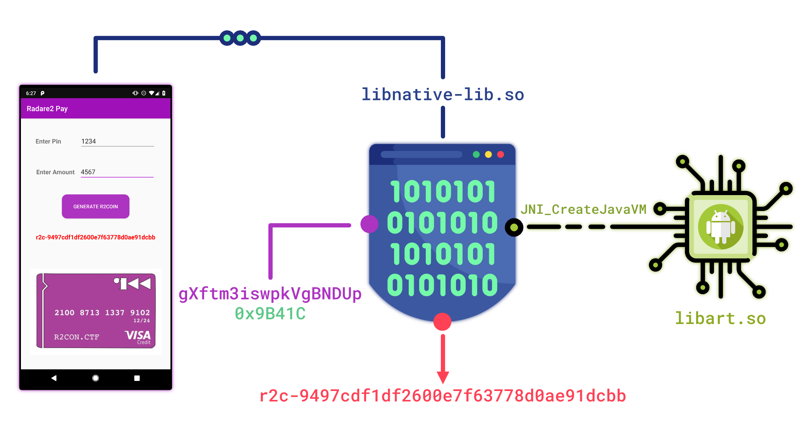
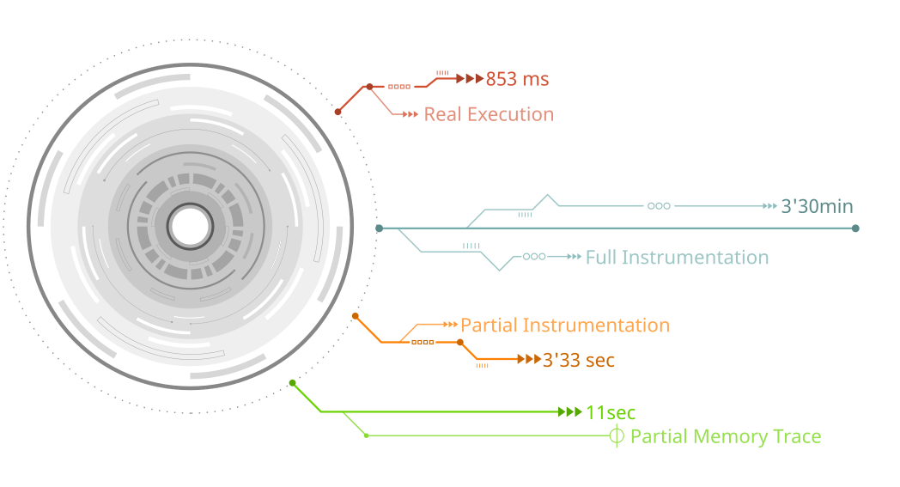
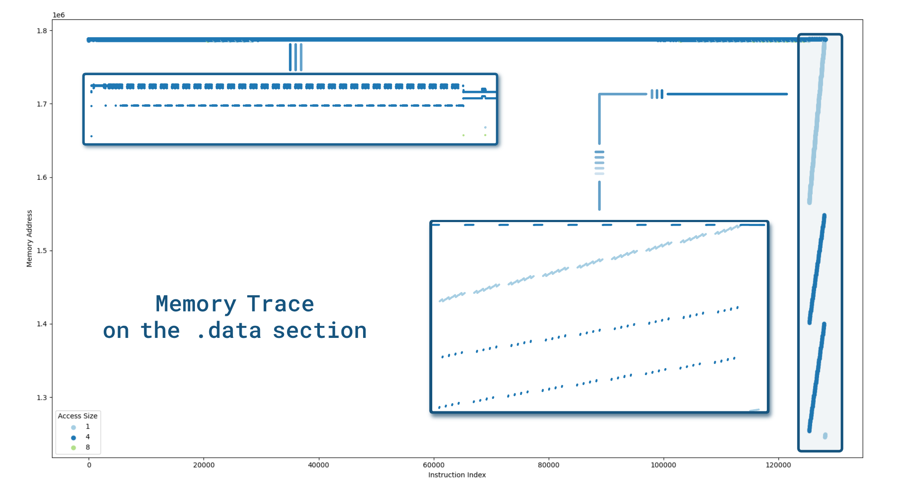
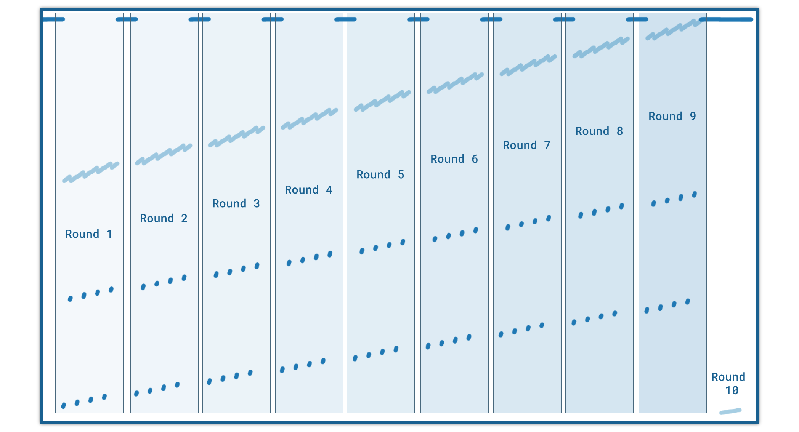
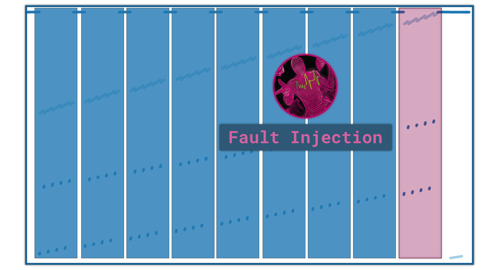
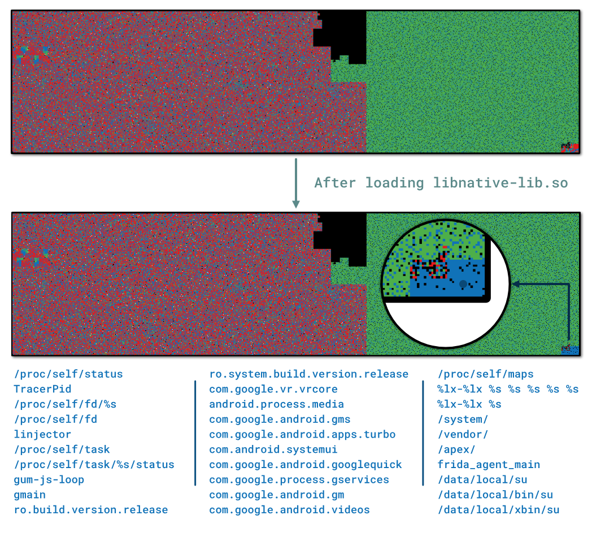

# r2-pay: whitebox (part 2)

> This second blog post explains how to recover the whitebox's key from the obfuscated library libnative-lib.so

<style>
  .green {
    color:green;
    font-family: 'JetBrains Mono', monospace;
    font-size: 87.5%;
  }

  .blue {
    color: blue;
    font-family: 'JetBrains Mono', monospace;
    font-size: 87.5%;
  }
  .orange {
    color: #FF6347;
    font-family: 'JetBrains Mono', monospace;
    font-size: 87.5%;
  }

  .red {
    color: #df2b04;
    font-family: 'JetBrains Mono', monospace;
    font-size: 87.5%;
  }

  .hl-comment {
    color: #df2b04;
    font-family: 'JetBrains Mono', monospace;
    font-size: 87.5%;
  }

  .hl-keyword {
    color: #A90D91;
    font-family: 'JetBrains Mono', monospace;
    font-size: 87.5%;
  }

  .hl-literal {
    color: #1C01CE;
    font-family: 'JetBrains Mono', monospace;
    font-size: 87.5%;
  }

  .hl-preproc {
    color: #633820;
    font-family: 'JetBrains Mono', monospace;
    font-size: 87.5%;
  }

  .hl-strings {
    color: #C41A16;
    font-family: 'JetBrains Mono', monospace;
    font-size: 87.5%;
  }
  .yellow {
    color: #CC7000;
    font-family: 'JetBrains Mono', monospace;
    font-size: 87.5%;
  }

#
</style>


## Introduction

In the [first part](/post/20-09-r2con-obfuscated-whitebox-part1/) of this write-up, we described the
anti-frida, anti-debug and anti-root techniques used in the application and how to remove most of them.

This second part digs into the JNI function ``gXftm3iswpkVgBNDUp`` and the underlying whitebox implementation.

## Library Shimming

The inputs of the function ``gXftm3iswpkVgBNDUp`` are provided by the GUI widgets and the function
is triggered when we press the *Generate R2Coin* button.
Nevertheless, the behavior of ``gXftm3iswpkVgBNDUp`` does not rely on UI features nor
the application's context[^1].

To take a closer look at the logic of ``gXftm3iswpkVgBNDUp``, it would be pretty useful to be able to feed
the function's inputs with our **own standalone binary**. Basically, we would like to achieve this kind
of interface:

```cpp
int main(int argc, char** argv) {
  void* dlopen("libnative-lib.so", RTLD_NOW);
  ...
  jbyteArray out = gXftm3iswpkVgBNDUp(env, ...);
  return 0;
}
```

This technique is not new and has been already described in a blog post by [Caleb Fenton](https://twitter.com/caleb_fenton)[^2]. The idea is to get
the ``JNIEnv* env`` variable with ``JNI_CreateJavaVM`` which is exported by the Android runtime: ``libart.so``.

Once we have this variable, we can call the ``gXftm3iswpkVgBNDUp`` function as well as manipulating the JNI buffers:
- ``env->NewByteArray()``
- ``env->GetArrayLength()``
- ...



Long story short, we can instantiate the Android runtime with the following piece of code:

```cpp
int main(int argc, char** argv) {
  JavaVMOption opt[2];
  opt[0].optionString = "-Djava.class.path=/data/local/tmp/re.pwnme.1.0.apk";
  opt[1].optionString = "-Djava.library.path=/data/local/tmp";

  JavaVMInitArgs args;
  args.version            = JNI_VERSION_1_6;
  args.options            = opt;
  args.nOptions           = 2;
  args.ignoreUnrecognized = JNI_FALSE;

  void* handler = dlopen("/system/lib64/libart.so", RTLD_NOW);
  auto JNI_CreateJavaVM_f = reinterpret_cast<decltype(JNI_CreateJavaVM)*>(dlsym(handler, "JNI_CreateJavaVM"));
  JNI_CreateJavaVM_f(&jvm, &env, &args);
}
```

Then, we can resolve the ``gXftm3iswpkVgBNDUp`` function with the base address of ``libnative-lib.so``
and the associated offset ``0x9B41C``:

```cpp
void* hdl = dlopen("libnative-lib.so", RTLD_NOW);
uintptr_t base_address = get_base_address("libnative-lib.so");

using gXftm3iswpkVgBNDUp_t = jbyteArray(*)(JNIEnv*, jobject, jbyteArray, jbyte);
gXftm3iswpkVgBNDUp = reinterpret_cast<gXftm3iswpkVgBNDUp_t>(base_address + 0x9B41C);
```
Finally, we can run the function with our own inputs:

```cpp
std::string pin_amount = "0000123400004567";
jbyteArray array = convert_to_jbyteArray(pin_amount, ptr);
jbyteArray jencrypted_buffer = gXftm3iswpkVgBNDUp(env, nullptr, array, 0xF0);
const std::vector<uint8_t> encrypted_buffer = from_jbytes(jencrypted_buffer);
std::string hex_str = to_hex(encrypted_buffer);
LOG_INFO("{} --> {}", pin_amount, ref_str);
```

> **Note**
The whole implementation is available [here ](https://github.com/romainthomas/r2pay/blob/master/shim-whitebox).


## Function Tracing

Now that we are able to run the ``gXftm3iswpkVgBNDUp`` function without the GUI layer, we can easily
create an interface with [QBDI](https://qbdi.quarkslab.com):

```cpp
VM vm;
vm.addInstrumentedModule("libnative-lib.so");
...
jbyteArray array = to_jarray(pin_amount, ptr);
jbyteArray qbdi_encrypted_buffer;

vm.call(
    /* ret    */ reinterpret_cast<uintptr_t*>(&qbdi_encrypted_buffer),
    /* target */ reinterpret_cast<uintptr_t>(gXftm3iswpkVgBNDUp),
    /* params */ {
      /* p_0: JNIEnv* */      reinterpret_cast<rword>(env),
      /* p_1: jobject thiz */ reinterpret_cast<rword>(nullptr),
      /* p_2: inbuffer */     reinterpret_cast<rword>(array),
                              0xF0
  }
);
```

The execution in QBDI **without user's callbacks** takes about **3minutes 30s** which is quite huge compared to
the **real execution** that takes about **853 milliseconds**:



This overhead is mostly due to the function ``0x1038f0`` that is executed ~20 000 times. After a quick
analysis, it turns out that this function is not relevant to instrument to break the whitebox.
We can force its *real* execution
(i.e. outside QBDI) **by removing the function's address from the instrumented range**[^3].

```cpp
static constexpr uintptr_t HEAVY_FUNCTION = 0x1038f0;
vm.removeInstrumentedRange(
  base_address + HEAVY_FUNCTION,
  base_address + HEAVY_FUNCTION + 1
);
```

This small adjustment **drops the execution to 3'30 seconds**.

---

Some cryptographic algorithms can be fingerprinted either with predefined constants or with their memory accesses.
According to the Quarkslab's blog post: [Differential Fault Analysis on White-box AES Implementations](https://blog.quarkslab.com/differential-fault-analysis-on-white-box-aes-implementations.html),
the whitebox lookup tables are likely to be stored in the ``.data, .rodata, ...`` sections.

By looking at the sizes of these sections, only the ``.data`` section seems to have an appropriate size.
We can generate a memory trace on this section to see if we can outline some patterns.
It can be made with the following piece of code:

```cpp
vm.recordMemoryAccess(MEMORY_READ_WRITE);
vm.addMemRangeCB(
    /* .data start address           */ base_address + 0x127000,
    /* .data end address             */ base_address + 0x127000 + 0x8e000,
    /* Record both: reads and writes */ MEMORY_READ_WRITE,

    /* Memory callback */
    [] (VM* vm, GPRState*, FPRState*, void* data) {
      auto ctx = reinterpret_cast<qbdi_ctx*>(data);
      /*
       * 'for' loop since on AArch64 we can have multiple reads / writes
       * at once. (e.g. stp x0, x1, [sp, #128])
       */
      for (const MemoryAccess& mem_access : vm->getInstMemoryAccess()) {
        ctx->trace->push_back({
            mem_access.instAddress   - base_address,
            mem_access.accessAddress - base_address,
            mem_access.size,
        });
      }

      return VMAction::CONTINUE;
    }, &ctx);
```

> **Note**
Generating the memory trace takes about 11 seconds which is acceptable.


It leads to the following graph in which we can notice a characteristic pattern at the end of the trace:



## Fault Injection

The pattern at the end of the trace is quite characteristic of AES-128 where we can identify 10 rounds.


We now have all the necessary information to make a *fault injection attack*:

1. We can identify the 9th round
2. We can **accurately** fault the ``.data`` section thanks to the memory trace



> **Note**
The memory trace is available in the [ mem_trace.JSON](https://github.com/romainthomas/r2pay/blob/master/assets/mem_trace.json) file of the repository.


To efficiently make
the injection, we can be first reduce the memory addresses to only keep those that are used in the last 2 rounds:

```python
trace_file = CWD / ".." / "assets" / "mem_trace.json"
trace = json.loads(trace_file.read_bytes())[0]

# Keep the entries that are involved in the last 2-rounds (empirical number)
nice_trace = trace[-1000:]
```

Then, we can use our shim mechanism to inject the faults in the ``.data`` section with the addresses previously selected.
Moreover, we can reduce the set of ``.data`` addresses with the faults that introduce exactly **4 differences** in the ciphertext:

```cpp
// Make sure the .data section is writable
mprotect(
  reinterpret_cast<void*>(base_address + /* .data */ 0x127000),
  0x8e000,
  PROT_READ | PROT_WRITE
);

for (uintptr_t fault_addr : selected_addresses) {
  uint8_t& target_byte = *reinterpret_cast<uint8_t*>(base_address + fault_addr);
  uint8_t backup = target_byte;

  // Fault 1 byte:
  target_byte ^= 0x33;

  // Run the whitebox with the faulty byte
  const std::vector<uint8_t> encrypted = encrypt(msg);

  // Restore the original byte
  target_byte = backup;

  // Compute the number of errors
  // ...
}
```

Finally, with the subset of the addresses that affect exactly 4 bytes, we can generate several faults for a given
address:

```cpp
for (uintptr_t nice_fault_addr : four_bytes_fault_addresses) {
  for (size_t i = 0; i < 255; ++i) {
    const std::vector<uint8_t>& output = inject_fault(addr, PIN_AMOUNT, i);
    const size_t nb_errors = get_error(genuine_value, output);
    if (nb_errors == 4 and unique.insert(output).second) {
      // Record the entry ...
    }
  }
}
```

The code above gives an idea about how to generate the faults. One can find the whole implementation in
this file: [shim-whitebox/src/main.cpp](https://github.com/romainthomas/r2pay/blob/master/shim-whitebox/src/main.cpp#L343-L365) that produces
this set of files [assets/wb-traces](https://github.com/romainthomas/r2pay/blob/master/assets/wb-traces).

## Key Extraction

Thanks to the [ Side-Channel Marvels](https://github.com/SideChannelMarvels) project,
we can use [JeanGrey](https://github.com/SideChannelMarvels/JeanGrey), developed by Philippe Teuwen, to recover the whitebox's key from the faulty traces:

```python
import pathlib
import phoenixAES

CWD = pathlib.Path(__file__).parent
trace_dir = CWD / ".." / "assets" / "wb-traces"

for f in trace_dir.iterdir():
    x = phoenixAES.crack_file(f)
    if x is not None:
        print(x, f.name)
```

It provides the following results which enable retrieving the key:

```console
$ python wb_key_recovery.py
..8D....7F............9A....79.. injection-1a930d.trace
..8D....7F............9A....79.. injection-1a95bd.trace
....19....62....B0............8F injection-1a91b2.trace
....19....62....B0............8F injection-1a8fdf.trace
76............1E....D3....E1.... injection-1a8549.trace
......E1....A0....CD....28...... injection-1a8978.trace
....19....62....B0............8F injection-1a90ce.trace
....19....62....B0............8F injection-1a8efd.trace
r 2 p 4 y 1 s N 0 w S e c u r 3
```

Finally, we can verify that **r2p4y1sN0wSecur3** is the right key by trying to decrypt ``9497cdf1df2600e7f63778d0ae91dcbb``[^4]:

```python
from Crypto.Cipher import AES
WB_KEY = b"r2p4y1sN0wSecur3"

cipher = AES.new(WB_KEY, AES.MODE_ECB)
output = cipher.decrypt(bytes.fromhex("9497cdf1df2600e7f63778d0ae91dcbb"))
print(output.decode())
```

```console
$ python ./aes_test.py
0000123400004567
```

## Side note about the ``.data`` section

Most of the obfuscators encode strings so that we don't have any clue about functions' logic. The obfuscator
used in the challenge follows this rule and running the ``strings`` utility on the library does not reveal any interesting information.

Nevertheless, we can find a lot of ``.datadiv_decode<random hex>`` in the ELF constructors of the library.
As explained in the previous part, they are generated by the obfuscator and aimed to decode the strings.

Since these functions are in the **ELF constructors**, this means that they are executed as soon as the library is loaded.
In particular, when calling ``dlopen(...)`` these constructors are executed. It can be confirmed by
dumping the ``.data`` section right after ``dlopen()``:

```cpp
dlopen("libnative-lib.so", RTLD_NOW);
std::ofstream ofs{fmt::format("/data/local/tmp/{}", output)};
auto start = reinterpret_cast<const char*>(base_address + 0x127000);
ofs.write(start, /* sizeof(.data) */ 0x8d49f);
```

Then, we can compare the bytes distribution with [binvis.io](https://binvis.io/):



At the end of the in-memory ``.data`` section, we can found interesting strings used to detect Frida and the
device's root state.

## Conclusion

Thanks again to <u>Eduardo Novella</u> ([@enovella_](https://twitter.com/enovella_))
and <u>Gautam Arvind</u> ([@darvincisec](https://twitter.com/darvincisec)) for this second part of the challenge :)

Also thanks to <u>[Quarkslab](https://www.quarkslab.com)</u> that allowed this publication.
One can find related blog posts about whitebox attacks on the Quarkslab's blog:


- [Introduction to Whiteboxes and Collision-Based Attacks With QBDI
  ](https://blog.quarkslab.com/introduction-to-whiteboxes-and-collision-based-attacks-with-qbdi.html) by Paul Hernault ([@0xAcid](https://twitter.com/0xAcid))

- [When SideChannelMarvels meet LIEF ](https://blog.quarkslab.com/when-sidechannelmarvels-meet-lief.html)

- [Differential Fault Analysis on White-box AES
  Implementations](https://blog.quarkslab.com/differential-fault-analysis-on-white-box-aes-implementations.html) by Philippe Teuwen ([@doegox](https://twitter.com/doegox)).
  *I used this blog post as a reference to resolve this part of the challenge.*


### References

[^1]: https://developer.android.com/reference/android/content/Context
[^2]: https://calebfenton.github.io/2017/04/05/creating_java_vm_from_android_native_code/
[^3]: QBDI will execute the function using the [ExecBroker](https://qbdi.readthedocs.io/en/stable/api_cpp.html#execution-filtering) mechanism.
[^4]: It is the output of the function when entering ``1234`` in the PIN field and ``4567`` in the amount field.
