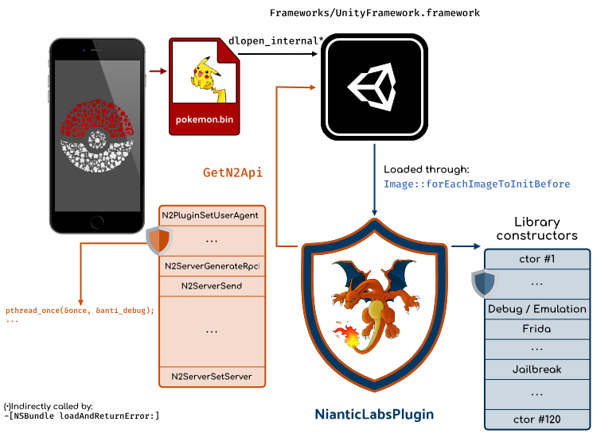
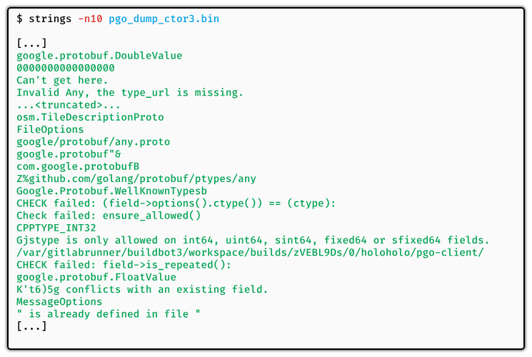
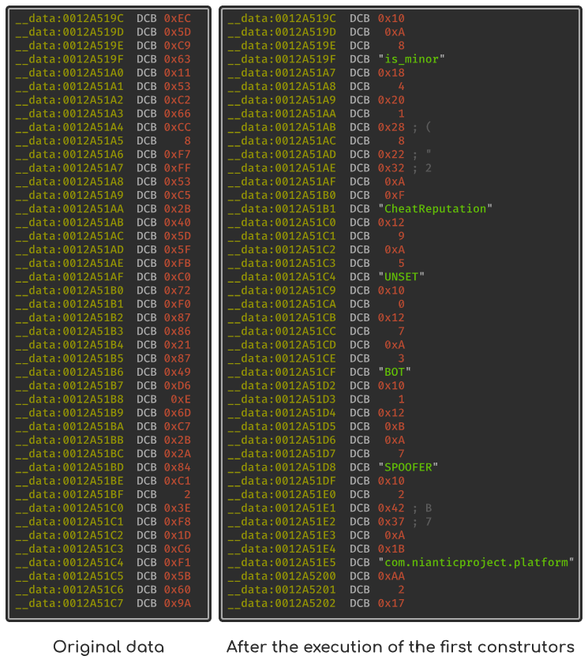
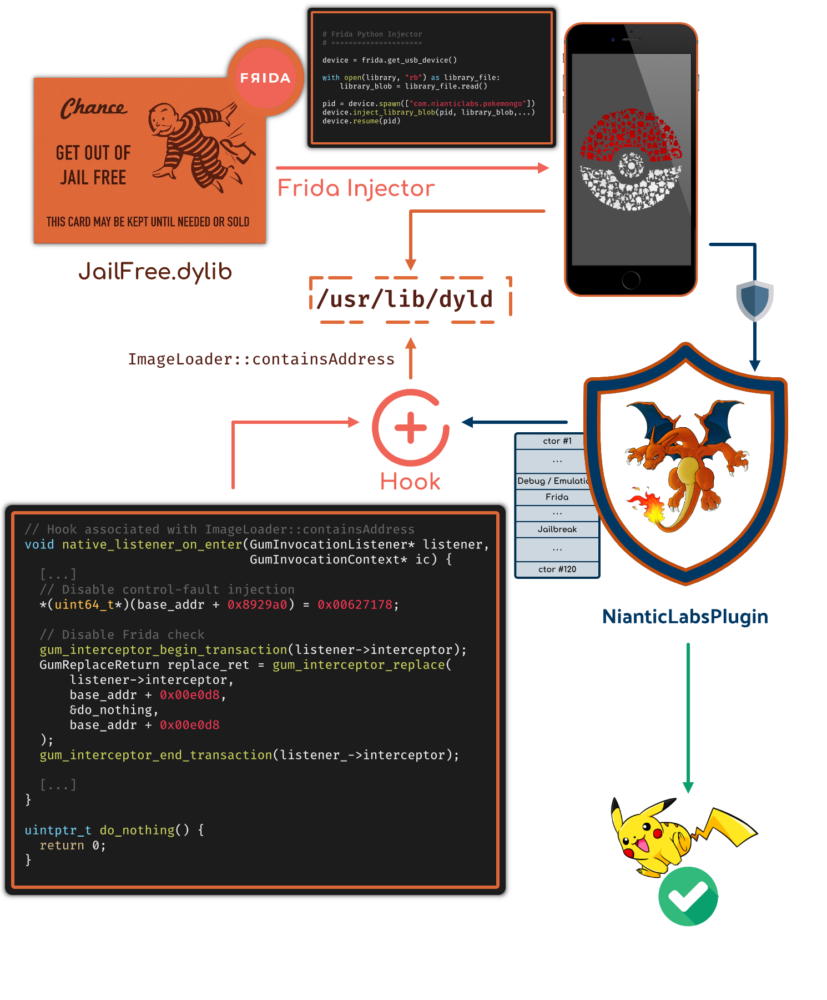

# Gotta Catch 'Em All: Frida & jailbreak detection

> This blog post analyzes the Frida and Jailbreak detection in PokemonGO for iOS.

<style>
  .green {
    color:green;
    font-family: 'JetBrains Mono', monospace;
    font-size: 87.5%;
  }

  .blue {
    color: blue;
    font-family: 'JetBrains Mono', monospace;
    font-size: 87.5%;
  }
  .orange {
    color: #FF6347;
    font-family: 'JetBrains Mono', monospace;
    font-size: 87.5%;
  }

  .red {
    color: #df2b04;
    font-family: 'JetBrains Mono', monospace;
    font-size: 87.5%;
  }

  .hl-comment {
    color: #df2b04;
    font-family: 'JetBrains Mono', monospace;
    font-size: 87.5%;
  }

  .hl-keyword {
    color: #A90D91;
    font-family: 'JetBrains Mono', monospace;
    font-size: 87.5%;
  }

  .hl-literal {
    color: #1C01CE;
    font-family: 'JetBrains Mono', monospace;
    font-size: 87.5%;
  }

  .hl-preproc {
    color: #633820;
    font-family: 'JetBrains Mono', monospace;
    font-size: 87.5%;
  }

  .hl-strings {
    color: #C41A16;
    font-family: 'JetBrains Mono', monospace;
    font-size: 87.5%;
  }
  .yellow {
    color: #CC7000;
    font-family: 'JetBrains Mono', monospace;
    font-size: 87.5%;
  }

</style>

> **Note**
Do not expect a *click & play* solution for PokemonGO in this blog post. This blog post is more about
the technical aspects of jailbreak detection than a bypass for this game.


## Introduction

While working on LIEF during my vacations to support in-memory parsing for Mach-O files, I found that
PokemonGO was an interesting use case to introduce this feature. It led me to look at the jailbreak
and Frida detection implemented in this game.
Being more familiar with Android than iOS, the analysis workflow on this platform is quite different, which
is also a good opportunity to improve tooling.

The first challenge stems from jailbreaking the device. Fortunately, checkra1n eases this step.
The second difficulty lies in extracting the encrypted iOS app from the device. In contrast to Android,
iOS apps are encrypted on the disk and decrypted by the kernel when loaded. It means that one way to get
the unencrypted code is to dump the file from memory. One could also leverage the function ``mremap_encrypted()``
as described in [Decrypting Apps on iOS](https://www.linkedin.com/pulse/decrypting-apps-ios-john-coates/).


## PokemonGO Overview

When running PokemonGO on a jailbroken device[^DEVICE], the application immediately crashes with the following backtrace:

```text
0   ???             0x000000020ac46ab8 0 + 8770579128
1   libdyld.dylib   0x0000000184df8304 invocation function for block in dyld3::AllImages::runAllInitializersInImage(dyld3::closure::Image const*, dyld3::MachOLoaded const*) + 136
2   libdyld.dylib   0x0000000184dea5b0 dyld3::closure::Image::forEachInitializer(void const*, void (void const*) block_pointer) const + 96
3   libdyld.dylib   0x0000000184df8160 invocation function for block in dyld3::AllImages::runInitialzersBottomUp(dyld3::closure::Image const*) + 296
4   libdyld.dylib   0x0000000184deae6c dyld3::closure::Image::forEachImageToInitBefore(void (unsigned int, bool&) block_pointer) const + 92
5   libdyld.dylib   0x0000000184df8b48 dyld3::AllImages::loadImage(Diagnostics&, char const*, unsigned int, dyld3::closure::DlopenClosure const*, bool, bool, bool, bool, void const*) + 776
6   libdyld.dylib   0x0000000184df8698 dyld3::AllImages::dlopen(Diagnostics&, char const*, bool, bool, bool, bool, bool, void const*, bool) + 872
7   libdyld.dylib   0x0000000184dfa2b4 dyld3::dlopen_internal(char const*, int, void*) + 368
8   libdyld.dylib   0x0000000184ded5b0 dlopen_internal(char const*, int, void*) + 108
9   CoreFoundation  0x00000001850ed038 _CFBundleDlfcnLoadFramework + 136
10  CoreFoundation  0x00000001850be974 _CFBundleLoadExecutableAndReturnError + 376
11  Foundation      0x0000000186359ba8 -[NSBundle loadAndReturnError:] + 332
12  pokemongo       0x00000001041a7c5c 0x1041a0000 + 31836
13  pokemongo       0x00000001041a7d50 0x1041a0000 + 32080
14  libdyld.dylib   0x0000000184de9588 start + 4
```

> **Note**
The full crash log is available [here](backtrace.log).


In this backtrace, the main ``pokemongo`` binary is a kind of *stub* that loads the Unity binary: ``UnityFramework`` which
contains the main logic of the game.

This library is loaded by the ``dlopen_internal`` function at index **8** in the backtrace as a
result of ``-[NSBundle loadAndReturnError:]``.
Since ``UnityFramework`` depends on other libraries, they are (pre)loaded with ``Image::forEachImageToInitBefore``
which processes the following files:

1. <span class="yellow">@/usr/lib/libc++.1.dylib</span>
2. ...
3. <span class="blue">@rpath/NianticLabsPlugin.framework/NianticLabsPlugin</span>
4. ...
5. <span class="yellow">@rpath/libswiftos.dylib</span>

Among those dependencies, we can notice the <span class="blue">NianticLabsPlugin</span> library which is a cross-platform
Unity plugin - also present in the Android version - that contains the main protections of the game.
These protections are used to prevent cheat, bots, GPS spoofing, in PokemonGO. The whole
being obfuscated by Digital.ai (formerly known as Arxan). <span class="blue">NianticLabsPlugin</span> communicates with the ``UnityFramework`` through
an exported function ``GetN2Api`` that returns an array of functions (pointers).

The following figure outlines these different components:



Getting back to the backtrace, if we assume that the application crashes when loading <span class="blue">NianticLabsPlugin</span>,
it precisely crashes when calling the Mach-O constructors in ``AllImages::runAllInitializersInImage``.
Since the application is heavily obfuscated, a static analysis reaches quickly its limits, which forces us
to emulate or dynamically analyze the functions of interest.

> **Note**
The addresses of the functions/instructions mentioned in this blog post are based on the following version of NianticLabsPlugin:

 [NianticLabsPlugin - 2140426ccdfdfb2529f454697cb5cc83](NianticLabsPlugin.bin)

 PokemonGO v0.211.2 - June 2021


## Analyzing Mach-O constructors with Frida

From the previous section, we surmised that the application crashed because of the <span class="blue">NianticLabsPlugin</span>'s constructors.
Since these functions are called before **any other functions** of the library, it raises the question of finding
a way to perform actions (or hook) before they are executed.

On Android, when we need to analyze a library's constructors, we can hook the ``call_array`` function from
[Bionic's linker (ELF loader)](https://github.com/aosp-mirror/platform_bionic/blob/c44b1d0676ded732df4b3b21c5f798eacae93228/linker/linker_soinfo.cpp#L488):

<script src="https://gist.github.com/romainthomas/c10298387a921df730c1556c2ee9cecb.js"></script>

If we try to apply the same approach on iOS, the mirror of the ELF loader on iOS is ``dyld`` which contains
most of the logic to load Mach-O files.
It turns out that at some points, the Mach-O's constructors are processed in the ``doModInitFunctions`` function
(from [ImageLoaderMachO.cpp](https://github.com/apple-opensource/dyld/blob/1128192c016372ae94793d88530bc5978c1fce93/src/ImageLoaderMachO.cpp#L2290)).


```cpp
void ImageLoaderMachO::doModInitFunctions(const LinkContext& context) {
  ...
  for (const struct macho_section* sect=sectionsStart; sect < sectionsEnd; ++sect) {
    const uint8_t type = sect->flags & SECTION_TYPE;
    if ( type == S_MOD_INIT_FUNC_POINTERS ) {
      Initializer* inits = (Initializer*)(sect->addr + fSlide);
      ...
      if (!this->containsAddress(stripPointer((void*)func)) ) {
        dyld::throwf("initializer function %p not in mapped image for %s\n", func, this->getPath());
      }
      ...
      func(context.argc, context.argv, context.envp, context.apple, &context.programVars);
    }
  }
  ...
}
```

From this code, we can notice that **all** constructor addresses are checked **beforehand** by the
``containsAddress`` function. Therefore, it makes this function a good hooking spot as it is executed before
calling the constructor itself. One can use the native SDK of [frida-gum](https://github.com/frida/frida-gum)
to perform this action:

```cpp
// Address of ImageLoader::containsAddress in /usr/lib/dyld
const uintptr_t containsAddress_ptr = ...;

// Setup hooks with gum_interceptor_attach
GumAttachReturn attach_ret = gum_interceptor_attach(
    listener_->interceptor,
    /* target */ reinterpret_cast<void*>(containsAddress_ptr),
    reinterpret_cast<GumInvocationListener*>(listener_),
    /* ID */ reinterpret_cast<void*>(containsAddress_ptr)
);
....
// Equivalent of onEnter in Javascript
void native_listener_on_enter(GumInvocationListener* listener, GumInvocationContext* ic) {
  const uintptr_t ctor_function_addr = ic->cpu_context->x[1];
  // Do stuff with ctor_function_addr
}
```

> **Note**
``containsAddress`` is a member function, therefore ``x0`` contains a pointer on ``this`` and the address
to check is located in ``x1``.


By hooking ``containsAddress()``, we get the **control before** the execution of the constructors.
It gives us the ability to perform the following actions that can help to identify the constructor involved in the crash:

1. Trace the constructors (see: [constructors_trace.log](constructors_trace.log))
2. Replace/disable a constructor (``gum_interceptor_replace``)
3. Detect the **first** constructor and hook the next ones (``gum_interceptor_attach``)

<span class="blue">NianticLabsPlugin</span> embeds no less than 120 constructors
among those, 6[^SIXCTOR] are involved in detecting Frida, jailbroken devices, anti-debug, etc:

| Index | Offset   | Description                            |
|-------|----------|----------------------------------------|
| 15    | 0x4369e0 | Anti-debug & anti-emulation            |
| 16    | 0x00e0d8 | Frida detection                        |
| 17    | 0x26bd5c | Anti-bypass?                           |
| 18    | 0x449b84 | Anti-jailbreak, anti-Frida             |
| 19    | 0x731b90 | Anti-jailbreak, anti-debug, anti-frida |
| 20    | 0x359194 | Anti-jailbreak                         |

Once we reduced the set of functions involved in the crash, we can combine dynamic analysis with Frida
and emulation with Unicorn.

## Anti-debug

One of the redundant checks we can find in many functions (not only the constructors) are the
anti-debugs. They always come in two parts:

1. Try to *"kill"* its own pid with the 0-signal
2. Check if PTRACE is flagged

```cpp
void try_kill() {
  const int pid = getpid(); // syscall@0x436cdc
  int ret = kill(pid, 0);   // syscall@0x436d28
}
```

According to the man page of kill (``man 2 kill``), the signal ``0`` is used to check
that the ``pid`` given in the first parameter really exists.

> [...] A value of 0, however, will cause error checking to be performed (with no signal being sent). This can be used
> to check the validity of pid.

This *kill* operation is followed by three ``PTRACE`` checks:

```cpp
// Done three times
inline bool ptrace_detect() {
  int32_t opt[4] = {
    CTL_KERN,
    KERN_PROC,
    KERN_PROC_PID,
    getpid(),
  };
  kinfo_proc info;
  sysctl(opt, 4, &info, sizeof(kinfo_proc), nullptr, 0);
  return info.kp_proc.p_flag & P_TRACED;
}
```

These three ``P_TRACED`` checks **always** come together:

```text
0x436cdc: getpid(): 6015
0x436d28: kill(6015, 0): 0
0x4374b0: sysctl(CTL_KERN, KERN_PROC, KERN_PROC_PID, 6015)
0x4371e8: sysctl(CTL_KERN, KERN_PROC, KERN_PROC_PID, 6015)
0x437398: sysctl(CTL_KERN, KERN_PROC, KERN_PROC_PID, 6015)
```


## Frida Detection

Frida is detected by the application through its client-server mode, which binds the localhost on the port ``27042``.
When PokemonGO is starting, it tries to open a socket on this port and if it manages to connect, it tests the Frida handshake.

```text
0x00e3b8: getifaddrs(0x16b7fb518): 0x0
0x016990: socket('IPV4', 'TCP', '0'): 0x8
0x019d60: bind('PF_INET', 0x8, '127.0.0.1:27042')
0x01805c: close(0x8)
0x016990: socket('IPV4', 'TCP', '0'): 0x8
0x019d60: bind('PF_INET', 0x8, '192.168.0.26:27042')
0x01805c: close(0x8)
0x00e3ec: freeifaddrs(0x10601ac00): 0x105360a00
```

The application also iterates over the list of the libraries loaded in memory with the
``_dyld_image_count``/``_dyld_get_image_name`` functions. Nevertheless, it seems that they are not used to detect
Frida libraries artifacts (like ``FridaGadget.dylib``).

## Jailbreak Detection

The application implements jailbreak detection by checking if some files are accessible or not on the device.
Most of the checks are done by using the ``access()`` syscalls that are inlined in different places:

```text
0x44c390: access('/bin/grep', 0x0)
...
0x7326b0: access('/private/var/checkra1n.dmg', 0x0)
```

The list of the checked files is given in the [annexes of the blog post](#annexes).

> **Note**
This list is very close to [vnodebypass/hidePathList.plist](https://github.com/XsF1re/vnodebypass/blob/870b21fd3566736cca285355b4faf7f289baa4d5/layout/usr/share/vnodebypass/hidePathList.plist)


In addition to *raw* ``access`` syscall, the application enhances its detection by creating a symbolic link of the
root directory in a temporary app data directory:

```
0x734e08: symlink('/Applications/..', '/private/var/mobile/Containers/Data/Application/D933FBC9-90E7-4584-851E-CE2D5E900446/tmp/WCH38bnM0x101a9e7d0')
```

Then, it performs the same checks with the app data directory as prefix: `[...]/tmp/WCH38bnM0x101a9e7d0`:

```
0x7376d8: access('/private/var/mobile/Containers/Data/Application/D933FBC9-90E7-4584-851E-CE2D5E900446/tmp/3Odis0x101a9dfd0/usr/bin/passwd', 0x0)
```

## Signature Check

At some point, one function checks the integrity of the signature of the ``pokemongo`` binary.
This check starts by opening the main ``pokemongo`` binary from **the disk**:

```text
0x7392ec: add  x0, x19, #6,lsl#12
0x7392f0: add  x0, x0, #0x540
0x7392f4: mov  w1, #0x1000000
0x7392f8: mov  x2, #0
0x7392fc: svc  0x80               ; x16 -> SYS_open = 5
// open('/private/var/containers/Bundle/Application/[...]/pokemongo.app/pokemongo'): fd_pgo
```

Then, it reads the beginning of the file in a stack buffer:

```text
0x74b494: ldr  x0, [x19, #0xc0]  ; fd
0x74b498: ldr  x1, [x19, #0x130] ; buff
0x74b49c: ldr  x2, [x19, #0xb8]  ; buff_size
0x74b4a0: svc  0x80              ; x16 -> SYS_read = 3
// uint8_t macho_head[0x4167];
// 0x74b4a0: read(fd_pgo, macho_header, 0x4167);
```

To iterate over the Mach-O load commands:

```text
; x8 points to the read's buffer
0x73942c: ldr w8, [x8, #0x10]  ; Number of LC_COMMANDS

for (size_t i = 0; i < nb_cmds; ++i) {
  0x74bc40: ldr w10, [x9, #4] ; Command's size
  0x74ade4: ldr w9,  [x9]     ; command's type
  if (cmd.type == LC_CODE_SIGNATURE) {
    0x74b1b8: ldr w10, [x10, #8]  ; read signature offset -> 0xc3d0
  }
}
```

With the offset of the Mach-O ``LC_CODE_SIGNATURE`` command, it reads the raw signature using the
``lseek/read`` syscalls:

```text
uint8_t sig_header[0x205];
0x73a978: lseek(fd_pgo, LC_CODE_SIGNATURE offset, 0x0)
0x73aecc: read(fd_pgo, &sig_header, 0x205);
```

The raw signature buffer is processed by chunks of 10 bytes in
a function that looks like a checksum:

```text
[...]
0x73ad58:  ldrsb w13, [x12]
0x73ad5c:  mov w14, #83
0x73ad60:  sub w13, w14, w13
0x73ad64:  ldrsb w14, [x12, #1]
0x73ad68:  mov w15, #87
0x73ad6c:  sub w14, w15, w14
0x73ad70:  ldrsb w16, [x12, #2]
0x73ad74:  mov w17, #53
0x73ad78:  sub w16, w17, w16
0x73ad7c:  ldrsb w17, [x12, #3]
0x73ad80:  mov w0, #52
0x73ad84:  sub w17, w0, w17
0x73ad88:  ldrsb w0, [x12, #4]
0x73ad8c:  sub w0, w15, w0
0x73ad90:  ldrsb w1, [x12, #5]
0x73ad94:  mov w2, #51
0x73ad98:  sub w1, w2, w1
0x73ad9c:  ldrsb w2, [x12, #6]
0x73ada0:  mov w3, #54
0x73ada4:  sub w2, w3, w2
0x73ada8:  ldrsb w3, [x12, #7]
0x73adac:  sub w15, w15, w3
0x73adb0:  ldrsb w3, [x12, #8]
0x73adb4:  mov w4, #78
0x73adb8:  sub w3, w4, w3
0x73adbc:  ldrsb w12, [x12, #9]
0x73adc0:  mov w4, #70
0x73adc4:  sub w4, w4, w12
[...]
```

I did not manage to identify the underlying checksum algorithm, but it involves square multiplications and
the key(?): ``SW5436NF``

## Control-Fault Injection

Once we determined the functions involved in the detections, we might want to disable them in order to
run the game smoothly.
Actually, PokemonGO is protected against such bypass with global variables that assert if a function
ran successfully or not.

This protection is equivalent to the following piece of code:

```cpp
static constexpr uintptr_t GOOD = 0x00627178; // bqx ?
static uintptr_t MAGIC_CFI = 0xdeadc0de;

__attribute__((constructor))
void frida_detect() {
  if (is_frida_running()) {
    crash();
  }
  MAGIC_CFI = GOOD;
}


__attribute__((constructor))
void control_fault_check() {
  if (MAGIC_CFI != GOOD) {
    crash();
  }
}
```

If we only disable ``frida_detect()``, the application will crash because of ``control_fault_check()``.

We could bypass this protection by identifying the address of the
``MAGIC_CFI`` in the ``__data`` section, or by disabling the ``control_fault_check()``.

## What about LIEF?

As mentioned in the introduction, it started with an ongoing feature to parse Mach-O files from memory.
Basically, LIEF will[^WILLETA] enable parsing Mach-O files[^2] from an absolute address with this kind of API:

```cpp
// 0x10234400 -> start of the Mach-O file
auto bin = LIEF::MachO::Parser::parse_from_memory(0x10234400);
```

Depending on the user's needs, the ``write()`` operation will optionally undo all the relocations and the symbol bindings.
This could be useful if we aim at (re)running the file dumped (on an Apple M1?).

As expected, the strings used within the <span class="blue">NianticLabsPlugin</span> library are encoded
by the obfuscator. We could statically analyze the decoding routine (cf. Tim Blazytko's [blog post](https://synthesis.to/2021/06/30/automating_string_decryption.html))
,but another technique consists in using a property of the obfuscator's string encoding mechanism.

It seems that the obfuscator put **all** the strings[^3] in the data section and decrypts **all of them**
in a **single** constructor function.

For instance, if we have the string "TOKEN" to protect in the following functions:

```cpp
void protect_me() {
  sensitive("TOKEN");
}

void protect_me_2() {
  sensitive("TOKEN2");
}
```

The obfuscator transforms and decodes the strings into something like:

```cpp
// __data section
static char var_TOKEN[]   = "\x00\x1D\xDD\xEE\xAB";
static char var_TOKEN_2[] = "\x00\x1D\xDD\xEE\xAF";

__attribute__((constructor))
void decode_strings() {
  decode(var_TOKEN);
  decode(var_TOKEN_2);
}

void protect_me() {
  sensitive(var_TOKEN);
}

void protect_me_2() {
  sensitive(var_TOKEN_2);
}
```

Since **all** the strings are decoded at once in one of the first constructors, if we manage to dump the binary
right after this constructor,
we can recover the original strings for free.

Programmatically, it can be done using (again) frida-gum SDK with the following pseudocode:

```cpp
// Hook associated with ImageLoader::containsAddress
void native_listener_on_enter(GumInvocationListener* listener,
                              GumInvocationContext* ic) {
  static size_t CTOR_ID = 0;
  const uintptr_t ctor_function_addr = ic->cpu_context->x[1];
  std::string libname = module_from_addr(ctor_function_addr);
  if (libname == "NianticLabsPlugin" && CTOR_ID++ == 3) {
    const uintptr_t base_address = base_addr_from_ptr(ctor_function_addr);
    auto bin = LIEF::MachO::Parser::parse_from_memory(base_address);
    bin->write("/tmp/pokemongo_after_ctor.bin"); // /tmp on the iPhone
  }
}
```

In the end, the dumped file contains the decoded strings:



If we skim the ``__data`` section, we can also observe the following changes:



A practiced eye might notice[^4] that some strings of the section are actually
embedded in Protobuf structures. We can confirm this observation by trying to infer the data as Protobuf
types:

```python
from . import proto_dump
import lief
pgo = lief.parse("pokemongo_after_ctor.bin")

start = 0x12A51A7
end   = 0x12A51E2
raw_proto = pgo.get_content_from_virtual_address(start, end - start)
print(proto_dump(raw_proto))
```

```text
{
  #3 = 4
  #4 (repeated) = 1 {
    #1 = "CheatReputation"
    #2 (repeated) = {
      #1 = "UNSET"
      #2 = 0
    } {
      #1 = "BOT"
      #2 = 1
    } {
      #1 = "SPOOFER"
      #2 = 2
    }
  }
  #5 = 8
  #8 = []
}
```

## Final Words

The application embeds other checks in the constructors and in the functions returned by ``GetN2Api``. It can
make a good exercise for those that are interested in.

Generally speaking, the application, and the protections are well designed since they slow down reverse engineers.
Nevertheless, ``anti-{jb, frida, debug}`` are quite difficult to protect as they need to interact with the OS
through functions or syscalls with unprotected parameters. As a result, and once identified, we can bypass them.

One technique consists in injecting a library with Frida's injector that aims at hooking
the ``containsAddress()`` to disable/patch the functions involved in the detections:



[Video](pokemongo_jb_bypass.mp4)

Nevertheless, this technique is **not persistent** and version-dependant.

After writing this post, it turned out that its structure is very close to [Reverse Engineering Starling Bank](https://hot3eed.github.io/2020/08/02/starling_p2_detections_mitigations.html).
In particular, we can find the same anti-debug and the same Frida detection routine. These similarities suggest
that these two application uses the same obfuscator that also provides ``anti-{jb, frida, debug}`` as built-in.

You might also be interested in the recent talk of [Eloi Benoist-Vanderbeken](https://twitter.com/elvanderb) [@Pass the Salt](https://2021.pass-the-salt.org/)
<a href="https://archives.pass-the-salt.org/Pass%20the%20SALT/2021/videos/PTS2021-Talk-01-JailBreak_detection.mp4"> Watch the talk</a>
<a href="https://archives.pass-the-salt.org/Pass%20the%20SALT/2021/slides/PTS2021-Talk-01-JailBreak_detection.pdf"> Download the slides</a>
who detailed another approach to identify and bypass
jailbreak detections.

> **Note**
[LIEF](https://lief-project.github.io) is a tool developed at [Quarkslab](https://www.quarkslab.com/) along with
[QBDI](https://qbdi.quarkslab.com) & [Triton](https://triton.quarkslab.com).


-----------

### Annexes

| Files that trigger the JB detection                                | Files that should be present |
|--------------------------------------------------------------------|------------------------------|
| ``/.bootstrapped_electra``                                         | ``/cores``                   |
| ``/Applications/Anemone.app``                                      | ``/dev/null``                |
| ``/Applications/Cydia.app``                                        | ``/etc/hosts``               |
| ``/Applications/SafeMode.app``                                     | ``/etc/passwd``              |
| ``/Library/Frameworks/CydiaSubstrate.framework``                   | ``/sbin``                    |
| ``/Library/MobileSubstrate/DynamicLibraries/FlyJB.dylb``           | ``/sbin/launchd``            |
| ``/Library/MobileSubstrate/MobileSubstrate.dylib``                 | ``/sbin/mount``              |
| ``/Library/PreferenceBundles/LaunchInSafeMode.bundle``             | ``/usr``                     |
| ``/Library/PreferenceLoader/Preferences/LaunchInSafeMode.plist``   |                              |
| ``/Library/Themes``                                                |                              |
| ``/Library/dpkg/info/com.inoahdev.launchinsafemode.list``          |                              |
| ``/Library/dpkg/info/com.inoahdev.launchinsafemode.md5sums``       |                              |
| ``/bin/bash``                                                      |                              |
| ``/bin/bunzip2``                                                   |                              |
| ``/bin/bzip2``                                                     |                              |
| ``/bin/cat``                                                       |                              |
| ``/bin/chgrp``                                                     |                              |
| ``/bin/chmod``                                                     |                              |
| ``/bin/chown``                                                     |                              |
| ``/bin/cp``                                                        |                              |
| ``/bin/grep``                                                      |                              |
| ``/bin/gzip``                                                      |                              |
| ``/bin/kill``                                                      |                              |
| ``/bin/ln``                                                        |                              |
| ``/bin/ls``                                                        |                              |
| ``/bin/mkdir``                                                     |                              |
| ``/bin/mv``                                                        |                              |
| ``/bin/sed``                                                       |                              |
| ``/bin/sh``                                                        |                              |
| ``/bin/su``                                                        |                              |
| ``/bin/tar``                                                       |                              |
| ``/binpack``                                                       |                              |
| ``/bootstrap``                                                     |                              |
| ``/chimera``                                                       |                              |
| ``/electra``                                                       |                              |
| ``/etc/apt``                                                       |                              |
| ``/etc/profile``                                                   |                              |
| ``/jb``                                                            |                              |
| ``/private/var/binpack``                                           |                              |
| ``/private/var/checkra1n.dmg``                                     |                              |
| ``/private/var/lib/apt``                                           |                              |
| ``/usr/bin/diff``                                                  |                              |
| ``/usr/bin/hostinfo``                                              |                              |
| ``/usr/bin/killall``                                               |                              |
| ``/usr/bin/passwd``                                                |                              |
| ``/usr/bin/recache``                                               |                              |
| ``/usr/bin/tar``                                                   |                              |
| ``/usr/bin/which``                                                 |                              |
| ``/usr/bin/xargs``                                                 |                              |
| ``/usr/lib/SBInject``                                              |                              |
| ``/usr/lib/SBInject.dylib``                                        |                              |
| ``/usr/lib/TweakInject``                                           |                              |
| ``/usr/lib/TweakInject.dylib``                                     |                              |
| ``/usr/lib/TweakInjectMapsCheck.dylib``                            |                              |
| ``/usr/lib/libjailbreak.dylib``                                    |                              |
| ``/usr/lib/libsubstitute.0.dylib``                                 |                              |
| ``/usr/lib/libsubstitute.dylib``                                   |                              |
| ``/usr/lib/libsubstrate.dylib``                                    |                              |
| ``/usr/libexec/sftp-server``                                       |                              |
| ``/usr/sbin/sshd``                                                 |                              |
| ``/usr/share/terminfo``                                            |                              |
| ``/var/mobile/Library/.sbinjectSafeMode``                          |                              |
| ``/var/mobile/Library/Preferences/jp.akusio.kernbypass.plist``     |                              |

[^DEVICE]: iPhone 6 running on iOS 14.2 with checkra1n.
[^2]: The Mach-O format is very suitable for this feature as
      the header in mapped in memory. Therefore, it eases the parsing.
[^3]: More generally, it can encode local data (strings, bytes arrays, ...)
[^4]: Protobuf strings can be identified as they usually start with ``0xA``, ``0xB``, followed by their lengths
      and the string itself (see: [protocol-buffers/docs/encoding](https://developers.google.com/protocol-buffers/docs/encoding#strings))
[^SIXCTOR]: We can identify them by trial and error.
[^WILLETA]: ETA: likely by the end of the year
