# PGSharp: Analysis of a Cheating App for PokemonGO

> This blog post is about the internal mechanisms of PGSharp, a cheat engine for PokemonGO.

<style>
  .green {
    color:green;
    font-family: 'JetBrains Mono', monospace;
  }

  .blue {
    color: blue;
    font-family: 'JetBrains Mono', monospace;
  }
  .orange {
    color: #FF6347;
    font-family: 'JetBrains Mono', monospace;
  }

  .red {
    color: #c02032;
    font-family: 'JetBrains Mono', monospace;
  }

  a.ul {
    color: #c02032 !important;
  }

  .hl-comment {
    color: #df2b04;
    font-family: 'JetBrains Mono', monospace;
  }

  .hl-keyword {
    color: #A90D91;
    font-family: 'JetBrains Mono', monospace;
  }

  .hl-literal {
    color: #1C01CE;
    font-family: 'JetBrains Mono', monospace;
  }

  .hl-preproc {
    color: #633820;
    font-family: 'JetBrains Mono', monospace;
  }

  .hl-strings {
    color: #C41A16;
    font-family: 'JetBrains Mono', monospace;
  }
  .yellow {
    color: #CC7000;
    font-family: 'JetBrains Mono', monospace;
  }


</style>

## Introduction

A few days after the release of the blog post [*Gotta Catch 'Em All: Frida & jailbreak detection*](/post/21-07-pokemongo-anti-frida-jailbreak-bypass), someone on [reddit - r/ReverseEngineering](https://www.reddit.com/r/ReverseEngineering/comments/on6ya9/comment/h5rhkoc/)
caught my attention on a cheating app for the Android version of PokemonGO:

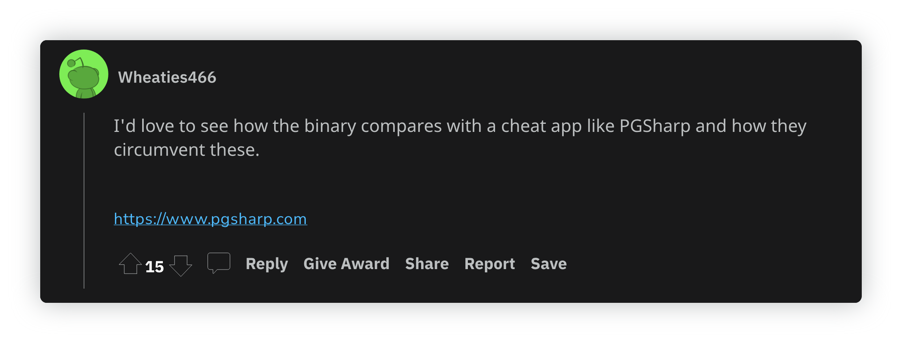

So here it is!

PGSharp belongs to the family of PokemonGO's cheating app that is not (yet) banned by Niantic.
This cheat provides an *enhanced* game experience with interesting functionalities such as:

* GPS Spoofing
* Quick Catch
* Pokemon Feed
* Nearby Radar
* ...

Last but not least, PGSharp runs on regular devices, **rooted or not**.

I enjoyed exploring this cheat over four months, and the technical investigation was worthwhile.
As discussed in this blog post, PGSharp uses several interesting tricks.

> **Note**
The content of this blog post is based on **PGSharp 1.33.0** which is related to the following APKs:

 [PGSharp v1.33.0](https://data.romainthomas.fr/21-09-pgsharp/pgs1.33.0.apk)

 [PokemonGO v0.221.0](https://data.romainthomas.fr/21-09-pgsharp/com.nianticlabs.pokemongo_0.221.0-2021093001.apk)


This blog post is quite **long** but the different parts are
more or less independents, so feel free to jump on them depending on your interests:

<span id="toc"></span>

* [  Code Protection](#code-protection)
    * [Lua VM](#lua-vm)
    * [Java Obfuscation](#java-obfuscation)
* [  Cheat Mechanisms](#cheat-mechanisms)
    * [DEX Files Comparison](#dex-files-diff)
    * [libmain.so](#libmain)
    * [Signature Bypass](#signature-bypass)
    * [Dynamic APK Loading](#dynamic-apk-loading)
    * [GPS Spoofing](#gps-spoofing)
    * [JNIEnv Proxifier](#jnienv-proxifier)
    * [Unity Hooks](#unity-hooks)
    * [Network Communications](#network)
    * [SafetyNet](#safetynet)
    * [When PGSharp avoids PokemonGO pitfalls](#pgsharp-signature-check)
* [  Final Words](#final-words)
* [  Acknowledgments](#acknowledgments)
* [  Annexes](#annexes)


You can also check the slides to get an overview of the content:

[PDF document](/publication/21-ekoparty-mobile-hacking-space-pgsharp/21-10-ekoparty-mobile-hacking-space-pgsharp.pdf)

<div class="legacy-center">
<br /><br />
<p><b>Enjoy!</b></p>
</div>

## Code Protection

PokemonGO is a target of choice for reverse engineers and some critical functionalities are protected by a commercial solution.
It is worth mentioning that only a subset of the game is obfuscated. For instance, the "Java" part of the
game is absolutely not protected, such as we have the original class and method names.
The Unity part is "compiled" into ``libil2cpp.so`` but we can recover some metadata with [Perfare/Il2CppDumper](https://github.com/Perfare/Il2CppDumper).

All the obfuscation is focused on ``libNianticLabsPlugin.so`` (c.f. [*Gotta Catch 'Em All: Frida & jailbreak detection*](/post/21-07-pokemongo-anti-frida-jailbreak-bypass)),
and since only this part of the game is heavily obfuscated, it gives a hint about where the critical functionalities are.

On the other hand, PGSharp uses different layers of obfuscation to prevent its analysis.
First of all, it uses O-LLVM to obfuscate the native code that includes, at least, control-flow flattening and
string encryption. Nevertheless, the obfuscation is *relatively* weak against emulation and static analysis[^weak-obf].

### Lua VM

Some obfuscation techniques are based on transforming the original code through a VM (like [VMProtect](https://vmpsoft.com/)).
It adds another layer to reverse, as we need to understand the VM architecture before being able to understand the original semantic of the code.

<div class="legacy-center">
<p><strong>But what about using an interpreted language (like Python) and obfuscate its VM or its interpreter with O-LLVM?</strong></p>
</div>

This is what PGSharp does with Lua. Some parts of the cheat are written in Lua whose VM has been modified to:

1. Fake the version: try to make believe ``Lua 5.1`` while it's ``Lua 5.3``
2. Add new opcodes (``OP_RUN``, ``OP_GETDOWNVAL``, ``OP_OLDTABLE``, and ``OP_XXOR``) to break decompilation and
   common Lua tools.

The native library that implements the cheat functionalities and that contains the Lua VM being stripped, one of the
challenges lies in recognizing the Lua C API among the library's functions[^static-link]. For instance,
here is a basic block of a native function that uses the Lua API:

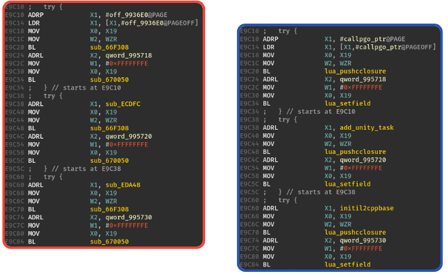

Among all the Lua C functions, some of them are worth identifying to ease reverse engineering:

- ``luaL_loadbuffer``
  : > *"Load a buffer as a Lua chunk."*.

  : Basically, it loads a Lua bytecode from a buffer given in parameter.
    This Lua bytecode is the result of the *compilation* of the original script with [luac](https://www.lua.org/manual/5.3/luac.html).
    By hooking this function, we can recover the following files:
    - <span class="orange">base64.luac</span>
    - <span class="green">class.luac</span>
    - <span class="green">global.luac</span>
    - <span class="green">init.luac</span>
    - <span class="orange">json.luac - from https://github.com/rxi/json.lua</span>
    - <span class="green">location.luac</span>
    - <span class="orange">md5.luac - from https://github.com/kikito/md5.lua</span>
    - <span class="green">`pgo.luac`</span>
    - <span class="green">pgodump.luac</span>
    - <span class="green">plugin.luac</span>
    - <span class="green">reflect.luac</span>

  The <span class="orange">orange files</span> are utilities, while the <span class="green">green ones</span>
  contain cheat mechanisms.

- ``luaD_precall``
  : Function that is involved when calling a C native function or a pure Lua function.
  Since its prototype is <span class="blue">(lua_State *L, StkId func, int nresults)</span>,
  it can help to dynamically identify which function is called:
  ```text
  0x6776a8 luaD_precall('gamehelper')
  0x6776a8 luaD_precall('@./app/arm64-v8a/luac/global.lua:0 - sub_71733ea5d0') {
  0x694d90 luaD_precall('@./app/arm64-v8a/luac/global.lua:246 - sub_71733f7b50') {
  0x6776a8 luaD_precall('@./app/arm64-v8a/luac/location.lua:38 - sub_717346d650') {
  ```

- ``lua_pushcclosure``
  : > Pushes a new C closure onto the stack.

  : This function is particularly interesting to recover
    native C functions linked to Lua function:

  ```text
  0x0e9cc0: lua_pushcclosure('initil2cppmethods')
  0x0e9cd4: lua_setfield(-2, 'initil2cppmethods', 'func_0xedaa0')
  ...
  0x0e9d10: lua_pushcclosure('nar')
  0x0e9d24: lua_setfield(-2, 'nar', 'func_0xeddbc')
  ...
  0x0ea020: lua_pushcclosure('ipf')
  0x0ea034: lua_setfield(-2, 'ipf', 'func_0x1318b0')
  ```


- ``lua_pushstring``
  : > *"Pushes the zero-terminated string pointed to onto the stack."*

  : This function enables to dynamically recover strings that might not be present
    in the native code or somehow encoded:

    ```text
    0x0ebdfc: lua_pushstring('https://tens.pgsharp.com/v1/scc-2-[...]/')
    0x0ebe28: lua_pushstring('me.uw.hela.pref')
    0x0c56ac: lua_pushstring('AIza[...]XhM4')
    0x0e15b4: lua_pushstring('token=[Redacted]')
    ```

> **Note**
To dynamically understand the behavior of the Lua VM, we can compile the Frida Gum SDK along with Lua v5.3.

It enables to hook Lua functions with Frida and to leverage the compiled Lua v5.3 to inspect the parameters:

```cpp
extern "C" {
#include "lua.h"
#include "ldo.h"
#include "ldebug.h"
}

gum_interceptor_attach(listener_->interceptor,
                       luaD_precall_addr, listener_ luaD_precall_addr);

void native_listener_on_enter(GumInvocationListener *listener, GumInvocationContext* ic) {
  auto* L = reinterpret_cast<lua_State*>(ic->cpu_context->x[0]);
  auto func = reinterpret_cast<StkId>(ic->cpu_context->x[1]);
  auto narg = static_cast<int>(ic->cpu_context->x[2]);
  if (ttype(func) != LUA_TLCL) {
    return log("sub_{:x}", ptr);
  }
  Proto *p = clLvalue(func)->p;
  return log("{}:{:d} - sub_{:x}", getstr(p->source), p->linedefined, ptr);
}
```


### Java Obfuscation

Contrary to the PokemonGO's Java layer, PGSharp protects its Java code with Proguard and the strings are xored
with the hardcoded key:

<div class="legacy-center">
<p><strong class="orange">vqGqQWCVnDRrNXTR</strong></p>
</div>

This key seems to not change across the different versions of PGSharp and the encoded strings look
like this:

```java
public void q() {
  String a = GL.a(r3.a("FAQgLiQlLw=="), (String) null);
  if (a != null) {
    JSONObject jSONObject = new JSONObject();
    Context context = GL.c;
    jSONObject.put(r3.a("Agg3FA=="), r3.a("Axg="));
    jSONObject.put(r3.a("Axgj"), UI.g(context));
    jSONObject.put(r3.a("BQUmBTQ="), this.s);
    jSONObject.put(r3.a("BQEoHjc+LTE="), ((Boolean) ...);
    jSONObject.put(r3.a("BAUr"), UI.f());
    jSONObject.put(r3.a("Gh8g"), Locale.getDefault().getDisplayLanguage());
    jSONObject.put(r3.a("FxMu"), UI.a());
    jSONObject.put(r3.a("FBA1"), LayoutInflater$Factory2o.i.e(context));
    jSONObject.put(r3.a("Gx4j"), Build.MODEL);
    String str = Build.VERSION.RELEASE;
  }
}
```

The string encoding routine being easy to reverse, we can create a Jadx plugin
that automatically decodes these strings:

```java
[...]
passes.add(new SimplifyVisitor());

passes.add(new PGSharpString()); // Automatically decode the strings

passes.add(new CheckRegions());
[...]
```

It results in this kind of output:

```java
public void q() {
  String a = GL.a("bug_url", (String) null);
  if (a != null) {
    JSONObject jSONObject = new JSONObject();
    Context context = GL.c;
    jSONObject.put("type", "ui");
    jSONObject.put("uid", UI.g(context));
    jSONObject.put("state", this.s);
    jSONObject.put("spoofing", ((Boolean) PL.a("hlspoofing")).booleanValue());
    jSONObject.put("rtl", UI.f());
    jSONObject.put("lng", Locale.getDefault().getDisplayLanguage());
    jSONObject.put("abi", UI.a());
    jSONObject.put("bar", LayoutInflater$Factory2o.i.e(context));
    jSONObject.put("mod", Build.MODEL);
    String str = Build.VERSION.RELEASE;
  }
}
```

The whole Jadx plugin is available on GitHub: [PGSharpStrings.java](https://github.com/romainthomas/pgsharp/blob/9addafbb6672571d2b7fbba43899f662c21aac8e/jadx/PGSharpStrings.java)

<hr width="50%" />

## Cheat Mechanisms

One ~~disruptive~~ feature of PGSharp is that it does not require a rooted device. Until recently,
most of the PokemonGO cheating apps required a jailbroken or a rooted device which raises a barrier
for people who are not familiar with rooting.

> But wait, how *hell* they do that?

The structure of the PGSharp APK is **very** close to the genuine PokemonGO
application, which leads identifying which parts of the game have been tampered with.

A naive comparison (cf. [zip_diff.py](https://github.com/romainthomas/pgsharp/blob/9addafbb6672571d2b7fbba43899f662c21aac8e/zip_diff.py)) raises mismatches on the following files:

| File                     | Size in PGSharp | Size in PGO   | Delta
| :------                  | :-----------    | :------------ | :------------
| classes.dex              | 9057844         | 8953000       | +1.17%
| classes2.dex             | 7131864         | 7107296       | +0.34%
| lib/arm64-v8a/libmain.so | 21278480        | 6424          | +331134%
| META-INF/MANIFEST.MF     | 351045          | 355533        | -1.26%

The high level of similarity between the two applications, associated with a different signature
confirms that PGSharp repackaged the original application.

#### DEX Files Comparison

To figure out which parts of the DEX files have been modified, we can use LIEF (yes, LIEF can <u><b>read</b></u> the DEX format).
Basically, the idea is to check which method(s) has a bytecode whose size is different from the real PokemonGO
application:

```python
import zipfile
import lief

with zipfile.ZipFile(CHEAT_FILE) as zip_file:
    with zip_file.open(target) as f:
        hela_dex = f.read()


with zipfile.ZipFile(ORIG_FILE) as zip_file:
    with zip_file.open(target) as f:
        pgo_dex = f.read()

hela_dex = lief.DEX.parse(list(hela_dex))
pgo_dex  = lief.DEX.parse(list(pgo_dex))

hela = {f"{m.cls.pretty_name}.{m.name}.{m.prototype!s}": len(m.bytecode) \
          for m in hela_dex.methods}

pgo  = {f"{m.cls.pretty_name}.{m.name}.{m.prototype!s}": len(m.bytecode) \
          for m in pgo_dex.methods}

for k, size_hela in hela.items():
    size_pgo = pgo[k]
    if size_pgo != size_hela:
        print(f"Mismatch: {k}")
```

By running this script on ``classes.dex``, we don't find any difference.
Actually, the PGSharp authors tried to prevent *diffing* by changing the line number attribute of the DEX classes.
If we try to diff the two applications from the output of apktool or Jadx, we get a lot of noise as the line number is
used in the output. On the other hand, the size bytecode for this kind of repackaging is suitable[^qb-modded].

Running the same script on ``classes2.dex`` raises the following mismatches:

- ``holoholo.libholoholo.unity.UnityMainActivity.onActivityResult``
- ``holoholo.nativelib.Library.<clinit>``

In ``UnityMainActivity.onActivityResult``, they changed this piece of code:

```java
public void onActivityResult(int i, int i2, Intent intent) {
  UnityCallbackInfo unityCallbackInfo = this.activityCallbacks.get(Integer.valueOf(i));
  if (unityCallbackInfo != null) {
    UnityPlayer.UnitySendMessage(unityCallbackInfo.mGameObjectName,
                                 unityCallbackInfo.mMethodName,
                                 String.valueOf(i2));
  } else {
    Client.handleActivityResult(i, intent);
  }
}
```

into:

```java
public void onActivityResult(int i, int i2, Intent intent) {
  UnityCallbackInfo unityCallbackInfo = this.activityCallbacks.get(Integer.valueOf(i));
  if (unityCallbackInfo != null) {
      String mGameObjectName = unityCallbackInfo.mGameObjectName;
      UnityPlayer.UnitySendMessage(mGameObjectName, unityCallbackInfo.mMethodName, "HL.PL".equals(mGameObjectName) ? intent == null ? "" : intent.getData().toString() : String.valueOf(i2));
      return;
  }
  Client.handleActivityResult(i, intent);
}
```

While in the static constructor of the ``Library`` class, they force the loading of <b class="red">libmain.so</b>:

```java
static {
  System.loadLibrary("main");
  System.loadLibrary("holoholo");
}
```

Now, let's look at <b class="red">libmain.so</b>


#### libmain.so

Compared to the original PokemonGO APK, <b class="red">libmain.so</b> in PGSharp is substantially larger. Moreover,
the ELF metadata leaks the original file name of the file:

```console
$ readelf -d libmain.so
...
0x000000000000000e (SONAME)             Library soname: [libhela.so]
...
```

During the analysis of PGSharp, we find references to [Hela](https://en.wikipedia.org/wiki/Hela_(comics))
in different places, like the package name
of the dynamically-loaded APK: ``me.underworld.helaplugin``.

Originally, the purpose of this library is to initialize some parts of the Unity engine but PGSharp
uses it to load its main payload.

In the cheating app, <b class="red">libmain.so</b> is responsible for:

1. Initializing the Lua VM
2. Implementing Lua native C functions
3. Implementing JNI functions
4. Calling the Lua scripts

<b class="red">libmain.so</b> exposes ``JNI_OnLoad`` which is used as an entrypoint
to perform the actions listed above.

The JNI functions don't have a meaningful name but thanks to their callsites, we can figure out their purpose:

| Name    | Description                             | Rename
| :------ | :--------                               | :----
| NRL     | Trigger Lua function from Java          | NativeRunLua
| NSMTC   | Trigger PGSharp Action                  | -
| NOHRB   | OkHtttp callback                        | NativeOkHttpResponseByte
| NOHR    | OkHtttp callback                        | NativeOkHttpResponse
| NOHF    | OkHtttp callback                        | NativeOkHttpFailure
| NIOS    | Google Signing?                         | -
| NIOR    | *Seems not used*                        | -
| NOT     | Perform periodic actions on Lua threads | NativeOnTimer
| NIPE    | Related to PokemonGO Plus               | -
| NIOF    | *Seems to do nothing relevant*          | -

Similarly, for the Lua C closures, we get the following table:

| Name                | Description                                  | Rename
| :------             | :--------                                    | :----
| callpgo             | Trigger Lua function from Java               | -
| add_unity_task      | Trigger PGSharp Action                       | -
| initil2cppbase      | OkHtttp callback                             | -
| initil2cpphooks     | OkHtttp callback                             | -
| initil2cppmethods   | OkHtttp callback                             | -
| newjbytearray       | Create a *Java* bytearray from Lua           | -
| nar                 | -                                            | nativeAttestResponse
| ngak                | -                                            | nativeGetApiKey
| findclass           | Find a *Java* class from Lua                 | -
| gettid              | Get Thread ID                                | -
| logi                | Log info (empty)                             | -
| logv                | Log verbose (empty)                          | -
| init_plugin_natives | Init Java layer (JNI + ``nUSlwbRIjReLowOP``) | -
| uf_whitelist        | *empty*                                      | -
| uf_forbid           | *empty*                                      | -
| uf_redirect         | *empty*                                      | -
| fkinitjni           | Lua wrapper[^wrapper]                        | FakeInitJNI
| fknalp              | Lua wrapper[^wrapper]                        | FakeNativeAddLocationProvider
| fkngsu              | Lua wrapper[^wrapper]                        | FakeNativeGpsStatusUpdate
| fknlu               | Lua wrapper[^wrapper]                        | FakeNativeLocationUpdate
| getPoisFromCache    | Related to the autowalk feature              | -


> **Spoiler:   NRL Actions**

| Action  | Event Task
| :------ | :--------
| 1       | plg.float.click
| 2       | plg.float.remove
| 3       | plg.map.tp
| 4       | plg.setspeed
| 5       | plg.randomwalk
| 6       | plg.enablespoof
| 7       | plg.joystart
| 8       | plg.joystop
| 9       | plg.entergame
| 10      | plg.pause


> **Note**
Long story short, PGSharp repackages the PokemonGO application and implements its payload in <b class="red">libmain.so</b>


> *But wait, since they repackage the application they have to re-sign the application and you won't tell me that PokemonGO does have
  signature checks?*

<div class="legacy-center">
<p>And this is where the fun begins!</p>
<br />
</div>

The functionalities of PGSharp heavily rely on hooking but not the hooking you might think of ...

### Signature Bypass

As it is detailed in the next section, <b class="red">libmain.so</b> dynamically loads another APK. Within
this APK, and more precisely in the class ``androidx.appcompat.app.AppCompatDelegateImpl``[^rename], we can notice this method:

```java
/* renamed from: g */
public static void proxifySignatureCheck(Context context) {
  String packageName = context.getPackageName();
  Class<?> aThreadCls = Class.forName("android.app.ActivityThread");
  Object mCurrentActivityThread = aThreadCls.getDeclaredMethod("currentActivityThread", new Class[0]).invoke(null, new Object[0]);

  Field sPackageManager = aThreadCls.getDeclaredField("sPackageManager");
  sPackageManager.setAccessible(true);

  Object pm = sPackageManager.get(mCurrentActivityThread);
  Class<?> IPackageManager = Class.forName("android.content.pm.IPackageManager");
  SignatureMock mock = new SignatureMock(pm, "30820 [ ... ] aa001f55", packageName)
  Object newProxyInstance = Proxy.newProxyInstance(IPackageManager.getClassLoader(),
                                                   new Class[]{IPackageManager}, mock);
  sPackageManager.set(mCurrentActivityThread, newProxyInstance);
  PackageManager packageManager = context.getPackageManager();
  Field mPM = packageManager.getClass().getDeclaredField("mPM");
  mPM.setAccessible(true);
  mPM.set(packageManager, newProxyInstance);
}
```

This code leverages the Java *hooking* API, [java.lang.reflect.Proxy](https://developer.android.com/reference/java/lang/reflect/Proxy),
to *proxify* the Android PackageManager ¯\\\_(ツ)\_/¯.

The *mocked* PackageManager looks like this:

```java
public SignatureMock(Object pm, String originalSignature, String packageName) {
  this.mPackageManager = pm;
  this.mOriginalSignature = originalSignature;
  this.mPackageName = packageName;
}
@Override // java.lang.reflect.InvocationHandler
public Object invoke(Object obj, Method inMeth, Object[] args) {
  PackageInfo packageInfo;
  SigningInfo signingInfo;
  // Hook getPackageInfo
  if ("getPackageInfo".equals(inMeth.getName())) {
    String pkgName = (String) args[0];
    int flags = ((Integer) args[1]).intValue();
    // Handle both
    // GET_SIGNATURES           (0x00000040) - Deprecated in API 28
    // GET_SIGNING_CERTIFICATES (0x08000000)
    if ((flags & PackageManager.GET_SIGNATURES) != 0 &&
        this.mPackageName.equals(pkgName)) {
      PackageInfo fakePkgInfo = (PackageInfo) inMeth.invoke(this.mPackageManager, args);
      // Fake the signature
      fakePkgInfo.signatures[0] = new Signature(this.mOriginalSignature);
      return fakePkgInfo;
    } else if (Build.VERSION.SDK_INT >= 28 &&
              (flags & GET_SIGNING_CERTIFICATES) != 0 &&
              this.mPackageName.equals(pkgName) &&
              (signingInfo = (packageInfo = (PackageInfo) method.invoke(this.mPackageManager, args)).signingInfo) != null) {
      Field FieldSigningDetails = signingInfo.getClass().getDeclaredField("mSigningDetails");
      FieldSigningDetails.setAccessible(true);
      Object mSigningDetails = FieldSigningD.get(packageInfo);
      Signature[] fakeSigArray = {new Signature(this.mOriginalSignature)};
      Field FieldSignatures = mSigningDetails.getClass().getDeclaredField("signatures");
      FieldSignatures.setAccessible(true);
      FieldSignatures.set(FieldSigningDetails, fakeSigArray);
      return packageInfo;
    }
  }
  return inMeth.invoke(this.mPackageManager, args);
}
```

In doing so, when PokemonGO accesses the PackageManager, it gets a *mocked* version of the PackageManager
that is **controlled** by PGSharp.
PGSharp changes the behavior of ``getPackageInfo()`` to return the real PokemonGO signature instead of its own.

The following figure outlines the process:

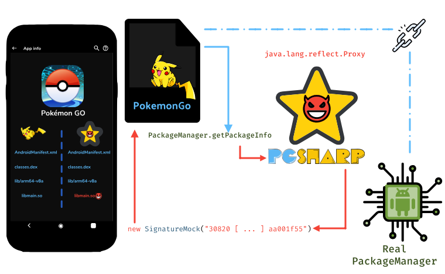

### Dynamic APK Loading

In the Lua script ``plugin.lua``, PGSharp defines an ``init`` function that performs the following
actions:

```lua
local filesdir     = (ref.call_method)(runtime.app, "getFilesDir", "()Ljava/io/File;")
local filesdirpath = (ref.call_method)(filesdir, "getAbsolutePath", "()Ljava/lang/String;")
u_plugin_path      = (gh.ipf)(loadjstring(filesdirpath))
```

``ipf`` is a function that takes the output of ``cxt.getFilesDir().getAbsolutePath()`` as parameter,
in other words, the path of the *files* directory of PokemonGO: ``/data/data/com.nianticlabs.pokemongo/files``,
and returns a ``u_plugin_path`` as a Lua string.

If we look for ``ipf`` in the Lua scripts, we don't find any implementation. Actually, this
function is referenced in the ``gamehelper()`` function of <b class="red">libmain.so</b> where it is
linked as follows:

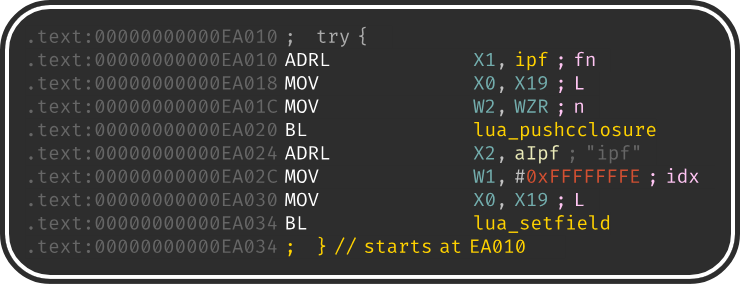

So ``ipf`` is a native Lua C function registered with ``lua_pushcclosure``.

Once we identified the location of ``ipf``, the logic of the function can be summarized with this pseudo code:

```cpp
// file_dir: /data/user/0/com.nianticlabs.pokemongo/files
void ipf(lua_State *L) {
  // std::string ctor @0xA4F00
  std::string outpath = lua_tostring(L, -1);
  // std::string::append @0xD868C
  outpath.append("/");
  outpath.append("LZZqoKpt.plg");

  FILE* fout = fopen(outpath.c_str(), "wb");

  // @0x634424
  extract_apk_file(FILE* fout) {
    for (chunk : chunks) {
      decode(chunk, 0x2710);
      fwrite(chunk, 0x2710, 1, fout);
    }
  }
  fclose(fout);
  lua_pushlstring(L, outpath.c_str(), outpath.size());
}

void inline_decode(uint8_t* data, size_t size) {
  for (size_t i = 0; i < size; ++i) {
    // Byte decoding
    data[i] = (0xb3 & ~data[i]) | (data[i] & 0x4c)
  }
}
```

> **Note**
Since the decoded file is written in the ``/data`` partition,
one can also pull the file from the device (this file is not removed when PGSharp stops running).


The written file, ``LZZqoKpt.plg``, is actually an APK that is loaded with ``PathClassLoader`` in the Lua script:

```lua
u_classloader = (ref.new_instance)("dalvik/system/PathClassLoader",
                "(Ljava/lang/String;Ljava/lang/String;Ljava/lang/ClassLoader;)V",
                (env.NewStringUTF)(u_plugin_path),
                nativeLibraryDir,
                gh.pgo_classloader);
```

> **Spoiler:   Rest of the function**
```lua
u_plugin_cls                = findclass("me/underworld/helaplugin/PL", u_classloader)
u_global_cls                = findclass("me/underworld/helaplugin/GL", u_classloader)
u_runnable_cls              = findclass("me/underworld/helaplugin/HR", u_classloader)

u_global_cls                = (env.NewGlobalRef)(u_global_cls)
u_plugin_cls                = (env.NewGlobalRef)(u_plugin_cls)
u_classloader               = (env.NewGlobalRef)(u_classloader)
u_runnable_cls              = (env.NewGlobalRef)(u_runnable_cls)
u_runnable_init_mid         = (env.GetMethodID)(u_runnable_cls, "<init>", "(ILjava/lang/Object;)V")
u_geturl_mid                = (env.GetStaticMethodID)(u_plugin_cls, "GU", "(Ljava/lang/String;Ljava/lang/String;)I")
u_postString_mid            = (env.GetStaticMethodID)(u_plugin_cls, "vtEdUZmWQYAgtGWs", "(Ljava/lang/String;Ljava/lang/String;Ljava/lang/String;)I")
u_postBytes_mid             = (env.GetStaticMethodID)(u_plugin_cls, "BbTwaTXurePBxTDt", "(Ljava/lang/String;[BLjava/lang/String;)I")
u_onLuaMessage_mid          = (env.GetStaticMethodID)(u_plugin_cls, "tFAxNZCNHOXBTYGM", "(ILjava/lang/Object;Ljava/lang/Object;)Ljava/lang/Object;")
u_global_updatelocation_mid = (env.GetStaticMethodID)(u_global_cls, "ul", "(DD)V")
u_global_savelocation_mid   = (env.GetStaticMethodID)(u_global_cls, "sl", "()V")

(gh.init_plugin_natives)(u_classloader)
(ref.call_static_method)(u_plugin_cls,
                         "rDymrMuxPIlIESFe", "(Landroid/app/Application;Ljava/lang/String;I)V",
                         runtime.app, (env.NewStringUTF)(u_plugin_path), runtime.log_level)

local cls              = (gh.findclass)("me.underworld.helaplugin.HLVM", u_classloader)
local hlviewmanagerref = (ref.call_static_method)(cls, "getInstance", "()Lme/underworld/helaplugin/HLVM;")
u_sm_mid               = (env.GetMethodID)(cls, "SM", "(Ljava/lang/String;I)V")
u_setviewshow_mid      = (env.GetMethodID)(cls, "SVC", "(Ljava/lang/String;Z)V")
u_hlviewmanager        = (env.NewGlobalRef)(hlviewmanagerref)
plugin.classloader     = u_classloader
```


### GPS Spoofing

Since PokemonGO heavily relies on the user's location, the must-have feature for the PokemonGO cheat engines
is to be able to spoof the GPS location.

The genuine PokemonGO application manages the user location through the Java class ``NianticLocationManager``,
which exposes three natives functions:

1. <span class="blue">nativeAddLocationProviders(Context ctx)</span>
2. <span class="blue">nativeGpsStatusUpdate(int i, SatelliteInfo[] info)</span>
3. <span class="blue">nativeLocationUpdate(String providerName, Location location, ...)</span>

``nativeAddLocationProviders`` aims at instantiating the different location providers as Java object:

1. FusedLocationProvider
2. GnssLocationProvider
3. GpsLocationProvider
4. NetworkLocationProvider

while ``nativeLocationUpdate`` and ``nativeGpsStatusUpdate`` are a kind of callbacks triggered when there is
a new user location to consider.

The implementation of ``nativeLocationUpdate`` checks natively if the location object given in the second parameter
is *mocked* (cf. [isMock()](https://developer.android.com/reference/android/location/Location#isMock()) or [isFromMockProvider()](https://developer.android.com/reference/android/location/Location#isFromMockProvider())).

Actually PGSharp hooks two of these three native methods:

1. <span class="red"> nativeAddLocationProviders(Context ctx)</span>
2. <span class="blue">nativeGpsStatusUpdate(int i, SatelliteInfo[] info)</span>
3. <span class="red"> nativeLocationUpdate(String provider, Location location, ...)</span>


By hooking ``nativeLocationUpdate``, they can modify the value of the ``Location`` parameter to change
the real location.

> *"You assert that PGSharp hooks ``nativeLocationUpdate`` and ``nativeAddLocationProviders`` in
>  ``libNianticLabsPlugin.so``, but this library is protected by a commercial obfuscator
>  which has anti-hooks features. How do they hook these functions?"*

And this is where the fun reaches another level :rocket:

### JNIEnv Proxifier

I would assume that ``nativeLocationUpdate`` and ``nativeAddLocationProviders`` are critical
enough to be protected against hooking. It turns out that PGSharp embeds a hooking framework to hook
Unity functions, but they don't use it on these functions.

<div class="legacy-center">
<p><b>
The authors of PGSharp found a subtle trick to circumvent the anti-hook protection.<br />
</b></p>
</div>

``nativeLocationUpdate`` and ``nativeAddLocationProviders`` are JNI functions
that are **dynamically** registered by ``Java_com_nianticlabs_nia_unity_UnityUtil_nativeInit``:

```cpp
Java_com_nianticlabs_nia_unity_UnityUtil_nativeInit(env, ...) {
  env->RegisterNatives(...);
}
```
The ``env`` parameter refers to the JNIEnv structure which is an array of function pointers:


```cpp
struct JNINativeInterface {
  ...
  jclass      (*GetObjectClass)(JNIEnv*, jobject);
  jboolean    (*IsInstanceOf)(JNIEnv*, jobject, jclass);
  jmethodID   (*GetMethodID)(JNIEnv*, jclass, const char*, const char*);
  ...
}
```


The values
of these pointers are defined by the implementation of the "JVM" which is, for Android, the **A**ndroid **R**un**T**ime (ART).

For instance, ``FindClass`` is actually a pointer
to ``art::{CheckJNI, JNIImpl}::FindClass`` located in ``art/runtime/jni/{jni_internal, check_jni}.cc``:

```cpp
static jclass FindClass(JNIEnv* env, const char* name) {
  Runtime* runtime = Runtime::Current();
  ClassLinker* class_linker = runtime->GetClassLinker();
  std::string descriptor(NormalizeJniClassDescriptor(name));
  ScopedObjectAccess soa(env);
  ObjPtr<mirror::Class> c = nullptr;
  if (runtime->IsStarted()) {
    StackHandleScope<1> hs(soa.Self());
    Handle<mirror::ClassLoader> class_loader(hs.NewHandle(GetClassLoader<kEnableIndexIds>(soa)));
    c = class_linker->FindClass(soa.Self(), descriptor.c_str(), class_loader);
  } else {
    c = class_linker->FindSystemClass(soa.Self(), descriptor.c_str());
  }
  return soa.AddLocalReference<jclass>(c);
}
```

If we hook ``Java_com_nianticlabs_nia_unity_UnityUtil_nativeInit`` from the **genuine** PokemonGO,
and we check where the pointers of the ``JNIEnv`` structure point to, we get this kind of output:

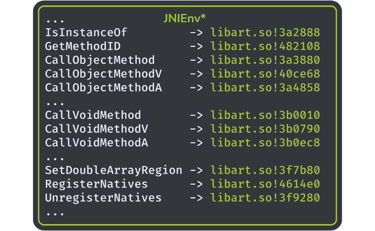

This output is consistent with what we said about the *JVM* and the runtime ART.
If we do the same check **on PGSharp**, we get this result:

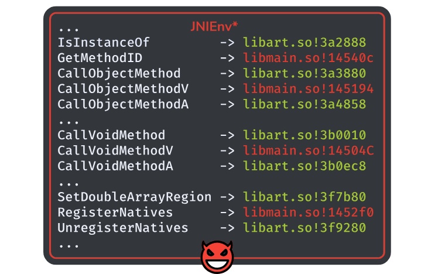

As we can see, some pointers have been relocated to point in <b class="red">libmain.so</b>:

<div class="legacy-center">

| JNI Function      | Offset in libmain.so (v1.33.0)
| :------           | :--------
| GetMethodID       | 0x14540c
| CallObjectMethodV | 0x145194
| CallVoidMethodV   | 0x145040
| RegisterNatives   | 0x1452f0

</div>

It means that when ``libNianticLabsPlugin.so`` is calling one of the functions listed above,
the execution is forwarded to <b class="red">libmain.so</b> instead of <b class="green">libart.so</b>.

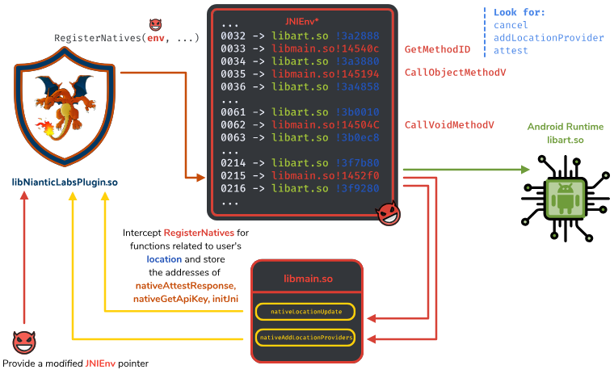

PGSharp proxifies these functions for the following purposes:

**GetMethodID**

  To monitor:

  1. SafetyNetService.attest
  2. SafetyNetService.cancel
  3. NianticLocationManager.addLocationProvider

**CallVoidMethodV**

  To monitor the parameters of:

  1. SafetyNetService.attest (to intercept the nonce)
  2. SafetyNetService.cancel

**RegisterNatives**

  Proxified to get, and potentially change, the effective location of the <br />
  ``libNianticLabsPlugin.so`` JNI functions:

  1. nativeAttestResponse
  2. nativeGetApiKey
  3. nativeAddLocationProviders
  4. nativeLocationUpdate
  5. initJni
  6. nativeInjectEvent
  7. nativeUnitySendMessage
  8. nativeRender
  9. nativeMuteMasterAudio

By managing the function ``JNIEnv::RegisterNatives``, they are able to change the value of ``JNINativeMethod.fnPtr``,
such as when PokemonGO calls ``nativeLocationUpdate``, it actually calls a function managed by PGSharp.

It results that JNI functions used by ``libNianticLabsPlugin.so`` have been *redefined*:

| JNI Function                                                         | Location
| :------                                                              | :--------
| <b class="red">NianticLocationManager.nativeAddLocationProviders</b> | <b class="red">libmain.so!ea868</b>
| NianticLocationManager.nativeGpsStatusUpdate                         | libNianticLabsPlugin.so!bc508
| <b class="red">NianticLocationManager.nativeLocationUpdate</b>       | <b class="red">libmain.so!ea8bc</b>
| NLog.nativeDispatchLogMessage                                        | libNianticLabsPlugin.so!4beaa0
| NetworkConnectivity.nativeNotifyNetworkStateChanged                  | libNianticLabsPlugin.so!6f8118
| NianticTrustManager.nativeCheckClientTrusted                         | libNianticLabsPlugin.so!9b9cc
| NianticTrustManager.nativeCheckServerTrusted                         | libNianticLabsPlugin.so!73b42c
| NianticTrustManager.nativeGetAcceptedIssuers                         | libNianticLabsPlugin.so!6dc5c8
| WebsocketController.nativeOnDidClose                                 | libNianticLabsPlugin.so!6fcabc
| WebsocketController.nativeOnDidFail                                  | libNianticLabsPlugin.so!4a0d0c
| WebsocketController.nativeOnDidOpen                                  | libNianticLabsPlugin.so!5922b0
| WebsocketController.nativeOnDidReceiveData                           | libNianticLabsPlugin.so!742fa8
| SafetyNetService.nativeAttestResponse                                | libNianticLabsPlugin.so!5ea1b8
| SafetyNetService.nativeGetApiKey                                     | libNianticLabsPlugin.so!6bc60
| NianticSensorManager.nativeCompassUpdate                             | libNianticLabsPlugin.so!4b9bc0
| NianticSensorManager.nativeSensorUpdate                              | libNianticLabsPlugin.so!177c44


### Unity Hooks

In addition to GPS spoofing, PGSharp provides other functionalities such as,
Pokemon feed, skip evolve animation ...

In the genuine PokemonGO application, these functionalities are implemented in the Unity layer
that is *compiled* into ``libil2cpp.so``.

To perform these functionalities, PGSharp hooks (hooking like Frida) some of these Unity functions.

They tried to hide[^hook-hide] the underlying hooking framework used to perform these hooks, unfortunately they missed
to remove important strings:

```console
$ strings ./libmain.so|grep -i -E "\w\+\.cc"
E:/work/code/Hela/app/src/main/cpp/Dobby/source/InterceptRouting/Routing/FunctionInlineReplace/FunctionInlineReplaceExport.cc
E:/work/code/Hela/app/src/main/cpp/Dobby/source/TrampolineBridge/Trampoline/arm64/trampoline-arm64.cc
E:/work/code/Hela/app/src/main/cpp/Dobby/source/MemoryAllocator/MemoryArena.cc
E:/work/code/Hela/app/src/main/cpp/Dobby/source/InstructionRelocation/arm64/ARM64InstructionRelocation.cc
E:/work/code/Hela/app/src/main/cpp/Dobby/source/UserMode/PlatformUtil/Linux/ProcessRuntimeUtility.cc
E:/work/code/Hela/app/src/main/cpp/Dobby/source/UserMode/UnifiedInterface/platform-posix.cc
```

So the hooking framework is Dobby:

<div class="legacy-center">
<p>
   <a href="https://github.com/jmpews/Dobby" target="_blank" rel="noopener">https://github.com/jmpews/Dobby</a>
<br />
</p>
</div>

Unity hooks start, in the script ``init.lua`` of PGSharp where they wait for the loading of ``libil2cpp.so``[^illoadinfo]:

```lua
set_event_handler("pgo.il2ready",
  function(il2base)
    runtime.il2base = il2base;
    (gh.initil2cppmethods)();
    (gh.initil2cpphooks)();
  end
)
```

``initil2cppmethods()`` aims at resolving the address of PokemonGO Unity functions needed to perform cheating actions,
while ``initil2cpphooks()`` uses Dobby to hook some Unity functions and change their behavior.
In the version 1.33 of PGSharp, they hook 207 functions
of ``libil2cpp.so`` and we will take one of them to detail the internal mechanisms:

- ``UnityEngine.Application$$OpenURL``

First of all, if we look at the symbols or the strings of ``libil2cpp.so``, we don't find meaningful information that could
help to figure out the original purpose of the Unity functions. In fact, the Unity metadata are embedded
in ``global-metadata.dat``, and to recover the bindings between this file
and ``libil2cpp.so``, we can use [Perfare/Il2CppDumper](https://github.com/Perfare/Il2CppDumper).

They compute the absolute of a Unity function by adding the offset provided by ``global-metadata.dat``
to the base address of ``libil2cpp.so``. Here is an example ``UnityEngine.Application$$OpenURL``:

```arm
MOV   W13, 0x4bfeea0                   ; Offset of the function (thanks to global-metadata.dat)
ADRP  X14, #Application_OpenURL
ADD   X13, X8, X13                     ; Add the libil2cpp.so base address
STR   X13, [X14, #Application_OpenURL] ; Store the absolute address in libmain.so
```

The function associated with ``initil2cpphooks()`` is quite large as shown in the figure below:

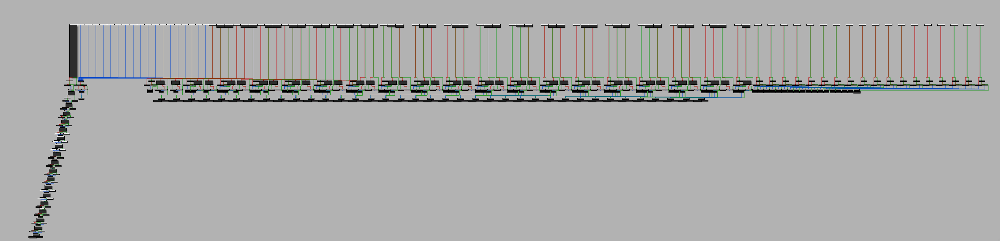

Actually, the function is large but easily understandable statically[^miss-ollvm]. The right-hand side of the figure is actually
the ``catch { ... }`` handlers of the exceptions, while the left-hand side that goes down, initializes
C++ objects. In this area of the CFG, we find the same pattern that repeats all the way down:

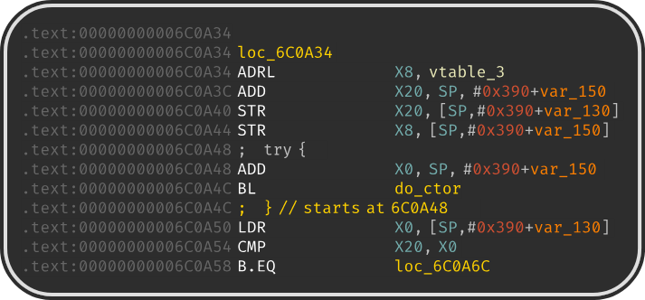

From what we can see, it initializes a C++ object (on the stack) and the first instructions set up the
VTable. We can find the relevant function in the last entry of the VTable that contains the hooking logic:

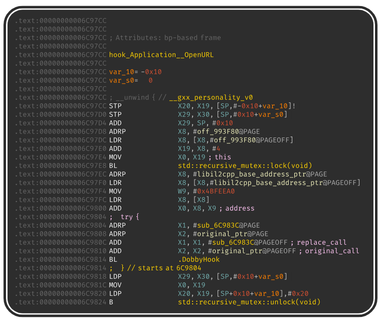

From this code, we can see that they perform the resolution of the absolute address of
``UnityEngine.Application$$OpenURL``. Also, thanks to the prototype of ``DobbyHook()`` we can
quickly understand that the new behavior of ``OpenURL`` is located in the function ``sub_6C983C``:

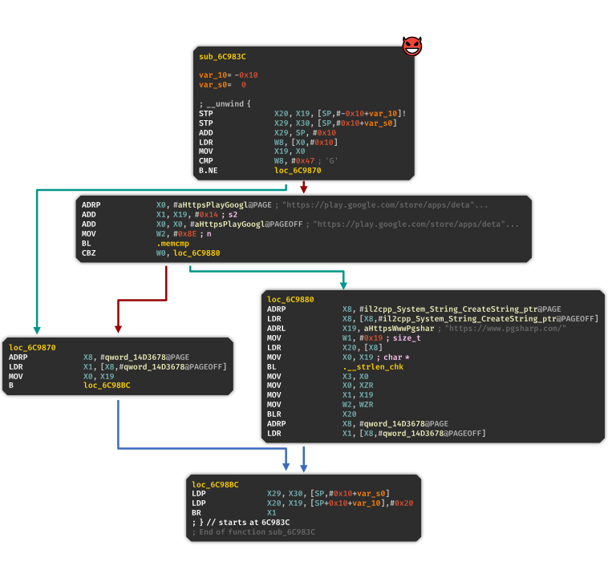

In this hook, they check if PokemonGO is opening its Google Play URL and redirect the user to the PGSharp home page.

### Network Communications and Encryption

The cheating application communicates with its servers through the TLS/HTTP protocol and adds another layer
of encryption on the top of TLS. To encrypt the HTTP payload, they use AES in the CBC mode.
We can identify the AES algorithm thanks to clear S-BOX present in the ``.rodata`` section.

It seems that they use different keys, depending on the endpoint the application targets but
we can retrieve them by hooking the AES key schedule function. It results that we can decrypt the communication
between the application and the PGSharp servers[^aes-hook].

Here are examples of endpoints and the data sent by PGSharp:

> **Spoiler:   hazelnuts**
- **POST ``hazelnuts``**
  * Action: Handshake
  * Request:
    ```json
      {
        "bid": "com.nianticlabs.pokemongo",
        "clt": "pgs",
        "host": "Samsung A40",
        "lv": -1,
        "nonce": "",
        "nonce_key": "",
        "pgver": "0.221.0",
        "uid": "00000000-00000000-[...]",
        "ver": "1.33.0"
      }
    ```
  * Response:
    ```json
    {
      "err": 0,
      "shiny": ["List of shiny"],
      "hotplaces": [
        {
          "name": "🇧🇷 Consolacao, São Paulo, Brazil",
          "lat": -23.5512,
          "lng": -46.6584
        },
      ]
    }
    ```


> **Spoiler:   Cw8dfkXpW7mq2i**
- **POST ``Cw8dfkXpW7mq2i``**
  * Action: ``PGS_ACTIONS.GETPLAYER``
  * Request:
    ```json
    {
      "bid": "com.nianticlabs.pokemongo",
      "clt": "pgs",
      "host": "Samsung A40",
      "lv": 4,
      "nonce": "",
      "nonce_key": "",
      "pgver": "0.221.0",
      "player": {
        "ban": 0,
        "captured": 3,
        "encountered": 5,
        "kmwalked": 10.50,
        "outage": 0,
        "pid": "[redacted]",
        "serverlo": 0,
        "susp": 0,
        "suspa": 0,
        "visits": 1,
        "warn": 0,
        "warna": 0,
        "warndt": 623234511000000000,
        "warntm": 0
      },
      "uid": "00000000-00000000-[...]",
      "ver": "1.33.0"
    }
    ```


> **Spoiler:   SSZgBPn6Ixq2ZK**
- **POST ``SSZgBPn6Ixq2ZK``**
  * Action: ``PGS_ACTIONS.GETREPORTABLE``
  * Request:
    ```json
    {
    "bid": "com.nianticlabs.pokemongo",
    "clt": "pgs",
    "host": "Samsung A40",
    "lv": 4,
    "nonce": "",
    "nonce_key": "",
    "pgver": "0.221.0",
    "raid": [
      {
        "battle": 1634490000000,
        "campaignId": "",
        "complete": false,
        "costume": 12233,
        "dex": 326,
        "eligible": false,
        "end": 1634490000000,
        "exclusive": false,
        "form": 0,
        "free": false,
        "gender": 1,
        "hidden": false,
        "lat": 0.1234,
        "lng": 5.6789,
        "lv": 3,
        "mov1": 163,
        "mov2": 90,
        "schedule": false,
        "seed": 5000000,
        "spawn": 1634400000000,
        "team": 1,
        "web": 0,
        "wec": 3
      },
    ],
    "uid": "00000000-00000000-[...]",
    "ver": "1.33.0"
    }
    ```


> **Spoiler:   /pga/keycode/v-q2mgqcyji/**
- **POST ``/pga/keycode/v-q2mgqcyji/``**
  * Action: Activate PGSharp with a premium key
  * Request:
    ```json
    {
      "ver": "1.33.0",
      "gi": 1,
      "key": "AVerySecretKey",
      "host": "Samsung A40",
      "clt": "pgs",
      "ua": "Samsung A40/11/[redacted]/arm64-v8a/[redacted]/unknow/unknown/English",
      "uid": "00000000-00000000-[...]"
    }
    ```


### SafetyNet


> **Note**
I skimmed this layer this weekend, so some parts might be inaccurate or wrong.


In addition to standard code obfuscation, PokemonGO uses SafetyNet as an attestation mechanism.
Similarly to the GPS management, we find a (non-obfuscated) Java layer implemented in the class
``SafetyNetService``. This class exposes two native functions:

1. <span class="blue">String nativeGetApiKey()</span>
2. <span class="blue">void nativeAttestResponse(byte[] nonce, String jwtResult)</span>

The implementation of these two functions is obfuscated within ``libNianticLabsPlugin.so``.

The first function is used to get the Google SafetyNet API key (``AIzaSyCh8l[...]_eOTXhM4``) while the second one,
is involved in the validation of the SafetyNet attestation.

Thanks to the JNIEnv proxy on ``GetMethodID`` and ``CallVoidMethodV``,
PGSharp is able to monitor the calls to ``SafetyNetService.attest(bytes[] nonce)``. When this function is called,
PGSharp intercepts the nonce and forward the request to its servers:


<div class="legacy-center">
<p>
<span class="red">https://tens.pgsharp.com/v1/scc-2-eg[...]4/</span><br />
</p>
</div>

The request is performed through an HTTP POST, whose data are encrypted with AES. The clear payload
has the following layout:

```json
{
  "n": "Cy[...]",
  "type": "attest",
  "ver": "<PGSharp Version>",
  "k": "i3[...]",
  "clt": "pgs",
  "data": {
    "k": "AIzaSyCh8l[...]_eOTXhM4 <- From nativeGetApiKey",
    "n": "<nonce>"
  }
}
```

On success, the server responses with an AES-encrypted payload which has the following layout:

```
{"result":"suc: <JWT SafetyNet Attestation>"}
```

The JWT SafetyNet value is then forwarded by PGSharp to ``nativeAttestResponse()`` with the original nonce.
At some point, this JWT attestation is sent to Niantic's servers (on the endpoint ``plfe/112/rpc2``)
wrapped by a Protobuf structure.

To understand how they *"bypass"* SafetyNet, let's look at the JWT payload:

```json
{
  "nonce": "<nonce>",
  "timestampMs": 1636265656,
  "apkPackageName": "com.nianticlabs.pokemongo",
  "apkDigestSha256": "ioYmlh5mk5EhMUH/DsaG1jrhUoQJDK/2IvK61eiAXJE=",
  "ctsProfileMatch": true,
  "apkCertificateDigestSha256": [
    "lEvaRm6vZL4ck4ltXI6aRUoHyNj8vEre7vs1RbM16Xk="
  ],
  "basicIntegrity": true,
  "evaluationType": "BASIC"
}
```

First of all, the JWT is correctly signed by Google SafetyNet's key and the ``apkCertificateDigestSha256``
matches the signature of the real PokemonGO application.

But ...

The value of ``apkDigestSha256`` does not match the checksum of the genuine PokemonGO application :confused:

**Here are my hypothesis:**

The server ``https://tens.pgsharp.com/v1/scc-2-eg/...`` forwards the SafetyNet request to
a real application that runs on a real device. This application would have been created by PGSharp authors
to *really* run SafetyNet and to get a valid attestation signed with a valid Google key.
The fake application would have been created with ``com.nianticlabs.pokemongo`` as package name
and would implement signature mocking, as discussed in the first part.

If they would have managed to break SafetyNet, the ``apkDigestSha256`` value would have been consistent.

The JWT attestation is forwarded to Niantic so they might check the consistency of ``apkDigestSha256``
but they might only focus on the signature (which can be faked) and not this value ...

### When PGSharp avoids PokemonGO pitfalls

As discussed in the section [*Signature Bypass*](#signature-bypass), PGSharp
tricks the Android PackageManager to mock the signature of the application.

It turns out that PGSharp is also concerned about app repackaging. As they provide premium
features, they don't want to be cheated ...

In the function associated with ``PGS_ACTIONS.INITPOST`` they perform a device fingerprint
whose one of these elements is the APK's signature. But instead of using the Android PackageManager to
retrieve the signature, they use [DimaKoz/stunning-signature](https://github.com/DimaKoz/stunning-signature)
to compute the MD5 digest of the signature.

## Final Words

When I started to look at this cheating app, I did not expect to find such nice tricks and challenges.
The PGSharp's authors know the sneaky tricks to hinder reverse engineering. Unfortunately,
O-LLVM is relatively weak in this context compared to the commercial obfuscator used by Niantic.

On the other hand, the design of PokemonGO is such that all the reverse engineering difficulties
lie in one single module that can be treated in black-box once we identified the API. In particular, the
un-obfuscated Java layer helps a lot to identify these API.

Regarding the signature bypass, at first, I thought it would be easy to prevent by checking the integrity
of the ``.apk`` and/or the native libraries. But, there are some points that need to be taken into account:

**APK Integrity Check**

Naively, we might want to compute a checksum of the APK or re-compute the signature (as it's done by PGSharp).
But in fact, for a few years, Google tries to push
developers to use app bundle such as an application is no longer a single ``.apk`` but a split ``.apk``.
While this feature optimizes the device's data partition size, it complicates the verification
of the signature since it would require to deal with different files and different checksum.

It's not infeasible, but it complicates its implementation in the APK build & development pipeline.

**Native Library Integrity Check**

I guess that ``libNianticLabsPlugin.so`` implements checksum on its own library as it is
a sensitive part of the application. Regarding the other libraries, some of them are owned
by Niantic (like ``libholoholo.so``) and others come from third-parties (like ``libmain.so``). Depending on
how they are integrated, the checksum of these external libraries might not be easy to automatically
compute while releasing a new version of PokemonGO. These third-party libraries are,
most of the time, not copy-pasted by the developers but automatically bundled when compiling the
application. Therefore, computing their checksums might require tweaking the build process
in a non-easy way.

On the top of that, Niantic releases a new version of its games on a monthly basis. It means
that these checks need to be automated in CI/CD pipeline which might not be trivial to do.

<hr width="50%" />

It was a funny and very interesting journey, for those who want to dig a bit more
in PGSharp, I pushed some materials and documents on GitHub. In particular, you can
find the symbol list of <b class="red">libmain.so</b> based on reverse engineering.


<div class="legacy-center">
<p>
   <a href="https://github.com/romainthomas/pgsharp" target="_blank" rel="noopener">https://github.com/romainthomas/pgsharp</a>
</p>
</div>


## Acknowledgments

This analysis has been independently done in my spare time while being at [Quarkslab](https://www.quarkslab.com) and
<a href="https://www.ul.com" target="_blank" rel="noopener" class="ul">UL</a>,
my current employer.

## Annexes

### Third-Party

Here is the (non exhaustive) list of the open-source projects used by PGSharp:
|
| :------
| https://github.com/jmpews/Dobby
| https://github.com/or-dvir/EasySettings
| https://github.com/zupet/LuaTinker or https://github.com/yanwei1983/luatinkerE
| https://github.com/DimaKoz/stunning-signature
| https://www.sqlite.org/index.html
| https://github.com/nlohmann/json
| https://www.lua.org/manual/5.3/
| https://github.com/kikito/md5.lua
| https://github.com/rxi/json.lua

### List of the Unity Functions used by PGSharp

> **Spoiler:   Expand**
```text
object__Invoke
String_CreateString1
String_CreateString3
ulong_object___get_Item
ulong_object___ContainsKey
ulong_object___TryGetValue
Application_OpenURL
Application_set_targetFrameRate
Quaternion_Angle
PlayerPrefs_TrySetInt
PlayerPrefs_TrySetFloat
PlayerPrefs_TrySetSetString
PlayerPrefs_SetInt
PlayerPrefs_GetInt
PlayerPrefs_SetFloat
PlayerPrefs_GetFloat
PlayerPrefs_SetString
PlayerPrefs_GetStringNoDefault
PlayerPrefs_HasKey
PlayerPrefs_DeleteKey
Component_get_gameObject
Transform_get_rotation
Animator_get_speed
Animator_set_speed
Animator_SetTriggerID
Animator_Update
Promise__ctor
Promise_Complete
MapMath_MetersBetween
NL_NLAny_object_
NL_NLFirst_object_
InputField_ActivateInputField
InputField_DeactivateInputField
Text_set_text
Text_set_fontSize
DiContainer_InjectExplicitInternal
Schedule_WaitOn_c__AnonStorey0____m__0
GameState_EnterState
GameState_ExitState
RpcBindings_Send
RpcManager_DispatchCallbacks
Animator_SetTriggerID
RpcManager_DispatchCallbacks
AuthService_get_CachedCredentialsExist
AuthService_Logout
DeviceServiceExtensions_IsUsable
GameMasterData_IsPokemonWeatherBoosted
Animator_SetTriggerID
AuthService_get_CachedCredentialsExist
AuthService_Logout
PgpApi_UpdateNotifications
ARPlusEncounterValuesProto__ctor
ARPlusEncounterValuesProto__cctor
PlayerService_GetPlayerDayBucket
PlayerService_get_PlayerStats
PlayerService_get_CurrentPokeball
PlayerService_get_CurrentLinkedLogins
AuthService_get_CachedCredentialsExist
PlayerService_get_PokemonBag
PlayerService_GetPlayerProfile
PlayerService_set_CurrentPokeball
PlayerService_get_BagIsFull
PlayerService_GetCandyCountForPokemon
StateToken_Complete
TimeUtil_ServerNowMs
RequestGymDetailsById_onSucceed
RequestGymDetailsById_onError
PlayerPrefs_SetInt
BluetoothUtil_get_IsBluetoothEnabled
PgpGuiController_ClickIcon
PgpGuiService_SetSfidaIconVisible
PgpGuiService_EnableSfidaIcon
ulong_object___get_Item
PgpService_get_IsSessionActive
PgpService_GetCurrentNotificationType
ItemBagImpl_GetItemCount
PokemonBagImpl_GetPokemon
ulong_object___get_Item
PgpApi_UpdateNotifications
Animator_set_speed
StateToken_Complete
VersionCheckService_CheckVersion
ulong_object___TryGetValue
QuestMapPokemon_get_Pokemon
QuestService_BeginQuestEncounterWithOut
EulaGuiController_PressAccept
StarterMapPokemon_get_Pokemon
OpenRemoteGym_gymOpner
OpenRemoteGym_onSucceed
BluetoothUtil_get_IsBluetoothEnabled
QuestService_BeginQuestEncounterWithOut
RaidState_ExitGymWithRaidDetails
AccountChoiceState_ClickNewPlayer
AccountChoiceState_ClickExistingPlayer
LoginAgeGateState_SubmitSelections
LoginChoiceState_ClickPtc
LoginChoiceState_ClickGoogle
LoginGuiController_ClickSubmit
PtcLoginState_SubmitLogin
I18n_PokemonMoveName
I18n_SetUpLanguageTable
I18n_PokemonNameTemporaryEvolution
I18n_Text
I18n_PokemonName
FriendsGuiState_StartOpenGiftFlow
FriendsGuiState_StartSendGiftFlow
FriendsRpcService_RemoveGiftbox
GiftingRpcService_SendGift
GiftingRpcService_OpenGift
StickerService_GetStickerInventory
CombatDirector_Initialize
MapPokestop_get_PoiId
MapPokestop_get_ActiveIncidentType
MapPokestop_get_Location
EncounterParkCameraController_PlayIntro
RunPokemonCaptured_onDitto
EncounterInteractionState_RunAway
MapMath_MetersBetween
PlayerPrefs_TrySetSetString
EncounterInteractionState_IntroCompleted
AttemptCapture_onResponse
EncounterIntroState_ExitState
EncounterPokemon_get_MapPokemon
PlayerPrefs_HasKey
ItemBagImpl_GetItemCount
Pokeball_TryHitPokemon
Pokeball_FlyStateImpl_Capture__MoveNext
Pokeball_DropStateImpl_Capture__MoveNext
EncounterGuiController_ShowPokemonFlee
EncounterState_get_EncounterType
EncounterState_EncounterStateComplete
EncounterState_EncounterStateComplete
EncounterState_get_MapPokemon
EncounterState_OnEncounterResponse
DefaultEncounter_get_DefaultBall
ExtraMapPokemon_get_Pokemon
ResearchEncounter_get_DefaultBall
ResearchEncounter_get_DefaultBall
object_object__object___CurrentPageIndex
PokemonInventoryCellView_Initialize
ToastService_OneLineMedium
ToastService_RewardItemNameAmount
ToastService_RewardItemDefault
ToastService_RewardItemStardust
ToastService_OneLineMediumWithParams
ToastService_RewardItemXlCandy
ToastService_RewardItemAmount
ToastService_TwoLine
ToastService_RewardItemAmountType
ToastService_RewardItemMegaResource
ToastService_RewardSticker
ToastService_OneLineWithParams
ToastService_OneLineBig
ToastService_OneLineBigWithParams
ToastService_RewardItemCandy
UserPromptsService_HasActiveModal
UserPromptsService_DismissActiveModal
PokemonInfoDynoScrollRect_Cleanup
Quaternion_Angle
Animator_get_speed
PokemonInfoPanel_DoUpdate
GymRootController_get_View
GymRootController_get_MapGym
MapGym_get_PoiId
MapGym_OnTap
MapGym_get_Location
RaidMapPokemon_get_Pokemon
MapContentHandler_UpdateCells
MapEntityCell_get_Pois
MapEntityService_get_Cells
MapEntityService_GetMapPoi
MapEntityService_UpdatePois
MapExploreState_GymSelected
MapExploreState_EnterQuestEncounter
MapPokemon_get_Location
MapPokemon_get_DespawnTime
MapPokemon_TryCapture
PhotobombingMapPokemon_get_Pokemon
MapPokestop_get_ActiveIncidentType
SendEncounterRequestCapture_onResponse
PoiMapPokemon_get_SpawnPointId
PoiMapPokemon_get_EncounterId
WildMapPokemon_get_Pokemon
WildMapPokemon_SendEncounterRequest
PoiDirectoryService_AddPokemon
PoiDirectoryService_RemovePokemon
RaidMapPokemon_get_Pokemon
IncidentMapPokemon_get_Pokemon
IncenseMapPokemon_SendEncounterRequest
IncenseMapPokemon_OnDestroy
IncenseMapPokemon_get_Pokemon
TroyDiskMapPokemon_SendEncounterRequest
TroyDiskMapPokemon_get_Pokemon
GroundTapHandler_OnTap
GroundTapHandler_OnTap1
MapViewHandler_GetGroundLocation
MapViewHandler_GetGroundPosition
MapViewHandler_GetWorldLocation
NL_NLFirst_object_
CompassGuiController_Update
PlayerService_SetPlayerProto
MapPokemon_LogEncounterMetrics
```


[^weak-obf]: O-LLVM provides control-flow obfuscation that can be *recovered* with emulation.
             On the other hand, the data-flow (function parameters, stack values, memory accesses) can be analyzed at a basic-block level with static analysis.
[^qb-modded]: Modded apps use similar tricks as discussed in [Android Application Diffing: Analysis of Modded Version](https://blog.quarkslab.com/android-application-diffing-analysis-of-modded-version.html#defeating-obfuscation)

[^static-link]: <b class="red">libmain.so</b> is also **statically** linked against other libraries like [jmpews/Dobby](https://github.com/jmpews/Dobby),
                [nlohmann/json](https://github.com/nlohmann/json), [SQLite](https://github.com/sqlite/sqlite) ...
[^aes-hook]: One can also hook the AES encrypt/decrypt functions whose prototype is ``(uint8_*t key_schedule, uint8_t* inout_buffer, size_t size)``
[^rename]: The package names are stripped with Proguard but we can quite easily recover those packages.
[^hook-hide]: Basically, they renamed [DobbyHook](https://github.com/jmpews/Dobby/blob/bba23cbee8e3cfff5622ef8b63fb797703baea5f/include/dobby.h#L157) in ``FbbUePBslRNHWkdS``
[^illoadinfo]: The event is triggered when ``nativeMuteMasterAudio`` or ``nativeRender`` is registered and they
               get the base address by iterating over ``/proc/<pid>/maps``.
[^miss-ollvm]: O-LLVM seems not applied on this function
[^wrapper]: In order to arbitrarily call the underlying function when needed.
