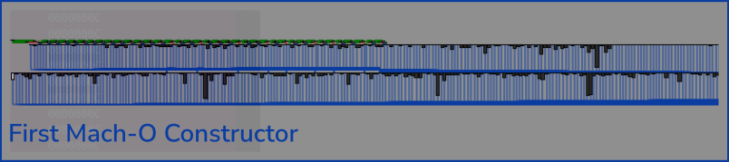
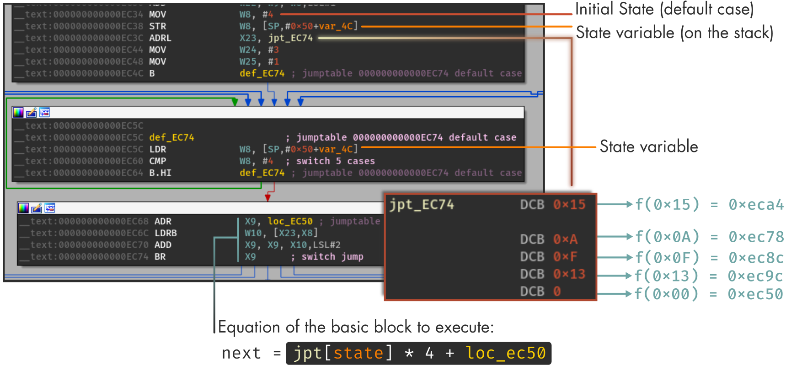
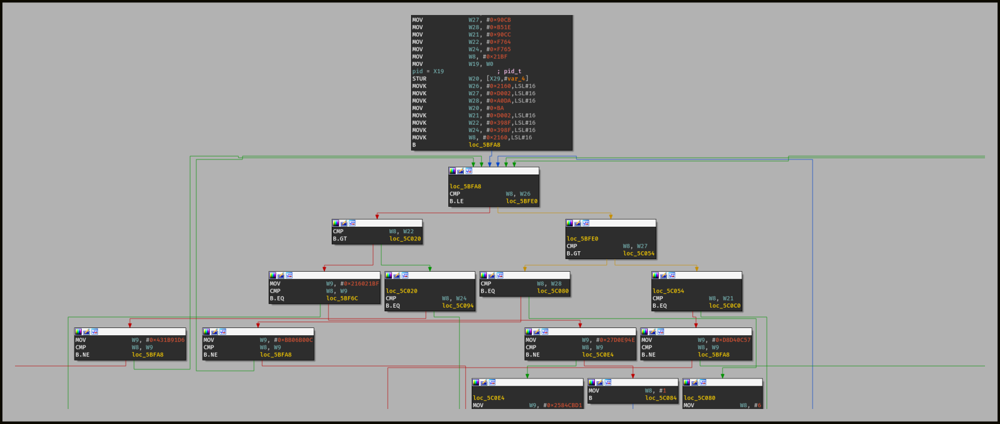
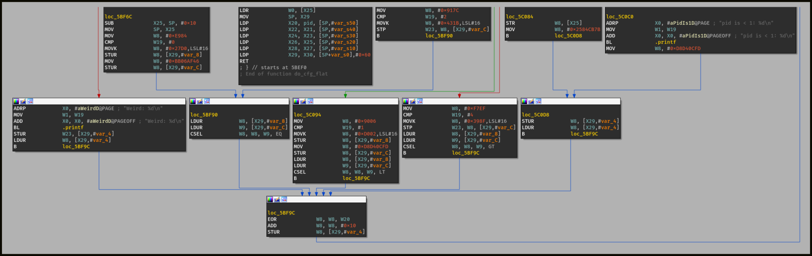
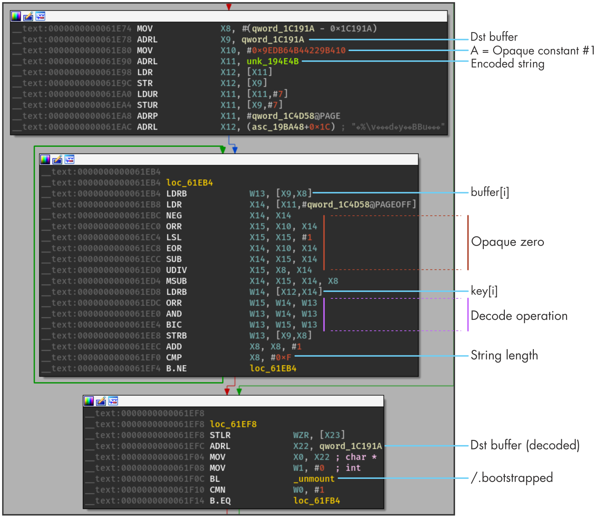
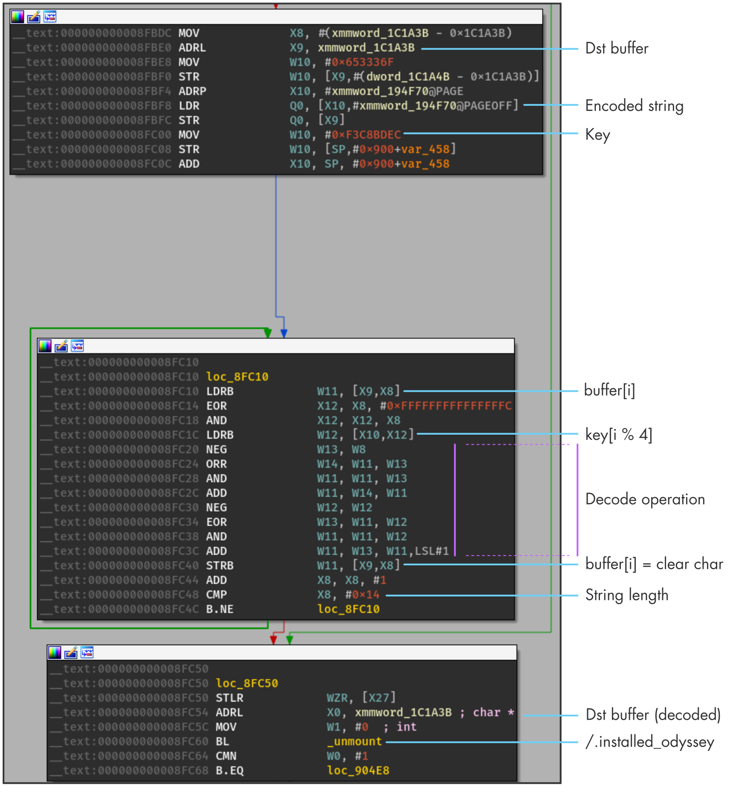
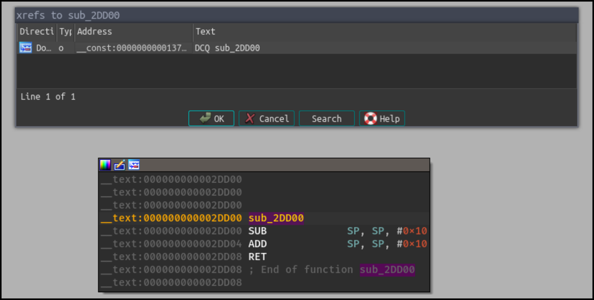
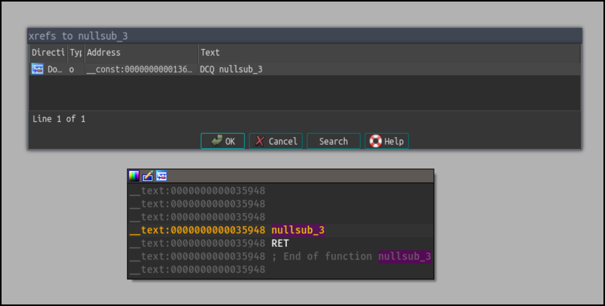

# Part 2 – iOS Native Code Obfuscation and Syscall Hooking

> This second blog post deals with native code obfuscation and RASP syscall interception

> **Note**
The first part is here: [Part 1 -- SingPass RASP Analysis](/post/22-08-singpass-rasp-analysis)


After SingPass, I took a look at another application protected with the same obfuscator but with
enhanced protections.

Compared to the previous application, this new application crashes immediately as soon as it is launched.

By checking the crash log, we don't get any meaningful information since the obfuscator trashes some registers like
`LR` before crashing. By trashing `LR`, the iOS crash analytics service is not able to correctly build the call stack
of the functions that led to the crash.

On the other hand, by tracing the libraries loaded by the application, we can identify in which loaded library
the application crashes, and thus, the library is likely in charge of checking the environment's integrity.

```text
$ ijector.py --spawn ios.app
iTrace started
PID: 63969 | tid: 771
Home: /private/var/mobile/Containers/Data/Application/A59541E1-106A-4C31-8188-0830E651449E
...
ImageLoader::containsAddress(0x1065f948c): cxxreact!1948c
ImageLoader::containsAddress(0x10564e270): ReactCommon!1a270
ImageLoader::containsAddress(0x103e5ed84): GRDB!12ed84
ImageLoader::containsAddress(0x104407790): Intercom!1bb790
ImageLoader::containsAddress(0x104c29d7c): KaaSLogging!9d7c
ImageLoader::containsAddress(0x105871bb4): RxSwift!91bb4
ImageLoader::containsAddress(0x1056f00cc): RxBluetoothKit!440cc
ImageLoader::containsAddress(0x104633f50): KaaSBle!bbf50
---> CRASH!
```

So the application crashes when loading the `KaaSBle` library embedded as a third-party framework of the application.

Compared SingPass, the library does not leak symbols about the RASP checks nor about
the obfuscator. In addition, some functions are obfuscated with control-flow flattening and Mixed Boolean-Arithmetic
(MBA) expressions as we can observe in the following figure:

<div class="legacy-center">
<figure>

<br />
<figcaption>Figure 1 - Control-Flow Flattening in the Constructor of KaaSBle</figcaption>
</figure>
<br />
</div>

Based on the previous analysis of `SingPass`, we know that RASP checks related to jailbreak or debugger detection use
uncommon functions like `getpid`, `unmount` or `pathconf`. It turns out that, these functions are also imported
by `KaaSBle` which enables to identify where some of the RASP checks are located.

> **Note**
Uncommon imported functions like `unmount` are usually a good signature to identify potential RASP checks


For instance, the function <span class="dark-boxed dark-yellow">sub_EBDC</span> which uses `getpid` is likely involved in the debugger detection. This
function is obfuscated with an MBA and control-flow flattening and, its graph is represented in Figure 2[^graph]

<div class="col-lg-0" id="fig-2">
<div class="legacy-center">
<figure>

<br />
<br />
<figcaption>Figure 2 - BinaryNinja HLIL Graph of <code>sub_EBDC</code></figcaption>
</figure>
<br />
</div>
</div>

## Control-Flow Flattening

I won't detail how generally control-flow flattening works as it already exists a good bunch of articles on this topic:

- [Deobfuscation: recovering an OLLVM-protected program ](https://blog.quarkslab.com/deobfuscation-recovering-an-ollvm-protected-program.html) by [Quarkslab](https://www.quarkslab.com/)
- [Automated Detection of Control-flow Flattening](https://synthesis.to/2021/03/03/flattening_detection.html) by [Tim Blazytko](https://twitter.com/mr_phrazer)
- [D810: A journey into control flow unflattening](https://eshard.com/posts/D810-a-journey-into-control-flow-unflattening) by [eShard](https://eshard.com)

Nevertheless, we can notice that the state variable that is used to drive the execution through the flattened
blocks is linear and not encoded:

> **Note**
<div class="legacy-center">
<p>
<b>The state variable set at the end of the basic block exactly defines the next basic block to execute.</b>
</p>
</div>


This means that given:

1. A state value
2. The switch table
3. The *switch base address*

It is possible to easily compute the targeted basic block:

<div class="legacy-center">
<figure class="mb-4">

<figcaption>Fig 3. Computation of the Basic Block from a State Variable</figcaption>
</figure>
</div>


<div class="legacy-center">
<figure class="mb-4">

<figcaption>Fig 4. Simplified Overview</figcaption>
</figure>
</div>


Since there is no encoding, we can determine the next states of a basic block by looking at the constant
written in the local stack variable <span class="dark-boxed text-white">[<span class="dark-clear-blue">sp</span>, <span class="dark-red">0x50</span>+<span class="dark-orange">var_4c</span>]</span>
or the <span class="dark-boxed dark-blue">state_variable</span> of the BinaryNinja High Level IL representation ([Figure 2](#fig-2)).

From a graph recovery perspective, this design **completely fits** in the case of the Quarkslab's blog:
[recovering an OLLVM-protected program ](https://blog.quarkslab.com/deobfuscation-recovering-an-ollvm-protected-program.html),
thus the original graph could be completely recovered.

> **Note**
I also checked other large control-flow-flattened functions in the binary and they follow the same design with
the same weakness.


### Improvements

> **Note**
<b>Spoiler</b>: *This example comes from an on-going larger project: [open-obfuscator](https://github.com/open-obfuscator).*


Actually we can enhance the protections of the control-flow flattening by encoding the state variable and by identifying the
basic blocks of the switch table with random numbers (instead of 1, 2, 3 etc).


The following figure outlines this design:

<div class="legacy-center">
<figure class="mb-4">

<figcaption>Fig 5. Control-Flow Flattening with Random ID and Encoding</figcaption>
</figure>
</div>

Concretely, the code generated **does not use a lookup-switch table** and the dispatcher is a succession of conditions:

<div class="legacy-center">
<figure>

<br />
<figcaption>Figure 6 - Head of the Control-Flow Flattening</figcaption>
</figure>
<br />
</div>

We can also observe the encoding block at the end of the graph:

<div class="legacy-center">
<figure>

<br />
<figcaption>Figure 7 - Tail of the Control-Flow Flattening</figcaption>
</figure>
<br />
</div>

In this example, the encoding is simply $E(X) = X \oplus A + B$ but it could be protected with an MBA and
generated with different expressions, unique per function. Globally speaking, any injective (or bijective) function
should fit as an encoding.

In the end, it would increase the complexity of recovering the original graph **at scale**
(even though the design is known).

## Mixed-Boolean Arithmetic

We can also observe in [Figure 2](#fig-2) that the function uses an MBA as an opaque zero or more precisely
an opaque boolean.

Generally speaking, MBA are widely used by the obfuscator but they are usually represented under
their *simple* form like $(A \oplus B) + (A \\& B) \times 2$.
In other words, we **can't quickly** identify the underlying arithmetic operation but with limited efforts, we can simplify the expression
using public tools.

If you want to dig more into MBA deobfuscation, I highly recommend this recent blog post [Improving MBA Deobfuscation using Equality Saturation](https://secret.club/2022/08/08/eqsat-oracle-synthesis.html)
by [Tim Blazytko](https://twitter.com/mr_phrazer) and [Matteo](https://twitter.com/fvrmatteo)
which also lists open-source tools that can be used for simplifying MBA like:

- [sspam](https://github.com/quarkslab/sspam)
- [msynth](https://github.com/mrphrazer/msynth/) (Used for this binary)


> **Note**
[Triton](https://triton-library.github.io/)
also supports program synthesis: [synthesizing_obfuscated_expressions.py](https://github.com/JonathanSalwan/Triton/blob/96104b1a860dc7ddb9ab123859b2fd668e388f72/src/examples/python/synthesizing_obfuscated_expressions.py) :)


## Strings Encoding

Most of the strings used in the library are encoded which prevents identifying quickly sensitive functions.

These encoded strings are decoded *just-in-time* near the instruction that uses given the string.
In the blog post about [PokemonGO](/post/21-07-pokemongo-anti-frida-jailbreak-bypass), **all the
strings** were decrypted at once in the Mach-O constructors which enabled to recover all of these strings without
caring about reverse engineering the decoding routines. For the current obfuscator, we can't exactly apply this
technique.

<div class="legacy-center">
<figure class="mb-4">


<br />
<br />
<figcaption>Fig 8. Differences in Designing String Encryption</figcaption>
</figure>
<br />
</div>

To better understand the difficulty, let's take a closer look at how strings are encoded with
the <span class="dark-boxed dark-yellow">_unmount()</span> function. As a reminder, this function is used
as a part of jailbreak detection.

In the KaaSBle library, there are five cross-references to <span class="dark-boxed dark-yellow">_unmount()</span>:

<div class="legacy-center">

<br /><br />
</div>

When looking at the prologue of the <span class="dark-boxed dark-yellow">_unmount()</span> calls,
we get the following basic blocks:

<div class="legacy-center">
<figure>

<figcaption>Figure 9 - Decoding Routine for the String /.bootstrapped</figcaption>
</figure>
<br />
</div>

Which is equivalent to this snippet:

```python
from itertools import cycle

def decode(encrypted: bytes, key: str, op):
    key       = bytes.fromhex(key)
    encrypted = bytes.fromhex(encrypted)
    out = ""
    for idx, (k, v) in enumerate(zip(encrypted, cycle(key))):
        out += chr(op(idx, k, v) & 0xFF)
    return out

# /.bootstrapped
clear = decode("9f0b698a3abc17e70bb54332271180", # Encoded string
               "b0250be555c8649379d43342427580", # Key
               lambda _, k, v: (k ^ v))          # Operation
```

It is worth mentioning that the string is not decoded *in-placed* but in another ``__data`` variable.
This means that an encoded string takes potentially twice its size in the final binary.

Another example of a decoding routine:

<div class="legacy-center">
<figure>

<figcaption>Figure 10 - Decoding Routine for the String /.installed_odyssey</figcaption>
</figure>
<br />
</div>

Which is equivalent to:

```python
# /.installed_odyssey
clear = decode("1bec336463362f66602b365d672e4f756f3353", # Encoded string
               "ecbdc8f3",                               # Key
               lambda i, k, v: (k - v - i))              # Operation
```

In this case, the key is an ``uint32_t`` integer for which the bytes are accessed through a stack variable.
The *weird* operation ``x12 = x8 & (x8 ^ 0xfffffffffffffffc)`` is simply a modulus ``sizeof(uint32_t)`` :)


In summary, because of the **disparity** of the encodings which are mixed with MBA and unique keys, it would be quite difficult
to **statically** decode all the strings of the library. On the other hand, since the clear strings are written in the
`__data` section of the binary, we can dump -- at some point in the execution -- this section and observe the
clear strings (c.f. [SingPass RASP Analysis - Jailbreak Detection](/post/22-08-singpass-rasp-analysis#jailbreak-detection)).

## Crash Analysis

When the obfuscator detects that the environment is compromised (jailbroken device, debugger attached, ...), it
reacts by crashing the application. This crash occurs through different techniques among which:

1. Corrupting a global pointer
2. Executing a break instruction (BRK #1)
3. Trashing the link register and frame register (LR / FP)
4. Calling `objc_msgSend` with corrupted parameters

The instructions involved in crashing the application are **inlined** in the function where the check occurs.
This means that there is as many *crash routine* as there are RASP checks.

In particular, with such a design, we can't target a single function to bypass the different checks as I did
for SingPass.

## Hooking the Syscalls

> **Note**
This approach is inspired by this talk at
Pass the Salt: [Jailbreak Detection and How to Bypass Them](https://archives.pass-the-salt.org/Pass%20the%20SALT/2021/slides/PTS2021-Talk-01-JailBreak_detection.pdf)


To better understand the *problem*, let's recap the situation:

1. The code is obfuscated with CFG flattening, MBA, etc
2. The RASP checks are **inlined** in the code
3. The application crashes near the detection spot. In particular and compared to SingPass,
   there is no RASP endpoint that can be hooked.

The following figure depicts the differences in the RASP reaction between the two applications:

<div class="col-lg-0" id="fig-11">
<div class="legacy-center">
<figure>

<br />
<br />
<figcaption>Figure 11 - RASP Reaction: User Callback vs Crash</figcaption>
</figure>
<br />
</div>
</div>


We can't actually hook a function to bypass the RASP checks **but** the structure of the AArch64 instructions
has a valuable property:


> **Note**
<div class="legacy-center">
<p>
<b>The size of an AArch64 instruction is fixed</b>
</p>
</div>


As a consequence, we can **linearly** search the <span class="dark-boxed text-white">SVC <span class="dark-blue">#80</span></span>
instructions which are encoded as <span class="dark-boxed text-white">0xD4001001</span>.

### Interception

Let's consider the following approach to intercept the syscalls:

1. We linearly scan the `__text` section to find the `SVC` instructions (i.e. the four-bytes `0xD4001001`)
2. We replace this instruction with a branch (`BL #imm`) to a function we *control*
3. We process the redirection to disable the RASP checks

For the first point, thanks to the fixed instruction's size, we can search syscalls by reading the whole `__text` section:

```cpp
static constexpr uint32_t SVC         = 0xD4001001; // SVC #0x80
static constexpr size_t   SIZEOF_INST = 4;

for (size_t addr = text_start; addr < text_end; addr += SIZEOF_INST) {
  // Read the instruction
  auto inst = *reinterpret_cast<uint32_t*>(addr);
  if (inst != SVC) {
    continue;
  }

  // We found a syscall instruction at: `addr`
}
```

For the second point, on a syscall instruction, we have to patch the syscall with a branch.
To do so, Frida's `gum_memory_patch_code` is pretty convenient:

```cpp
void* svc_addr = /* Address of the syscall to patch */

gum_memory_patch_code(svc_addr, /* sizeof an arm64 inst */ 4,
                      [] (void* addr, void*) {
                        GumArm64Writer* writer = gum_arm64_writer_new(addr);

                        /* Transform a SVC #0x80 into BL #AABBCC */
                        gum_arm64_writer_put_bl_imm(writer, 0xAABBCC);
                      }, nullptr);
);
```

The pending question is where to branch the new `BL` instruction instead of `0xAABBCC`?

Ideally, we would like to jump on our own dedicated stub:

```cpp
void handler() {
  // ...
}

{
  // ...
  gum_arm64_writer_put_bl_imm(writer, &handler);
}
```

<b><u>But</u></b>, the `bl #imm` instruction only accepts an immediate value in the range of `]-0x8000000; 0x8000000[`.
This range might be too narrow to encode our absolute pointer `&handler`.

> **Note**
The BL instruction encodes the **signed** `#imm` as a multiple of 4 on 26 bits. Thus, and because of the sign bit,
this `#imm` can range from: `±1 << (26 + 2 - 1);`


We can actually bypass this restriction by using a *trampoline* located **in the library** where the RASP checks occur.
It is quite common for large binary to find small functions with one or two instructions that are not likely or rarely used:


<div class="legacy-center">
<figure>

<br />
<figcaption>Figure 12 - Small C++ vtable function</figcaption>
</figure>
<br />
</div>

<div class="legacy-center">
<figure>

<br />
<figcaption>Figure 13 - Small C++ vtable function</figcaption>
</figure>
<br />
</div>

The idea is to use one of these functions as a placeholder to write **two instructions** which enables to branch
an **absolute address**:

```asm
LDR   x15, =&handler
BR    x15
```

Since this placeholder function is located within the library where the syscalls take place,
we can `BL #imm` to this function without risking too much that `#imm` overflows the range `]-0x8000000; 0x8000000[`.

<div class="legacy-center">
<figure class="mb-4">

<figcaption>Fig 14. Syscall Patch</figcaption>
</figure>
</div>

Now that we found a mechanism to redirect the syscall instruction, we can focus on the `handler` function
which aims at welcoming the syscall's redirection.

First, the `SVC` instructions are *atomic* which means that our `handler` function must take care
of not corrupting the values of the registers.

In particular, `handler` can't follow the ARM64 calling convention. If we consider the following instructions:

```asm
mov x6, #0
...
svc #0x80
...
mov x2, x6
```

`svc #0x80` does not corrupt `x6` while this code:


```asm
mov x6, #0
...
BL #imm
...
mov x2, x6
```

Could corrupt `x6` according to the ARM64 calling convention. Therefore, our `handler()` function
must **really** mimic an interruption and take care of correctly saving/restoring the registers.

In other words, we must write a small assembly stub to save and restore the registers[^asm-stub]


```asm
stp x0,  x1,  [sp, -16]!
...
stp x28, x29, [sp, -16]!
stp x30, xzr, [sp, -16]!

mov x0, sp

bl _syscall_handler;

ldp x30, xzr, [sp], 16
ldp x28, x29, [sp], 16
...
ldp xzr, x1,  [sp], 16
ret
```

The `syscall_handler` function takes a pointer to the stack frame as a parameter. Thus, we can access the saved
registers:

```cpp
extern "C" {
uintptr_t syscall_handler(uintptr_t* sp) {
  uintptr_t x16 = sp[14]; // Syscall number
  return -1;
}
}
```

> **Note**
Apple prefixes (or mangles) symbols with a **`_`** this is why `syscall_handler` is referenced by `_syscall_handler` in the
assembly code.


Given our `syscall_handler` function, we have access to the original AArch64 registers such as we can
access the syscall number and its parameters. We are also able to modify the return value since the original syscall
is replaced by a branch.

<div class="col-lg-0" id="fig-14">
<div class="legacy-center">
<figure>

<br />
<br />
<figcaption>Fig 14. Syscall Redirection</figcaption>
</figure>
<br />
</div>
</div>

A PoC that wraps all this logic will be published on GitHub.

## Conclusion

Whilst this application uses the same obfuscator as in the previous blog post, it was configured with
multi-layered code obfuscation which includes control-flow flattening and MBA. In addition, the RASP checks are
also configured to crash the application instead of calling a callback function and displaying a message.
These improvements in the configuration of the obfuscator make the reverse engineering of the application
harder compared to the previous SingPass application.

This blog post also detailed a new AArch64-generic technique to intercept RASP syscalls
which resulted in a successful bypass of the RASP checks. This technique should also apply to Android AArch64.

This is the last part of this series about iOS obfuscation. As I said in the first disclaimer, the obfuscator used
for protecting these applications is and remains a good choice to protect assets from reverse engineering.

[^graph]: The graph is more convenient to explore if JavaScript is enabled.
[^asm-stub]: We don't restore `x0` as we want to change the return value from `_syscall_handler`.
