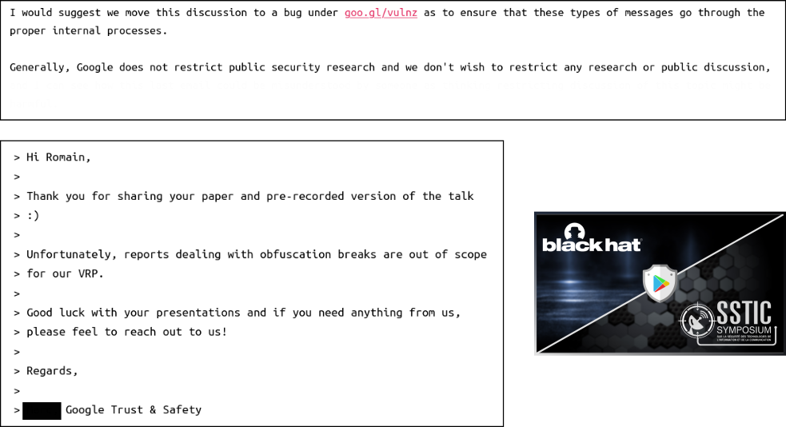

# Open-Obfuscator: A free and open-source obfuscator for mobile applications

> This blog post introduces open-obfuscator, a new open-source project to obfuscate mobile applications.

## Introduction

This post is about a new project on which I (intensively) worked this month. It aims at providing a free and
open-source solution for obfuscating mobile applications.

> **Note**
open-obfuscator is available at this URL: https://obfuscator.re, and this blog post is more about the motivation
behind this project.
You can also check the GitHub repositories: [O-MVLL](https://github.com/open-obfuscator/o-mvll) & [dProtect](https://github.com/open-obfuscator/dprotect)


## The origin of this project

For several years now, I'm doing reverse engineering on (obfuscated) mobile applications and my latest
publications tend to be more about how to "defeat" obfuscation rather than how to protect code.
I actually enjoy both aspects and I'm also aware that breaking[^breaking] something or reversing a RASP check
is -- most of the time -- easier than finding and building something that works **at scale** and
for **different users/environments** (like an obfuscator).

An idea started to grow after a recent discussion about the legal aspect of reverse engineering on obfuscated code.
It's true: reverse engineering an obfuscator is not permitted and publishing the results is even less.
Depending on the interlocutor, you might be lucky or not (c.f. [Promon vs University Researchers](https://www.heise.de/newsticker/meldung/Offenlegung-von-Softwareluecken-Rechtsstreit-endet-mit-Vergleich-4156393.html) and this [36C3 talk](https://www.youtube.com/watch?v=RGNarKVO-WI)).

That being said, the publications of this blog followed a responsible disclosure in which the stakeholders
have been contacted ahead time of the publications.
For instance, the feedback from Google for SafetyNet was very fair:



On the other hand, if one would have to decide which solution would be better to protect his assets,
this person could only refer (and infer) datasheets, demos[^terms], or testimonials.

In particular, there are no public benchmarks to get an idea about how solutions are positioned
from each other.
Moreover, it can be difficult for developers to understand the purpose of an obfuscation scheme and how
it really works underneath.

Thus, why not trying to take another hat and creating an obfuscator that fulfills these objectives:

- Easy to use and easy to integrate for the developers.
- Highly documented so that developers have a good understanding of the protections.
- Open source:
  1. To welcome **public improvements**.
  2. To welcome **public attacks**, free from legal issues, which in the end are used to enhance the protections.
  3. To be objectively and technically benchmarked.
- Realistic: trying to be as close as possible to the state of the art for the benefit of both: developers and attackers.


> **Note**
<div class="legacy-center">
<p>
<b>Obfuscation and open source sounds a bit contradictory no?</b>
</p>
</div>


Somehow yes. If the design is known attacks are easier. **But**, even if an obfuscation technique
is known, attacks can remain costly.

Let's take an example with the control-flow flattening protection.
The technique is known, documented and there are public attacks[^cfgflat]
but defeating this pass (statically) can be painful and time-consuming.
Usually (including myself), it forces the reverse engineer to analyze the program dynamically
which shifts the problem to dynamic protections. Thus, we can
assume that the pass is efficient against static analysis even if it is known.

Another example, [SafetyNet](/publication/22-sstic-blackhat-droidguard-safetynet).
The overall design of the protection is based on a virtual machine.
Once we reversed the different handlers, we can assume that the design is "known".
Some layers of obfuscation are also based on **known** MBA. But, Google did something very smart, a new
version is published regularly and the internal components are shuffled.

I do believe that the strongest protection against reverse engineering comes from a well-thought design,
not an individual obfuscation pass.

Obfuscation is also about time, and I think that by combining several (known) obfuscation techniques,
we can trigger a time-out in the attackers.

Talking about time, this month I had the time to bridge all these ideas.

## Technical choices

So far, the ideas were on the paper and I did not want to create "*yet another O-LLVM fork*" [^yansollvm] or
spend time on something that already exists.

## Native code obfuscation

No doubt about using LLVM and while looking at the current solutions based on LLVM,
I found [eShard/obfuscator-llvm](https://github.com/eshard/obfuscator-llvm) on GitHub, which is developed by [eShard](https://eshard.com/)
(a company known for side channels attacks on whiteboxes [^scared][^estraces]).

Compared to other LLVM-based obfuscators, it uses the new LLVM pass manager which enables us to load an
**out-of-tree plugin** with clang:

```bash
clang -fpass-plugin=<path/to/llvm/obfuscation>/libLLVMObfuscator.so \
      hello_world.c -o hello_world

```

I was definitely convinced by this way of using an obfuscator. Especially because it keeps the original
compiler from the toolchain which simplifies this kind of issue: [Hikari/Troubleshooting - AArch64e Support](https://github.com/HikariObfuscator/Hikari/wiki/Troubleshooting#aarch64e-support).

On the other hand, I was less convinced of using environment variables to trigger and configure the obfuscation passes.

## Java/Kotlin obfuscation

To support Java and Kotlin obfuscation for Android, I took a look at
[Proguard](https://github.com/Guardsquare/proguard)/[Proguard-core](https://github.com/Guardsquare/proguard-core)
which actually provides all the components to create an obfuscation pipeline.

Proguard is known for obfuscating symbols (class names, methods, ...) and optimizing code but it's just
the tip of the iceberg. The project is **really** well designed and modular such as it was very
easy to add an obfuscation pipeline.

## O-MVLL/dProtect

I ended up with two projects:

1. O-MVLL, in reference to the well know, parent of all the forks:
   [O-LLVM](https://github.com/obfuscator-llvm).
2. **d**Protect for **`{dex,droid}`**-Protector

### O-MVLL

O-MVLL uses the original idea of eShard: a *`pass-plugin`* obfuscator.
On the other hand, it uses a Python API instead of environment variables.

In short, the user defines what she/he wants to protect and how she/he wants to protect it in Python. For instance,
to obfuscate strings the developer must override the `obfuscate_string` method:

```python
def obfuscate_string(self,
                     mod: omvll.Module,
                     func: omvll.Function,
                     string: bytes):

  # Replace the string
  return "REDACTED"

  # Obfuscate the string on the stack
  return omvll.StringEncOptStack()

  # Obfsucate the string the stack with a
  # loop if the length is too long
  return omvll.StringEncOptStack(loopThreshold=0)
  ...
```

There is also `mod: omvll.Module` and `func: omvll.Function` in the arguments of the function.

These arguments are LLVM objects wrapped with Python bindings. Thus, the user can use all the information (name, flags, visibility [^flag])
provided by LLVM for these objects.

If the user only wants to protect strings in the function `omvll::decode()`, she/he can use this condition:

```python
def obfuscate_string(self,
                     mod: omvll.Module,
                     func: omvll.Function,
                     string: bytes):

    if func.demangled_name == "omvll::decode()":
        return StringEncOptGlobal()
    ...
```

You can find more details about this pass [here](https://obfuscator.re/omvll/passes/strings-encoding/) and
you can also explore the O-MVLL documentation [here](https://obfuscator.re/omvll).


### dProtect

For dProtect, nothing really new in terms of API compared to Proguard.
I added custom obfuscation passes that can be enabled as follows:

```bash
# Mixed boolean-arithmetic Obfuscation
-obfuscate-arithmetic,high class com.dprotect.salsa20 {
  *;
}
# Strings protection
-obfuscate-strings "XEYnuNOGoEQ*", "TOKEN: *"
-obfuscate-strings class dprotect.Connect {
  private static java.lang.String API_KEY;
  public static java.lang.String getToken();
}
# Constants
-obfuscate-constants    class com.dprotect.secret.** { *; }
# Control-Flow
-obfuscate-control-flow class com.dprotect.internal.** { *; }
```

The logic of these dProtect's passes relies on existing internal components available in Proguard and
Proguard-CORE which have been developed by
[Eric Lafortune](https://www.lafortune.eu/) and [James Hamilton](https://jameshamilton.eu/).

In its current version, dProtect provides the following obfuscation passes:

- [Arithmetic Obfuscation](https://obfuscator.re/dprotect/passes/arithmetic/)
- [Constants Obfuscation](https://obfuscator.re/dprotect/passes/constants/)
- [Control-Flow Obfuscation](https://obfuscator.re/dprotect/passes/control-flow/)
- [Strings Encryption](https://obfuscator.re/dprotect/passes/strings/)

## CI

O-MVLL and dProtect are CI compiled with nightly packages available at these addresses:

- http://nightly.obfuscator.re/latest/omvll
- http://nightly.obfuscator.re/latest/dprotect

The CI for O-MVLL could have been challenging to bootstrap because it is based on an out-of-tree plugin.
However, once the right version of LLVM is precompiled, building the project from scratch for both
the NDK and Xcode toolchains takes about **2 minutes**.

The environment to compile O-MVLL for the Android NDK and Xcode is fully Dockerized and available on Docker Hub:
https://hub.docker.com/u/openobfuscator:

- [openobfuscator/omvll-ndk](https://hub.docker.com/r/openobfuscator/omvll-ndk)
- [openobfuscator/omvll-xcode](https://hub.docker.com/r/openobfuscator/omvll-xcode)

For those who are interested, you can check out the GitHub Actions configurations:

- [NDK Workflow](https://github.com/open-obfuscator/o-mvll/blob/main/.github/workflows/ndk.yml)
- [Xcode Workflow](https://github.com/open-obfuscator/o-mvll/blob/main/.github/workflows/xcode.yml)

## Demo

I think the better way to demonstrate the level of obfuscation that can be provided by O-MVLL and dProtect in
their current version, is to obfuscate an open-source project.

For that purpose, I choose [optiv/android-ndk-crackme](https://github.com/optiv/android-ndk-crackme)
and the configuration of O-MVLL and dProtect are available here:

- [`o-conf.py`](https://gist.github.com/romainthomas/68ecda22775c2b3ca036bd58e4e73e5a)
- [dProtect.pro](https://gist.github.com/romainthomas/0d89bcd2547ff5968a0f3a5f4f7c067d)

The cherry on the cake, I also applied some techniques described in
["The Poor Man Obfuscator"](/publication/22-pst-the-poor-mans-obfuscator):

- [elf_tricks.py](https://gist.github.com/romainthomas/5898cd2c64b01b29270d9cad6787c1ff)

In the end, we have this un-obfuscated version of the crackme: [com.optiv.ndkcrackme.apk](https://data.romainthomas.fr/22-10-open-obfuscator/com.optiv.ndkcrackme.apk)
and this one, protected with O-MVLL and dProtect: [com.optiv.ndkcrackme-protected.apk](https://data.romainthomas.fr/22-10-open-obfuscator/com.optiv.ndkcrackme-protected.apk)

About iOS, O-MVLL works **as a PoC and the support is far from being finished**:

> **Note**
The obfuscation passes [Anti-Hooking](https://obfuscator.re/omvll/passes/anti-hook/) and
[Control-Flow Breaking](https://obfuscator.re/omvll/passes/control-flow-breaking) are not working
correctly due to an issue (from O-MVLL) in the JIT engine.<br /><br />
<u>The overall support for iOS is **highly** experimental.</u>


Nevertheless, you can compare this (unprotected) version of zlib for iOS: [libz.dylib](https://data.romainthomas.fr/22-10-open-obfuscator/libz.dylib)
with this protected one: [libz-obfuscated.dylib](https://data.romainthomas.fr/22-10-open-obfuscator/libz-obfuscated.dylib).

The obfuscation has been done with this configuration file: [ios-zlib-obf.py](https://gist.github.com/romainthomas/149ce793702f3dc28126f7840f5d6870).

## Last words

The project is one month old so you can expect bugs, limitations, and typos. I released a beta version
on GitHub so feel free to try and send your feedback.

Regarding the time spent on the project:

- 60% on the documentation, UI, website, etc
- 30% on the obfuscation passes themselves
- 5% on the CI
- 5% on the tests

So yes, some obfuscation passes still need to be improved to be really efficient and the support for iOS is
very experimental (i.e. depending on the configuration, **the compiler might crash**).
There is also a test suite for both dProtect and O-MVLL but it is not public yet.


Open-obfuscator is going to be my second largest project after [LIEF](https://lief-project.github.io/)
and I hope it will serve its long-term purpose:

**Providing an obfuscation playground for both, developers, and reverse engineers**.

<br />

Thank you for reading and happy Halloween :jack_o_lantern:

Romain

[^yansollvm]: This fork exists: https://github.com/emc2314/YANSOllvm
[^breaking]: Breaking obfuscation is a moot topic.
[^terms]: I guess the *terms of use* of the demo does not allow you to reverse it.
[^flag]: In the current version, only the name is provided.
[^cfgflat]: See: https://obfuscator.re/omvll/passes/control-flow-flattening/#references
[^scared]: https://gitlab.com/eshard/scared
[^estraces]: https://gitlab.com/eshard/estraces
