# Instrumenting an Apple Vision Pro Library with QBDI

> This blog post demonstrates how to extract liblockdown.dylib from the visionOS dyld shared cache to be instrumented with QBDI on an Apple M1.

## Introduction

The purpose of this blog post is to demonstrate how to extract a library
from an Apple visionOS 2.0 dyld shared cache to instrument it with
QBDI on an Apple M1.

Since the Apple Vision Pro and Apple M1 share the same architecture (ARM64), we should
theoretically be able to execute and instrument binaries from one platform on the other.

The iOS and visionOS environments are more restricted than macOS running as root with SIP disabled.
Therefore, lifting and instrumenting their binaries on an Apple M1 can create new opportunities
for fuzzing, reverse engineering, and vulnerability research.

In general, running or instrumenting an arbitrary function
compiled for iOS/visionOS on an Apple M1 is not possible especially if the given
function is using hardware-specific inputs.

That being said, research has already shown that we can mock, emulate[^emulate] or trick
platform- or hardware-specific functions.

I have no doubt that people have already found workarounds for that :)

[^emulate]: Behavior emulation, not code emulation

## Dyld Shared Cache

To speed up program loading, Apple bundles important libraries into a "shared" cache
which is located in a file (or several files) named `dyld_shared_cache_<arch>.<suffix>`.
On macOS 14 - Sonoma, these shared cache files are located in `/System/Volumes/Preboot/Cryptexes/OS/System/Library/dyld/`:

```text
-rwxr-xr-x   1 root  admin   2.3G Aug  4 12:31 dyld_shared_cache_arm64e
-rwxr-xr-x   1 root  admin   1.5G Aug  4 12:31 dyld_shared_cache_arm64e.01
-rwxr-xr-x   1 root  admin   984K Aug  4 12:31 dyld_shared_cache_arm64e.map
-rwxr-xr-x   1 root  admin   819M Aug  4 12:31 dyld_shared_cache_x86_64
-rwxr-xr-x   1 root  admin   786M Aug  4 12:31 dyld_shared_cache_x86_64.01
-rwxr-xr-x   1 root  admin   723M Aug  4 12:31 dyld_shared_cache_x86_64.02
-rwxr-xr-x   1 root  admin   720M Aug  4 12:31 dyld_shared_cache_x86_64.03
-rwxr-xr-x   1 root  admin   724M Aug  4 12:31 dyld_shared_cache_x86_64.04
-rwxr-xr-x   1 root  admin   169M Aug  4 12:31 dyld_shared_cache_x86_64.05
-rwxr-xr-x   1 root  admin   800K Aug  4 12:31 dyld_shared_cache_x86_64.map
```

If you already wondered where is located `/usr/lib/libSystem.B.dylib` while this
library is not present on the filesystem, the answer is in the dyld shared cache.

Prior to dyld v940 (publicly released in February 2022) the dyld shared cache was
composed of a single file (but one per architecture). From version 940,
it is composed of several files.

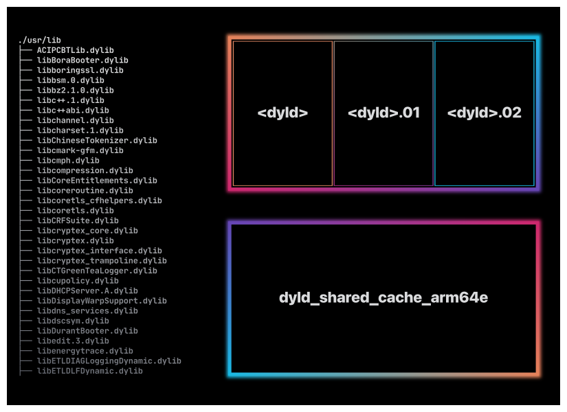

One of the interesting questions about the dyld shared cache is: *how do we extract
or recover a library from this cache?*

Indeed, the dyld shared cache encapsulates system libraries (including sensitive ones)
so getting back these libraries as regular Mach-O binaries can be a legitimate question.

There are different open source tools available for that:

- https://github.com/keith/dyld-shared-cache-extractor
- https://github.com/blacktop/ipsw
- https://github.com/arandomdev/DyldExtractor

The good news is that [LIEF](https://lief.re) is also supporting the shared cache with a
C++/Rust/Python API (not publicly released yet).

Given a visionOS dyld shared cache directory (from `Apple_Vision_Pro_2.0_22N320_Restore.ipsw`),
we can load it with LIEF through:

```console
$ ls -l visionOS-2.0/
dyld_shared_cache_arm64e
dyld_shared_cache_arm64e.01
...
dyld_shared_cache_arm64e.57
dyld_shared_cache_arm64e.58
dyld_shared_cache_arm64e.59.dylddata
dyld_shared_cache_arm64e.60.dyldlinkedit
dyld_shared_cache_arm64e.symbols
```

```python
import lief

shared_cache: lief.dyldsc.DyldSharedCache = lief.dyldsc.load("visionOS-2.0/")
```

From this `lief.dyldsc.DyldSharedCache` object, we can iterate over the embedded dylibs with:

```python
shared_cache: lief.dyldsc.DyldSharedCache = ...
for dylib in shared_cache.libraries:
    print(f"0x{dylib.address:016x}: {dylib.path}")
```

```text
0x00000001800f4000: /usr/lib/libobjc.A.dylib
0x000000018013e000: /System/Library/AccessibilityBundles/ARKit.axbundle/ARKit
0x0000000180140000: /System/Library/AccessibilityBundles/ARTraceModule.axbundle/ARTraceModule
0x0000000180142000: /System/Library/AccessibilityBundles/ASMessagesProvider.axbundle/ASMessagesProvider
...
0x0000000251766000: /usr/lib/system/libxpc.dylib
0x00000002517ad000: /usr/lib/updaters/libAce3Updater.dylib
0x00000002517d2000: /usr/lib/updaters/libAppleTCONUpdater.dylib
0x00000002517da000: /usr/lib/updaters/libAppleTypeCRetimerUpdater.dylib
0x0000000251834000: /usr/lib/updaters/libBoraUpdater.dylib
0x000000025184a000: /usr/lib/updaters/libDurantUpdater.dylib
0x0000000251854000: /usr/lib/updaters/libSEUpdater.dylib
0x00000002518c1000: /usr/lib/updaters/libSavageRestoreInfo_iOS.dylib
0x00000002518cc000: /usr/lib/updaters/libSavageUpdater_iOS.dylib
0x00000002519f0000: /usr/lib/usd/libusd_ms.dylib
0x00000002528a7000: /usr/lib/xr/libRuntimeSupport.dylib
```

Getting back to the original question about extracting a library from the dyld
shared cache, we can extract the in-cache Mach-O binary of `/usr/lib/liblockdown.dylib`
using `dylib.get()`:

```python
import lief
shared_cache: lief.dyldsc.DyldSharedCache = ...

liblockdown: lief.dyldsc.Dylib = shared_cache.find_library("/usr/lib/liblockdown.dylib")
liblockdown_macho: lief.MachO.Binary = liblockdown.get()
liblockdown_macho.write("liblockdown.1.dylib")
```

And we have come full circle: we can parse with LIEF shared cache files to get a
`DyldSharedCache` object. From this instance, we can access the `lief.dyldsc.Dylib`
object associated with `/usr/lib/liblockdown.dylib`. From this object, we can
retrieve a LIEF's Mach-O binary with `.get()`.
Finally, we can re-write back the Mach-O object with LIEF's writer:
`liblockdown_macho.write("liblockdown.1.dylib")`.

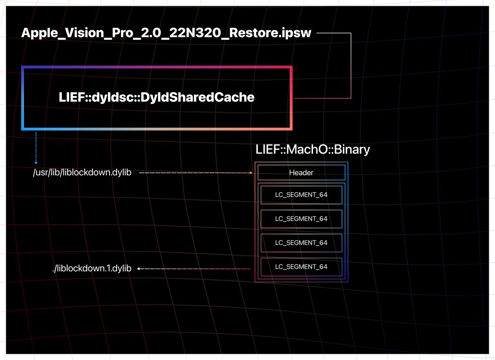

You can download `liblockdown.1.dylib` here: [romainthomas/visionOS-liblockdown/bin/liblockdown.1.dylib](https://github.com/romainthomas/visionOS-liblockdown/raw/refs/heads/main/bin/liblockdown.1.dylib).

However, if we open this `liblockdown.1.dylib` library in IDA or BinaryNinja
we might complain about the result:

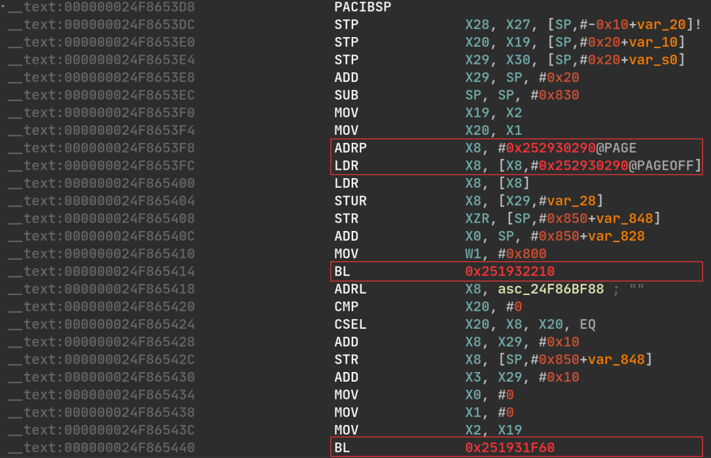

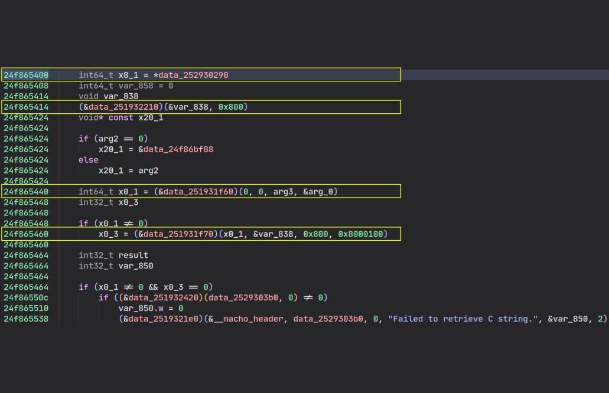

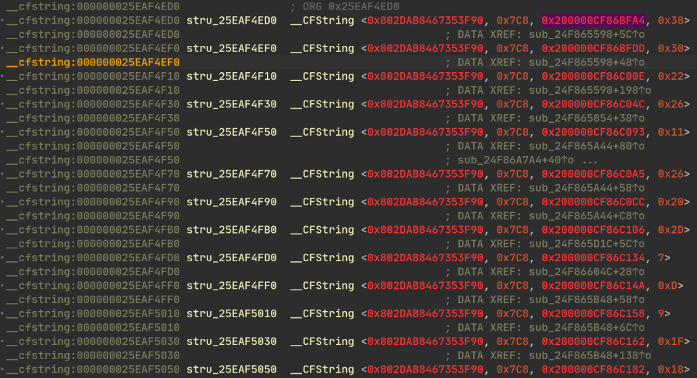

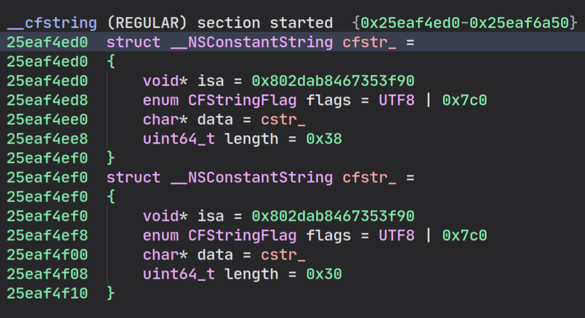

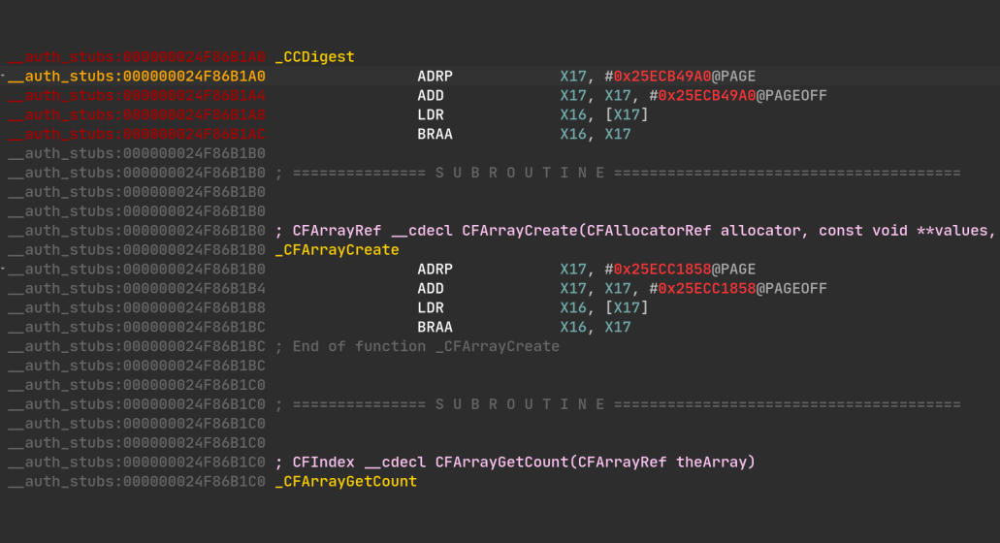

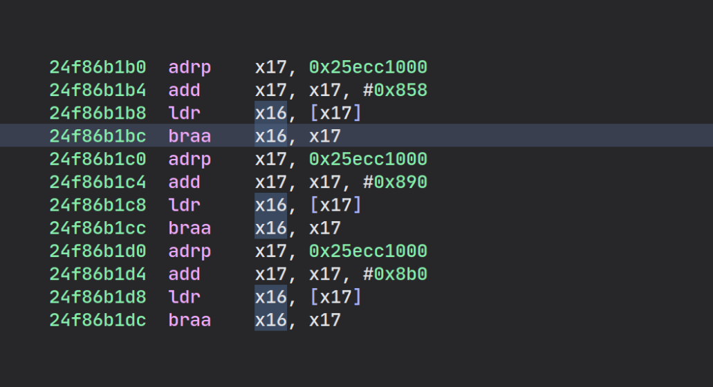

When Apple generates the dyld shared cache, it performs some optimizations and pre-loading,
such as the in-cache libraries are usually referencing addresses specific to the shared cache.
These optimizations usually break:

- Relocations
- Symbol bindings
- Calls
- Got accesses
- ObjC metadata

Last but not least, on recent shared cache, the `LC_DYLD_CHAINED_FIXUPS` command
is striped from the library before being added to the shared cache:

[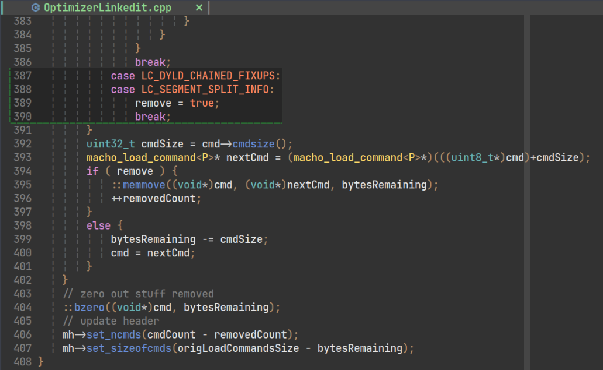](https://github.com/romainthomas/dyld/blob/main/cache-builder/OptimizerLinkedit.cpp#L387-L390)

That means that we can't rely on this command to recover the original
bindings or relocations. Fortunately, we can deoptimize the in-cache library
by accessing internal structures of the dyld shared cache.

All these de-optimizations can be enabled while calling the `.get()` function
on a `LIEF::dyldsc::Dylib` object:

```cpp
#include <LIEF/DyldSharedCache.hpp>

std::unique_ptr<LIEF::MachO::Binary> extract(const LIEF::dyldsc::DyldSharedCache& cache) {
  std::unique_ptr<LIEF::dyldsc::Dylib> liblockdown = cache.find_library("liblockdown.dylib");
  return liblockdown.get({
    .fix_branches    = true,
    .fix_memory      = true,
    .fix_relocations = true,
  });
}
```

We can also ask LIEF to **recreate** a `LC_DYLD_CHAINED_FIXUPS`
command based on information recovered from previous stages:

```diff
#include <LIEF/DyldSharedCache.hpp>

std::unique_ptr<LIEF::MachO::Binary> extract(const LIEF::dyldsc::DyldSharedCache& cache) {
  std::unique_ptr<LIEF::dyldsc::Dylib> liblockdown = cache.find_library("liblockdown.dylib");
  return liblockdown.get({
    .fix_branches    = true,
    .fix_memory      = true,
    .fix_relocations = true,
+   .create_dyld_chained_fixup_cmd = true,
  });
}
```

Et voilà: [romainthomas/visionOS-liblockdown/bin/liblockdown.2.dylib](https://github.com/romainthomas/visionOS-liblockdown/raw/refs/heads/main/bin/liblockdown.2.dylib).

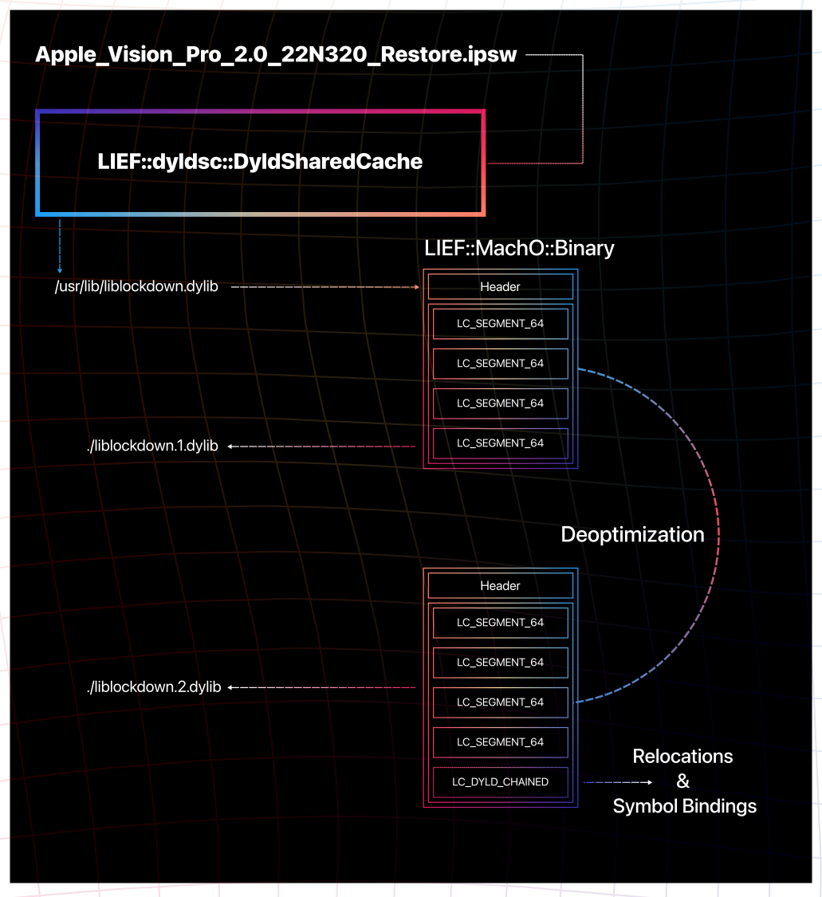

Using LIEF Python API it could be done with:

```python
def extract(cache: lief.dyldsc.DyldSharedCache) -> lief.MachO.Binary:
    dylib: lief.dyldsc.Dylib = cache.find("liblockdown.dylib")
    return dylib.get(
      fix_branches=True,
      fix_memory=True,
      fix_relocations=True,
      create_dyld_chained_fixup_cmd=True,
    )

extract(vision_os_cache).write("liblockdown.2.dylib")
```

You can observe the differences between the raw extracted `liblockdown.1.dylib`
and the de-optimized `liblockdown.2.dylib`:


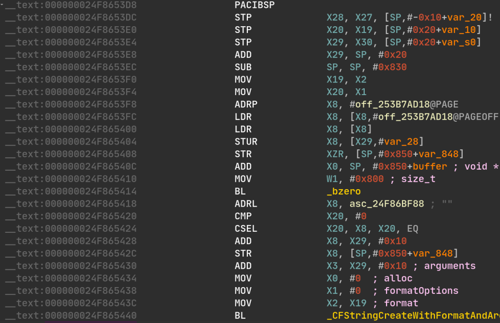


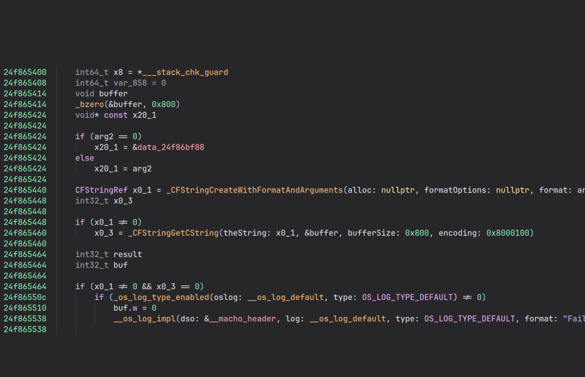


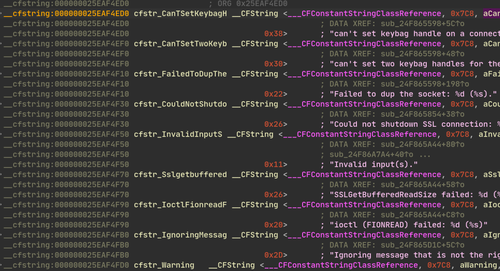


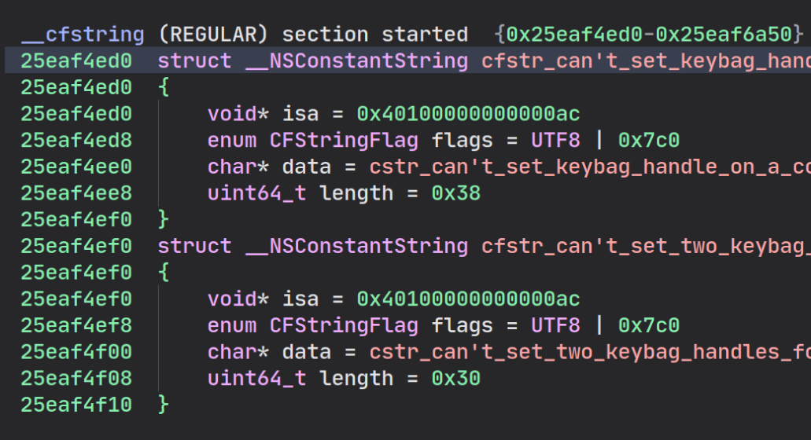


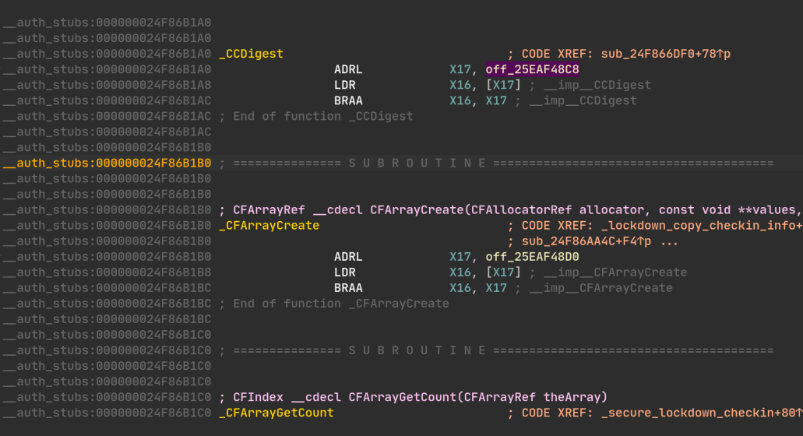


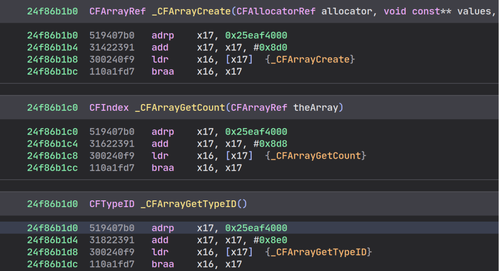

Now that we have a pretty well-structured `liblockdown.dylib` with all
the information needed for loading (relocations, bindings, ...) we can start considering
loading this `visionOS` library on macOS.

## Loading a VisionPro library on macOS

Back in the day I was working at Quarkslab, I had the chance to create with
[Adrien Guinet](https://github.com/aguinet) QBDL: QuarkslaB Dynamic Linker library.

The idea of this project is to have a cross-platform/cross-format library to load
executables (based on LIEF).

For the details, you can check:

- [SSTIC Presentation](https://www.sstic.org/2021/presentation/qbdl_quarkslab_dynamic_loader/)
- [Quarkslab's Blog](https://blog.quarkslab.com/introducing-qbdl-how-to-run-the-nvidia-ngx-sdk-under-linux.html)
- [Documentation](https://quarkslab.github.io/QBDL/0.1.0/)

From an executable format perspective only, the primary differences between Mach-O binaries
for visionOS and macOS (Silicon) lie in their
linked libraries and their imports.

We could fairly expect that `liblockdown.dylib` from the visionOS dyld shared cache
is linked with visionOS-specific libraries or importing specific symbols.

Nonetheless, Apple is an **ecosystem** and they try to minimize the cost for developers
to create an app or a framework that can target different platforms (visionOS/macOS/iOS/watchOS).

This comes with an API abstraction that we can leverage to lift executables from
one platform on another. In other words, we can likely expect that some libraries
used by `liblockdown.dylib` for visionOS are also available on macOS.

Let's check this with QBDL:

```cpp
#include <LIEF/LIEF.hpp>
#include <QBDL/QBDL.hpp>

using namespace QBDL;
using namespace LIEF::MachO;
using namespace LIEF;

struct FinalTargetSystem: public Engines::Native::TargetSystem {
  using Engines::Native::TargetSystem::TargetSystem;
  uint64_t symlink(Loaders::MachO& loader, const LIEF::MachO::Symbol& symbol) override {
  }
}

int main() {
  auto mem = std::make_unique<Engines::Native::TargetMemory>();
  auto system = std::make_unique<FinalTargetSystem>(*mem);
  auto loader = Loaders::MachO::from_file("./liblockdown.2.dylib"
    Engines::Native::arch(), *system, Loader::BIND::NOW
  );
  return 0;
}
```

In this code `symlink` is a kind of callback that is used by QBDL whenever a symbol
needs to be resolved. For instance, you could redirect `printf` with:

```cpp
int my_printf(const char *restrict format, ...) {
  printf("w000t");
  return 5;
}

uint64_t symlink(Loaders::MachO& loader, const LIEF::MachO::Symbol& symbol) override {
  if (symbol.name() == "printf") {
    return (uint64_t)&my_printf;
  }
  return 0;
}
```

With our `liblockdown.dylib` case, we can naively try to resolve symbols based
on the existing macOS libraries:

```cpp
uint64_t symlink(Loaders::MachO& loader, const LIEF::MachO::Symbol& symbol) override {
  const LIEF::MachO::DylibCommand* lib = symbol.library()
  void* hdl = dlopen(lib->name().c_str(), /*mode=*/RTLD_NOW);
  if (hdl == nullptr) {
    fprintf(stderr, "Can't find library %s on the current macOS system\n",
            lib->name().c_str());
    return 0;
  }
  void* addr = dlsym(hdl, symbol.name().c_str());
  if (addr == nullptr) {
    fprintf(stderr, "Can't find '%s' in %s\n",
            symbol.name().c_str(), lib->name().c_str());
    return 0;
  }
  return (uint64_t)addr;
}
```

When executing this code, we can observe that the library `liblockdown.dylib`
from visionOS is *binding* 395 symbols. From these
395 symbols, only **4 of them fail to be resolved** using macOS library:

```text
Can't find '__SSLCopyPeerCertificates' in /System/Library/Frameworks/Security.framework/Security
Can't find '__SSLDisposeContext' in /System/Library/Frameworks/Security.framework/Security
Can't find '__SSLNewContext' in /System/Library/Frameworks/Security.framework/Security
Can't find '__SSLSetEnableCertVerify' in /System/Library/Frameworks/Security.framework/Security
```

In other words, **98% of the functions** imported by `liblockdown.dylib` on the visionOS
are **natively available** on macOS 14.

The missing symbols could be mocked or emulated but for the sake of simplicity
we just skip them.

Now that we have a mean to resolve imported symbols pretty well, we can ask QBDL
to get a pointer to the function `_lockdown_connect`:

```cpp
struct FinalTargetSystem: public Engines::Native::TargetSystem {
  using Engines::Native::TargetSystem::TargetSystem;
  uint64_t symlink(Loaders::MachO& loader, const LIEF::MachO::Symbol& symbol) override {
    // Logic described previously
  }
}

int main() {
  auto mem = std::make_unique<Engines::Native::TargetMemory>();
  auto system = std::make_unique<FinalTargetSystem>(*mem);
  auto loader = Loaders::MachO::from_file("./liblockdown.2.dylib"
    Engines::Native::arch(), *system, Loader::BIND::NOW
  );

  uint64_t addr = loader->get_address("_lockdown_connect");
  LK_INFO("_lockdown_connect: 0x{:016x}", addr);
  return 0;
}
```


At this point we are in the situation where:

1. We extracted `/usr/lib/liblockdown.dylib` from a visionOS dyld shared cache
2. We removed shared cache optimizations and we re-created a `LC_DYLD_CHAINED_FIXUPS`
3. We loaded the library with QBDL and most of the imported symbols are resolved
4. We have a pointer to `_lockdown_connect` in macOS memory

Depending on the needs, we could start lldb to debug the function or feed the
function with fuzzing inputs.

Since I talked about [LIEF](https://lief.re) & [QBDL](https://github.com/quarkslab/QBDL),
I can't finish this blog post without mentioning [QBDI](https://qbdi.quarkslab.com/).

## Instrumenting `_lockdown_connect` with QBDI

First off, we have to instantiate and initialize a QBDI's VM[^vm] object:

```cpp
// [...]
auto loader = Loaders::MachO::from_file("./liblockdown.2.dylib"
  Engines::Native::arch(), *system, Loader::BIND::NOW
);

uint64_t lockdown_connect_addr = loader->get_address("_lockdown_connect");
LK_INFO("_lockdown_connect: 0x{:016x}", lockdown_connect_addr);

QBDI::VM dbi;
QBDI::GPRState* state = vm.getGPRState();

state->pc = lockdown_connect_addr;

uint64_t start = loader->base_address();
uint64_t end   = start + loader->get_binary().virtual_size();
vm.addInstrumentedRange(start, end);
```

I omitted stack registers initialization (`sp`, `x29`) but the previous code is essentially
setting the PC register and scoping the range of virtual addresses we want to instrument.

After this initialization, we can define what we want to do with the instrumented code. In this example,
we just trace the instructions:

```cpp
vm.addCodeCB(QBDI::InstPosition::PREINST,
    [] (QBDI::VM* vm, QBDI::GPRState* gpr, QBDI::FPRState*, void* data) {
      const QBDI::InstAnalysis* inst = vm->getInstAnalysis();
      LK_INFO("0x{:016x}: {}", inst->address, inst->disassembly);
      return QBDI::VMAction::CONTINUE;
    }, nullptr
);
```

Let's go?

```cpp
vm.run(lockdown_connect_addr, lr);
```

And here we go:

```cpp
_lockdown_connect: 0x00000001039ed024
0x00000001039ed024:     pacibsp
0x00000001039ed028:     sub sp, sp, #208
0x00000001039ed02c:     stp x22, x21, [sp, #160]
0x00000001039ed030:     stp x20, x19, [sp, #176]
0x00000001039ed034:     stp x29, x30, [sp, #192]
0x00000001039ed038:     add x29, sp, #192
0x00000001039ed03c:     adrp    x8, #70324224
0x00000001039ed040:     ldr x8, [x8, #3352]
0x00000001039ed044:     ldr x8, [x8]
0x00000001039ed048:     stur    x8, [x29, #-40]
0x00000001039ed04c:     mov w21, #1
0x00000001039ed050:     mov w0, #1
0x00000001039ed054:     mov w1, #1
0x00000001039ed058:     mov w2, #0
0x00000001039ed05c:     bl  #10372
0x00000001039ef8e0:     adrp    x17, #254316544
0x00000001039ef8e4:     add x17, x17, #3176
0x00000001039ef8e8:     ldr x16, [x17]
0x00000001039ef8ec:     braa    x16, x17
0x00000001039ed060:     cmn w0, #1
...
```

Given this instruction-level granularity, we could also intercept syscall instructions.

I won't advocate any longer about how powerful QBDI is, but for those who are interested in more detail
you can check these posts/publications:

- [Android Native Library Analysis with QBDI](/post/android-native-library-analysis-with-qbdi/)
- [Dynamic Binary Instrumentation Techniques to Address Native Code Obfuscation](/publication/20-bh-asia-dbi/)
- [r2-pay - part 1](/post/20-09-r2con-obfuscated-whitebox-part1/) & [r2-pay - part 2](/post/20-09-r2con-obfuscated-whitebox-part2/)

[^vm]: The term VM can be confusing but are still talking about dynamic binary
instrumentation like Intel PIN not emulation:)

## Closing Words

This blog post demonstrates that it is possible to extract a library from a
visionOS dyld shared cache that can be instrumented on a different platform.

While the same approach would also work for an iOS dyld shared cache, I thought
it would be more challenging to tackle a recent device that lacks the same
knowledge base as iOS.

Back in January 2024, dfsec also did a publication about
running an iOS binary on macOS: [Will macOS and iOS merge?](https://www.df-f.com/blog/macosandiosmerge)
Both approaches are complementary and I recommend reading their blog post.

For those who seek more details about QBDL/QBDI and a live demo of the instrumentation,
I recorded this video where I detail more aspects about QBDL loading and QBDI instrumentation:

[YouTube video](https://www.youtube.com/watch?v=5L05OE5mL2o)

Finally, the source code of the PoC is on GitHub at this address:
[ romainthomas/visionOS-liblockdown](https://github.com/romainthomas/visionOS-liblockdown)


The dyld shared cache support in LIEF is still in progress but you can join [ LIEF's Discord
channel](https://discord.com/invite/7hRFGWYedu) to be notified when this will be released.

Thank you for reading,

Romain

### References

- https://www.nowsecure.com/blog/2024/09/11/reversing-ios-system-libraries-using-radare2-a-deep-dive-into-dyld-cache-part-1/
- https://worthdoingbadly.com/dscextract/
