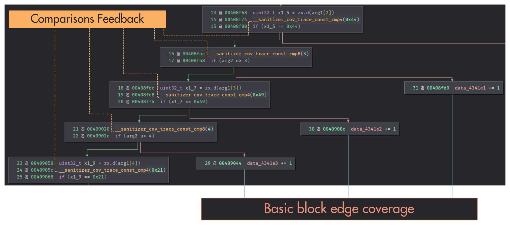
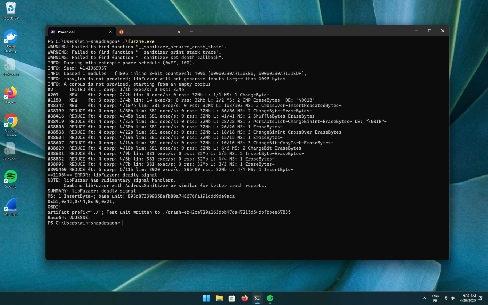
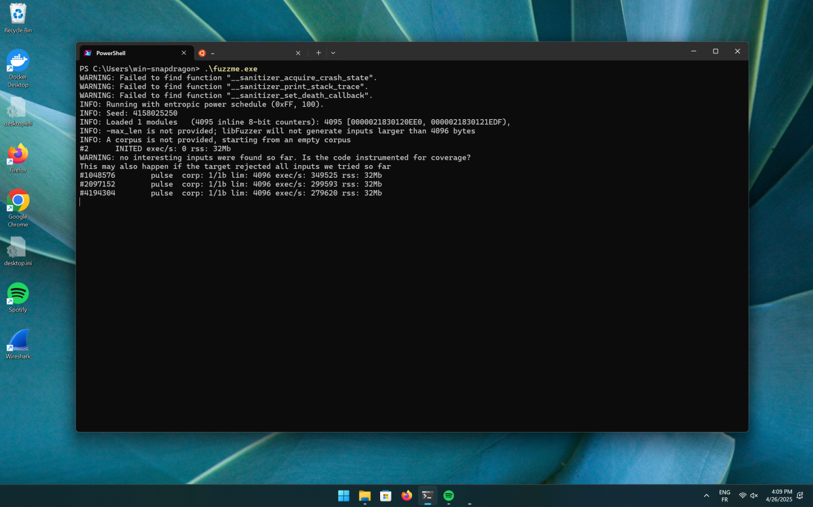
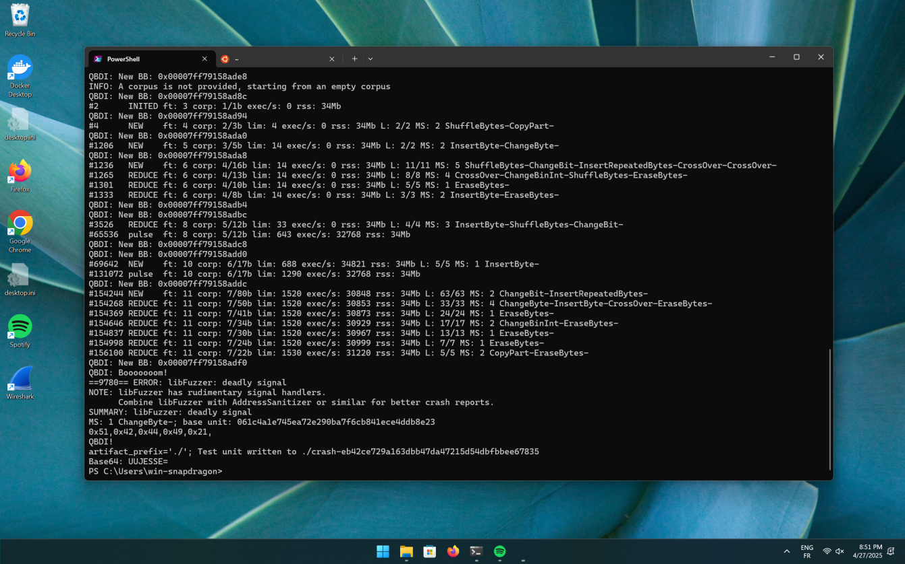

# Fuzzing Windows ARM64 closed-source binary 

> This blog post introduces coverage-guided fuzzing with QBDI and libFuzzer targeting Windows ARM64.

## Introduction

Coverage-guided fuzzing is a well-known technique that improves the efficiency
of a fuzzer by providing runtime feedback

This blog post explores this concept on Windows ARM64, using QBDI for code
instrumentation and LLVM's libFuzzer as the fuzzing engine.

In addition to the fact that QBDI is based on LLVM and
libFuzzer is under the LLVM umbrella, the support for Windows ARM64
(`arm64-pc-windows-msvc`) in LLVM is sufficient for cross-compiling executables
and libraries from Linux.

All the LLVM components mentioned in this blog post are based on LLVM 20.1.3
(2025-04-16)

## libFuzzer 101

First, let's consider that we have access to the source code of the function that
we want to fuzz:

```cpp
int fuzzme(const uint8_t *data, size_t size) {
  if (size > 0 && data[0] == 'Q') {
    if (size > 1 && data[1] == 'B') {
      if (size > 2 && data[2] == 'D') {
        if (size > 3 && data[3] == 'I') {
          if (size > 4 && data[4] == '!') {
            __builtin_trap();
          }
        }
      }
    }
  }
  return 0;
}

extern "C" int LLVMFuzzerTestOneInput(const uint8_t *data, size_t size) {
  return fuzzme(data, size);
}
```

As mentioned in the documentation of libFuzzer[^doc], we can run clang on this
source file to leverage built-in coverage instrumentation:

```bash
$ clang++ --target=arm64-pc-windows-msvc -fsanitize=fuzzer -c fuzzme.cpp -o fuzzme.obj
```

When compiling `fuzzme.cpp` with the `-fsanitize=fuzzer` flag, Clang instruments
the code at sensitive locations to enhance fuzzer efficiency.
In this context, these sensitive locations are:

- Comparisons (e.g. `data[3] == 'I'`)
- Basic block edges

You can find more about the LLVM code coverage instrumentation built-in on the
[SanitizerCoverage](https://clang.llvm.org/docs/SanitizerCoverage.html) page.

When we open `fuzzme.obj` in Binary Ninja, we get the following representation:



- `__sanitizer_cov_trace_const_cmp{4,8}` is injected before comparisons
- Edge coverage is done by incrementing a bitmap.

For more insight about how a bitmap is used by a fuzzer, I recommend this
presentation by P. - batcido - Hernault : [Fuzzing binaries using Dynamic Instrumentation](https://project.inria.fr/FranceJapanICST/files/2019/04/19-Kyoto-Fuzzing_Binaries_using_Dynamic_Instrumentation.pdf)


The hidden instrumentation produced by Clang with the `-fsanitize=fuzzer` flag
can also be achieved by manually modifying the source code:

```cpp {hl_lines=[25,26,28,29,31,32,34,35,37,38,"41-45"]}
extern "C" void __sanitizer_cov_trace_const_cmp8(uint64_t Arg1, uint64_t Arg2);
extern "C" void __sanitizer_cov_trace_const_cmp4(uint32_t Arg1, uint32_t Arg2);
extern "C" void __sanitizer_cov_8bit_counters_init(uint8_t *Start, uint8_t *Stop);

static std::array<uint8_t, 5> BITMAP = {};


// For the *NIX folks, this code is equivalent to
// __attribute__((constructor)) void ctor() {
//    __sanitizer_cov_8bit_counters_init(BITMAP.data(), BITMAP.data() + BITMAP.size())
// }
// but since __attribute__((constructor)) is not available and its equivalent is
// painfull to write, we allocate a static class whose constructor init the bitmap
class InitBitMap {
  public:
  InitBitMap() {
    BITMAP.fill(0);
    __sanitizer_cov_8bit_counters_init(BITMAP.data(), BITMAP.data() + BITMAP.size());
  }
};

static InitBitMap _;

int fuzzme(const uint8_t *data, size_t size) {
  __sanitizer_cov_trace_const_cmp8(size, 0);
  __sanitizer_cov_trace_const_cmp4(data[0], 'Q');
  if (size > 0 && data[0] == 'Q') {
    __sanitizer_cov_trace_const_cmp8(size, 1);
    __sanitizer_cov_trace_const_cmp4(data[1], 'B');
    if (size > 1 && data[1] == 'B') {
      __sanitizer_cov_trace_const_cmp8(size, 2);
      __sanitizer_cov_trace_const_cmp4(data[2], 'D');
      if (size > 2 && data[2] == 'D') {
        __sanitizer_cov_trace_const_cmp8(size, 3);
        __sanitizer_cov_trace_const_cmp4(data[3], 'I');
    if (size > 3 && data[3] == 'I') {
          __sanitizer_cov_trace_const_cmp8(size, 4);
          __sanitizer_cov_trace_const_cmp4(data[4], '!');
          if (size > 4 && data[4] == '!') {
            __builtin_trap();
          } else { ++BITMAP[4]; }
        } else { ++BITMAP[3]; }
      } else { ++BITMAP[2]; }
    } else { ++BITMAP[1]; }
  } else { ++BITMAP[0]; }
  return 0;
}
```

With this **manual** source-based instrumentation, we simply need to link the
compiled object file (`fuzzme.obj`) with the libFuzzer runtime
(`lib/clang/20/lib/arm64-pc-windows-msvc/clang_rt.fuzzer.lib`):

```bash
$ clang++ -fuse-ld=lld-link -fsanitize=fuzzer fuzzme.obj -o fuzzme.exe
```

Et voilà.

As depicted in the following screenshot, when running `fuzzme.exe` on
my Inspiron 14 Plus (Snapdragon X Elite), libFuzzer finds the relevant input (`QBDI!`)
in less than a second.

<div class="legacy-center">
<figure>

<br />
<figcaption>Fuzzing with source instrumentation feedback</figcaption>
</figure>
<br />
</div>

The key point here is that providing feedback to the fuzzer engine (libFuzzer)
enhances the chances of finding meaningful inputs.
While in this section, we assumed we had access to the function's original
source code, the next section assumes a black-box approach.

## DBI-based Fuzzing

Now let's consider that we don't have access to the source code of the function,
which means we cannot use the `-fsanitize=fuzzer` option at compile time or
manually modify the source code. This situation is similar to fuzzing a closed-source
function. However, in our case, the implementation, and the harness of `fuzzme`
is simple which is usually not the case with real-world targets.

Without any kind of feedback to libFuzzer, `fuzzme.exe` runs at ~300k execs/s
but it fails to find the input that triggers the `__builtin_trap` case before hours.

<div class="legacy-center">
<figure>

<br />
<figcaption>Fuzzing without feedback</figcaption>
</figure>
<br />
</div>

By using a DBI like Intel PIN, DynamoRIO, Frida, QBDI or emulating the code (QEMU/Unicorn),
we can gather information about the code being executed or emulated.
This information can then be used to provide feedback to libFuzzer.

While I'm sure the following example could work with QEMU, Frida or other DBI,
I will focus on demonstrating these concepts using [QBDI](https://github.com/QBDI/QBDI).

### QBDI Bootstrap

To instrument a function through QBDI, we first need to create and instantiate
`QBDI::VM`[^qbdi-note]:

```cpp
extern "C" int LLVMFuzzerTestOneInput(const uint8_t *data, size_t size) {
  QBDI::VM dbi;
  dbi.addInstrumentedModuleFromAddr((uintptr_t)&fuzzme);

  QBDI::GPRState* gpr = dbi.getGPRState();

  gpr->pc = reinterpret_cast<uintptr_t>(fuzzme);
  gpr->lr = 0xdeadc0de;

  gpr->x0 = reinterpret_cast<uintptr_t>(data);
  gpr->x1 = reinterpret_cast<uintptr_t>(size);

  dbi.run(gpr->pc, gpr->lr);

  return dbi.getGPRState()->x0;
}
```

This code is just bootstrapping the execution of `fuzzme()` through QBDI. In particular,
we initiate `x0` and `x1` to match the inputs of `LLVMFuzzerTestOneInput`.

### Basic Block Coverage

Once we have setup the execution through QBDI, we can define instrumentation callbacks
to provide feedback to libFuzzer. For instance, we can offer coverage feedback using
the QBDI event `BASIC_BLOCK_ENTRY`:

```cpp
static std::vector<uint8_t> BITMAP;

dbi.addVMEventCB(VMEvent::BASIC_BLOCK_ENTRY,
  [] (VM* vm, const VMState* state, GPRState* gpr, FPRState* fpr, void* ctx) {
    size_t bitmap_idx = to_index(state->basicBlockStart);
    BITMAP[bitmap_idx] += 1;
    return VMAction::CONTINUE;
  });
```

### Comparison Feedback

We can also use QBDI to provide feedback about the comparisons similarly to
`__sanitizer_cov_trace_const_cmp{4,8}`. At the assembly level, these comparisons
are represented as follows:

```text
14004ada8  08044039   ldrb    w8, [x0, #0x1]
14004adac  1f090171   cmp     w8, #0x42
14004adb0  c1010054   b.ne    0x14004ade8
```

In particular, the LLVM `MCInst` representation of `cmp w8, #0x42` is:

```text
<stdin>:1:1: note: parsed instruction: ['cmp', <register 216>, 66]
cmp w8, #0x42
^
        cmp     w8, #0x42   // encoding: [0x1f,0x09,0x01,0x71]
                            // <MCInst #7422 SUBSWri
                            //  <MCOperand Reg:12>
                            //  <MCOperand Reg:216>
                            //  <MCOperand Imm:66>
                            //  <MCOperand Imm:0>>
```

One of the most powerful features of QBDI compared to other DBIs is the ability
to specify the conditions under which we want an instrumentation callback.
This means that the overhead associated with the DBI's context switch and the
callback only occur when the specified condition is met. In our context,
we don't want to pay the overhead for every instruction.
Rather, we only want a "hook" for comparison operations. To achieve this, we can use
the [`addMnemonicCB`](https://github.com/QBDI/QBDI/blob/34bf7e47ec90d825a320a3dd3479c1d6494358af/include/QBDI/VM.h#L459-L473)
function or more efficiently, using the LLVM opcode:

```cpp
dbi->addOpcodeCB(llvm::AArch64::SUBSWri, InstPosition::PREINST,
  [] (VM* dbi, GPRState* gpr, FPRState*, void*) {
    // [...]
    return VMAction::CONTINUE;
  }, /*data=*/nullptr);
```

This callback is triggered before any `cmp w[0-29], #cst` instruction. Ideally,
we would like to call `__sanitizer_cov_trace_const_cmp4` with the values coming from
the DBI. Something like:

```cpp {hl_lines=[3]}
dbi->addOpcodeCB(llvm::AArch64::SUBSWri, InstPosition::PREINST,
  [] (VM* dbi, GPRState* gpr, FPRState*, void*) {
    __sanitizer_cov_trace_const_cmp4(inst.operands[0], inst.operands[1]);
    return VMAction::CONTINUE;
  }, /*data=*/nullptr);
```

This would work but `__sanitizer_cov_trace_const_cmp4` is computing PC with a macro
that we can't control. Therefore, one solution consists of replicating the implementation of
`__sanitizer_cov_trace_const_cmp4`:

```diff {hl_lines=[8]}
dbi->addOpcodeCB(llvm::AArch64::SUBSWri, InstPosition::PREINST,
  [] (VM* dbi, GPRState* gpr, FPRState*, void*) {
-   __sanitizer_cov_trace_const_cmp4(inst.operands[0], inst.operands[1]);
+   const llvm::MCInst* inst = dbi->getOriginalMCInst();
+   const size_t regw_idx = inst->getOperand(1).getReg() - llvm::AArch64::W0;
+   const uintptr_t cst = inst->getOperand(2).getImm();
+   const auto* gpr_ptr = reinterpret_cast<const uintptr_t*>(gpr);
+   fuzzer::TPC.HandleCmp<uint32_t>(gpr->pc, cst, gpr_ptr[regw_idx]);
    return VMAction::CONTINUE;
  }, /*data=*/nullptr);
```

Et voilà. We now provide comparison feedback to libFuzzer.
As you can see in this screenshot, libFuzzer can efficiently identify the `QBDI!` input
in less than 10 seconds.

<div class="legacy-center">
<figure>

<br />
<figcaption>Fuzzing with QBDI feedback</figcaption>
</figure>
<br />
</div>

## The Hidden Bits

The attentive reader may have noticed significant simplifications regarding some
technical aspects discussed in this blog post. For example, in the section on
[Basic Block Coverage](#basic-block-coverage) I reference a function `to_index`
which is intended to convert a basic block's start address into a bitmap index:

```cpp {hl_lines=[3]}
dbi.addVMEventCB(VMEvent::BASIC_BLOCK_ENTRY,
  [] (VM* vm, const VMState* state, GPRState* gpr, FPRState* fpr, void* ctx) {
    size_t bitmap_idx = to_index(state->basicBlockStart);
    BITMAP[bitmap_idx] += 1;
    return VMAction::CONTINUE;
  });
```

Theoretically, this code could work if we establish a unique mapping between the
address of the basic block and the bitmap index (essentially, a bijection).
This approach also operates under the assumption that we have a
bitmap of unlimited size, as we cannot predict in advance how many basic blocks
will be reached by the DBI.
In practice, fulfilling these two conditions is quite challenging.
This topic is also examined in [Google's Atheris blog post](https://security.googleblog.com/2020/12/how-atheris-python-fuzzer-works.html)[^atheris]
which has been a source of inspiration for this blog post.
You can review the actual implementation I used in the GitHub repository associated
with this blog post: [ romainthomas/windows-arm64-qbdi-fuzzing](https://github.com/romainthomas/windows-arm64-qbdi-fuzzing)

When it comes to QBDI, I simplified the process by stating that we only need to
instantiate a `QBDI::VM` object:

```cpp
extern "C" int LLVMFuzzerTestOneInput(const uint8_t *data, size_t size) {
  QBDI::VM dbi;
  dbi.addInstrumentedModuleFromAddr((uintptr_t)&fuzzme);
  [...]
}
```

This approach works well, but it doesn't use a key optimization feature of QBDI:
instrumented basic block caching. Essentially, QBDI caches instrumented basic
blocks so that when we re-execute a known basic block, we don't need to patch
and instrument it again.

To take advantage of this optimization, we can store the `QBDI::VM` object in a
static variable and initialize it just once. This allows us to leverage the
caching mechanism effectively:

```cpp
std::unique_ptr<QBDI::VM> get_dbi() {
  auto dbi = std::make_unique<QBDI::VM>();
  dbi->addInstrumentedModuleFromAddr((uintptr_t)&fuzzme);
  [...]
  return dbi;
}
extern "C" int LLVMFuzzerTestOneInput(const uint8_t *data, size_t size) {
  static std::unique_ptr<QBDI::VM> DBI = get_dbi();
  [...]
}
```

## Final Words

This blog post brings nothing new in terms of fuzzing techniques,
but it demonstrates that:

1. QBDI is able to run and instrument Windows ARM64 code
2. LLVM libFuzzer works effectively on Windows ARM64.
3. QBDI and libFuzzer can work together to fuzz binaries without built-in
   coverage instrumentation (i.e. closed source)
4. LLVM excels in different areas from compilation[^ccompile],
   DBI (QBDI), reverse-engineering, and fuzzing :heart:

The source code and the binaries used in this blog post are available on GitHub at this address:
[ romainthomas/windows-arm64-qbdi-fuzzing](https://github.com/romainthomas/windows-arm64-qbdi-fuzzing)

Happy Fuzzing

[^doc]: https://llvm.org/docs/LibFuzzer.html
[^qbdi-note]: Don't be confused by the name `VM`, we are talking about dynamic
              instrumentation, not emulation.
[^atheris]: https://security.googleblog.com/2020/12/how-atheris-python-fuzzer-works.html
[^ccompile]: **All** the compilation and link steps in this blog post are cross-compiled from Linux for Windows ARM64.
            This includes the (cross)compilation of QBDI and LLVM for Windows ARM64.
