# A Glimpse Into DexProtector

> This blog post provides a high-level overview of DexProtector's security features and their limitations

## Introduction

[DexProtector](https://licelus.com/products/dexprotector) is a comprehensive security solution
providing a complete set of features to protect mobile apps (Android/iOS) against
different threats including reverse engineering and malware.

Its core capabilities include:

- Obfuscation, Encryption, and Virtualization
- RASP (Runtime Application Self-Protection)
- Anti-Tampering and Integrity Control

This protector renewed my interest when I noticed that
[Revolut][com.revolut.revolut] is using this solution to protect their apps.
Interestingly, I also found that the solution was used by [Live Net TV](./img/livenet.png),
a dubious IPTV application.

This post synthesizes my findings from a deep dive into DexProtector.

You can download the original LiveNet APK for reference here: [com.playnet.androidtv.ads.5.0.1.apk](./assets/com.playnet.androidtv.ads.5.0.1.apk)[^checksum]

## Bootstrap

DexProtector uses a complex loading chain designed to hinder static/dynamic analysis
and memory dumping.

It all starts with a custom class named `Protected<suffix>` which is injected in the main package
of the application and referenced in the `AndroidManifest.xml`:

```xml
<?xml version="1.0" encoding="utf-8"?>
<manifest xmlns:android="http://schemas.android.com/apk/res/android"
    android:versionCode="56"
    android:versionName="5.0.1"
    package="com.playnet.androidtv.ads">
  <application
    android:name="com.playnet.androidtv.ProtectedLiveNetTV">
  </application>
</manifest>
```

This class is involved in various stages of DexProtector but first, it is used
to load a native library: `libdpboot.so`:

```java
package com.playnet.androidtv;

public class ProtectedLiveNetTV extends Application {
  @Override
  protected void attachBaseContext(Context context) {
      super.attachBaseContext(context);
      try {
          DeFcpynjg(); // Basic integrity check
          System.loadLibrary("dpboot");
          oagfhBoAe(); // Load libdexprotector.so (or libdexprotector_h.so)
      } catch (Throwable th) {
          ProtectedLiveNetTV$R$id.EfxsfkH(this, th);
      }
  }
}
```

`libdpboot.so` serves multiple purposes, one of which is loading `libdexprotector.so`.
`libdexprotector.so` is loaded by a Java native function (named `oagfhBoAe` in the previous example)
that uses the JNI to call `System.loadLibrary("dexprotector")`.

`libdexprotector.so` is a custom ELF loader[^liblinker] that is responsible for
decrypting and mapping the final protected payload into memory.

This protected payload is embedded within the library itself:

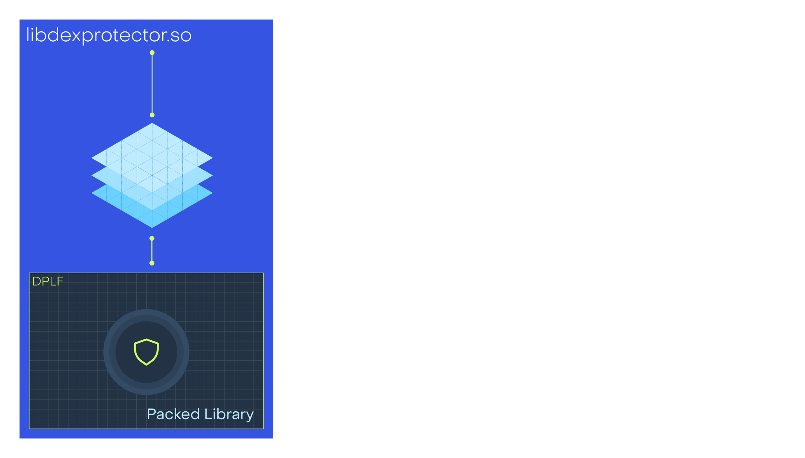

In some versions of DexProtector, the beginning of the packed library
can be identified by looking for the magic bytes: `DPLF`:

```hexdump
0000fac0  44 50 4c 46 c0 b1 f2 ea e1 c6 0d 5b 45 6e fd e5  DPLF.......[En..
0000fad0  86 f2 2e c5 46 82 66 44 e7 68 b4 e1 5b 87 36 9e  ....F.fD.h..[.6.
0000fae0  09 54 ef b4 17 94 94 71 46 88 8d 47 c4 ee ba a7  .T.....qF..G....
0000faf0  e7 aa da c0 55 32 4b b3 8c 1f 09 db fc a6 04 fd  ....U2K.........
0000fb00  0e 22 04 8c d6 11 05 18 fb 93 3b 27 32 ca 97 e6  ."........;'2...
0000fb10  b2 9b 7b 87 ed 35 64 32 aa 8b 0e ee ca 1c 02 7b  ..{..5d2.......{
0000fb20  56 e9 8f c7 1e dd e1 58 4d 9b d9 ca cd 5f 38 f1  V......XM...._8.
```

In other versions, the payload is located in the last `PT_LOAD` segment:

```bash
-> revolut-10-109 git:(main) ✗ readelf -lW ./libdexprotector.so

Elf file type is DYN (Shared object file)
Entry point 0x0
There are 8 program headers, starting at offset 64

Program Headers:
  Type           Offset   VirtAddr           PhysAddr           FileSiz  MemSiz   Flg Align
  PHDR           0x000040 0x0000000000000040 0x0000000000000040 0x0001c0 0x0001c0 R   0x8
  LOAD           0x000000 0x0000000000000000 0x0000000000000000 0x0026bc 0x0026bc R E 0x4000
  LOAD           0x0026c0 0x00000000000066c0 0x00000000000066c0 0x0000f8 0x0000f8 RW  0x4000
  LOAD           0x0027b8 0x000000000000a7b8 0x000000000000a7b8 0x000a70 0x000a80 RW  0x4000
  DYNAMIC        0x0026c8 0x00000000000066c8 0x00000000000066c8 0x0000f0 0x0000f0 RW  0x8
  GNU_RELRO      0x0026c0 0x00000000000066c0 0x00000000000066c0 0x0000f8 0x001940 R   0x1
  GNU_STACK      0x000000 0x0000000000000000 0x0000000000000000 0x000000 0x000000 RW  0x0
  LOAD           0x003630 0x000000000000f630 0x000000000000f630 0x057535 0x057535 RW  0x4000
   ^
   |
   +------------ Packed library
```

The most clever aspect of `libdexprotector.so` is how it derives the 32-byte key that
is used to decrypt the payload.

It uses a static salt located in its library but it also uses the
**runtime state** of the system linker.

The key is partially derived from the assembly code of the linker function
`rtld_db_dlactivity()`.

By default, `rtld_db_dlactivity()` is an empty function (i.e. a `ret`).
However, when `frida-server` is used, it hooks this function by injecting a "trampoline"
It is worth mentioning that this trampoline is persistent even
if `frida-server` is no longer running. This means that if `frida-server` runs
at least **once**, the key will be corrupted by the **persistent** trampoline.

Consequently, the second stage won't be executed

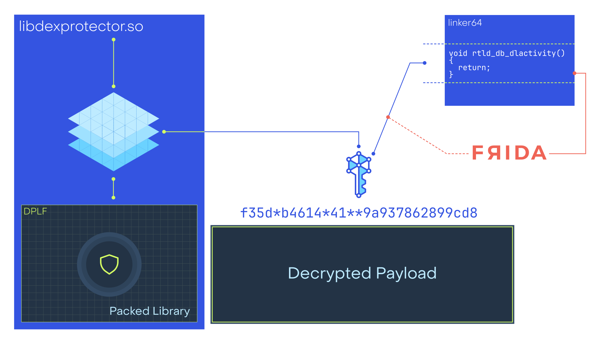

Given the correct computed key, `libdexprotector.so` decrypts the beginning of
the payload, which starts with a header followed by ELF-like segments describing
the content to be mapped into memory.

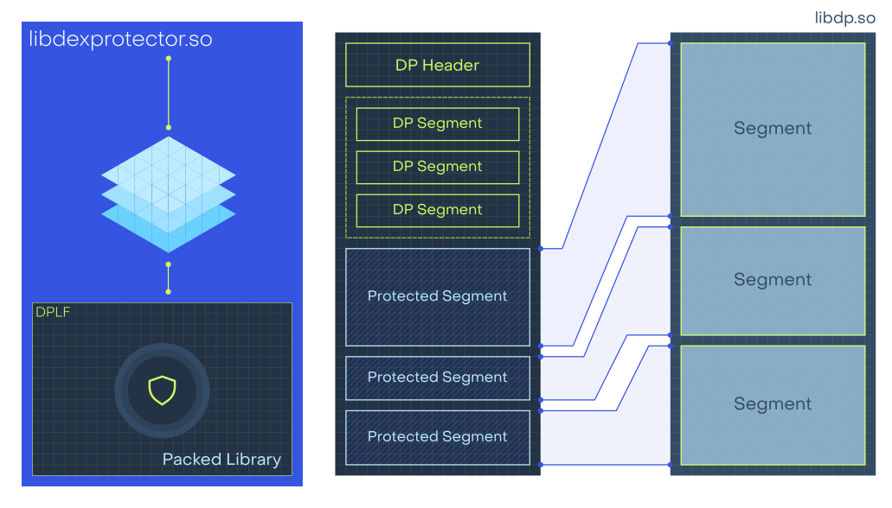

The unpacked library was originally named `libdp.so`. It is worth mentioning
that neither the packed nor the unpacked library contains the original ELF header.

Instead, `libdexprotector.so` acts as a custom ELF loader that relies on
its own custom header rather than using the official `Elf64_Ehdr` structure.
Similarly, the segments table uses a custom structure to represent the segments
that need to be mapped in memory.

When `libdexprotector.so` has finished mapping the protected-packed library,
it jumps to the function referenced in the `DT_FINI_ARRAY` entry of the protected
library.


> **Note**
During the loading phase, `libdexprotector.so` clears the different regions
referenced in the dynamic table. For instance, the relocations table referenced
in the `DT_ANDROID_RELA` entry is cleared with zeros once `libdexprotector.so`
has processed the relocations.

This means that if attackers try to dump the protected library after it has fully loaded,
they will miss critical information from the dynamic table.


## `libdp.so`

The protected library loaded through `libdexprotector.so` is a key component
to understand most of the DexProtector's security features.

It contains the RASP detections, the engine to load encrypted classes, the
logic to load protected `assets/` etc. It's a masterpiece of engineering and different detections
are very juicy.

From a cryptography perspective, it uses various algorithms and everything is implemented
following standards and good practices. In addition, DexProtector
uses a highly context-sensitive approach to generate and derive key material.

## Key Derivation

One of the purposes of `libdp.so` is to generate a 32-byte master key.
This key is critical, as it is used to derive the subkeys necessary for various
security features, such as asset decryption.

To ensure integrity, the master key is generated using specific elements that
create a strong cryptographic binding to the host application.

These elements typically include:

- The APK signature
- Unprotected DEX files
- The DexProtector configuration (embedded within `libdp.so`)

Because of this binding, even minimal static or dynamic modifications to the APK
will result in a corrupted master key, preventing the application from executing correctly.

The key derivation process also uses the content of `libdp.so` to derive
or corrupt the key. This acts as an anti-tampering measure:
if an attacker attempts to hook or instrument functions within `libdp.so`,
the resulting key will be invalid.

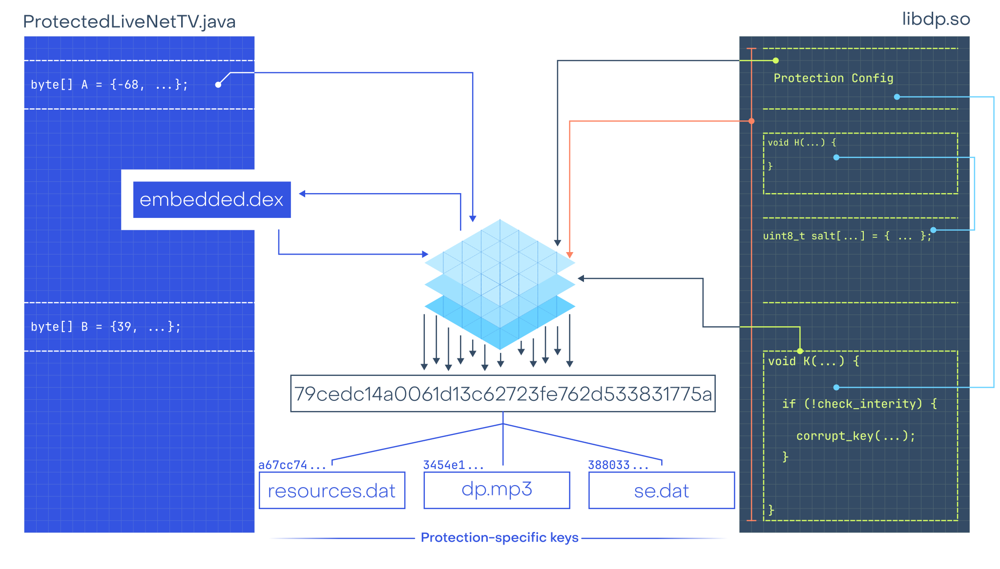

In theory, this design is robust. However, while it was challenging,
I managed to develop a workaround to instrument and hook `libdp.so` without
triggering these corruption mechanisms.

Ultimately, I was able to generate the valid master key without executing the protected applications
(e.g., Revolut, Kaspersky). With this master key, it is straightforward to
derive the subkeys required to decrypt assets and access DexProtector's proprietary files, such as:

- `se.dat`
- `resources.dat`
- `mm.dat`
- `dp.mp3`
- `classes.dex.dat`
- `ic.dat`
- `ct.dat`
- `rcdb.dat`

## Class Encryption

One of the major features provided by DexProtector is the ability to encrypt classes.

As detailed in the official documentation[^dexpro-config], this is configured by defining the
target classes or packages within the `<classEncryption>` tag:

```xml
<classEncryption>
    <filters>
        <filter>glob:com/mypackage/**</filter>
    </filters>
</classEncryption>
```

Internally, DexProtector protects all `classes<N>.dex` files that match the
classes or packages defined in the configuration.
For instance, protecting the packages `com/mypackage` and `com/iptv` may require
DexProtector to protect the entire `classes.dex` and `classes2.dex`.

The protected DEX files are bundled into a single file located in `assets/classes.dex.dat`.
This file contains the encrypted and compressed DEX data, along with a header
located at the end of the file.
At runtime, the protection works by decrypting and decompressing the given DEX
files and then using internal Android APIs to dynamically load the clear DEX files from memory.

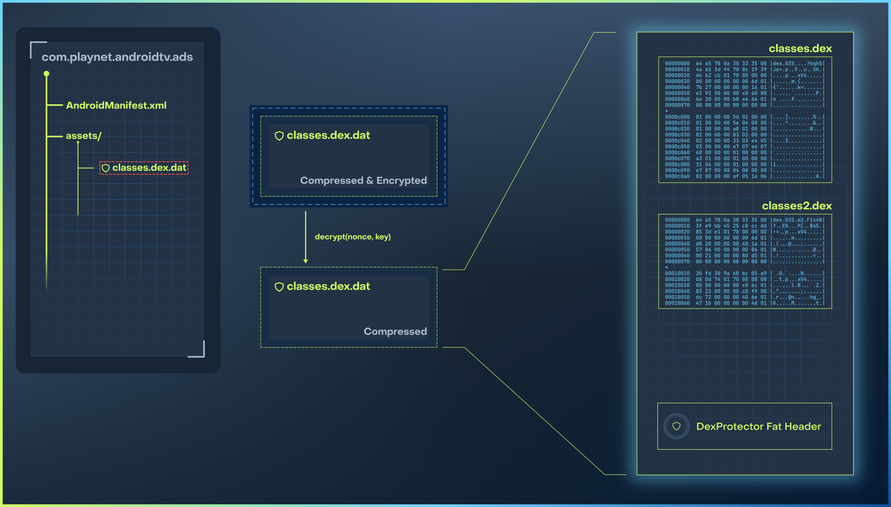

Note that DexProtector implements an anti-dump mechanism to prevent an attacker
from extracting the clear DEX file from memory.
This mechanism works by unmapping[^munmap-area] unused regions of the in-memory DEX files.

For instance, consider that the plain `classes.dex` is mapped in the
memory region `[0x60000, 0x70000]` and that DexProtector unmaps the unused region `[0x64000, 0x68000]`.
If an attacker tries to dump the whole range `[0x60000, 0x70000]`, it will trigger
a `SEGV_MAPERR` because the region `[0x64000, 0x68000]` is unmapped.

Nevertheless, this protection can be defeated to access the "unprotected" DEX files:

**`com.playnet.androidtv.ads - assets/classes.dex.dat`**

- [classes0.decrypted.dex](./assets/classes0.decrypted.dex)
- [classes1.decrypted.dex](./assets/classes1.decrypted.dex)
- [classes2.decrypted.dex](./assets/classes2.decrypted.dex)
- [classes3.decrypted.dex](./assets/classes3.decrypted.dex)

When we open these unprotected DEX files, we notice that some classes exhibit
obfuscated code:

```java
package com.playnet.androidtv;

import android.content.BroadcastReceiver;
import android.content.Context;
import android.content.Intent;


public class BootReceiver extends BroadcastReceiver {
    @Override // android.content.BroadcastReceiver
    public void onReceive(Context context, Intent intent) {
        Object objI;
        try {
            Object objI2 = LibLiveNetTV.i(1263, intent);
            if (objI2 == null ||
                !LibLiveNetTV.i(0, objI2, ProtectedLiveNetTV.s("\u5a7d")) ||
                !LibLiveNetTV.i(440, LibLiveNetTV.i(666, context),
                    LibLiveNetTV.i(3238, context, 2131951803), false) ||
                (objI = LibLiveNetTV.i(567, LibLiveNetTV.i(2489, context),
                                       LibLiveNetTV.i(1465, context))) == null)
            {
                return;
            }
            LibLiveNetTV.i(904, objI, 268435456);
            LibLiveNetTV.i(1054, context, objI);
        } catch (Exception e) {
            LibLiveNetTV.i(69, e);
        }
    }
}
```

This output demonstrates the presence of two additional security layers:
string encryption and indirect method/field access (invocation hiding).

## String Encryption

As described in the official documentation[^dexpro-config], developers can protect
sensitive strings by applying the `<stringEncryption>` tag in their configuration:

```xml
<stringEncryption>
    <filters>
        <filter>glob:!**/**</filter>
        <filter>glob:com/test/**</filter>
    </filters>
</stringEncryption>
```

From an implementation perspective, this protection works by replacing sensitive
strings with calls to a native function.
This function accepts an encoded index (passed as a string) to retrieve the original string.

Consider the following example:

```java
public class BootReceiver extends BroadcastReceiver {
    @Override // android.content.BroadcastReceiver
    public void onReceive(Context context, Intent intent) {
        // ...
        String clear = ProtectedLiveNetTV.s("\u5a7d");
        // ...
    }
}
```

In this example, the native function is `ProtectedLiveNetTV.s`, and the index is
`0x5a7d` (represented by the character `\u5a7d`).


The native function `ProtectedLiveNetTV.s(String enc)` is implemented within
the library `libdp.so` and the decryption process operates as follows:

- **Lookup**: The function uses the external `assets/se.dat` file to convert
               the input index (`0x5a7d`) into a file offset.

- **Retrieval**: This offset points to the specific location of `se.dat`.
- **Decryption**: `ProtectedLiveNetTV.s` decrypts the data found at that offset
    and returns the plain-text string using a standard cryptography algorithm and a custom one.

The algorithm used to decrypt the strings relies on a specific key and a nonce
constructed using a combination of:

1. The string index (e.g., `0x5a7d`).
2. The hash code of the calling class (e.g., `com.playnet.androidtv.BootReceiver`).

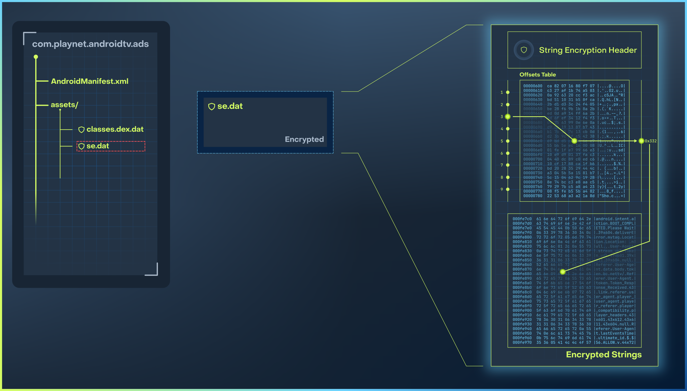

<br />

After that, we get the clear string `android.intent.action.BOOT_COMPLETED`.

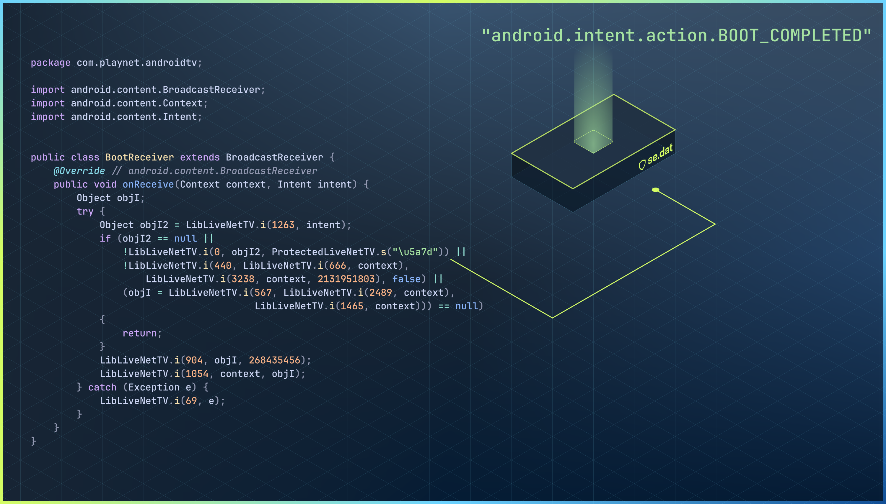

<br />

> **Note**

DexProtector adds an additional layer of security by binding the decryption
logic to the memory address of the native function itself.

The internal crypto context used for decryption is masked using the address of
`ProtectedLiveNetTV.s`. This acts as an integrity check: if an attacker attempts
replace the function during `env->RegisterNative`, the memory address will not match.
Consequently, the unmasking process will fail, the crypto context will be corrupted,
and the string will not decrypt correctly.


## Method & Field Access Protection

The second layer of protection focuses on obfuscating method calls and field access.
This process involves transforming these operations into native invocations.

```diff
- context.getPackageName()
+ LibLiveNetTV.i(1465, context)
```

Similar to string encryption, developers can use the `<hideAccess>` tag to apply
this protection to specific packages and classes defined in the filters:

```xml
<hideAccess>
    <filters>
        <filter>glob:!**/**</filter>
        <filter>glob:com/test/**</filter>
    </filters>
</hideAccess>
```

When an instruction requires protection, DexProtector replaces it with a call
to a native bridge function (e.g., `LibLiveNetTV.i(...)`). This function accepts
an index as the first parameter, followed by any arguments required by the
original method or field.

This index is used to resolve the targeted method or field thanks to the asset file
`assets/dp.mp3`. This file is decrypted and decompressed during the DexProtector's
initialization routine and it contains the information to make the relationship between
indexes and the hidden methods or fields.

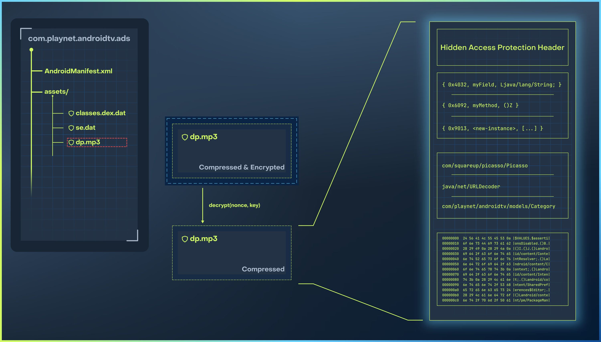

<br />

The layout of the data file is divided into four distinct sections:

**Header**

Contains integrity hashes and the number of elements in the subsequent sections.

**Elements Array**

An array of structures describing the hidden methods and fields. Each element
contains references to:

- The name (e.g., `getPackageName`)
- The signature (e.g., `()Ljava/lang/String;`)
- The defining class (e.g., `android/content/Context`)

**Classes Array**

An array listing the class names that own the elements in the previous section.
Note that this is not an array of strings, but an array of integers serving as
references into the Strings Pool.

**Strings Pool**

A collection of all string literals referenced by the previous sections.

Using the previous example, `LibLiveNetTV.i(1465, context)`:

1. The native function `LibLiveNetTV.i` whose implementation is located in `libdp.so` takes the index `1465`.
2. This number is used as an index into the *Elements Array* of `dp.mp3`
3. It resolves the mapping to: `android/content/Context.getPackageName() - ()Ljava/lang/String;`

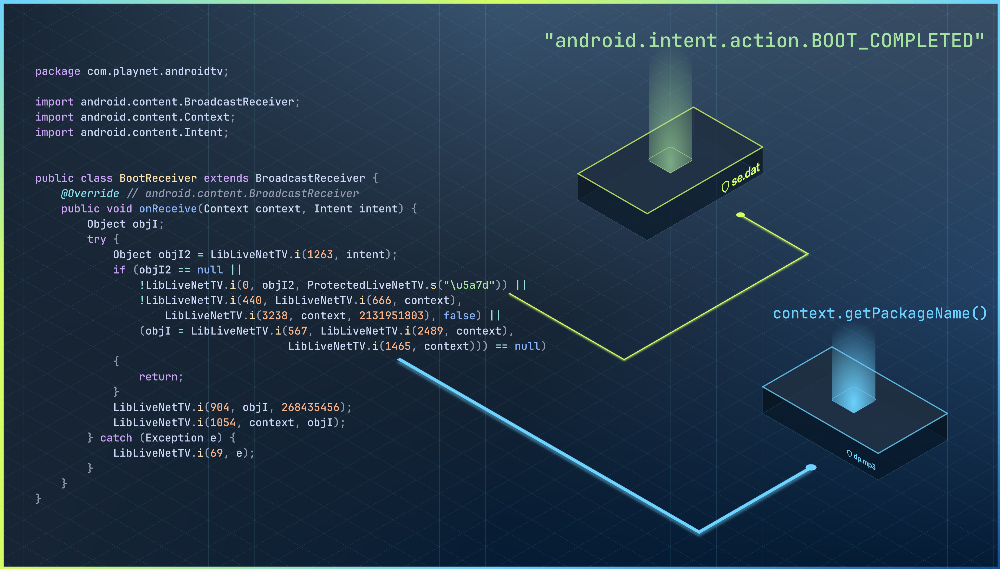

<br />

Then, it executes the function via the JNI:

```cpp
jclass clazz = env->FindClass("android/content/Context");
jmethodID mid = env->GetMethodID(clazz, "getPackageName", "()Ljava/lang/String;");
return env->CallObjectMethod(context, mid);
```

## Recovery

Based on our understanding of the string encryption and hidden access mechanisms,
we can now strip the protections from the different DEX files using [Redex](https://github.com/facebook/redex).

Redex is a DEX bytecode optimizer that provides a reliable framework for
reading, writing, and analyzing `.dex` files. It also offers facilities
to orchestrate and configure passes and perform both type inference and abstract
interpretation. These features make it the ideal tool to strip these protections.

To achieve this, we create two custom passes, one targeting each protection mechanism:

```json {hl_lines=[4,5]}
{
  "redex" : {
    "passes" : [
      "StringEncryption",
      "RecoverHiddenAccess",

      "PeepholePass",
      "ConstantPropagationPass",
      "ResultPropagationPass",

      "RegAllocPass",
      "CopyPropagationPass",
      "LocalDcePass",

      "ReduceGotosPass"
     ]
  },
  "RecoverHiddenAccess": {
    "info": "/home/romain/research/dexprotector/livenet/dp.mp3"
  },
  "StringEncryption": {
    "se_dat_file": "/home/romain/research/dexprotector/livenet/se.dat.clear"
  },
}
```

These passes work by identifying calls to the obfuscation wrappers,
specifically `ProtectedLiveNetTV.s()` or `LibLiveNetTV.i()`.
The system then replaces these calls with the recovered data:

1. Strings are restored using the `se.dat` file.
2. Methods/Fields are restored using the `dp.mp3` file.

The output is an unprotected DEX file.

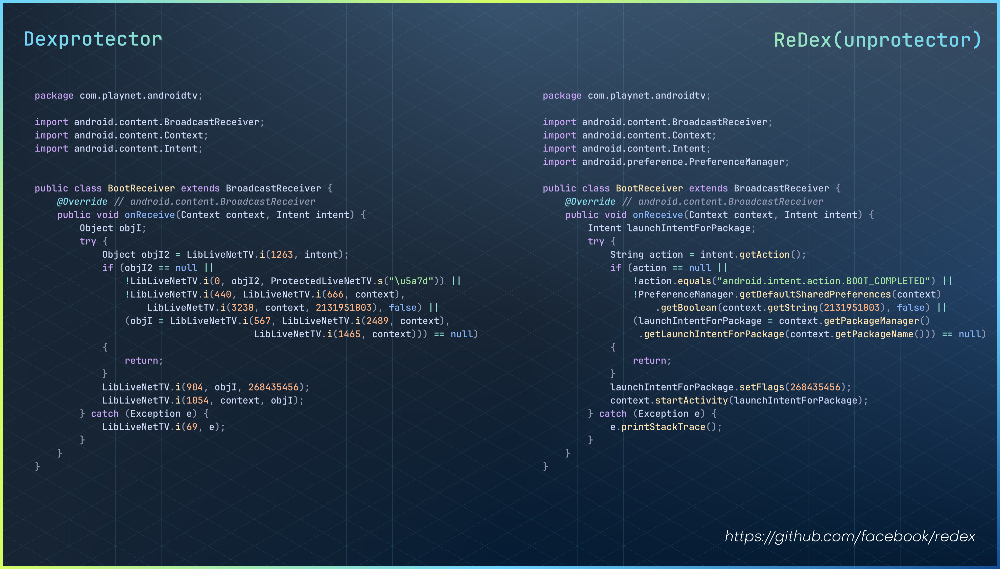

<br />

To verify the effectiveness of the Redex approach, you can compare the files below:

- **Before Redex:** [classes2.decrypted.dex](./assets/classes2.decrypted.dex)
- **After Redex:** [classes2.unprotected.dex](./assets/classes2.unprotected.dex)

This Redex-based deobfuscation approach has been successfully tested on other applications
secured by DexProtector (examples below).

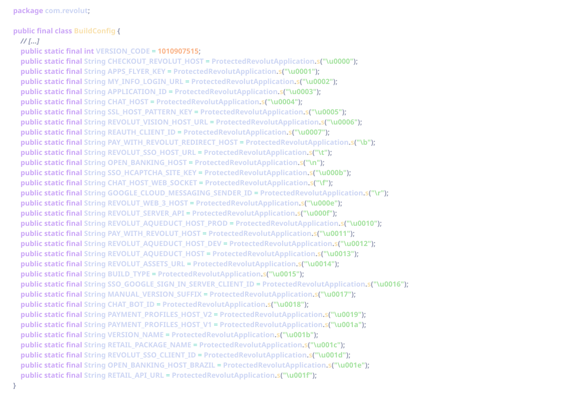

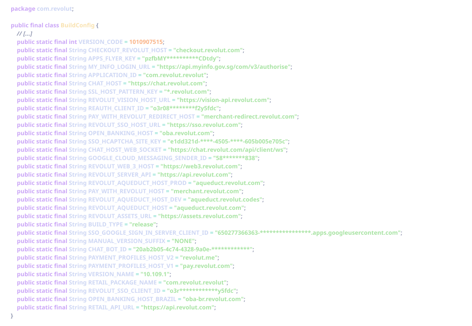

<br />
<br />

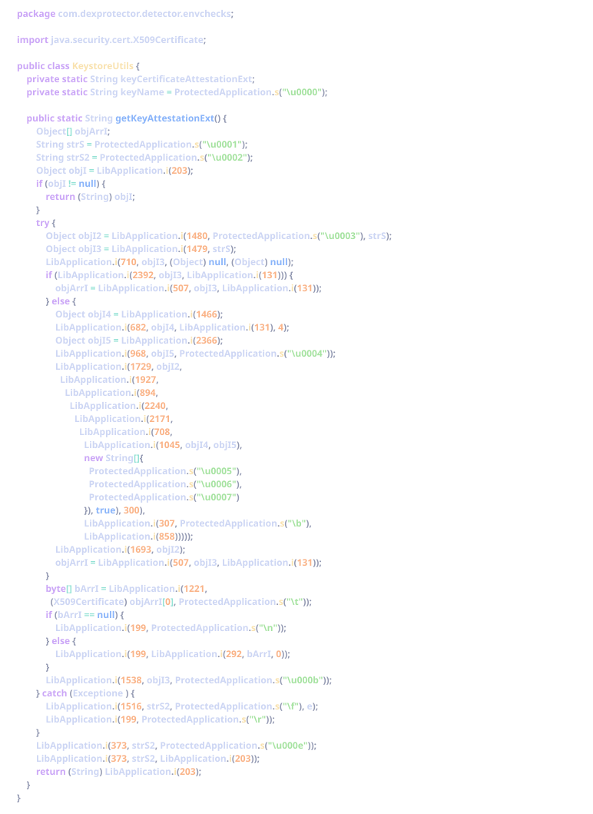

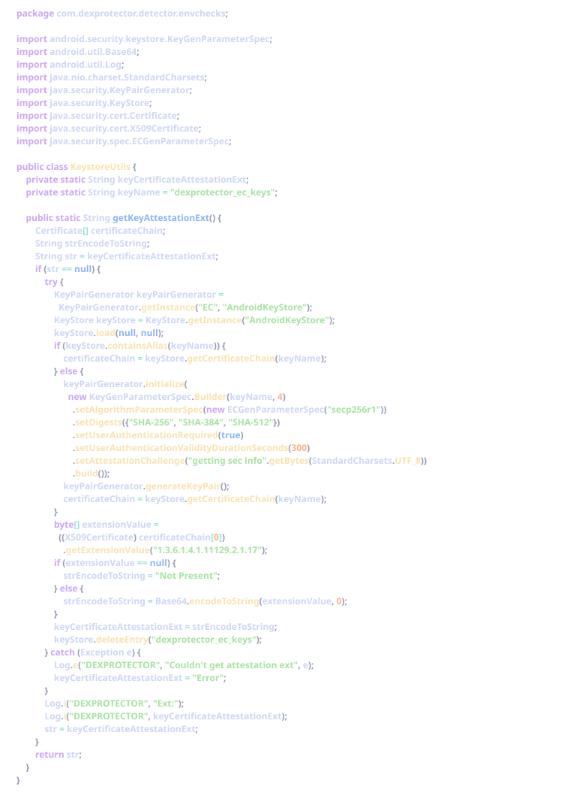

<br />
<br />

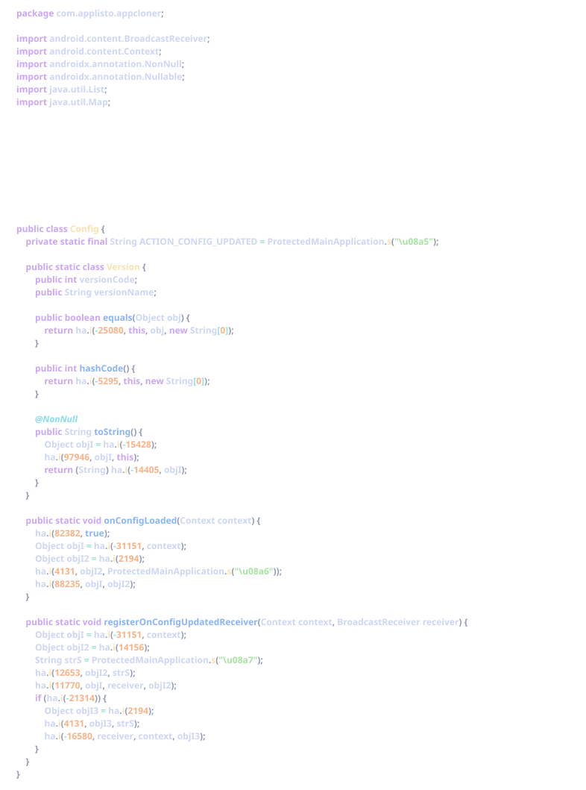

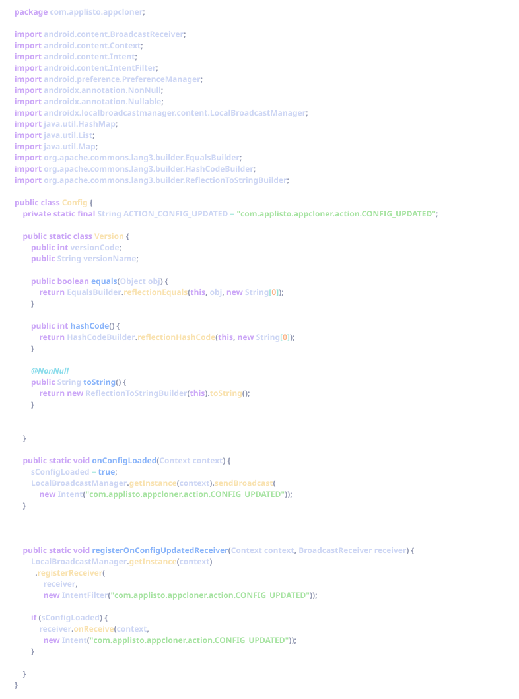

<br />
<br />

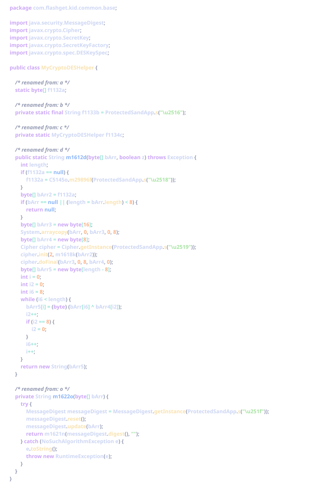

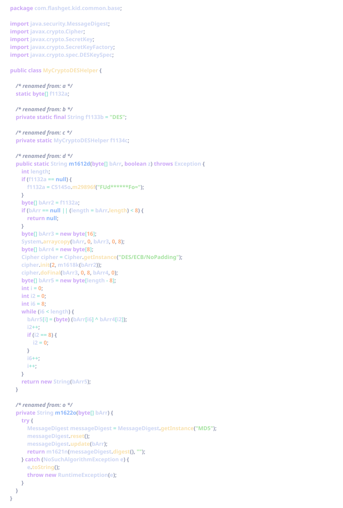

> **Note**
It is worth mentioning that this app, which has been downloaded over 10 million times,
uses weak `DES/ECB-MD5` cipher suite along with clear and **explicit** `http://` communications. (c.f., `network-security-config.xml`)


## Assets Protections

Sensitive application data is often stored within files attached to the APK/XAPK.
These assets can include certificates, images, Machine Learning models, or
serialized keystores. DexProtector provides a means to protect these embedded resources.

According to the documentation[^dexpro-config], asset protection can be configured
using the following structure:


```xml
<resourceEncryption>
    <assets>
        <filters>
            <filter>glob:cert/**</filter>
        </filters>
    </assets>
    <res>
        <filters>
            <filter>glob:raw/**</filter>
        </filters>
    </res>
    <root>
        <filters>
            <filter>glob:fonts/**</filter>
        </filters>
    <strings>
        <filters>
            <filter>my_api_key</filter>
            <filter>glob:mobile_token*</filter>
            <filter>glob:payments_**</filter>
            <filter>glob:sensitive_strings_arrays_etc*</filter>
        </filters>
    </strings>
</resourceEncryption>
```

To demonstrate this protection, I will analyze the application [com.dexprotector.detector.envchecks](https://play.google.com/store/apps/details?id=com.dexprotector.detector.envchecks).
The `.xapk` can be downloaded here: [`com.dexprotector.detector.envchecks.2.1.xapk`](assets/com.dexprotector.detector.envchecks.2.1.xapk).

> **Note**
The assets protected by LiveNet (`zpoasosdi.dat, regtbeonuev.dat, and btylusqrepu.dat`)
are serialized BouncyCastle keystores used to authenticate the application on the
IPTV backend. Due to the sensitive nature of this identification,
I took a different application to illustrate how this protection mechanism works.


This application contains a file named `assets/chinook.db`.
While the extension suggests it is a database, the file is protected and the hexdump
reveals high entropy data rather than a standard file header.

```hexdump
00000000  7c 96 af 76 c2 8b 88 b5  18 e6 d7 12 d1 8d f1 a5  |...v............|
00000010  00 80 0d 00 cc 6f ce 95  30 3d 50 61 05 cd 8e 5f  |.....o..0=Pa..._|
00000020  2a 55 ae 81 85 32 24 53  cb 11 c6 a1 f1 f7 bd 56  |*U...2$S.......V|
00000030  bc 1a 67 0e 1e b5 fc 60  3c 20 6a 08 dc f1 d2 7f  |..g....`< j.....|
00000040  8e f8 7a 5b 89 14 2e 37  fc 4b 5e f9 db d9 e2 f5  |..z[...7.K^.....|
00000050  6c e4 be 83 2b 18 2e 22  00 b4 1a f1 6b d4 3c 86  |l...+.."....k.<.|
00000060  78 0a f6 0e 5c 39 fd 2b  5a b1 33 e4 6f 19 23 49  |x...\9.+Z.3.o.#I|
```

When DexProtector runs its initialization routine via `libdp.so`, it modifies
the vtable of the internal class related to assets processing which is located
in `libandroidfw.so`.

The modifications of the vtable are not trivial but
the main idea is to intercept all the virtual calls from `android::_FileAsset::*`.

This interception occurs whenever the application attempts to access asset files using:

- The Java API: `AssetManager.open()`
- The Native API: `AAssetManager_open()`

When DexProtector intercepts these calls, it decrypts and potentially uncompress the underlying file
on-the-fly, providing the clear content to the application.

The key and nonce required to decrypt the file are distributed across different elements,
including the file header and a subkey derived from a master key.
By recovering these elements, it is possible to decrypt the asset manually and
reveal the original content.

```hexdump
00000000  53 51 4c 69 74 65 20 66  6f 72 6d 61 74 20 33 00  |SQLite format 3.|
00000010  04 00 01 01 00 40 20 20  00 00 00 19 00 00 03 60  |.....@  .......`|
00000020  00 00 00 00 00 00 00 00  00 00 00 22 00 00 00 01  |..........."....|
00000030  00 00 00 00 00 00 00 00  00 00 00 01 00 00 00 00  |................|
00000040  00 00 00 00 00 00 00 00  00 00 00 00 00 00 00 00  |................|
00000050  00 00 00 00 00 00 00 00  00 00 00 00 00 00 00 19  |................|
00000060  00 2d e2 1e 05 00 00 00  07 03 dd 00 00 00 00 19  |.-..............|
```

You can find the encrypted and decrypted files here:

- [`chinook.db`](./assets/chinook.db)
- [`chinook.decrypted.db`](./assets/chinook.decrypted.db)

> **Note**
This file is actually not sensitive and it taken from https://github.com/lerocha/chinook-database


The other mechanisms used by DexProtector to protect resources under the tags
`<res>, <strings>` are similar but less sophisticated. They consist of hooking
internal Android API like
`android.content.res.StringBlock.{nativeGetString, nativeGetResourceStringArray}` and
`android/content/res/AssetManager.nativeGetResourceIdentifier`
to decrypt the protected content on-the-fly.

## RASP

DexProtector uses state-of-the-art RASP mechanisms that secure both
its core and the application against tampering.

For instance, it bypasses the standard `PackageManager` API in favor of raw
Binder communication to detect installed root-related packages (such as `com.zachspong.temprootremovejb`).

Developers can enable these protections using the following configuration:

```xml
<antiDebug>true</antiDebug>
<antiEmulator>true</antiEmulator>
<antiManualInstall>true</antiManualInstall>
<antiMalware>true</antiMalware>
<runtimeChecks/>
```

When DexProtector flags a threat (such as hooking), it typically records the
detection and defers its reaction to a later point in the execution flow.

However, if a threat occurs very early during startup, it may trigger immediate
countermeasures, such as corrupting the master key or terminating the application.

Despite these measures, these detections are susceptible to bypass and reverse
engineering in a quasi-systematic way:

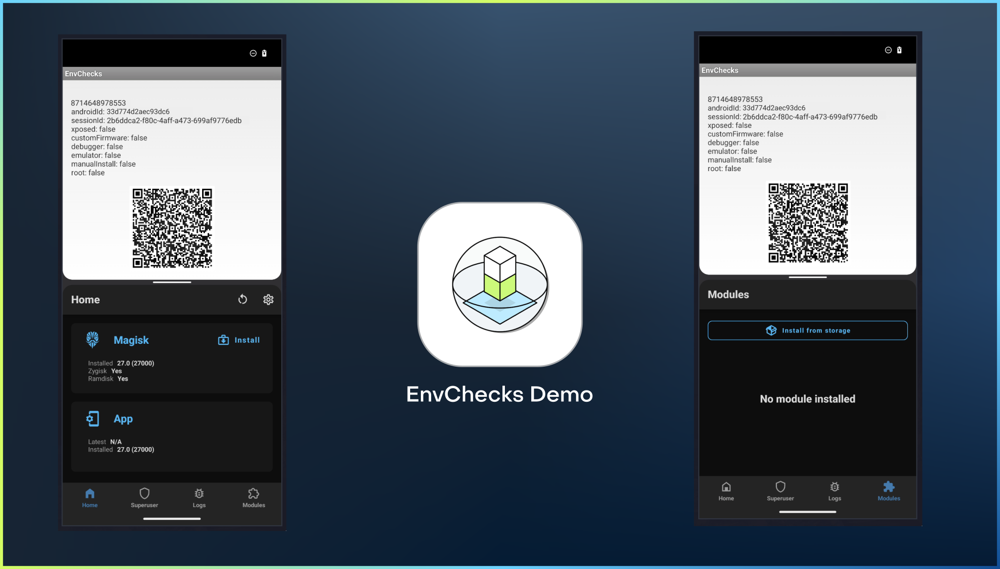

## Conclusion

DexProtector provides a post-build, no-code solution requiring minimal configuration by
developers to protect their mobile applications.
While this approach is appealing, it introduces a generic design that weakens
the solution: successfully reverse engineering one instance of DexProtector
enables a scalable attack on all applications protected by this tool (see [Annexes](#annexes)).

Although DexProtector uses a highly context-sensitive approach to
derive cryptographic material, this is insufficient to prevent key recovery and
access protected assets.

DexProtector remains a good solution for protecting assets and IP but its
limitations must be weighed against the sensitivity of the content being secured.

You can find additional material in this repo: [ romainthomas/dexprotector](https://github.com/romainthomas/dexprotector)

*These different weaknesses were shared with Licel ahead of time.*

### Annexes

List of applications successfully unprotected:

| App                                                                          | Version          |
|------------------------------------------------------------------------------|------------------|
| [`com.revolut.revolut`][com.revolut.revolut]                                 | `10.109.1`       |
| [`istark.vpn.starkreloaded`][istark.vpn.starkreloaded]                       | `7.1-rc`         |
| [`com.dexprotector.detector.envchecks`][com.dexprotector.detector.envchecks] | `2.1`            |
| [`ar.tvplayer.tv`][ar.tvplayer.tv]                                           | `5.2.0`          |
| [`org.unhcr.zakat`][org.unhcr.zakat]                                         | `2.1.54`         |
| [`com.Hyatt.hyt`][com.Hyatt.hyt]                                             | `6.16.0`         |
| [`com.kms.free`][com.kms.free]                                               | `11.129.4.14969` |
| [`com.flashget.parentalcontrol`][com.flashget.parentalcontrol]               | `1.3.6.0`        |
| [`com.belongtail.ai`][com.belongtail.ai]               | `2.8.4`        |
| [`com.kidoprotect.app`][com.kidoprotect.app]               | `11.1`        |

[com.revolut.revolut]: https://play.google.com/store/apps/details?id=com.revolut.revolut
[istark.vpn.starkreloaded]: https://play.google.com/store/apps/details?id=istark.vpn.starkreloaded
[com.dexprotector.detector.envchecks]: https://play.google.com/store/apps/details?id=com.dexprotector.detector.envchecks
[ar.tvplayer.tv]: https://play.google.com/store/apps/details?id=ar.tvplayer.tv
[com.gss.crocodile]: https://cafebazaar.ir/app/com.gss.crocodile
[org.unhcr.zakat]: https://play.google.com/store/apps/details?id=org.unhcr.zakat
[com.Hyatt.hyt]: https://play.google.com/store/apps/details?id=com.Hyatt.hyt
[com.flashget.parentalcontrol]: https://play.google.com/store/apps/details?id=com.flashget.parentalcontrol
[com.belongtail.ai]: https://play.google.com/store/apps/details?id=com.belongtail.ai
[com.kms.free]: https://support.kaspersky.com/common/beforeinstall/16085
[com.kidoprotect.app]: https://play.google.com/store/apps/details?id=com.kidoprotect.app


[^dt_so_name]: Name given from the `DT_SONAME`
[^dexpro-config]: https://licelus.com/products/dexprotector/docs/android/configuring-dexprotector
[^munmap-area]: These regions are described in the header located at the end of the packaged dex files (`classes.dex.dat`).
[^unprotected]: In this context, unprotected means: computing the master key, accessing the protected DEX files, recovering strings, methods, and fields and, accessing protected assets if any.
[^checksum]: sha256: `810634a3757a9ab1bfc37fb7a48fa7928fe917befd9ef0619f65eeb88173ad4a`
[^liblinker]: Its original name is `liblinker.so`
