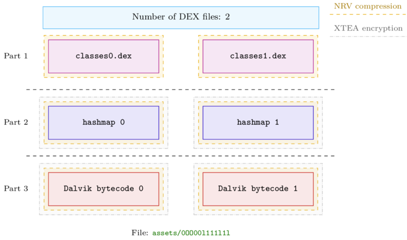
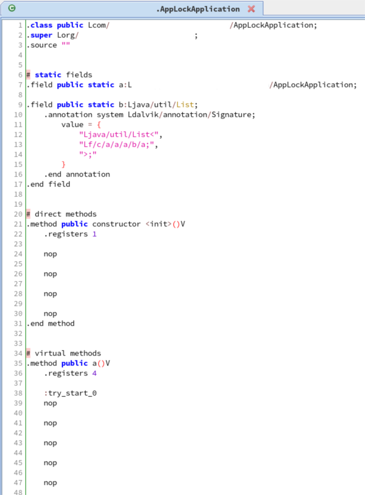
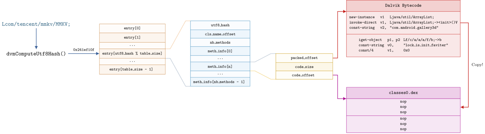
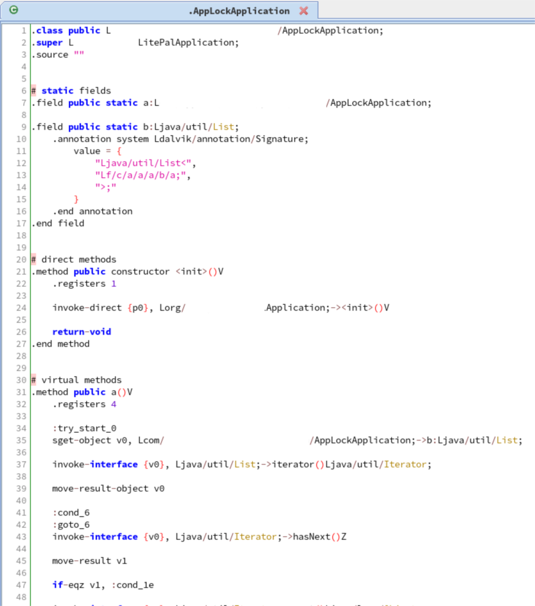

# A Glimpse Into Tencent's Legu Packer

> Analysis of Tencent Legu: a packer for Android applications.

<style>
  .packedfile {
    color:green;
    font-family: 'Lucida Console', monospace;
  }
  .keyfile {
    color: blue;
    font-family: 'Lucida Console', monospace;
  }
  .libshell {
    color: #FF6347;
    font-family: 'Lucida Console', monospace;
  }
  .tencentclass {
    color: #df2b04;
    font-family: 'Lucida Console', monospace;
  }
</style>

> **Note**
This post has been originally posted on the <a href=https://blog.quarkslab.com/a-glimpse-into-tencents-legu-packer.html>Quarkslab's Blog</a>


## Introduction

This blog post deals with the Legu packer, an Android protector developed by Tencent that is currently one of the
state-of-the-art solutions to protect APK DEX files. The packer is updated frequently and this blog post focuses on
versions ``4.1.0.15`` and ``4.1.0.18``.

## Overview

An application protected with Legu is composed of two native libraries: <span class="libshell">libshell-super.2019.so</span>
and ``libshella-4.1.0.XY.so`` as well as raw binary files embedded in the resources of the APK:

- <span class="keyfile">tosversion</span>
- <span class="packedfile">0OO00l111l1l</span>
- ``0OO00oo01l1l``
- ``o0oooOO0ooOo.dat``

The main logic of the packer is located in the native library <span class="libshell">libshell-super.2019.so</span> which basically
unpacks and loads the protected DEX files from the resources.

Some functions of the library are obfuscated but thanks to Frida/QBDI their analysis is not a big deal.

## Internals

Basically, the original DEX files are located in the <span class="packedfile">assets/0OO00l111l1l</span> file along with the information required to
unpack them.

The following figure lays out the structure of this file.



In the <span class="packedfile">assets/0OO00l111l1l</span> file, the first part contains the original DEX files with the same number of ``classes<N>.dex`` according to the multi-DEX feature of the original APK. These
DEX files are not exactly the original ones, as their Dalvik bytecode have been *NOP-ed* by Legu.
Therefore, a dump of these files only gives information about the classes' names, not the code logic:



Then follows what we called a *hashmap* that is used to link a class name (e.g. <span class="tencentclass">Lcom/tencent/mmkv/MMKV;</span>) to an offset in
the data block located in the third part of the file.
This data block contains the original Dalvik bytecode of the methods.

Actually, the first part that contains the altered DEX files, is compressed with **NRV**[^1].
The second part, the hashmap, is also compressed with NRV but the packer adds a layer of
encryption through a slightly modified version of **XTEA**[^2]. Finally, the last part is compressed and encrypted with the
same algorithms as the previous one.


Regarding the *hashmap*, it uses a custom structure that has been reversed and lead to a Kaitai structure available
here: [legu_packed_file.ksy](https://github.com/quarkslab/legu_unpacker_2019/blob/master/legu_packed_file.ksy), [legu_hashmap.ksy](https://github.com/quarkslab/legu_unpacker_2019/blob/master/legu_hashmap.ksy)

Its overall layout is exposed in the next figure:



## Unpacking process

Let's say that the application needs to use the packed Java class <span class="tencentclass">Lcom/tencent/mmkv/MMKV;</span>.

First, the packer's runtime transforms the class name into an integer with the ``dvmComputeUtf8Hash()`` hash function[^3]. This integer is then used
as an index into the *hashmap* whose value is a structure that contains information about the class in the packed data (blue area in
the figure). The first attribute of this structure, ``utf8_hash``, is a copy of the hash value which is used to check that it is the right key/value association.

The ``class_info`` structure (blue block in the figure) next contains the packed method information (yellow area in the figure) whose size is the same as the original number of
methods in the class. This structure makes the relationship between the NOP-ed bytecode offset in the altered DEX
files and the offset in the original bytecode (red block).
Finally, the packer copies the original bytecode into the altered DEX files.

To summarize, the first part contains the original DEX files with the Dalvik bytecode removed (*NOP-ed*).
The last part contains the missing Dalvik bytecode and the second part makes the
bridge between the altered DEX files and the Dalvik bytecode.

# Compression & Encryption

To decrypt the hashmap and the Dalvik bytecode, the packer uses the first 16 bytes of <span class="keyfile">assets/tosversion</span>
xored with a hard-coded key: ``^hHc7Ql]N9Z4:+1m~nTcA&3a7|?GB1z@``.

```python
LIB_KEY = b"^hHc7Ql]N9Z4:+1m~nTcA&3a7|?GB1z@"

def key_derivation(key: bytes) -> bytes:
  return bytes(x1 ^ x2 for x1, x2 in zip(LIB_KEY, cycle(key)))
```

Then, it uses a slightly modified version of XTEA that is given in the next listing:

```cpp
int xtea_decrypt(uint32_t* key, uint32_t* buf, size_t ilen, size_t nb_round) {
  const size_t count = ilen / 8;
  const size_t key_off = (ilen & 8) / 4;
  static constexpr uint32_t DELTA = 0x9e3779b9;

  const uint32_t key_0 = key[key_off + 0];
  const uint32_t key_1 = key[key_off + 1];

  for (size_t i = 0; i < count * 2; i += 2) {
    buf[i + 0] ^= key_0;
    buf[i + 1] ^= key_1;

    uint32_t sum = DELTA * nb_round;
    uint32_t temp0 = buf[i + 0];
    uint32_t temp1 = buf[i + 1];

    for (size_t j = 0; j < nb_round; ++j) {
      temp1 -= (key[2] + (temp0 << 4)) ^ (key[3] + (temp0 >> 5)) ^ (temp0 + sum);
      temp0 -= (key[0] + (temp1 << 4)) ^ (key[1] + (temp1 >> 5)) ^ (temp1 + sum);
      sum -= DELTA;
    }
    buf[i + 0] = temp0;
    buf[i + 1] = temp1;
  }
  return 0;
}
```

After the decryption routine, the packer decompresses the data with ``NRV``, the same algorithm used to compress the altered DEX
files:

```python
key = key_derivation(open("assets/tosversion", "rb").read()[:16])
for i in range(nb_dex_files):
  hashmap[i]          = nrv_decompress(xtea_decrypt(blob1, key))
  dalvik_bytecodes[i] = nrv_decompress(xtea_decrypt(blob2, key))
```

## Unpacking

Putting all the pieces together, we can **statically** unpack protected APKs and recover the original bytecode:



Hence, as we can automatically unpack such APKs, the unpacking process could be integrated into an automatic analysis pipeline.

The script and the Kaitai structures are available in the Quarkslab repository: [legu_unpacker_2019](https://github.com/quarkslab/legu_unpacker_2019),
along with a suspicious application [^4], [packed](https://github.com/quarkslab/legu_unpacker_2019/blob/master/samples/com.intotherain.voicechange.apk) and [unpacked](https://github.com/quarkslab/legu_unpacker_2019/blob/master/samples/com.intotherain.voicechange_unpacked.apk).


## Acknowledgments

Thanks to my colleagues who proofread this article.

### References

[^1]: http://www.oberhumer.com/opensource/ucl/
[^2]: https://en.wikipedia.org/wiki/XTEA
[^3]: http://androidxref.com/4.4.4_r1/xref/dalvik/vm/UtfString.cpp#88
[^4]: https://www.virustotal.com/gui/file/708e6967920dcf2789b7183d714e73ab79a2f8b3ca71929b12aadeb2c58c2867/detection
