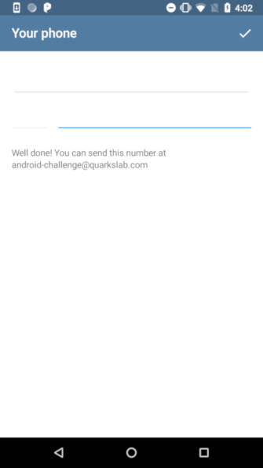

# Android crackme challenge

> Android crackme that uses system's internals

> **Note**
This post has been originally posted on the <a href=https://blog.quarkslab.com/android-challenge.html>Quarkslab's Blog</a>

Here is an Android crackme developed for the Android training given at Quarkslab.

The objective is to find the correct phone number that leads to the following message:

The application can be run on an emulator or a real device (whatever the architecture) but the Android version must be at **least Marshmallow** (> 6.0).

[crackme-telegram.apk.zip](crackme-telegram.apk.zip) - ``SHA256: d66b82ebc14708b214a581760e99894af17e10598bcef95e75441a12b948bbf0``

Password is ``cr4ckm3``
