# Android Native Library Analysis with QBDI

> This blog post deals with QBDI and how it can be used to reverse an Android JNI library

> **Note**
This post has been originally posted on the <a href=https://blog.quarkslab.com/android-native-library-analysis-with-qbdi.html>Quarkslab's Blog</a>


## Introduction

During the past few months we improved the ARM support in QBDI. More precisely, we enhanced the QBDI's engine
to support Thumb and Thumb2 instructions as well as Neon registers.

Development is still in progress and we need to clean the code and add non-regression tests
compared to the x86-64 support.

To add Thumb and Thumb2 support, we tested the DBI against well-known obfuscators such as [Epona](https://epona.quarkslab.com),
[O-LLVM](https://github.com/obfuscator-llvm/obfuscator)
or [Arxan](https://www.arxan.com/), as we could expect good instruction coverage, corner cases and nice use cases.
The native code came from Android JNI libraries embedded in different APKs.

This blog post introduces some QBDI features that could be useful to assess native code
and speedup reverse engineering.
To expose these features, we analyzed an Android SDK that aims to protect applications against API misuse.


## Dynamic Instrumentation on Android

[Frida](https://www.frida.re/) is one of the Android day-to-day dynamic instrumentation framework widely
used to instrument applications.
It can address both native code with inline hooking and *Java* side thanks to ART instrumentation[^1].

Frida works at the function level and in some cases we may need to have a finer granularity
at the basic-block level or at the instruction level (i.e. have *hooks* on instructions)

To address this limitation, one trick commonly used is to combine hooking with emulation.
One can use Frida to hook the function that we are interested in, then we can dump the CPU context
and the memory state of the process and eventually continue the execution through an emulator like [Miasm](https://miasm.re/blog/)
or [Unicorn](https://www.unicorn-engine.org/)

This approach works pretty well but has a few limitations:

   * **Speed**: For large sets of functions.
   * **External calls**: One needs to mock external calls behavior (e.g. ``strlen``, ``malloc``, ...).
   * **Some behaviors can be difficult to emulate**: Thread, Android internal frameworks, ...

Moreover, while it is quite simple to mock the behavior of ``strlen``, it may be more challenging to mock
JNI functions behavior like ``FindClass()``, ``GetMethodID()``, ``RegisterNatives()``, ...

The design of QBDI provides a good trade-off between full instrumentation and partial emulation thanks to
the ``ExecBrocker`` that enables to switch between instrumented code (our function) and non-instrumented
code: ``strlen()``, ``FindClass()``, ``pthread_call_once()``, ...

This diagram represents the instrumentation flow for the different scenarios:

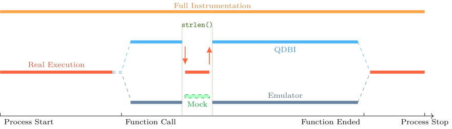

For those who are interested in QBDI internals you can look at the 34C3 talk by Charles and Cédric[^2].
There are also examples in the GitHub repository[^3].

To summarize, we can bootstrap QBDI as follows:

```cpp
// QBDI main interface
QBDI::VM vm;

// QBDI CPU state for GPR registers
GPRState* state = vm.getGPRState();

// Setup virtual stack
uint8_t *fakestack = nullptr;
QBDI::allocateVirtualStack(state, /* size */0x100000, &fakestack);

// {
//    Setup instrumentation ranges, callbacks etc, ...
// }

// Start Instrumentation:
uintptr_t retval;
bool ok = vm.call(&retval, /* Address of the function to instrument */);
// Instrumentation Finished
```

## SDK Overview

Among the QBDI tests, we analyzed an SDK that aims to protect applications against API abuses.
This kind of protection is used to protect API endpoints against illegitimate uses: emulator, bots, ...

To protect the main application, the solution collects information about the device state: rooted, debugged,
custom, then encodes this information with a *proprietary* algorithm and sends the encoded data to a server.

The **server** decodes the information sent by the device collector, performs analyzes to check the device
integrity and sends back a token that handles the information about whether the device is corrupted or not.

The following figure summarizes this process:

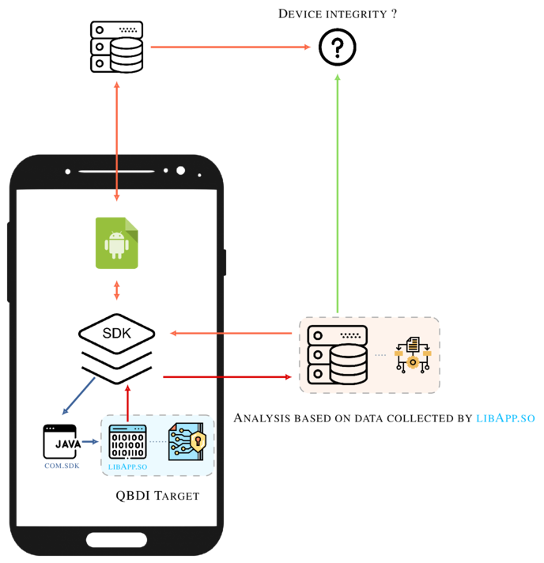

Such architecture is robust and similar to the one in [SafetyNet](https://developer.android.com/training/safetynet/attestation)[^4]. On the other hand,
the SDK has fewer permissions than SafetyNet, therefore it cannot collect as much data about
the device as SafetyNet does.

We started the analysis by monitoring the network traffic between the SDK and its server. At some point,
we can observe the following request:

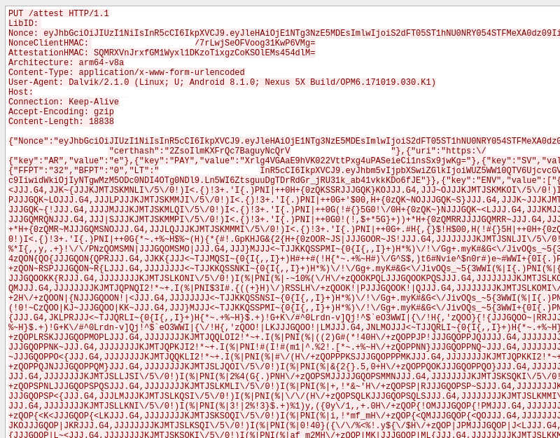

It is JSON encoded and the characters that look like random values are the encoded information sent
by the device collector.

The analysis of the SDK aims to address these questions:

   * How the SDK checks if the device is rooted or not?
   * How the SDK detects if the application is being debugged?
   * What kind of information is collected from the device and how it is encoded?

After a look at the Java layer, we found that the logic of the solution is implemented
in a JNI library that will be named ``libApp.so`` [^5]. The library exposes the following JNI functions:

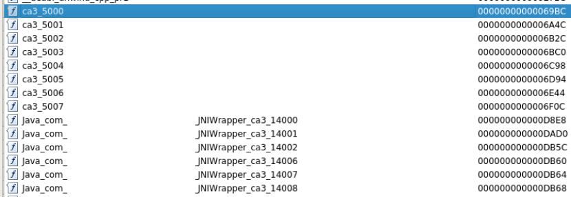

With static analysis, we can identify that the function ``Java_XXX_JNIWrapper_ca3_14008()`` is the one
involved in the generation of the sequence ``"QJRR{JJJGQJ~|MJJJ..."``. It returns the encoded data as a
``java.lang.String`` and takes two parameters that are not mandatory: ``bArr``, ``iArr`` [^6].


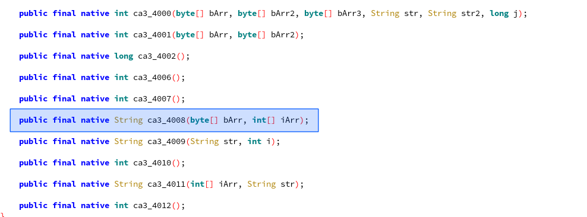

The library as a whole is not especially obfuscated. Nonetheless, we find strings encoding
and syscall replacement on well-known ``libc`` functions:

   * ``read``
   * ``openat``
   * ``close``
   * ...

This technique is commonly used to avoid hooking but the fact is that the given syscalls are wrapped
in functions that are not inlined. Hence, one can hook the functions that wrap
the associated syscall.

## Get Started with QBDI

In order to fully understand the logic of this function, we instrumented the function through QBDI [^7] associated
with a set of instrumentation callbacks.

These callbacks aim to provide different kinds of information that will be useful to the analyst to understand the
function logic. For instance, we can setup a first callback that records
all the syscall instructions, we can also add a callback that records memory access.

The purpose of this blog post is to show how a small number of well-chosen callbacks can help analysts
understand the logic of the function.

First of all, the native library embedded in the SDK can be loaded outside of the original APK using
``dlopen()`` / ``dlsym()``.
Moreover, one can instantiate a JVM thanks to the ART runtime (``libart.so``):

```cpp
int main(int argc, char** argv) {

   static constexpr const char* TARGET_LIB  = "libApp.so";
   void* hdl = dlopen(TARGET_LIB, RTLD_NOW);

   using jni_func_t = jstring(*)(JNIEnv* /* Other parameters are not required */);
   auto jni_func  = reinterpret_cast<jni_func_t>(dlsym(hdl, "Java_XXX_JNIWrapper_ca3_14008"));

   JavaVM* jvm, JNIEnv* env;
   ART_Kitchen(jvm, env); // Instantiate the JVM and initialize the jvm and env pointers
}
```

At this point, the ``jni_func()`` function is tied to ``Java_XXX_JNIWrapper_ca3_14008`` and ready to be
executed in ``main()``:

```cpp
jstring output = jni_func(env);
const char* cstring = env->GetStringUTFChars(output, nullptr);
console->info("Real Output: {}", cstring);
```

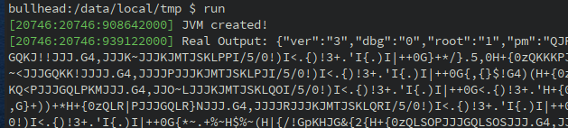

The output seems consistent with the network capture and the value ``"root: 1"`` too since we are on a rooted device [^8]

Now, let's run the function through QBDI:

```cpp
console->info("Initializing VM ...");
QBDI::VM vm;
GPRState* state = vm.getGPRState();

uint8_t *fakestack = nullptr;
QBDI::allocateVirtualStack(state, 0x100000, &fakestack);

console->info("Instument module: {}", TARGET_LIB);
vm.addInstrumentedModule(TARGET_LIB);

console->info("Simulate call in QBDI");
jstring dbioutput;
bool ok = vm.call(&dbioutput, reinterpret_cast<rword>(jni_func), {reinterpret_cast<rword>(env)});
if (ok and dbioutput != nullptr) {
  console->info("DBI output {:x}", env->GetStringUTFChars(dbioutput, nullptr));
}
```

This code provides the following output:

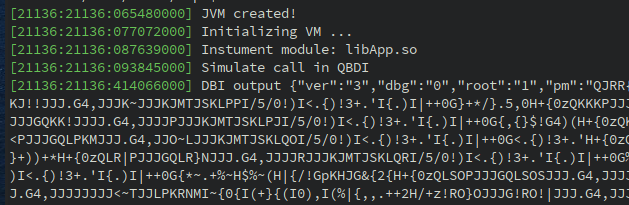

Everything looks good, QBDI managed to **fully** instrument the function (which includes ARM / Thumb switch)
and the result is similar to the real execution.


Analysis
========

Now that we are able to run and instrument the function,
we can start to add instrumentation callbacks to analyze its behavior.

One of the first callbacks that is useful to setup is a callback that instruments syscall
instructions (i.e. ``svc #0``). To do so, we can use the ``vm.addSyscallCB(position, callback, data)``.

   * **Position** - It stands for the position of the callback: Before or after the syscall.
   * **callback** - The callback itself.
   * **Data** - Pointer to user data (e.g. user context that register dynamic information)

It leads to the following piece of code:

```cpp
auto syscall_enter_cbk = [] (VMInstanceRef vm, GPRState *gprState, FPRState *fprState, void *data) {

   const InstAnalysis* analysis = vm->getInstAnalysis(ANALYSIS_INSTRUCTION | ANALYSIS_DISASSEMBLY);
   rword syscall_number = gprState->r7;
   /*
    * std::string sys_str = lookup[syscall_number]; // Lookup table that convert syscall number to function
    */
   console->info("0x{:06x} {} ({})", addr, analysis->disassembly, sys_str);

   return VMAction::CONTINUE;
}

vm.addSyscallCB(PREINST,  syscall_enter_cbk, /* data */ nullptr);
```

Before any syscall instructions, we perform a basic lookup on the syscall number stored in the **R7** register
to resolve its name.

It results in the following output:

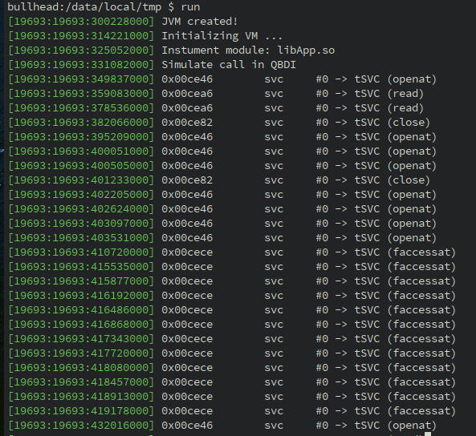

Since we are able to resolve syscall numbers into function names, we can improve the logic of callback
to dispatch and print function parameters:

```cpp
auto syscall_enter_cbk = [] (...) {
   ...
   /*
    * Lookup table (syscall number, function pointer)
    * {
    *   322 -> on_openat
    * }
    */
   auto function_wrapper = func_lookup[syscall_number];
   return function_wrapper(...)
}

// Wrapper for openat syscall
VMAction on_openat(VMInstanceRef vm, GPRState *gprState, ...) {
   auto path = reinterpret_cast<const char*>(gprState->r1);
   console->info("openat({})", path);
   return VMAction::CONTINUE;
}
```

By doing so on the common syscalls number, we get this new trace:

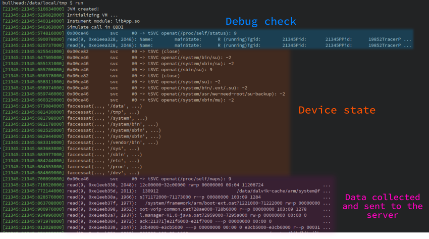

Based on this output, we can figure out how root check (orange area) is done. It is performed by checking
the existence of the following binaries:

   - /system/bin/su
   - /system/xbin/su
   - /sbin/su
   - ...

The function also checks if some directories are present on the device (``faccessat`` syscall):

   - /data
   - /tmp
   - /system
   - ...

Especially, it would be suspicious if the directory ``/tmp`` were present on the *device* while it is standard to
have ``/system`` and ``/data`` directories.

Regarding the debug state of the process (blue area), it is done by looking at ``/proc/self/status``. After
analysis, the function checks the ``TracerPID`` attribute
(cf [More Android Anti-Debugging Fun - B. Mueller](https://www.vantagepoint.sg/blog/89-more-android-anti-debugging-fun))

Finally, the function processes the output of ``/proc/self/maps`` right before to returning the encoded values.
It suggests that the data collected by the solution are based on this resource.

### Encoding Routine

In the previous part we got a global overview about how the solution achieves root detection,
debug detection and what kind of data is collected (i.e. process memory map).

However, some questions are pending:

   - What part of the process memory map is used: Base addresses? Module paths? Permissions?
   - How the data are encoded (i.e. how ``QJRR{JJJGQJ~|MJJJ...`` is generated) ?

Along with the QBDI ARM support, we also added ARM support to resolve **memory addresses** during the
instrumentation.
It means that QBDI is now able to resolve **the effective memory address** of instructions such as:

```armasm
LDR R0, [R1, R2];         # Resolve R1 + R2
STR R1, [R2, R3, LSL #2]; # Resolve R2 + R3 * 4
LDRB    [PC, #4];         # Resolve **real** PC + 4
```

Moreover, QBDI is also able to get **the effective memory value** that is read or written. This feature
is quite useful in the case of conditional instructions such as:

```armasm
ITT LS;
LDRLS R0, [R4];
LDRLS R1, [R0, #4]
```

The **effective** value of ``R0`` and ``R1`` is stored in QBDI. It may not be
``*(r4)`` and ``*(r0 + 4)`` since the ``LS`` condition may not be verified.


To add a callback on memory accesses, we can use the ``addMemAccessCB(...)`` function on the VM instance:

```cpp
vm.addMemAccessCB(MEMORY_READ_WRITE, memory_callback, /* data */ nullptr);
```

In the given ``memory_callback(...)`` function, we perform the following actions:

   * Track memory **byte** accesses.
   * Check if the value is printable.
   * Pretty print the R/W value.

The idea of this callback is to track memory accesses that are performed on printable characters. It enables
to quickly identify strings encoding/decoding routines.

Here is the implementation of the callback:


```cpp
VMAction memory_callback(VMInstanceRef vm, GPRState *gprState, ...) {
  auto&& acc = vm->getInstMemoryAccess();

  // Get last memory access
  MemoryAccess maccess = acc.back();

  // Retrieve access information:
  rword addr  = maccess.accessAddress; // Address accessed
  rword value = maccess.value;         // Value read or written
  rword size  = maccess.size;          // Access size

  // Only look for byte access
  if (size != sizeof(char)) {
     return VMAction::CONTINUE;
  }

  // Read / Write operation as a string
  const std::string kind = maccess.type == MemoryAccessType::MEMORY_READ ? "[R]" : "[W]";

  // Cast the value into a char
  const char cvalue = static_cast<char>(value);

  // Check if the value read or written is printable
  if (::isprint(cvalue)) {
     logger->info("0x{:x} {}: {}", addr, kind, cvalue); // Pretty print
  }

  // Continue this execution
  return VMAction::CONTINUE;
}
```

With this new callback, we can observe such output between two ``openat()`` syscalls involved in the
``root`` check routine:

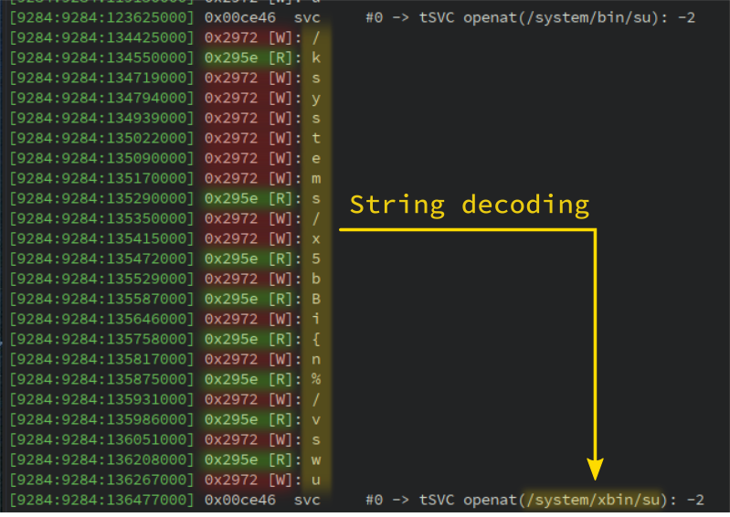

It is basically the string decoding routine in action. Note that some read operations are missing
since we only track **printable** characters. However, all write operations are present.

The routine **loads** characters with the instruction at address **0x295e** and **stores** the decoded
value at address **0x2972**. If we look at the function that handles these two addresses, we find
the decoding routine:

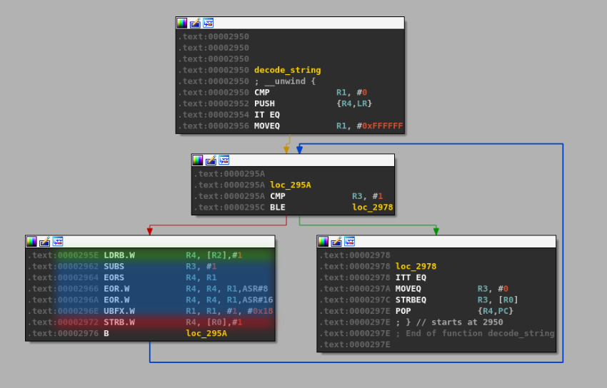

In the above figure, the **green** section highlights the memory **load access** while the **red** one highlights
the **write operation**. The **blue** area is the **decoding logic**.

The output of **all** read / write accesses turns out to be quite verbose on the whole execution of the function.
We can improve the instrumentation by adding two callbacks before and after function **calls**
with this purpose:

   1. Before calls, we print the target address (e.g. ``0x123: blx r3 -> .text!0xABC``).
   2. After calls we print **all** printable characters being read or written **within the called function**.

The ``addCallCB(...)`` is still in experimentation but it aims to put callbacks before or after call instructions:

```cpp
// Callback before ``call`` instructions
vm.addCallCB(PRECALL,  on_call_enter, nullptr);

// Callback when a ``call`` returns
vm.addCallCB(POSTCALL, on_call_exit, nullptr);
```


With these two callbacks we get the following output:

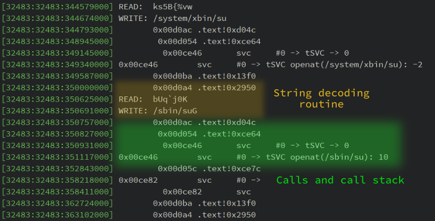

By going further in the memory trace, we can observe this output:

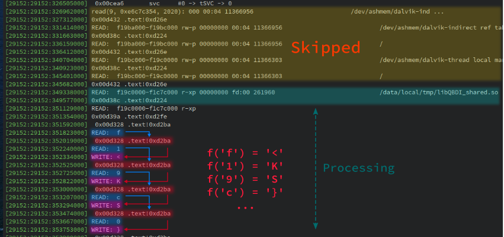

From this output we can infer the behavior of the collector (pseudo-code):

```python
f = open("/proc/self/maps")
for line in f.readlines():
   if not "/" in line: # Avoid entries such as XXX-YYY ... [anon:linker_alloc]
      continue

   if not "-xp" in line # Process executable segments only
      continue

    buffer += encode(line)
```

We can also observe a sequence of

   1. **READ** ``line[i]``
   2. **CALL** ``.text!0xd2ba``
   3. **WRITE** ``encoded(line[i])``

It suggests that the logic of the ``encode()`` function is implemented at address **0xd2ba**.

The CFG of this function is compounded by instructions that compare the input against *magic* printable
values and we manually checked that it is the encoding function. Moreover, this function is, by design, reversible since
the server side algorithm needs to process the *encoded* data.

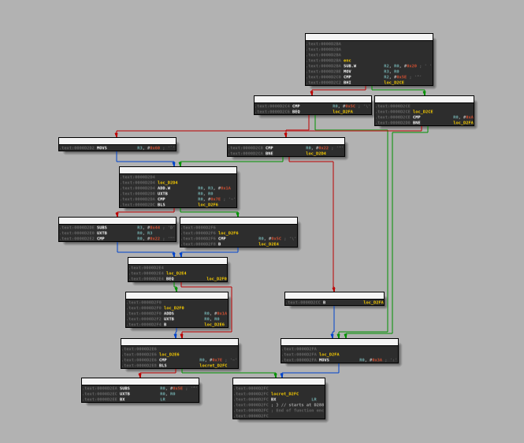


Library lifting
===============

In the previous parts, we targeted the ARM version of the library. It turns out that SDKs which use
native libraries usually provide the libraries for all architectures (``arm``, ``arm64``, ``x86``, ``x86-64``).

Indeed, they do not want to limit developers to some architectures. The solution previously analyzed also
comes with a ``x86-64`` version of ``libApp.so`` with the exact same interface.

Moreover, the analysis done in the previous sections shows that there are no real dependencies to the Android system:

   - Syscall are standards and available on Linux.
   - ``/proc/self/maps`` and ``/proc/self/status`` are available on Linux.

Thus, we can *lift* the library and run it on Linux. This technique has already been described in this
blog post: [When SideChannelMarvels meet LIEF](https://blog.quarkslab.com/when-sidechannelmarvels-meet-lief.html).


In a first step, we have to patch the library with LIEF:

```python
import lief

libApp = lief.parse("libApp.so")

# Patch library names
# ===================
libApp.get_library("libc.so").name   = "libc.so.6"
libApp.get_library("liblog.so").name = "libc.so.6"
libApp.get_library("libm.so").name   = "libm.so.6"
libApp.get_library("libdl.so").name  = "libdl.so.2"

# Patch dynamic entries
# =====================

# 1. Remove ELF constructors
libApp[lief.ELF.DYNAMIC_TAGS.INIT_ARRAY].array   = []
libApp[lief.ELF.DYNAMIC_TAGS.INIT_ARRAY].tag     = lief.ELF.DYNAMIC_TAGS.DEBUG
libApp[lief.ELF.DYNAMIC_TAGS.INIT_ARRAYSZ].value = 0

libApp[lief.ELF.DYNAMIC_TAGS.FINI_ARRAY].array   = []
libApp[lief.ELF.DYNAMIC_TAGS.FINI_ARRAY].tag     = lief.ELF.DYNAMIC_TAGS.DEBUG
libApp[lief.ELF.DYNAMIC_TAGS.FINI_ARRAYSZ].value = 0

# 2. Remove symbol versioning
libApp[lief.ELF.DYNAMIC_TAGS.VERNEEDNUM].tag = lief.ELF.DYNAMIC_TAGS.DEBUG
libApp[lief.ELF.DYNAMIC_TAGS.VERNEED].tag    = lief.ELF.DYNAMIC_TAGS.DEBUG
libApp[lief.ELF.DYNAMIC_TAGS.VERDEFNUM].tag  = lief.ELF.DYNAMIC_TAGS.DEBUG
libApp[lief.ELF.DYNAMIC_TAGS.VERDEF].tag     = lief.ELF.DYNAMIC_TAGS.DEBUG
libApp[lief.ELF.DYNAMIC_TAGS.VERSYM].tag     = lief.ELF.DYNAMIC_TAGS.DEBUG

libApp.write("libApp-x86-64.so")
```

Then, we can instantiate a Linux JVM and run the native function:

```cpp
int main() {

   JavaVM *jvm = nullptr;
   JNIEnv* env = nullptr;

   // JVM options
   JavaVMOption opt[1];
   JavaVMInitArgs args;
   ...

   // JVM instantiation
   JNI_CreateJavaVM(&jvm, reinterpret_cast<void**>(&env), &args);

   // Load the library
   void* hdl = dlopen("libApp-x86-64.so", RTLD_LAZY | RTLD_LOCAL);

   // Resolve the functions
   using abi_t      = jint(*)(JNIEnv*);
   using jni_func_t = jstring(*)(JNIEnv*);

   auto&& jni_get_abi = reinterpret_cast<abi_t>(dlsym(hdl, "Java_XXX_JNIWrapper_ca3_14007"));
   auto&& jni_func    = reinterpret_cast<jni_func_t>(dlsym(hdl, "Java_XXX_JNIWrapper_ca3_14008"));

   // Execute
   jint abi = jni_get_abi(env);
   console->info("ABI: {:d}", abi);

   jstring encoded = jni_func(env);
   console->info("ca3_14008(): {}", env->GetStringUTFChars(encoded, nullptr));

   return EXIT_SUCCESS;
}
```


By executing this code, we get a similar output as seen in the previous parts:

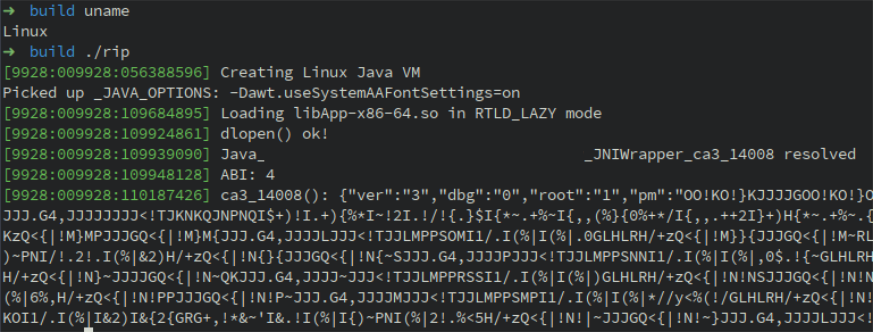

We can also run the ``strace`` utility to inspect the syscalls:

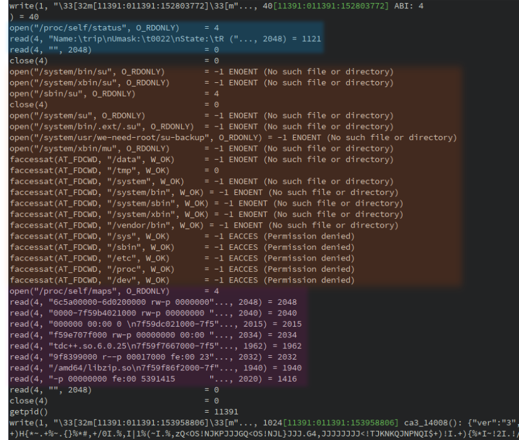


Since we are able to run the function on Linux, we could also use ``gdb``, ``Intel PIN`` or ``QBDI(x86-64)``
to analyze the library.


## Conclusion

While it has been quite challenging to add the whole ARM support in QBDI, it starts to work pretty well on real
use cases. Such support should also lead to interesting applications among which:

   - HongFuzz / QBDI for Android.
   - [SideChannelMarvels](https://github.com/SideChannelMarvels) integration for CPA attacks.
   - Trustlets instrumentation.


The raw traces used in this blog post are available here: [traces.zip](traces.zip)

## Acknowledgments

Many thanks to Charles Hubain and Cédric Tessier who developed and designed QBDI. It is really pleasant
to work on the concepts involved in this DBI.

Thanks to the LLVM community to provide such framework without which this project would not be possible.

Thanks to my Quarkslab colleagues who proofread this article.


## References

[^1]: Frida modifies fields of the ``art::ArtMethod`` object associated with the Java method.
[^2]: [Slides](https://qbdi.quarkslab.com/QBDI_34c3.pdf) - [Talk](https://media.ccc.de/v/34c3-9006-implementing_an_llvm_based_dynamic_binary_instrumentation_framework)
[^3]: https://github.com/QBDI/QBDI/blob/master/examples
[^4]: DroidGuard being the SafetyNet module that collects information about the device.
[^5]: The name has been intentionally changed.
[^6]: Plus the ``this`` parameter which is a ``jclass`` object for a static method.
[^7]: Even though static analysis would be enough in this case.
[^8]: Nexus 5X - Android 8.1.0 - Rooted with Magisk.
