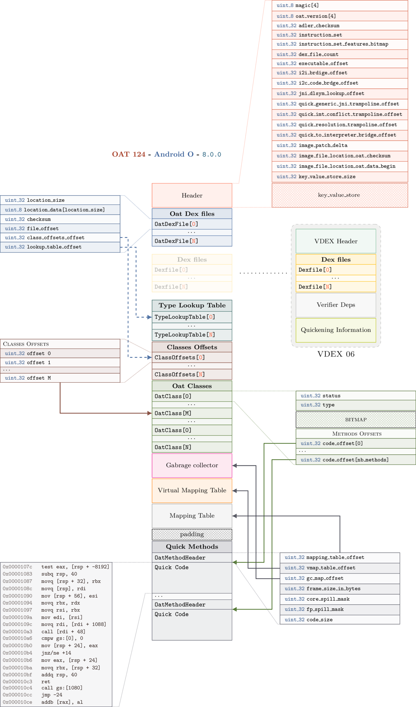
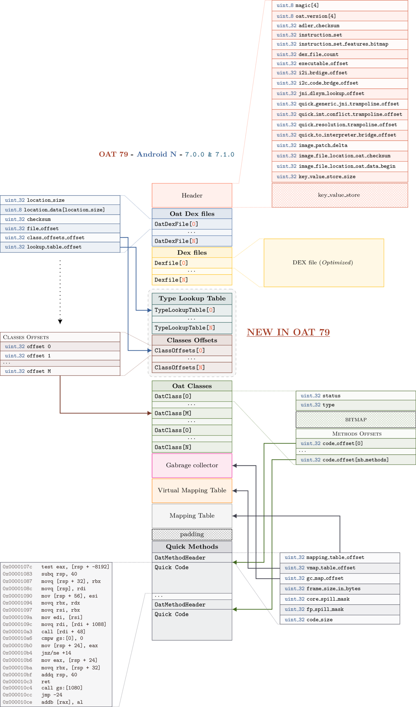
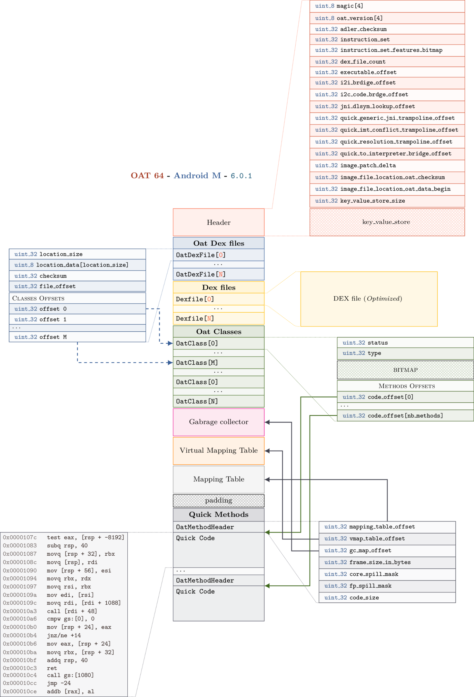

# Android OAT formats

> Internal structures of OAT format

Here are internal structures of Android OAT:

# OAT 124

[PDF Version](oat_124.pdf)

# OAT 79

[PDF Version](oat_79.pdf)

# OAT 64

[PDF Version](oat_64.pdf)
