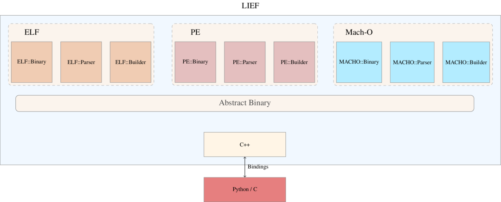
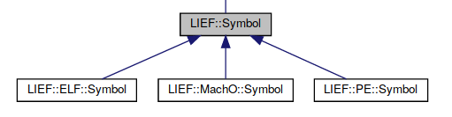

# Open-sourcing LIEF

> We are open-sourcing LIEF, a library to parse and manipulate ELF, PE, and Mach-O binary formats. This blog post explains the purpose of this project and some parts of its …

> **Note**
This post has been originally posted on the <a href=https://blog.quarkslab.com/lief-library-to-instrument-executable-formats.html>Quarkslab's blog</a>


Executable File Formats in a Nutshell
=====================================

When dealing with executable files, the first layer of information is the format in which the code is wrapped. We can see an executable file format
as an envelope. It contains information so that the postman (i.e. Operating System) can handle and deliver (i.e. execute) it.
The message wrapped by this envelope would be the machine code.

There are mainly three mainstream formats, one per OS:

  * **Portable Executable** (**PE**) for Windows systems
  * **Executable and Linkable Format** (**ELF**) for UNIX systems (Linux, Android...).
  * Mach-O for OS-X, iOS...

Other executable file formats, such as ``COFF``, exist but they are less relevant.

Usually each format has a header which describes at least the target architecture, the program's entry point and the type of the wrapped object (executable, library...)
Then we have blocks of data that will be mapped by the OS's loader. These blocks of data could hold machine code (``.text``), read-only data (``.rodata``) or other OS specific information.

For PE there is only one kind of such block: **Section**. For ELF and Mach-O formats, a section has a different meaning. In these formats,
sections are used by the **linker** at the **compilation** step, whereas **segments** (second type of block) are used by the OS's loader at **execution** step. Thus,
sections are not mandatory for ELF and Mach-O formats and can be removed without affecting the execution.


Purpose of LIEF
===============

It turns out that many projects need to parse executable file formats but don't use a *standard* library and re-implement their own parser (and the wheel).
Moreover, these parsers are usually bound to one language.

On Unix system one can find the ``objdump`` and ``objcopy`` utilities but they are limited to Unix and the API is not user-friendly.

The purpose of LIEF is to fill this void:

  * Providing a cross-platform library which can parse and modify (in a certain extent) ELF, PE, and Mach-O formats using a common abstraction
  * Providing an API for different languages (Python, C++, ,C ...)
  * Abstract common features from the different formats (Section, header, entry point, symbols, ...)

The following snippets show how to obtain information about an executable using different API of LIEF:

```python
  import lief
  # ELF
  binary = lief.parse("/usr/bin/ls")
  print(binary)

  # PE
  binary = lief.parse("C:\\Windows\\explorer.exe")
  print(binary)

  # Mach-O
  binary = lief.parse("/usr/bin/ls")
  print(binary)
```

With the ``C++`` API:

```cpp

  #include <LIEF/LIEF.hpp>
  int main(int argc, const char** argv) {
    LIEF::ELF::Binary*   elf   = LIEF::ELF::Parser::parse("/usr/bin/ls");
    LIEF::PE::Binary*    pe    = LIEF::PE::Parser::parse("C:\\Windows\\explorer.exe");
    LIEF::MachO::Binary* macho = LIEF::MachO::Parser::parse("/usr/bin/ls");

    std::cout << *elf   << std::endl;
    std::cout << *pe    << std::endl;
    std::cout << *macho << std::endl;

    delete elf;
    delete pe;
    delete macho;
  }
```

And finally with the ``C`` API:

```C

  #include <LIEF/LIEF.h>
  int main(int argc, const char** argv) {

    Elf_Binary_t*    elf_binary     = elf_parse("/usr/bin/ls");
    Pe_Binary_t*     pe_binary      = pe_parse("C:\\Windows\\explorer.exe");
    Macho_Binary_t** macho_binaries = macho_parse("/usr/bin/ls");

    Pe_Section_t**    pe_sections    = pe_binary->sections;
    Elf_Section_t**   elf_sections   = elf_binary->sections;
    Macho_Section_t** macho_sections = macho_binaries[0]->sections;

    for (size_t i = 0; pe_sections[i] != NULL; ++i) {
      printf("%s\n", pe_sections[i]->name)
    }

    for (size_t i = 0; elf_sections[i] != NULL; ++i) {
      printf("%s\n", elf_sections[i]->name)
    }

    for (size_t i = 0; macho_sections[i] != NULL; ++i) {
      printf("%s\n", macho_sections[i]->name)
    }

    elf_binary_destroy(elf_binary);
    pe_binary_destroy(pe_binary);
    macho_binaries_destroy(macho_binaries);
  }
```

LIEF supports FAT-MachO and one can iterate over binaries as follows:


```python
  import lief
  binaries = lief.MachO.parse("/usr/lib/libc++abi.dylib")
  for binary in binaries:
    print(binary)
```

> **Note**

  The above script uses the ``lief.MachO.parse`` function instead of the ``lief.parse`` function because ``lief.parse`` returns a **single** ``lief.MachO.binary`` object
  whereas ``lief.MachO.parse`` returns a **list** of ``lief.MachO.binary`` (according to the FAT-MachO format).


Along with standard format components like headers, sections, import table, load commands, symbols, etc. LIEF is also able to parse PE Authenticode:

```python

  import lief
  driver = lief.parse("driver.sys")

  for crt in driver.signature.certificates:
    print(crt)
```

```console

  Version:             3
  Serial Number:       61:07:02:dc:00:00:00:00:00:0b
  Signature Algorithm: SHA1_WITH_RSA_ENCRYPTION
  Valid from:          2005-9-15 21:55:41
  Valid to:            2016-3-15 22:5:41
  Issuer:              DC=com, DC=microsoft, CN=Microsoft Root Certificate Authority
  Subject:             C=US, ST=Washington, L=Redmond, O=Microsoft Corporation, CN=Microsoft Windows Verification PCA
  ...
```

Full API documentation is available here

  * [Python API](https://lief-project.github.io/doc/latest/api/python/index.html)
  * [C++ API](https://lief-project.github.io/doc/latest/api/cpp/index.html)
  * [C API](https://lief-project.github.io/doc/latest/api/c/index.html)


Architecture
============

In the ``LIEF`` architecture, each format implements at least the following classes:

  * Parser: Parse the format and decompose it into a ``Binary`` class
  * Binary: Modelize the format and provide an API to modify and explore it.
  * Builder: Transform the binary object into a valid file.




To factor common characteristics in formats we have an inheritance relationship between these characteristics.

For symbols it gives the following diagram:




It enables to write cross-format utility like ``nm``. ``nm`` is a Unix utility to list symbols in an executable. The source code is available here: [binutils](https://github.com/gittup/binutils/blob/0af702d47a443acea853b84157c2e81f6c131e77/binutils/nm.c)

With the given inheritance relationship one can write this utility for the three formats in a single script:

```python
  import lief
  import sys

  def nm(binary):
    for symbol in binary.symbols:
      print(symbol)

    return 0

  if __name__ == "__main__":
    r = nm(sys.argv[1])
    sys.exit(r)
```

Conclusion
==========

As LIEF is still a young project we hope to have feedback, ideas, suggestions, and pull requests.

The source code is available here: https://github.com/lief-project (under Apache 2.0 license) and the associated website: http://lief.quarkslab.com

If you are interested in use cases, you can take a look at these tutorials:

  * [Parse and manipulate formats](https://lief-project.github.io/doc/latest/tutorials/01_play_with_formats.html)
  * [Create a PE from scratch](https://lief-project.github.io/doc/latest/tutorials/02_pe_from_scratch.html)
  * [Play with ELF symbols](https://lief-project.github.io/doc/latest/tutorials/03_elf_change_symbols.html)
  * [Hooking](https://lief-project.github.io/doc/latest/tutorials/04_elf_hooking.html)
  * [Infecting the PLT/GOT](https://lief-project.github.io/doc/latest/tutorials/05_elf_infect_plt_got.html)


The project will be presented at the [Third French Japanese Meeting on Cybersecurity](http://cyber.science-japon.org/)

Contact
=======

 * lief [at] quarkslab [dot] com
 * Gitter: [lief-project](https://gitter.im/lief-project)


Thanks
======

Thanks to Serge Guelton and Adrien Guinet for their advice about the design and their code review. Thanks to Quarkslab for making this project open-source.
