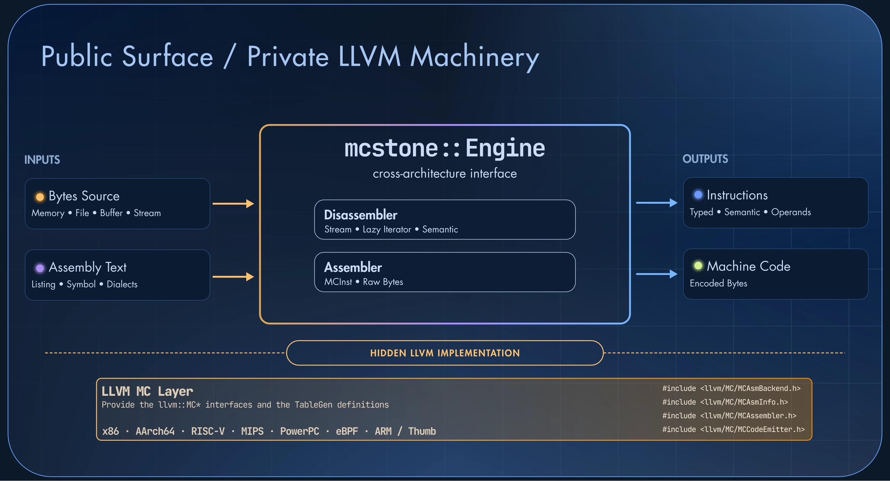

# MCStone

> A clean, high-performance assembler and disassembler built on LLVM's MC layer for engineering and reverse-engineering workflows.

MCStone is an assembler and disassembler built directly on LLVM's MC layer. It
exposes a modern C++ API to disassemble streams of bytes and to assemble text
listings. It ships instruction and operand models for x86, x86-64, AArch64,
RISC-V, MIPS, PowerPC, and eBPF, plus ARM and Thumb at the instruction level.

LLVM provides a strong and reliable engine to assemble and disassemble code for
many architectures. Nevertheless, its `llvm::MCDisassembler` API is not easy to
interface with: it requires instantiating a bunch of other `llvm::MC*`
objects first, each with its own lifetime and configuration:

```cpp
#include <llvm/MC/MCDisassembler/MCDisassembler.h>

std::unique_ptr<llvm::MCSubtargetInfo> MSI{target->createMCSubtargetInfo(
    /*TheTriple=*/*triple,
    /*CPU=*/details.cpu,
    /*Features=*/SF.getString()
)};

auto MC = std::make_unique<llvm::MCContext>(
  *triple, MAI.get(), MRI.get(), MSI.get(), SrcMgr.get(), MTO.get());

std::unique_ptr<llvm::MCDisassembler> MD{target->createMCDisassembler(*MSI, *MC)};
```

The purpose of MCStone is to absorb all this boilerplate and to keep the LLVM
implementation **private** to the library, while exposing a user-friendly API
that covers most reverse-engineering and binary analysis use cases.

## Disassembly: Streams and Iterators

The cross-architecture decoding and encoding logic itself comes from LLVM and
its TableGen definitions. MCStone does not reimplement it.

From an API perspective, `llvm::MCDisassembler` takes a sized buffer of bytes as
input and emits a `llvm::MCInst`. For instance, `cmp byte ptr [rip + 4901546], 0` is
decoded as follows:

```text
# encoding: [0x80,0x3d,0xaa,0xca,0x4a,0x00,0x00]
cmp     byte ptr [rip + 4901546], 0
                                # <MCInst #1335 CMP8mi
                                #  <MCOperand Reg:RIP>
                                #  <MCOperand Imm:1>
                                #  <MCOperand Reg:>
                                #  <MCOperand Imm:4901546>
                                #  <MCOperand Reg:>
                                #  <MCOperand Imm:0>>
```

MCStone uses this low-level API as a primitive and builds two facilities on top
of it:

1. Streams
2. Lazy iterators

### Streams

`llvm::MCDisassembler` takes a sized buffer as input. In many reverse-engineering
situations, we don't (exactly) know the boundaries of the bytes we want to
disassemble. This happens, for instance, when disassembling a function directly
from memory:

```cpp
auto anti_hook_ptr = imagebase + 0x40090;
auto instructions = engine->disassemble(anti_hook_ptr);
```

To address this practical need, the MCStone disassembly API abstracts its input
behind a stream:

```cpp
namespace mcstone {
class Engine {
  public:
  // [...]

  // Disassemble a non-owning stream
  instructions_it disassemble(Stream& stream, uint64_t addr);

  // Disassemble the given stream and take its ownership
  instructions_it disassemble(std::unique_ptr<Stream> stream, uint64_t addr);

  // Disassemble the memory of the current process, starting at addr
  instructions_it disassemble(uint64_t addr);
};
}
```

A `Stream` can be bounded by a size, but the user is also free to create an
unbounded stream when this size is unknown. This is what the address-only
overload does with a `MemoryStream`: bytes are read on demand from the process
memory.

> **Note**
The MCStone `Stream` interface is close to [LIEF](https://lief.re)'s
`LIEF::BinaryStream`. A custom stream, for instance one reading the memory of a
remote process, only needs to implement `peek_in()` and `size()`.


Regular functions that take a pointer and a size, or a `std::vector<uint8_t>`,
are also exposed. They wrap their input in a non-owning `RefStream`:

```cpp {linenos=inline hl_lines=[15,17]}
namespace mcstone {
class Engine {
  public:
  // [...]

  // Disassemble a non-owning stream
  instructions_it disassemble(Stream& stream, uint64_t addr);

  // Disassemble the given stream and take its ownership
  instructions_it disassemble(std::unique_ptr<Stream> stream, uint64_t addr);

  // Disassemble the memory of the current process, starting at addr
  instructions_it disassemble(uint64_t addr);

  instructions_it disassemble(const uint8_t* buffer, size_t size, uint64_t addr);

  instructions_it disassemble(std::vector<uint8_t> bytes, uint64_t addr);
};
}
```

### Lazy iterators

MCStone disassembles streams by returning an iterator range: `instructions_it`.
Calling `disassemble(...)` positions the iterator on the first instruction and
stops there. Nothing else is decoded until the user advances it.

```cpp {linenos=false hl_lines=[11,12]}
#include <mcstone/mcstone.hpp>

using namespace mcstone;

std::vector<uint8_t> get_bytes();

int main() {
  auto engine = Engine::create(Engine::Platform::LINUX,
                               Engine::Architecture::X86_64);

  // Only the first instruction has been decoded at this point
  auto instructions = engine->disassemble(get_bytes(), /*address=*/0x1000);
  return 0;
}
```

Therefore, the user **only** pays the memory and runtime cost of the
instructions that are **consumed**. This matters when the goal is to find a
specific set of instructions (e.g. syscalls) within a multi-gigabyte buffer, or
to stop at the first `ret` of a function whose size is unknown.

As mentioned in the introduction, `llvm::MCDisassembler` emits `llvm::MCInst`
objects to represent the decoded instructions. This representation is not
user-friendly from an instruction-analysis perspective. So in addition to lazily
decoding the stream, the iterator yields a `mcstone::Instruction` that is
specialized for each supported architecture:

```cpp {linenos=false hl_lines=["13-15"]}
#include <mcstone/mcstone.hpp>

using namespace mcstone;

std::vector<uint8_t> get_bytes();

int main() {
  auto engine = Engine::create(Engine::Platform::LINUX,
                               Engine::Architecture::X86_64);

  auto instructions = engine->disassemble(get_bytes(), /*address=*/0x1000);

  for (const mcstone::Instruction& inst : instructions) {
    std::println("{} | {}", inst, inst.is_syscall());
  }
  return 0;
}
```

> **Note**

`mcstone::Instruction` combines the TableGen instruction properties exposed by
`llvm::MCInstrDesc` with opcode-based predicates such as `is_syscall()`:

```cpp {linenos=false}
class Instruction {
  // [...]
  virtual bool is_call() const;
  virtual bool is_syscall() const;

  virtual bool is_trap() const;
  virtual bool is_barrier() const;
  virtual bool is_return() const;

  virtual std::optional<uint64_t> branch_target() const;
  // [...]
};
```


### Operands

Given a handle on an `mcstone::Instruction`, the natural next step is to inspect
its operands. `llvm::MCInst` exposes **raw** operands through `llvm::MCOperand`,
but these operands do not carry the original semantics.

For instance, the `MCInst` representation of `ldrb w0, [x1, x2]` has these
operands:

```text
ldrb    w0, [x1, x2]                    // encoding: [0x20,0x68,0x62,0x38]
                                        // <MCInst #5035 LDRBBroX
                                        //  <MCOperand Reg:W0>
                                        //  <MCOperand Reg:X1>
                                        //  <MCOperand Reg:X2>
                                        //  <MCOperand Imm:0>
                                        //  <MCOperand Imm:0>>
```

The memory operand `[x1, x2]` is scattered across the last four operands, and
none of them describes the structure of the memory address.

MCStone fills this gap with a lazily evaluated iterator over the operands that
reconstructs their higher-level semantics:

```cpp {linenos=false hl_lines=["8-19"]}
std::unique_ptr<mcstone::Instruction> I = get_inst("ldrb  w0, [x1, x2]");
const auto& arm64 = *I->cast<mcstone::aarch64::Instruction>();

std::println("{}", arm64);

for (size_t idx = 0; const auto& op : arm64.operands()) {
  std::println("  [{}]: {}", ++idx, *op);
  if (const auto* mem = op->as<mcstone::aarch64::Memory>()) {
    std::println("Base: {}", get_register_name(mem->base()));
    std::visit(overloaded{
      [](int64_t offset) {
        std::println("Offset (imm): {}", offset);
      },
      [](mcstone::aarch64::REG reg) {
        std::println("Offset (reg): {}", get_register_name(reg));
      },
      [](std::monostate) {},
    }, mem->offset());
  }
}
```

This code generates the following output:

```text
0x000000: ldrb w0, [x1, x2]
  [1]: W0
  [2]: [x1, x2]
    Base: X1
    Offset (reg): X2
```

`arm64.operands()` yields only two operands. The second one is an
`mcstone::aarch64::Memory` instance that exposes the base register, the offset
(an immediate or a register), and the shift or extension of the memory access.

This semantic-aware operand iterator is what we need to analyze instruction
operands accurately. MCStone still relies on the original `llvm::MCOperand`
values, but with an extra layer of processing on top.

Please note that this operand processing is **only** performed when the
`operands()` iterator is consumed. Users don't pay this cost unless they iterate
over it.

### Ranges and Views

Beyond the performance aspect, lazily evaluated iterators have an interesting
property when combined with C++ ranges. Users can create a view of what they
**intend** to observe:

```cpp
auto engine = mcstone::Engine::from_process();
auto insts = engine->disassemble((uintptr_t)&sensitive_function);
auto insts_view = insts |
    std::views::take_while([](const auto& I) { return !I->is_return(); }) |
    std::views::transform([](const auto& I) { return I->to_string(); });
```

This `insts_view` is just a _view_ of the instructions before the first `ret`,
transformed into their textual representation. To **effectively** disassemble
and observe these instructions, we must iterate over the view:

```cpp
for (const std::string& inst_str : insts_view) {
  std::println("{}", inst_str);
}
```

```bash
$ ./run
0x7f042cdbec60: push rax
0x7f042cdbec61: mov qword ptr [rsp], rdi
0x7f042cdbec65: inc qword ptr [rip + 0xfaec]
0x7f042cdbec6c: mov rax, qword ptr [rip + 0xe695]
0x7f042cdbec73: mov qword ptr [rax], rdi
0x7f042cdbec76: mov rax, qword ptr [rip + 0xe693]
0x7f042cdbec7d: mov rdi, qword ptr [rax]
0x7f042cdbec80: lea rdx, [rip - 0x7020]
0x7f042cdbec87: mov rcx, rsp
0x7f042cdbec8a: mov esi, 0x9
0x7f042cdbec8f: call 0xcc0c
0x7f042cdbec94: pop rax
```

The interesting aspect of this view is that it can be observed again later. The
range reads the process memory each time it is traversed. So if the underlying
code uses some kind of polymorphic protection, or if an attacker hooks the
function, the **same** code observes the change:

```cpp {linenos=false hl_lines=["13-24"]}
auto engine = mcstone::Engine::from_process();
auto insts = engine->disassemble((uintptr_t)&sensitive_function);
auto insts_view = insts |
    std::views::take_while([](const auto& I) { return !I->is_return(); }) |
    std::views::transform([](const auto& I) { return I->to_string(); });

std::println("Before hooking:");

for (const std::string& inst_str : insts_view) {
  std::println("{}", inst_str);
}

hooky.hook((uintptr_t)&sensitive_function,
  [] (hooky::Engine&, hooky::HookingContext& ctx, bool is_enter) {
    if (is_enter) {
      std::println("Who: {}", (const char*)ctx.cpu.rdi);
    }
  });

std::println("After hooking:");

for (const std::string& inst_str : insts_view) {
  std::println("{}", inst_str);
}
```

```bash
$ ./run
Before hooking:
0x7f042cdbec60: push rax
0x7f042cdbec61: mov qword ptr [rsp], rdi
0x7f042cdbec65: inc qword ptr [rip + 0xfaec]
0x7f042cdbec6c: mov rax, qword ptr [rip + 0xe695]
0x7f042cdbec73: mov qword ptr [rax], rdi
0x7f042cdbec76: mov rax, qword ptr [rip + 0xe693]
0x7f042cdbec7d: mov rdi, qword ptr [rax]
0x7f042cdbec80: lea rdx, [rip - 0x7020]
0x7f042cdbec87: mov rcx, rsp
0x7f042cdbec8a: mov esi, 0x9
0x7f042cdbec8f: call 0xcc0c
0x7f042cdbec94: pop rax

After hooking:
0x7f042cdbec60: jmp qword ptr [rip]
0x7f042cdbec66: sbb al, 0x60
0x7f042cdbec68: shr byte ptr [rsp + rax], cl
0x7f042cdbec6b: jg 0x0
0x7f042cdbec6d: add byte ptr [rax - 0x6f6f6f70], dl
0x7f042cdbec73: nop
0x7f042cdbec74: nop
[...]
```

Same **view**, different **runtime** observation.

## Assembly

The same `Engine` also assembles. It takes a text listing and returns the
encoded bytes, which makes round trips between text and machine code simple:

```cpp
auto engine = Engine::create(Engine::Platform::LINUX,
                             Engine::Architecture::ARM64);

std::vector<uint8_t> raw = engine->assemble(R"asm(
  mov x16, x0;
  mov x17, x1;
)asm");

for (const auto& inst : engine->disassemble(raw, /*addr=*/0)) {
  std::println("{}", *inst);
}
```

On x86, the assembler supports both the Intel and AT&T dialects. Symbols are
resolved through an `AssemblerConfig` callback, and an existing `llvm::MCInst`
can be re-encoded directly. This last point is what allows, for instance,
`x86::Instruction::lock()` to return a copy of an instruction re-encoded with a
`LOCK` prefix.




## MCStone compared to Capstone & Zydis

MCStone shares the same foundation as [Capstone](https://www.capstone-engine.org/):
both decode instructions with the tables that LLVM generates from its TableGen
definitions. Capstone uses its own generated copy of these tables for each
architecture, while MCStone links against upstream LLVM (23.1.0 at the time of
writing). New instruction set extensions, decoder fixes, and the assembler side
all land with each LLVM release. [Zydis](https://zydis.re/) is a different
design: a hand-written, dependency-free x86 and x86-64 decoder, and the
throughput reference of this benchmark.

The numbers below come from the MCStone benchmark. Every engine uses
the same corpus: the first `16 MiB` of the `.text` section of
`libLLVM.so.22.1`, about 3.7 million x86-64 instructions. The three libraries are built
by the same clang 24 (LLVM `main` branch) at `-O3`. MCStone is on `LLVM 23.1.0`, Capstone
`6.0.0-Alpha10`, and the Zydis `v5` development branch. In the tables below, an
empty cell means that the benchmark has no equivalent measurement for that
engine.

### Throughput

The engines do not perform the same amount of work in their default call, so
the rows are grouped by the API level they exercise. Throughput is in MiB/s,
higher is better:

| API level | Zydis | MCStone | Capstone |
|---|---:|---:|---:|
| Decode only | 110.0 | 84.9 | |
| Instruction objects | | 53.0 | |
| Instruction objects and operands | 66.9 | 40.2 | 24.5 [^capstone] |
| Formatted text | 40.6 | 16.5 | 30.3 |

- Zydis leads at every level.
- The MCStone decode-only row is its raw `llvm::MCInst` iterator, without
  `mcstone::Instruction` objects.
- With operands, which is what analysis code needs, MCStone is 1.6 times
  faster than Capstone's detail mode.
- Text formatting is the weak point of MCStone: Capstone is 1.8 times faster
  and Zydis 2.5 times faster. This path goes through LLVM's `MCInstPrinter`.


[^capstone]: Capstone always formats the text, so its
detail mode does more work than the two operand-only cells. It has no public
decode-only path either.

### Initialization and Memory

| | MCStone | Capstone | Zydis |
|---|---:|---:|---:|
| Engine initialization (ms) | 0.194 | 0.060 | 0.002 |
| Retained instruction without operands (bytes) | 270 | 260 | |
| Retained instruction with operands (bytes) | 270 [^mcstone-operand] | 2,484 | 1,161 |
| Peak RSS, full disassembly (MiB) | 133.2 | 132.1 | 130.3 |

- `Engine::create()` registers the LLVM targets and builds the MC context, the
  disassembler, the printer, the assembler, and the target machine.
  It is slower than the others to start but stays below 0.2 milliseconds.
- Streaming keeps O(1) decoder state for all three engines: the peak memory on
  the full `92.7 MiB` corpus is the process base plus the corpus itself.
- A retained `mcstone::Instruction` costs about 270 bytes, close to a Capstone
  instruction without details. It is 4 to 9 times smaller than the full-detail
  records of Capstone and Zydis.

[^mcstone-operand]: There is no separate detailed record: the operands are derived on demand from the retained instruction.

### What it means

MCStone does not try to beat a hand-written x86 decoder. Its value lies in the
combination: LLVM decoding **and** encoding for many architectures, a
modern C++ API with streams, lazy iterators, and semantic operands.
The performances sits between Capstone and Zydis for analysis workloads.

## Integration and public API

MCStone is a core component of my reverse-engineering workflow, and it powers
other private components such as [Hooky](/project/hooky) and
[DynaMIR](/project/dynamir).

The public-facing API is available in [LIEF Extended](https://extended.lief.re),
which also provides Python and Rust bindings. You can find the documentation on
these pages:

- [Disassembler](https://lief.re/doc/latest/extended/disassembler/index.html)
- [Assembler](https://lief.re/doc/latest/extended/assembler/index.html)
