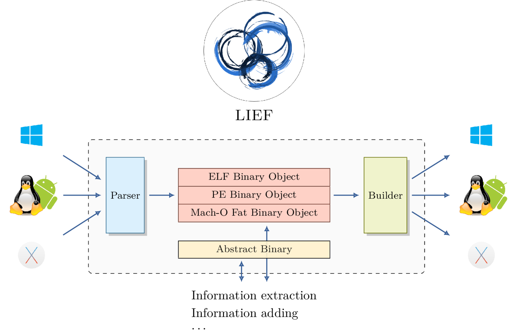

# LIEF: Library to Instrument Executable Formats

> When analyzing an executable, the first layer of information is the format in which the executable is wrapped. Many tools and libraries can analyze and instrument machine code …

When analyzing an executable, the first layer of information is the format in which the executable is wrapped. Many tools and libraries can analyze and instrument machine code wrapped by one format. However, no library handled all three mainstream executable formats while supporting both reading and modification. LIEF was developed to that end.

In the talk, we explain the rationale behind LIEF's architecture choices, what LIEF allows us to do, and several use cases.

LIEF is a cross-platform library and it can be used through a Python, C++ and C API. The library enables to parse standard structures as well as more complex ones like PE Signature (Authenticode) and ELF hash table. As use cases we can inject code into a binary or a library, we can also redirect the control flow to hook functions and it can be used to obfuscate some parts of a binary. Another feature of LIEF is that common characteristics of these formats are factorized so that we can develop a single script which works for the three formats.

##  Slides of the talk given at RMLL

[PDF document](17-07-RMLL-LIEF.pdf)

You can also grab the slides of the talk given at [Cybersecurity France-Japan](https://project.inria.fr/FranceJapanICST/wokshops/2017-program/presentations/): [17-04-cybersecurity-frjp-LIEF.pdf](17-04-cybersecurity-frjp-LIEF.pdf)
